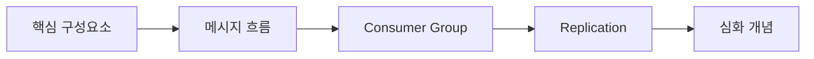

# 개념 이해

Kafka의 핵심 구성요소와 동작 원리를 이해합니다.

## 학습 순서

## 목차

1. [핵심 구성요소](/docs/concepts/core-components/) - Producer, Consumer, Broker, Topic, Partition
2. [메시지 흐름](/docs/concepts/message-flow/) - 메시지가 어떻게 전달되는가
3. [Consumer Group과 Offset](/docs/concepts/consumer-group-offset/) - 병렬 처리와 진행 상태 관리
4. [Replication](/docs/concepts/replication/) - 고가용성을 위한 복제
5. [심화 개념](/docs/concepts/advanced-concepts/) - acks, Message Key, Retention
