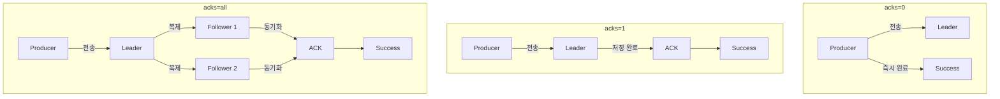
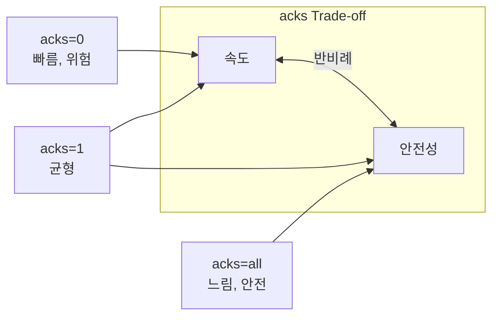
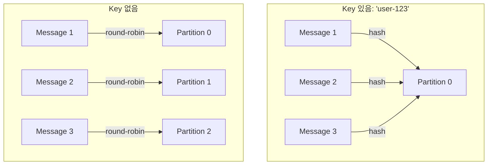
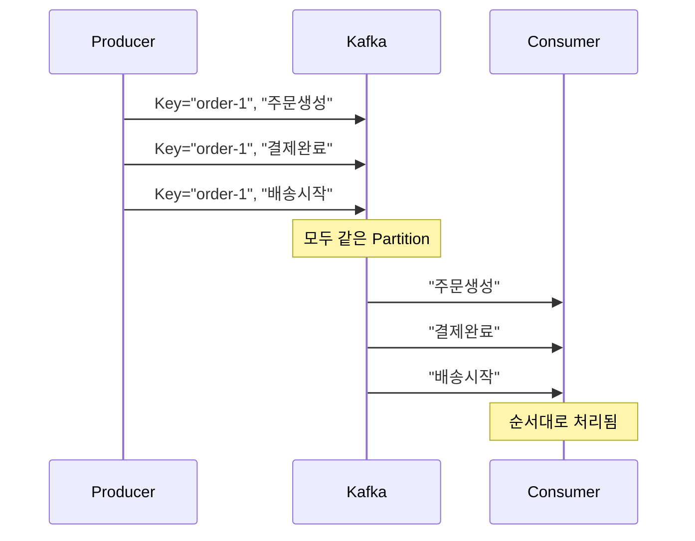
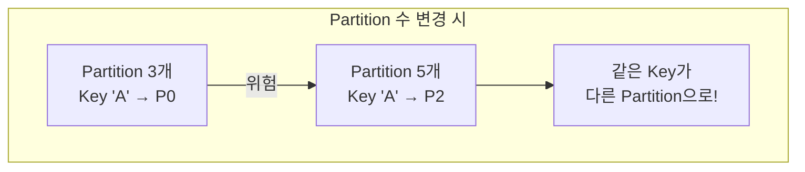
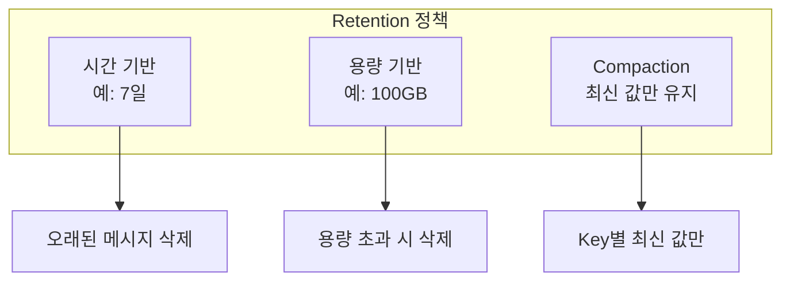
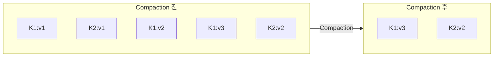
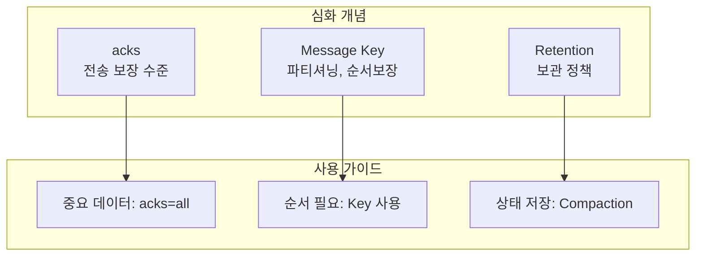

# 심화 개념

acks, Message Key, Retention 정책을 이해합니다.

## acks (Acknowledgment)

Producer가 메시지 전송 성공을 어떻게 확인할지 결정합니다.

### acks 옵션



### 옵션별 비교

| acks | 동작 | 속도 | 안전성 | 사용 사례 |
|------|------|------|--------|----------|
| **0** | 응답 대기 안함 | 최고 | 최저 | 로그, 메트릭 |
| **1** | Leader 저장 확인 | 중간 | 중간 | 일반 이벤트 |
| **all** | ISR 전체 복제 확인 | 최저 | 최고 | 결제, 주문 |

### Spring Kafka 설정

```yaml
spring:
  kafka:
    producer:
      acks: all  # 권장
      retries: 3
```

### Trade-off 다이어그램



## Message Key

메시지를 특정 Partition으로 라우팅하는 데 사용됩니다.

### Key의 역할



### 순서 보장

> **동일 Key = 동일 Partition = 순서 보장**



### 사용 사례

| Key 선택 | 효과 | 예시 |
|---------|------|------|
| **사용자 ID** | 사용자별 이벤트 순서 보장 | `user-123` |
| **주문 ID** | 주문별 상태 변경 순서 보장 | `order-456` |
| **기기 ID** | IoT 디바이스별 데이터 그룹화 | `device-789` |

### Spring Kafka 코드

```java
// Key 지정
kafkaTemplate.send("orders", orderId, orderJson);
//                  Topic    Key      Value

// Key 없이 (라운드 로빈)
kafkaTemplate.send("logs", null, logMessage);
```

### 주의사항



> **경고:** Partition 수를 변경하면 Key 해시가 달라져 기존 메시지와 새 메시지가 다른 Partition에 저장될 수 있습니다.

## Retention (보관 정책)

메시지를 얼마나 오래 보관할지 결정합니다.

### 정책 종류



### 시간 기반 (기본)

```yaml
# Topic 설정
retention.ms: 604800000  # 7일 (기본값)
```

```
Day 1    Day 2    Day 3    ...    Day 7    Day 8
[msg1]   [msg2]   [msg3]          [msg7]   [삭제됨]
```

### 용량 기반

```yaml
retention.bytes: 107374182400  # 100GB
```

용량 초과 시 오래된 세그먼트부터 삭제

### Log Compaction

**Key별 마지막 값만 유지**하는 정책입니다.



### 사용 사례별 권장 설정

| 사용 사례 | 정책 | 설정 예시 |
|----------|------|----------|
| **이벤트 로그** | 시간 기반 | 7일 보관 |
| **감사 로그** | 시간 기반 | 1년 보관 |
| **사용자 상태** | Compaction | 최신 상태만 |
| **세션 데이터** | 시간 기반 | 24시간 |

### Compaction 설정

```yaml
# Topic 설정
cleanup.policy: compact
min.cleanable.dirty.ratio: 0.5
```

## 설정 예시 종합

### 고신뢰성 프로덕션 환경

```yaml
# Producer
spring:
  kafka:
    producer:
      acks: all
      retries: 3
      properties:
        enable.idempotence: true
        max.in.flight.requests.per.connection: 5

# Topic 생성 시
kafka-topics.sh --create \
  --topic orders \
  --partitions 6 \
  --replication-factor 3 \
  --config min.insync.replicas=2 \
  --config retention.ms=604800000
```

### 고성능 로깅 환경

```yaml
# Producer
spring:
  kafka:
    producer:
      acks: 0
      batch-size: 65536
      linger-ms: 10

# Topic
retention.ms: 86400000  # 1일
```

## 정리



| 개념 | 핵심 질문 | 권장 |
|------|----------|------|
| **acks** | 얼마나 안전하게? | 프로덕션: `all` |
| **Message Key** | 순서가 중요한가? | 순서 필요 시 Key 사용 |
| **Retention** | 얼마나 보관? | 요구사항에 따라 |

## 다음 단계

- [실습 예제](/docs/examples/) - 배운 개념을 직접 적용해보기
