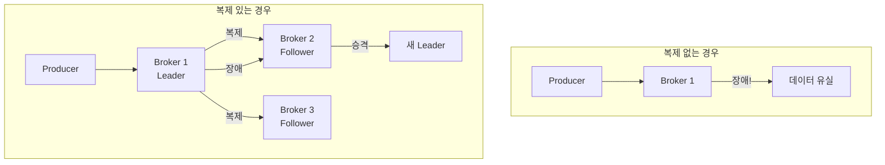
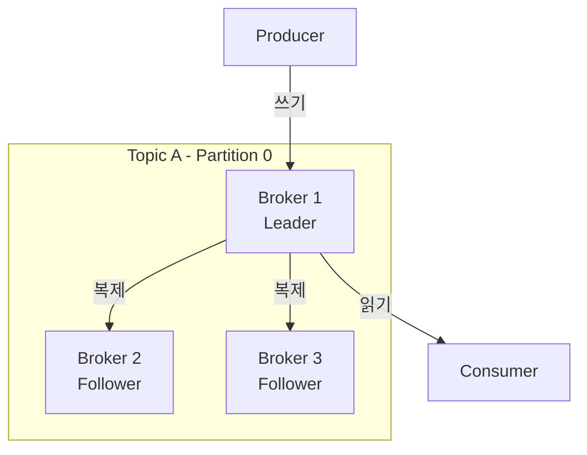
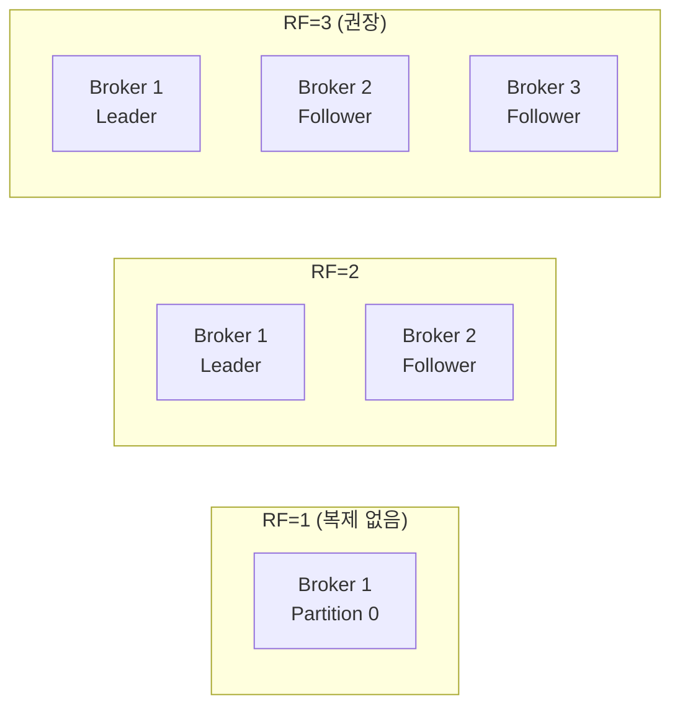
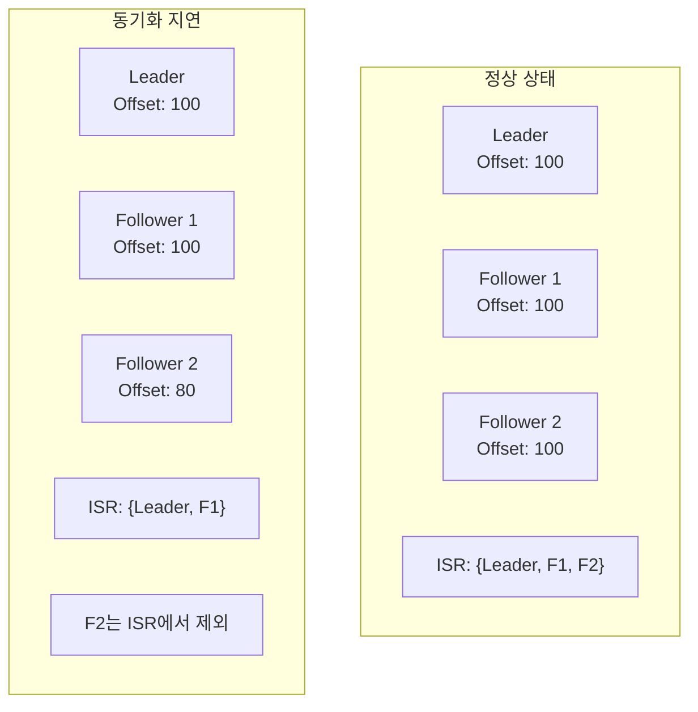
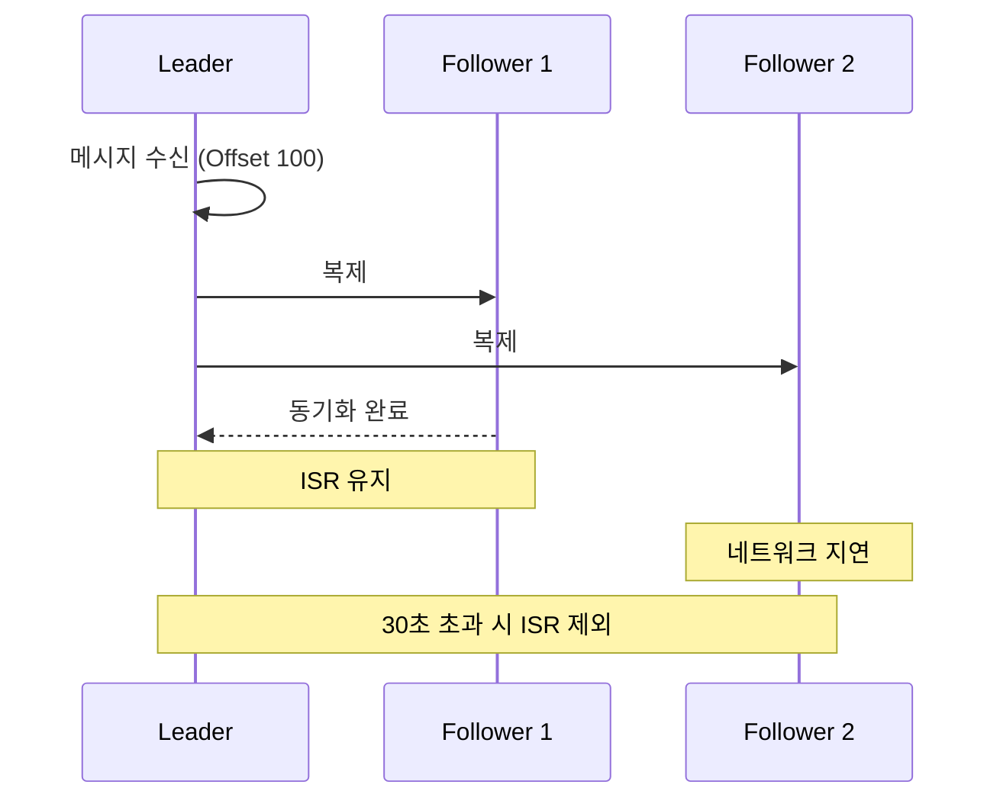
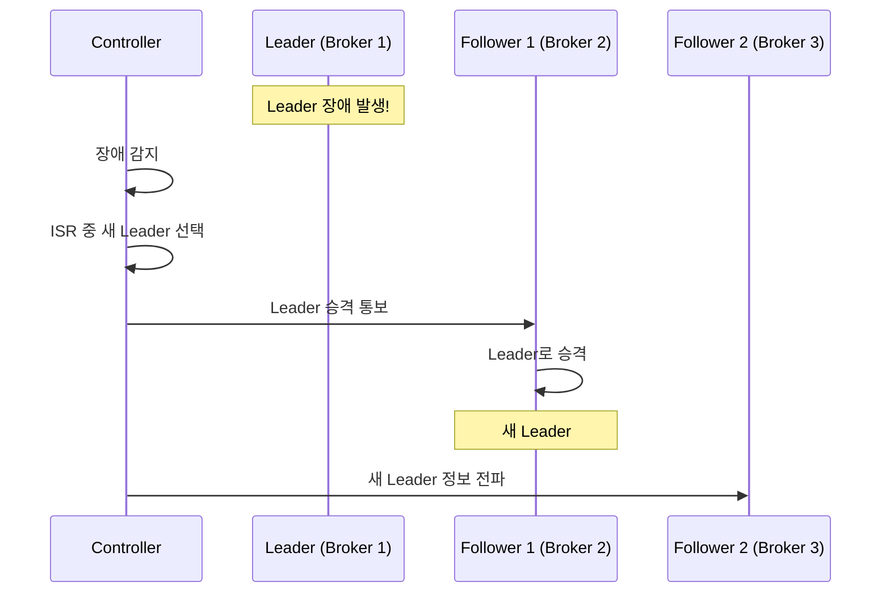
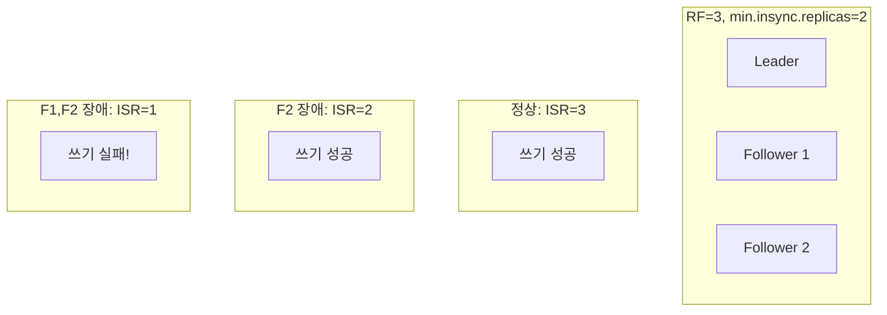
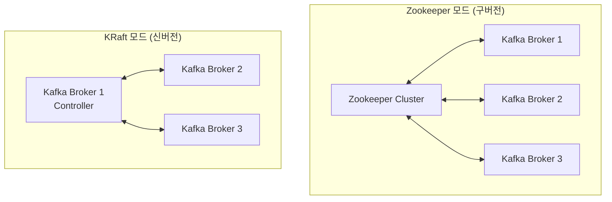
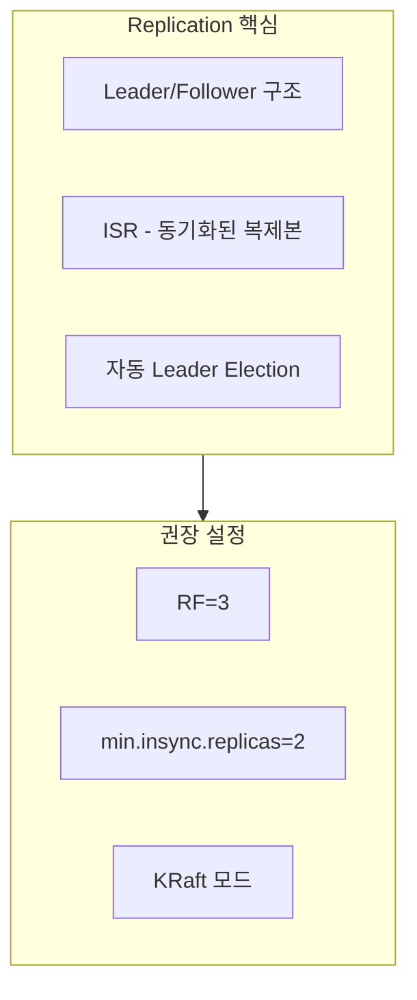

# Replication

데이터 복제와 고가용성 메커니즘을 이해합니다.

## 왜 Replication이 필요한가?

단일 Broker에 데이터를 저장하면 장애 시 데이터 유실이 발생합니다.



## Leader와 Follower

각 Partition은 하나의 **Leader**와 여러 **Follower**로 구성됩니다.



### 역할 분담

| 역할 | 책임 |
|------|------|
| **Leader** | 모든 읽기/쓰기 처리, Follower에 데이터 복제 |
| **Follower** | Leader 데이터 복제, Leader 장애 시 승격 대기 |

> **중요:** Producer와 Consumer는 **Leader에만** 연결됩니다.

## Replication Factor

**Replication Factor**는 각 Partition의 복제본 수입니다.



### RF별 특성

| RF | 내결함성 | 저장 비용 | 권장 사용 |
|----|---------|----------|----------|
| 1 | 없음 | 1x | 개발/테스트 |
| 2 | 1 Broker 장애 허용 | 2x | 일반 |
| 3 | 2 Broker 장애 허용 | 3x | **프로덕션 권장** |

## ISR (In-Sync Replicas)

**ISR**은 Leader와 동기화된 복제본 집합입니다.



### ISR 조건

Follower가 ISR에 포함되려면:
- `replica.lag.time.max.ms` 이내에 Leader와 동기화
- 기본값: 30초



## Leader Election

Leader 장애 시 새로운 Leader를 선출하는 과정입니다.



### 선출 규칙

1. **ISR 우선**: ISR 내의 Follower 중에서 선출
2. **Unclean Leader Election**: ISR이 비어있을 때 비동기 Follower 선출 (데이터 유실 가능)

```yaml
# Topic 설정
unclean.leader.election.enable: false  # 권장: 데이터 유실 방지
```

## min.insync.replicas

메시지 쓰기 시 필요한 최소 ISR 수입니다.



### 권장 설정

| 환경 | RF | min.insync.replicas |
|------|----|--------------------|
| 개발 | 1 | 1 |
| 프로덕션 | 3 | 2 |

## Zookeeper vs KRaft

Kafka의 메타데이터 관리 방식 비교:



### 비교

| 항목 | Zookeeper | KRaft |
|------|-----------|-------|
| **외부 의존성** | 필요 | 불필요 |
| **운영 복잡도** | 높음 | 낮음 |
| **Partition 확장성** | 제한적 | 향상 |
| **복구 시간** | 느림 | 빠름 |
| **Kafka 버전** | 2.x 이하 | 3.3+ 권장 |

> **권장:** 신규 프로젝트는 **KRaft 모드**를 사용하세요.

### KRaft 설정 예시

```yaml
# docker-compose.yml
environment:
  KAFKA_PROCESS_ROLES: broker,controller
  KAFKA_CONTROLLER_QUORUM_VOTERS: 1@kafka:9093
```

## 정리



| 개념 | 역할 |
|------|------|
| **Replication Factor** | 데이터 복사본 수 |
| **ISR** | 동기화된 복제본 집합 |
| **Leader Election** | 자동 장애 복구 |
| **KRaft** | 단순화된 클러스터 관리 |

## 다음 단계

- [심화 개념](/docs/concepts/advanced-concepts/) - acks, Message Key, Retention
