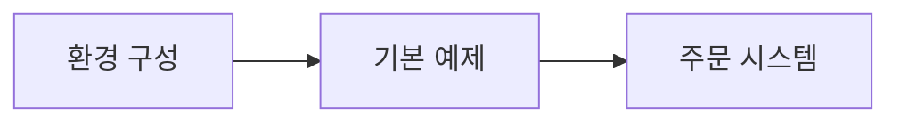

# 실습 예제

Spring Boot를 사용한 다양한 Kafka 예제를 직접 실행해보세요.

## 학습 순서

## 목차

1. [환경 구성](/docs/examples/setup/) - Docker Compose, Spring Boot 설정
2. [기본 예제](/docs/examples/basic/) - Producer/Consumer 구현 패턴
3. [주문 시스템](/docs/examples/order-system/) - 실전 이벤트 기반 시스템

## 예제 프로젝트

| 프로젝트 | 경로 | 설명 |
|---------|------|------|
| Quick Start | `examples/quick-start/` | 최소 설정 예제 |
| 주문 시스템 | `examples/order-system/` | 이벤트 기반 예제 |
