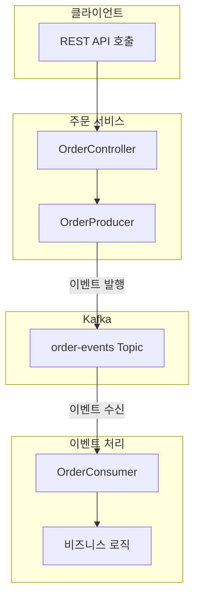
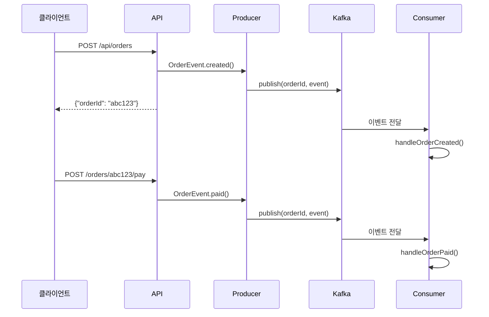
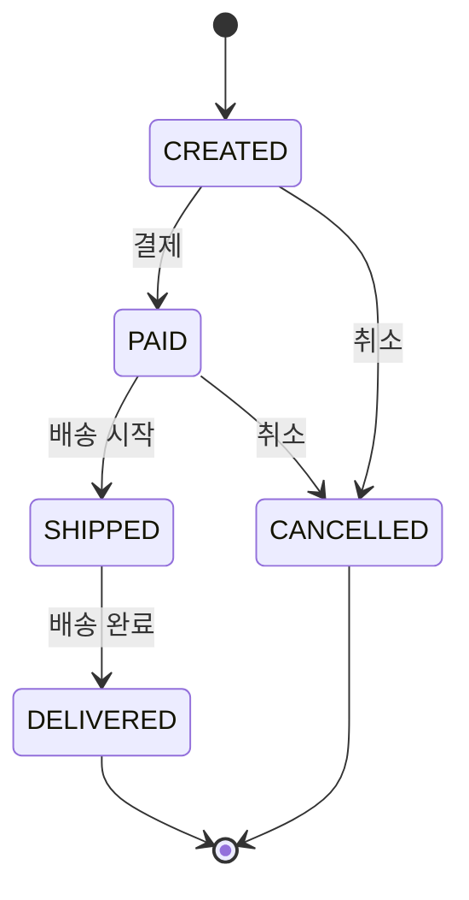
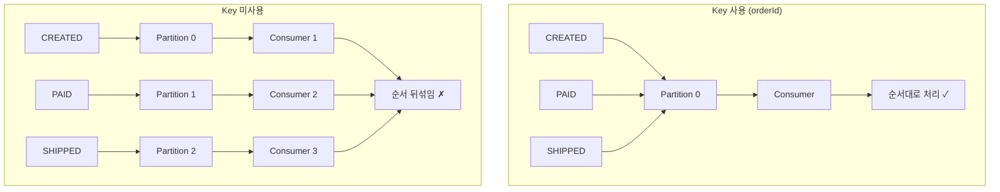
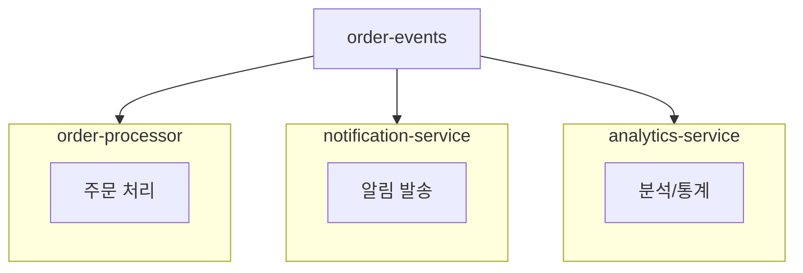

# 주문 시스템 예제

실무에 가까운 이벤트 기반 주문 시스템을 구현합니다.

## 시스템 아키텍처



## 이벤트 흐름



## 이벤트 타입

### OrderEvent

```java
public record OrderEvent(
    String orderId,
    String customerId,
    OrderStatus status,
    String description,
    LocalDateTime timestamp
) {}
```

### OrderStatus

| 상태 | 설명 | 다음 상태 |
|------|------|----------|
| `CREATED` | 주문 생성됨 | PAID, CANCELLED |
| `PAID` | 결제 완료 | SHIPPED, CANCELLED |
| `SHIPPED` | 배송 시작 | DELIVERED |
| `DELIVERED` | 배송 완료 | - |
| `CANCELLED` | 주문 취소 | - |



## Message Key 사용

### 왜 orderId를 Key로 사용하나요?

```java
kafkaTemplate.send(TOPIC, event.orderId(), event);
//                 topic  key           value
```

**순서 보장**이 필요하기 때문입니다.



### 같은 주문의 이벤트 순서

```
Order "abc123":
  Partition 2: [CREATED] → [PAID] → [SHIPPED] → [DELIVERED]
                   ↓          ↓         ↓            ↓
  Consumer:     처리 1     처리 2     처리 3       처리 4
                (순서 보장됨)
```

## Producer 구현

```java
@Component
public class OrderProducer {

    private static final String TOPIC = "order-events";
    private final KafkaTemplate<String, OrderEvent> kafkaTemplate;

    public void publish(OrderEvent event) {
        // orderId를 Key로 사용하여 순서 보장
        kafkaTemplate.send(TOPIC, event.orderId(), event)
                .whenComplete((result, ex) -> {
                    if (ex == null) {
                        log.info("발행 성공 - Partition: {}, Offset: {}",
                                result.getRecordMetadata().partition(),
                                result.getRecordMetadata().offset());
                    } else {
                        log.error("발행 실패", ex);
                    }
                });
    }
}
```

## Consumer 구현

```java
@Component
public class OrderConsumer {

    @KafkaListener(topics = "order-events", groupId = "order-processor")
    public void consume(ConsumerRecord<String, OrderEvent> record) {
        OrderEvent event = record.value();

        // Key(orderId)로 같은 주문 이벤트가 순서대로 도착
        log.info("수신 - OrderId: {}, Status: {}",
                record.key(), event.status());

        switch (event.status()) {
            case CREATED -> handleOrderCreated(event);
            case PAID -> handleOrderPaid(event);
            case SHIPPED -> handleOrderShipped(event);
            case DELIVERED -> handleOrderDelivered(event);
            case CANCELLED -> handleOrderCancelled(event);
        }
    }
}
```

## 실행 방법

### 1. Kafka 시작

```bash
cd docker
docker-compose up -d
```

### 2. 애플리케이션 실행

```bash
cd examples/order-system
./gradlew bootRun
```

### 3. 주문 생성

```bash
curl -X POST http://localhost:8080/api/orders \
  -H "Content-Type: application/json" \
  -d '{"customerId": "customer-123"}'
```

응답:
```json
{"orderId": "abc12345", "message": "주문이 생성되었습니다"}
```

### 4. 주문 진행

```bash
# 결제
curl -X POST "http://localhost:8080/api/orders/abc12345/pay?customerId=customer-123"

# 배송
curl -X POST "http://localhost:8080/api/orders/abc12345/ship?customerId=customer-123"

# 배송 완료
curl -X POST "http://localhost:8080/api/orders/abc12345/deliver?customerId=customer-123"
```

### 5. 로그 확인

```
========================================
이벤트 수신
  Partition: 0, Offset: 0
  Key (OrderId): abc12345
  Status: CREATED
========================================
[처리] 주문 생성 - 재고 확인 및 결제 대기

========================================
이벤트 수신
  Partition: 0, Offset: 1
  Key (OrderId): abc12345
  Status: PAID
========================================
[처리] 결제 완료 - 배송 준비 시작
```

## 확장 포인트

### 여러 Consumer Group



각 서비스가 독립적으로 같은 이벤트를 처리합니다.

### 에러 처리 추가

```java
@RetryableTopic(attempts = "3")
@KafkaListener(topics = "order-events")
public void consume(OrderEvent event) {
    // 3회 재시도 후 실패 시 DLT로 이동
}
```

## 정리

| 패턴 | 구현 |
|------|------|
| **이벤트 발행** | KafkaTemplate + JSON Serializer |
| **이벤트 소비** | @KafkaListener + JSON Deserializer |
| **순서 보장** | Message Key (orderId) |
| **상태 전이** | 이벤트 기반 상태 머신 |

## 다음 단계

- [부록](/docs/appendix/) - 용어 사전 및 참고 자료
