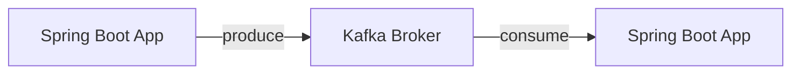

# Quick Start

5분 만에 Kafka 메시지 송수신을 경험해보세요.

## 전체 흐름

## 준비물

- Docker Desktop 또는 Docker Engine
- Java 17+
- IDE (IntelliJ IDEA 권장)

## 다음 단계

1. [환경 설정](/docs/examples/setup/) - Docker로 Kafka 실행
2. [첫 번째 메시지 보내기](/docs/quick-start/first-message/) - Producer 작성
3. [메시지 받기](/docs/quick-start/receive-message/) - Consumer 작성
