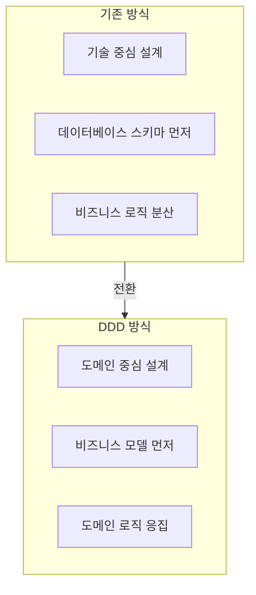
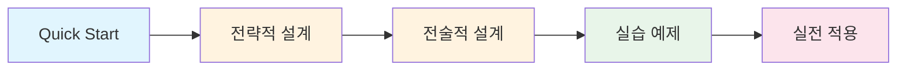

복잡한 비즈니스 도메인을 효과적으로 모델링하고 소프트웨어로 구현하는 방법을 단계별로 안내합니다.

## DDD란?

**Domain-Driven Design(DDD)**은 복잡한 소프트웨어를 개발할 때 **비즈니스 도메인**을 중심에 두고 설계하는 방법론입니다. Eric Evans가 2003년 동명의 책에서 제시했습니다.

## 왜 DDD인가?

| 문제 | DDD 해결책 |
|------|-----------|
| 개발자와 비즈니스 전문가 간 소통 단절 | **유비쿼터스 언어**로 공통 어휘 사용 |
| 비즈니스 로직이 여러 계층에 분산 | **도메인 모델**에 로직 응집 |
| 시스템 간 의존성 복잡 | **Bounded Context**로 명확한 경계 |
| 변경에 취약한 구조 | **Aggregate**로 일관성 경계 정의 |

## 목차

- [Quick Start](quick-start/) - 5분 만에 DDD 핵심 개념 이해
- [개념 이해](concepts/) - 전략적/전술적 설계 패턴
- [실습 예제](examples/) - Spring Boot로 구현하는 주문 도메인
- [부록](appendix/) - 용어 사전, 참고 자료

## 학습 로드맵

## 선수 지식

- Java/Spring Boot 기본 이해
- 객체지향 프로그래밍 개념
- 기본적인 데이터베이스 지식
