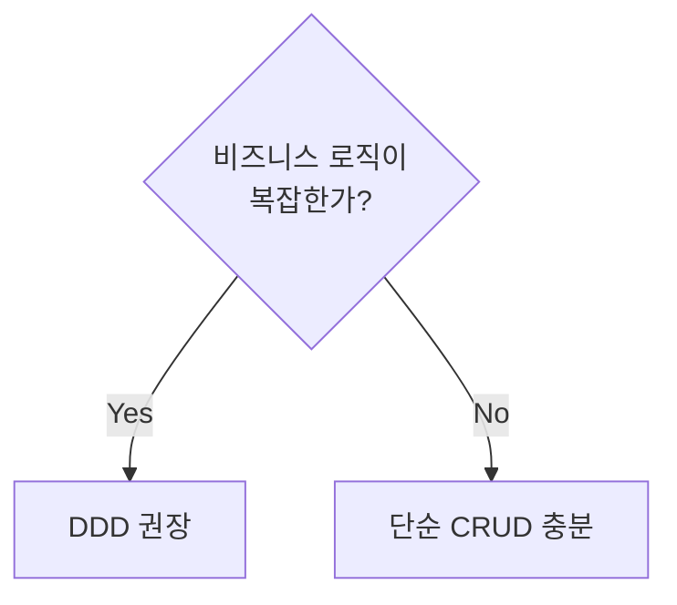
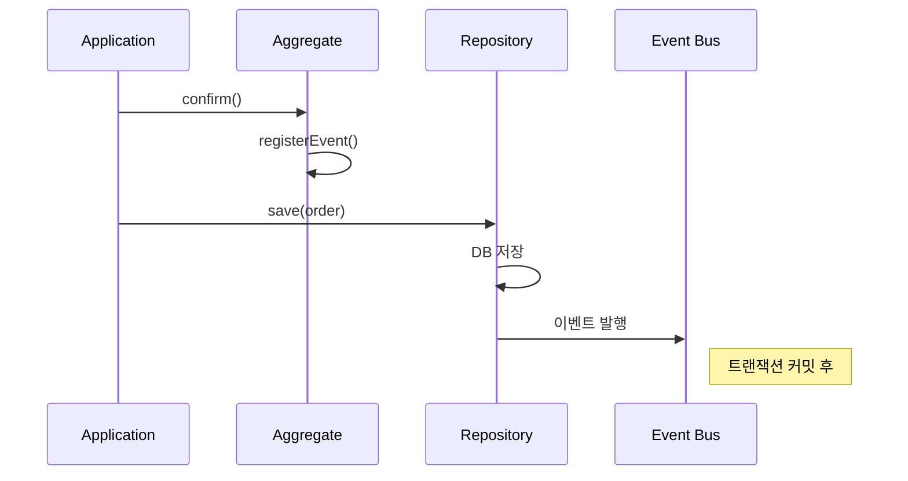
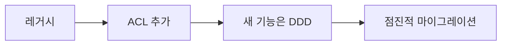
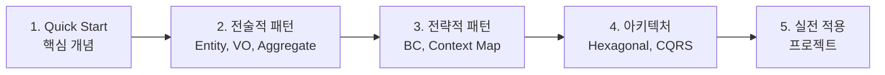

# DDD 자주 묻는 질문 (FAQ)

DDD를 적용할 때 자주 받는 질문과 답변입니다.

## 기본 개념

### Q: DDD는 아키텍처인가요?

**A:** 아닙니다. DDD는 **복잡한 도메인을 다루는 방법론**입니다.

```
DDD가 아닌 것:
- 아키텍처 패턴 (Clean, Hexagonal 등과 같이 쓰일 뿐)
- 기술 스택
- 프레임워크

DDD인 것:
- 도메인 중심 사고방식
- 전략적/전술적 패턴 모음
- 비즈니스와 기술의 협업 방법
```

---

### Q: DDD는 모든 프로젝트에 필요한가요?

**A:** 아닙니다. **복잡한 비즈니스 로직이 있을 때** 가치가 있습니다.



**DDD가 적합한 경우:**
- 복잡한 비즈니스 규칙 (금융, 보험, 물류)
- 도메인 전문가와 협업 필요
- 장기 운영/유지보수 예상

**DDD가 과한 경우:**
- 단순 CRUD 애플리케이션
- 프로토타입/MVP
- 소규모 단기 프로젝트

---

### Q: Entity와 Value Object를 어떻게 구분하나요?

**A:** **"시간이 지나도 추적해야 하는가?"**로 판단합니다.

| 기준 | Entity | Value Object |
|------|--------|--------------|
| **동등성** | ID로 비교 | 모든 속성으로 비교 |
| **생명주기** | 생성→변경→소멸 | 생성→불변 |
| **추적** | 추적 필요 | 추적 불필요 |
| **예시** | 주문, 회원, 상품 | 금액, 주소, 기간 |

```java
// Entity: 주문 ID가 같으면 같은 주문
Order order1 = new Order(OrderId.of("ORD-001"));
Order order2 = new Order(OrderId.of("ORD-001"));
order1.equals(order2);  // true (ID로 비교)

// Value Object: 금액이 같으면 같은 돈
Money money1 = Money.won(10000);
Money money2 = Money.won(10000);
money1.equals(money2);  // true (값으로 비교)
```

---

### Q: Aggregate 크기는 어떻게 결정하나요?

**A:** **"진정한 불변식(invariant)"을 보호하는 최소 단위**로 만듭니다.

```
잘못된 접근:
"주문 → 고객 → 고객의 모든 주문 → ..." (무한 확장)

올바른 접근:
"이 불변식을 지키려면 어떤 객체가 함께 변경되어야 하는가?"
```

**Aggregate 설계 원칙:**

1. **작게 유지** - 트랜잭션 범위 최소화
2. **ID로 참조** - 다른 Aggregate는 ID로만 참조
3. **결과적 일관성** - Aggregate 간은 이벤트로 동기화

```java
// ❌ 너무 큰 Aggregate
public class Order {
    private Customer customer;        // 전체 포함
    private List<Product> products;   // 전체 포함
}

// ✅ 적절한 크기
public class Order {
    private CustomerId customerId;    // ID만
    private List<OrderLine> lines;    // 진짜 내부 엔티티
}
```

---

## 구현 관련

### Q: Repository는 Aggregate마다 만들어야 하나요?

**A:** 네, **Aggregate Root마다 하나의 Repository**를 만듭니다.

```java
// ✅ Aggregate Root(Order)만 Repository
public interface OrderRepository {
    Order save(Order order);
    Optional<Order> findById(OrderId id);
}

// ❌ 내부 Entity는 Repository 없음
// OrderLineRepository - 만들지 않음
```

**이유:**
- Aggregate는 일관성 경계
- 내부 Entity는 Root를 통해서만 접근
- 단위 테스트가 쉬워짐

---

### Q: 도메인 서비스와 애플리케이션 서비스의 차이는?

**A:** **도메인 로직 vs 유스케이스 조율**의 차이입니다.

| 구분 | Domain Service | Application Service |
|------|----------------|---------------------|
| **위치** | 도메인 계층 | 응용 계층 |
| **역할** | 도메인 로직 | 트랜잭션, 조율 |
| **의존성** | 도메인만 의존 | 도메인 + 인프라 |
| **상태** | 무상태 | 무상태 |

```java
// Domain Service: 여러 Aggregate에 걸친 도메인 로직
@DomainService
public class DiscountCalculator {
    public Money calculate(Order order, Customer customer) {
        // 순수 도메인 로직
        return customer.getGrade().calculateDiscount(order.getTotalAmount());
    }
}

// Application Service: 유스케이스 조율
@Service
@Transactional
public class OrderApplicationService {
    private final OrderRepository orderRepo;
    private final DiscountCalculator discountCalc;

    public void createOrder(CreateOrderCommand cmd) {
        Order order = Order.create(...);
        Money discount = discountCalc.calculate(order, customer);
        order.applyDiscount(discount);
        orderRepo.save(order);  // 트랜잭션 관리
    }
}
```

---

### Q: 도메인 이벤트는 언제 발행하나요?

**A:** **상태 변경 후, 다른 시스템에 알려야 할 때** 발행합니다.

```java
public class Order {
    public void confirm() {
        validateConfirmable();

        // 1. 상태 변경
        this.status = OrderStatus.CONFIRMED;

        // 2. 이벤트 등록 (실제 발행은 저장 후)
        registerEvent(new OrderConfirmedEvent(this));
    }
}
```

**이벤트 발행 시점:**



---

### Q: 트랜잭션은 어디서 관리하나요?

**A:** **Application Service**에서 관리합니다.

```java
@Service
@Transactional  // 여기서 트랜잭션 관리
public class OrderApplicationService {

    public void confirmOrder(OrderId orderId) {
        Order order = orderRepository.findById(orderId);
        order.confirm();  // 도메인은 트랜잭션 모름
        orderRepository.save(order);
    }
}
```

**원칙:**
- 도메인은 트랜잭션을 모름
- 하나의 트랜잭션 = 하나의 Aggregate
- 여러 Aggregate는 이벤트로 결과적 일관성

---

### Q: JPA Entity와 도메인 Entity를 분리해야 하나요?

**A:** **상황에 따라 다릅니다.**

**분리하는 경우 (권장):**

```java
// Domain Layer - 순수
public class Order {
    private OrderId id;
    private Money totalAmount;
}

// Infrastructure Layer - JPA
@Entity
public class OrderEntity {
    @Id
    private String id;
    private BigDecimal totalAmount;
    private String currency;
}

// Mapper
@Component
public class OrderMapper {
    public Order toDomain(OrderEntity entity) { ... }
    public OrderEntity toEntity(Order domain) { ... }
}
```

**장점:** 도메인 순수성, 테스트 용이
**단점:** 복잡성 증가, 매핑 코드

**분리하지 않는 경우:**

```java
@Entity
public class Order {
    @Id
    private String id;

    @Embedded
    private Money totalAmount;

    // JPA 어노테이션과 도메인 로직 공존
    public void confirm() { ... }
}
```

**장점:** 단순함
**단점:** 도메인이 JPA에 의존

---

## 아키텍처 관련

### Q: Hexagonal과 Clean Architecture 중 무엇을 사용하나요?

**A:** 둘은 **같은 원칙을 다른 관점으로 설명**한 것입니다.

```
공통점:
- 도메인이 중심
- 의존성은 안쪽으로
- 외부 관심사 분리

차이점:
- Hexagonal: Port/Adapter 관점 (수평)
- Clean: 동심원 레이어 관점 (수직)
```

**실무에서는 둘을 조합**하여 사용합니다.

---

### Q: CQRS는 항상 필요한가요?

**A:** 아닙니다. **복잡한 조회가 있을 때만** 고려하세요.

```
CQRS가 필요한 경우:
- 조회와 명령의 모델이 크게 다름
- 복잡한 검색/리포팅 필요
- 조회 성능 최적화 필요

CQRS가 과한 경우:
- 단순 CRUD
- 조회가 Entity 그대로 반환
- 결과적 일관성 수용 불가
```

---

## 팀/조직 관련

### Q: 도메인 전문가가 없으면 어떻게 하나요?

**A:** **누군가는 도메인을 가장 잘 아는 사람**이 있습니다.

```
도메인 전문가 후보:
- 기획자 / PM
- 현업 담당자
- 도메인 경험 많은 개발자
- 고객 (직접 인터뷰)
```

**도메인 지식 습득 방법:**
1. 기존 문서/매뉴얼 학습
2. 경쟁 서비스 분석
3. 실제 업무 프로세스 관찰
4. 질문하고 기록

---

### Q: 팀원들이 DDD를 모르면 어떻게 시작하나요?

**A:** **작게 시작**하세요.

```
1주차: 기본 개념 공유
- Quick Start 문서로 개념 소개
- Entity vs Value Object 이해

2주차: 용어 사전 작성
- 현재 프로젝트의 핵심 용어 정의
- 코드에 반영

3주차: 도메인 모델 개선
- 기존 코드에서 로직을 Entity로 이동
- Value Object 도입

4주차~: 점진적 확장
- Aggregate 정의
- Repository 패턴 적용
```

---

### Q: 레거시 시스템에 DDD를 적용할 수 있나요?

**A:** 네, **점진적으로** 적용합니다.



**전략:**
1. **Anti-Corruption Layer**로 레거시 격리
2. 새 기능은 DDD로 개발
3. 점진적으로 레거시 기능 마이그레이션
4. Strangler Fig Pattern 활용

```java
// 레거시 격리
@Component
public class LegacyOrderAdapter implements OrderReader {
    private final LegacyOrderClient legacy;

    public Order findById(OrderId id) {
        LegacyOrderData data = legacy.getOrder(id.getValue());
        return translateToDomain(data);  // ACL
    }
}
```

---

## 실무 팁

### Q: DDD 적용 시 가장 중요한 것은?

**A:** **유비쿼터스 언어**입니다.

```
코드에서 비즈니스 용어를 사용하면:
✓ 개발자-비개발자 소통 원활
✓ 코드가 문서 역할
✓ 새 팀원 온보딩 쉬움
✓ 요구사항 변경 대응 쉬움
```

기술적 패턴(Aggregate, Repository 등)보다 **언어 통일이 먼저**입니다.

---

### Q: DDD 학습 순서는?

**A:**



**추천 자료:**
1. **입문:** DDD Distilled (책)
2. **기본:** Implementing DDD (책)
3. **실습:** 이 가이드의 예제 코드

---

### Q: DDD를 적용했는데 코드량이 늘었어요

**A:** 초기에는 **정상**입니다. 장기적으로 **유지보수 비용이 줄어듭니다.**

```
단기 비용:
- Value Object 클래스 증가
- Repository Interface/구현 분리
- 이벤트 클래스 추가

장기 이익:
- 버그 감소 (불변식 보호)
- 변경 용이 (관심사 분리)
- 테스트 용이 (순수 도메인)
- 온보딩 단축 (코드 = 문서)
```

**균형점 찾기:**
- 핵심 도메인에만 DDD 집중
- 주변 기능은 단순하게
- 과도한 추상화 피하기

## 다음 단계

- [용어 사전](../glossary/) - DDD 용어 정리
- [참고 자료](../references/) - 학습 자료
