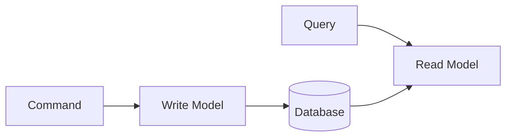

# DDD 용어 사전

Domain-Driven Design의 핵심 용어를 정리합니다.

## 전략적 설계 (Strategic Design)

### Bounded Context (경계된 컨텍스트)

**정의:** 특정 도메인 모델이 적용되고 일관성을 유지하는 명시적 경계

**특징:**
- 같은 용어도 Context마다 다른 의미를 가질 수 있음
- 각 Context는 독립적인 모델을 가짐
- 보통 하나의 팀이 하나의 Context를 담당

**예시:**
- 판매 Context의 "Product" = 가격, 프로모션
- 재고 Context의 "Product" = 수량, 창고 위치

---

### Context Mapping (컨텍스트 매핑)

**정의:** Bounded Context 간의 관계와 통합 방식을 정의하는 것

**주요 패턴:**

| 패턴 | 설명 | 사용 시점 |
|------|------|----------|
| **Shared Kernel** | 두 Context가 모델 일부를 공유 | 긴밀한 협력 필요 |
| **Customer-Supplier** | 공급자가 API 제공, 소비자가 사용 | 의존 관계 명확 |
| **Conformist** | 소비자가 공급자 모델을 그대로 따름 | 협상력 없을 때 |
| **Anti-Corruption Layer** | 번역 계층으로 외부 모델 변환 | 레거시 통합 |
| **Open Host Service** | 표준 API 공개 | 다수 소비자 |
| **Published Language** | 표준 데이터 형식 사용 | 이벤트 통합 |

---

### Ubiquitous Language (유비쿼터스 언어)

**정의:** 개발자와 도메인 전문가가 공유하는 공통 언어

**특징:**
- 코드, 문서, 대화에서 동일한 용어 사용
- Context마다 별도의 언어 존재 가능
- 용어 사전으로 정의하고 관리

**실천 방법:**
```
비즈니스 용어: "주문을 확정한다"
코드: order.confirm()
테스트: @Test void 주문_확정_시_상태가_CONFIRMED로_변경된다()
```

---

### Core Domain (핵심 도메인)

**정의:** 비즈니스의 핵심 경쟁력이 되는 도메인

**특징:**
- 가장 중요하고 복잡한 비즈니스 로직 포함
- 최고의 개발자가 담당해야 함
- 외부에 위임하면 안 됨

---

### Supporting Domain (지원 도메인)

**정의:** Core Domain을 지원하지만 핵심은 아닌 도메인

**특징:**
- 비즈니스에 필요하지만 차별화 요소는 아님
- 외부 솔루션 사용 가능
- 예: 사용자 인증, 알림

---

### Generic Domain (일반 도메인)

**정의:** 모든 비즈니스에 공통적으로 필요한 도메인

**특징:**
- 표준 솔루션 구매/사용 가능
- 예: 이메일, 결제 게이트웨이

---

## 전술적 설계 (Tactical Design)

### Entity (엔티티)

**정의:** 고유 식별자(Identity)로 구분되는 도메인 객체

**특징:**
- 상태가 변경되어도 동일한 객체
- 생명주기 존재 (생성 → 변경 → 소멸)
- 식별자로 동등성 판단

```java
// 식별자로 동등성 판단
@Override
public boolean equals(Object o) {
    if (!(o instanceof Order order)) return false;
    return id.equals(order.id);
}
```

---

### Value Object (값 객체)

**정의:** 속성 값으로 동등성이 결정되는 불변 객체

**특징:**
- 불변 (Immutable)
- 모든 속성이 같으면 같은 객체
- 부수효과 없는 메서드만 제공
- 자체적으로 유효성 검증

```java
public record Money(BigDecimal amount, Currency currency) {
    public Money add(Money other) {
        return new Money(amount.add(other.amount), currency);
    }
}
```

---

### Aggregate (집합체)

**정의:** 데이터 변경의 단위로 취급되는 연관 객체들의 묶음

**특징:**
- Aggregate Root를 통해서만 접근
- 하나의 트랜잭션 = 하나의 Aggregate
- 진정한 불변식(Invariant)을 보호

**설계 원칙:**
1. 작게 유지
2. 다른 Aggregate는 ID로만 참조
3. 경계 밖은 결과적 일관성

---

### Aggregate Root (집합 루트)

**정의:** Aggregate의 진입점이 되는 Entity

**책임:**
- 외부와의 유일한 접점
- Aggregate 내부 일관성 보장
- 도메인 이벤트 발행

```java
public class Order extends AggregateRoot<OrderId> {
    private List<OrderLine> orderLines;

    public void addOrderLine(OrderLine line) {
        // 불변식 검증
        validateMaxLines();
        orderLines.add(line);
        recalculateTotal();
    }
}
```

---

### Repository (리포지토리)

**정의:** Aggregate의 영속성을 추상화하는 인터페이스

**특징:**
- Aggregate Root만 Repository를 가짐
- Collection처럼 동작
- 도메인 계층에 인터페이스, 인프라에 구현

```java
// 도메인 계층
public interface OrderRepository {
    Order save(Order order);
    Optional<Order> findById(OrderId id);
}

// 인프라 계층
@Repository
public class JpaOrderRepository implements OrderRepository { }
```

---

### Domain Service (도메인 서비스)

**정의:** 특정 Entity에 속하지 않는 도메인 로직을 담는 서비스

**사용 시점:**
- 여러 Aggregate에 걸친 연산
- 외부 서비스가 필요한 도메인 로직
- Entity의 책임으로 보기 어려운 로직

```java
@DomainService
public class DiscountCalculator {
    public Money calculate(Order order, Customer customer) {
        // 여러 Aggregate 정보 필요
    }
}
```

---

### Domain Event (도메인 이벤트)

**정의:** 도메인에서 발생한 비즈니스적으로 의미 있는 사건

**특징:**
- 과거형으로 명명 (OrderConfirmed)
- 불변
- 발생 시점 포함
- 필요한 정보 자체 포함

```java
public class OrderConfirmedEvent extends DomainEvent {
    private final OrderId orderId;
    private final LocalDateTime confirmedAt;
}
```

---

### Factory (팩토리)

**정의:** 복잡한 Aggregate 생성 로직을 캡슐화

**사용 시점:**
- 생성 로직이 복잡할 때
- 다른 서비스 조회가 필요할 때
- 여러 생성 방식이 있을 때

---

### Application Service (애플리케이션 서비스)

**정의:** 유스케이스를 조율하는 서비스

**특징:**
- 트랜잭션 관리
- 도메인 객체 간 조율
- 도메인 로직 포함하지 않음

```java
@Service
@Transactional
public class OrderService {
    public OrderId createOrder(CreateOrderCommand command) {
        Order order = Order.create(...);  // 도메인에 위임
        return orderRepository.save(order).getId();
    }
}
```

---

## 아키텍처 패턴

### Layered Architecture (계층형 아키텍처)

```
┌─────────────────────────┐
│   Interfaces (API)      │
├─────────────────────────┤
│   Application           │
├─────────────────────────┤
│   Domain                │
├─────────────────────────┤
│   Infrastructure        │
└─────────────────────────┘
```

**의존성 규칙:** 위에서 아래로만 의존

---

### Hexagonal Architecture (헥사고날 아키텍처)

**다른 이름:** Ports and Adapters

**구조:**
- Port: 인터페이스 (도메인이 정의)
- Adapter: 구현체 (인프라가 제공)

```
           ┌─────────────┐
           │   Domain    │
           │  (Hexagon)  │
           └─────────────┘
          ↑               ↑
         Port            Port
          ↓               ↓
    ┌─────────┐     ┌──────────┐
    │ Adapter │     │ Adapter  │
    │ (Web)   │     │ (DB)     │
    └─────────┘     └──────────┘
```

---

### CQRS (Command Query Responsibility Segregation)

**정의:** 명령(쓰기)과 조회(읽기)의 모델을 분리



**장점:**
- 각각 최적화 가능
- 조회 성능 향상
- 복잡성 분리

---

### Event Sourcing (이벤트 소싱)

**정의:** 상태 대신 이벤트를 저장하고, 이벤트로부터 상태를 도출

```
이벤트 스트림:
[OrderCreated] → [OrderLineAdded] → [OrderConfirmed]
                           ↓
              현재 상태 = 이벤트 재생 결과
```

**장점:**
- 완전한 감사 추적
- 시간 여행 가능
- 이벤트 기반 통합에 적합

---

## 다음 단계

- [참고 자료](../references/) - 도서, 아티클, 발표 자료
