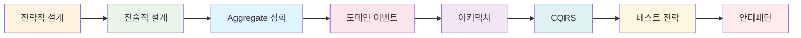
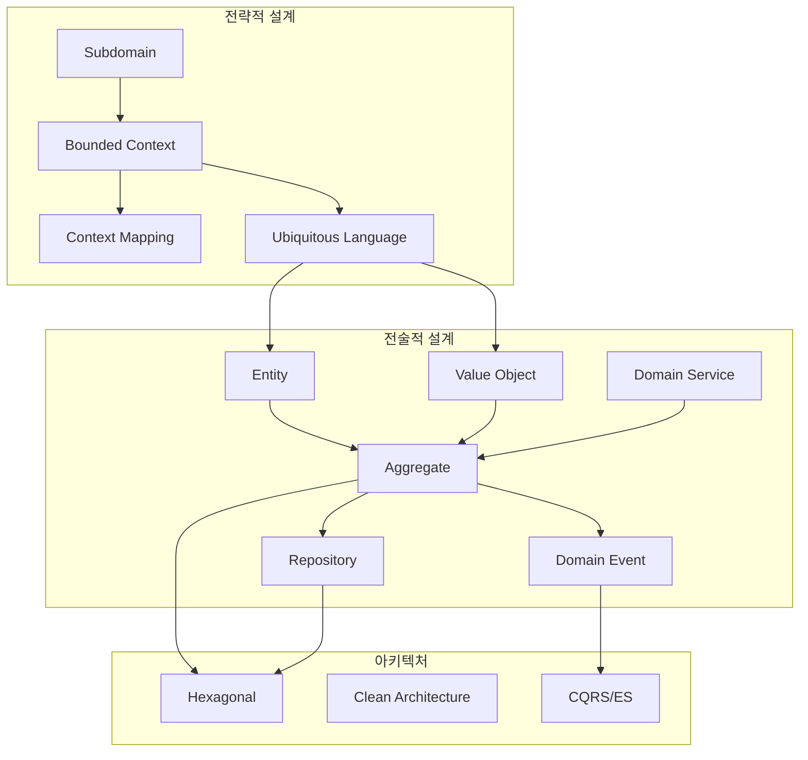

DDD의 전략적 설계와 전술적 설계 패턴을 깊이 있게 살펴봅니다.

## 학습 순서

## 목차

### 설계 패턴

1. [전략적 설계](strategic-design/) - Subdomain, Bounded Context, Context Mapping, Ubiquitous Language
2. [전술적 설계](tactical-design/) - Entity, Value Object, Repository, Domain Service, Specification
3. [Aggregate 심화](aggregate/) - Aggregate 설계 원칙, 트랜잭션 경계, 크기 결정
4. [도메인 이벤트](domain-events/) - 이벤트 기반 아키텍처, Event Sourcing

### 아키텍처

5. [아키텍처 패턴](architecture/) - Hexagonal, Clean Architecture, Onion Architecture
6. [CQRS](cqrs/) - Command Query Responsibility Segregation

### 품질

7. [테스트 전략](testing/) - 도메인 모델 테스트, 통합 테스트, E2E
8. [안티패턴과 함정](anti-patterns/) - 흔한 실수와 해결책

## 개념 간 관계

