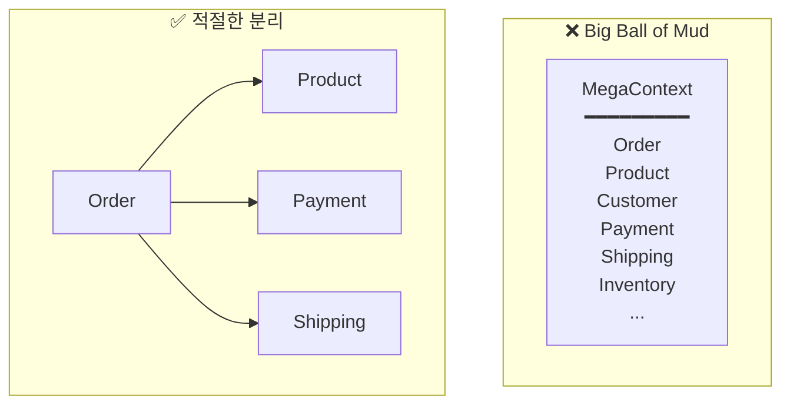
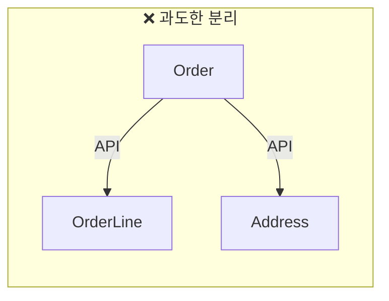

# DDD 안티패턴과 함정

DDD를 적용할 때 흔히 범하는 실수와 해결책을 정리합니다.

## 전략적 설계 안티패턴

### 1. Big Ball of Mud Context

**문제:** 모든 것을 하나의 거대한 Bounded Context로 만듦



**증상:**
- 모든 팀이 같은 코드베이스 수정
- 작은 변경에 큰 배포 필요
- 같은 용어가 혼란스럽게 사용됨

**해결책:**
```
1. 언어적 경계 찾기: 용어 충돌 지점 = Context 경계
2. 팀 경계 고려: 다른 팀 = 다른 Context
3. 점진적 분리: 가장 명확한 경계부터 분리
```

---

### 2. Context가 너무 작음

**문제:** 너무 세밀하게 나눠서 통합 비용이 커짐



**증상:**
- 간단한 기능에 여러 서비스 호출
- 트랜잭션 관리 복잡
- 네트워크 오버헤드

**해결책:**
```
Context 분리 기준:
- 독립적으로 배포 가능한가?
- 다른 팀이 담당하는가?
- 다른 생명주기를 가지는가?

하나라도 No면 같은 Context 유지
```

---

### 3. Ubiquitous Language 무시

**문제:** 도메인 용어 없이 기술 용어로만 코드 작성

```java
// ❌ 기술 용어
public class OrderManager {
    public void updateStatus(Long id, int status) {
        // status: 0=대기, 1=확정, 2=배송, 9=취소
    }
}

// ✅ 도메인 용어
public class Order {
    public void confirm() { }
    public void ship(TrackingNumber trackingNumber) { }
    public void cancel(CancellationReason reason) { }
}
```

**해결책:**
```
1. 도메인 전문가와 용어 사전 작성
2. 코드, 테스트, 문서에서 동일한 용어 사용
3. 코드 리뷰에서 용어 검증
```

## 전술적 설계 안티패턴

### 4. Anemic Domain Model (빈약한 도메인 모델)

**문제:** Entity가 데이터만 가지고 로직이 없음

```java
// ❌ Anemic Model
public class Order {
    private Long id;
    private String status;
    private LocalDateTime confirmedAt;

    // getter/setter만 존재
    public String getStatus() { return status; }
    public void setStatus(String status) { this.status = status; }
}

// 로직이 서비스에 분산
public class OrderService {
    public void confirmOrder(Long orderId) {
        Order order = repository.findById(orderId);
        if (order.getStatus().equals("PENDING")) {
            order.setStatus("CONFIRMED");
            order.setConfirmedAt(LocalDateTime.now());
            // 비즈니스 규칙이 여기에...
        }
        repository.save(order);
    }
}
```

```java
// ✅ Rich Domain Model
public class Order {
    private OrderId id;
    private OrderStatus status;
    private LocalDateTime confirmedAt;

    public void confirm() {
        validateConfirmable();
        this.status = OrderStatus.CONFIRMED;
        this.confirmedAt = LocalDateTime.now();
        registerEvent(new OrderConfirmedEvent(this));
    }

    private void validateConfirmable() {
        if (this.status != OrderStatus.PENDING) {
            throw new IllegalOrderStateException(
                "PENDING 상태에서만 확정 가능합니다. 현재: " + this.status
            );
        }
    }
}

// 서비스는 흐름만 조율
public class OrderService {
    public void confirmOrder(OrderId orderId) {
        Order order = repository.findById(orderId).orElseThrow();
        order.confirm();  // 도메인에 위임
        repository.save(order);
    }
}
```

**진단 체크리스트:**
```
[ ] Entity에 setter가 있는가? → 행위 메서드로 교체
[ ] Service가 if-else로 상태를 검증하는가? → Entity로 이동
[ ] 비즈니스 규칙이 Service에 있는가? → 도메인으로 이동
```

---

### 5. God Aggregate

**문제:** 너무 많은 것을 포함하는 거대한 Aggregate

```java
// ❌ God Aggregate
public class Order {
    private OrderId id;
    private Customer customer;        // Customer Aggregate 전체
    private List<Product> products;   // Product Aggregate 전체
    private Payment payment;          // Payment Aggregate 전체
    private Shipment shipment;        // Shipment Aggregate 전체
}
```

**문제점:**
- 트랜잭션 범위가 너무 넓음
- 동시성 충돌 빈번
- 성능 저하

```java
// ✅ 적절한 크기
public class Order {
    private OrderId id;
    private CustomerId customerId;      // ID로 참조
    private List<OrderLine> orderLines; // 진짜 내부 엔티티만
    private ShippingAddress address;    // Value Object
}

public class OrderLine {
    private OrderLineId id;
    private ProductId productId;        // ID로 참조
    private String productName;         // 필요한 정보만 복사
    private Money price;
    private int quantity;
}
```

---

### 6. Aggregate 경계 무시

**문제:** 한 트랜잭션에서 여러 Aggregate 수정

```java
// ❌ 여러 Aggregate 동시 수정
@Transactional
public void confirmOrder(OrderId orderId) {
    Order order = orderRepository.findById(orderId);
    order.confirm();

    // 같은 트랜잭션에서 다른 Aggregate 수정 - 피해야 함!
    for (OrderLine line : order.getOrderLines()) {
        Stock stock = stockRepository.findByProductId(line.getProductId());
        stock.reserve(line.getQuantity());
        stockRepository.save(stock);
    }

    Customer customer = customerRepository.findById(order.getCustomerId());
    customer.addPoints(order.getTotalAmount().multiply(0.01));
    customerRepository.save(customer);

    orderRepository.save(order);
}
```

```java
// ✅ 이벤트로 분리
@Transactional
public void confirmOrder(OrderId orderId) {
    Order order = orderRepository.findById(orderId);
    order.confirm();  // OrderConfirmedEvent 발행
    orderRepository.save(order);
}

// 별도 트랜잭션에서 처리
@Component
public class StockEventHandler {
    @TransactionalEventListener(phase = TransactionPhase.AFTER_COMMIT)
    @Transactional(propagation = Propagation.REQUIRES_NEW)
    public void on(OrderConfirmedEvent event) {
        for (OrderLineSnapshot line : event.getOrderLines()) {
            Stock stock = stockRepository.findByProductId(line.productId());
            stock.reserve(line.quantity());
            stockRepository.save(stock);
        }
    }
}
```

---

### 7. Primitive Obsession (원시 타입 집착)

**문제:** 도메인 개념을 원시 타입으로 표현

```java
// ❌ Primitive Obsession
public class Order {
    private String orderId;          // 그냥 String
    private String customerId;       // 그냥 String
    private String email;            // 그냥 String
    private int totalAmount;         // 그냥 int
    private String status;           // 그냥 String
}

public void createOrder(String customerId, String email, int amount) {
    // customerId와 email을 바꿔 넣어도 컴파일 에러 없음!
}
```

```java
// ✅ Value Object 사용
public class Order {
    private OrderId id;
    private CustomerId customerId;
    private Email email;
    private Money totalAmount;
    private OrderStatus status;
}

// 컴파일 타임에 타입 검증
public void createOrder(CustomerId customerId, Email email, Money amount) {
    // 타입이 다르면 컴파일 에러
}

// 도메인 규칙을 Value Object가 보호
public record Email(String value) {
    public Email {
        if (!value.matches("^[\\w.-]+@[\\w.-]+\\.[a-zA-Z]{2,}$")) {
            throw new InvalidEmailException(value);
        }
    }
}
```

---

### 8. Smart UI Anti-Pattern

**문제:** 비즈니스 로직이 UI/Controller에 있음

```java
// ❌ Controller에 비즈니스 로직
@RestController
public class OrderController {

    @PostMapping("/orders/{id}/confirm")
    public ResponseEntity<?> confirmOrder(@PathVariable Long id) {
        Order order = repository.findById(id);

        // Controller에서 비즈니스 규칙 검증
        if (!order.getStatus().equals("PENDING")) {
            return ResponseEntity.badRequest().body("이미 확정된 주문");
        }

        if (order.getTotalAmount() > 1000000) {
            // 고액 주문 추가 검증
            if (!fraudService.check(order)) {
                return ResponseEntity.badRequest().body("사기 의심");
            }
        }

        order.setStatus("CONFIRMED");
        repository.save(order);
        return ResponseEntity.ok().build();
    }
}
```

```java
// ✅ 로직은 도메인에
@RestController
public class OrderController {

    private final ConfirmOrderUseCase confirmOrderUseCase;

    @PostMapping("/orders/{id}/confirm")
    public ResponseEntity<?> confirmOrder(@PathVariable String id) {
        confirmOrderUseCase.confirm(OrderId.of(id));
        return ResponseEntity.ok().build();
    }
}

// Domain
public class Order {
    public void confirm(FraudChecker fraudChecker) {
        validateConfirmable();
        validateFraud(fraudChecker);
        this.status = OrderStatus.CONFIRMED;
    }

    private void validateConfirmable() {
        if (this.status != OrderStatus.PENDING) {
            throw new IllegalOrderStateException("...");
        }
    }

    private void validateFraud(FraudChecker fraudChecker) {
        if (isHighValue() && !fraudChecker.isSafe(this)) {
            throw new FraudSuspectedException(this.id);
        }
    }
}
```

## 아키텍처 안티패턴

### 9. 도메인 의존성 오염

**문제:** 도메인이 인프라에 의존

```java
// ❌ 도메인이 JPA에 의존
@Entity
@Table(name = "orders")
public class Order {
    @Id @GeneratedValue
    private Long id;

    @OneToMany(cascade = CascadeType.ALL)
    private List<OrderLine> orderLines;

    @Transient  // JPA 무시
    private List<DomainEvent> events;
}
```

```java
// ✅ 순수한 도메인
// Domain Layer
public class Order {
    private OrderId id;
    private List<OrderLine> orderLines;
    private List<DomainEvent> events;
}

// Infrastructure Layer
@Entity
@Table(name = "orders")
public class OrderEntity {
    @Id
    private String id;

    @OneToMany(cascade = CascadeType.ALL)
    private List<OrderLineEntity> orderLines;
}

// Mapper가 변환
@Component
public class OrderMapper {
    public OrderEntity toEntity(Order order) { ... }
    public Order toDomain(OrderEntity entity) { ... }
}
```

---

### 10. Repository 구현 누출

**문제:** Repository 구현 세부사항이 도메인에 노출

```java
// ❌ JPA 구현 누출
public interface OrderRepository extends JpaRepository<Order, Long> {
    // JPA 기능이 그대로 노출됨
    // findAll(), save(), saveAll() 등
}

// 도메인에서 JPA 메서드 직접 사용
orderRepository.saveAll(orders);
orderRepository.flush();
```

```java
// ✅ 도메인 Repository 인터페이스
// Domain Layer
public interface OrderRepository {
    Order save(Order order);
    Optional<Order> findById(OrderId id);
    List<Order> findByCustomerId(CustomerId customerId);
}

// Infrastructure Layer
@Repository
public class JpaOrderRepository implements OrderRepository {
    private final OrderJpaRepository jpaRepository;

    @Override
    public Order save(Order order) {
        OrderEntity entity = mapper.toEntity(order);
        return mapper.toDomain(jpaRepository.save(entity));
    }
}

interface OrderJpaRepository extends JpaRepository<OrderEntity, String> {
    // JPA 기능은 여기에만 존재
}
```

## CQRS 안티패턴

### 11. 과도한 CQRS

**문제:** 단순 CRUD에 CQRS 적용

```java
// ❌ 단순 조회에 복잡한 CQRS
public class UserQueryService {
    public UserView getUser(String userId) {
        // 단순 조회인데 별도 Read Model, Projector 구축
    }
}

// ✅ 복잡도에 맞는 선택
public class UserService {
    public User getUser(UserId id) {
        return userRepository.findById(id).orElseThrow();
    }
}
```

**CQRS 적용 기준:**
```
[ ] 조회와 명령의 모델이 크게 다른가?
[ ] 조회 성능 최적화가 필요한가?
[ ] 복잡한 검색/리포팅이 필요한가?

하나도 Yes가 아니면 단순 모델로 충분
```

---

### 12. 동기화 실패 무시

**문제:** Read Model 동기화 실패 처리 없음

```java
// ❌ 실패 시 데이터 불일치
@EventListener
public void on(OrderConfirmedEvent event) {
    OrderView view = viewRepository.findById(event.getOrderId());
    view.setStatus("CONFIRMED");  // 실패하면?
    viewRepository.save(view);
}
```

```java
// ✅ 실패 처리와 재시도
@Component
public class OrderViewProjector {

    private final FailedEventStore failedEventStore;

    @KafkaListener(topics = "order-events")
    @Retryable(maxAttempts = 3, backoff = @Backoff(delay = 1000))
    public void handle(DomainEvent event) {
        try {
            project(event);
        } catch (Exception e) {
            // 재시도 실패 시 저장
            failedEventStore.save(event, e);
            throw e;
        }
    }

    // 실패 이벤트 수동 재처리
    @Scheduled(fixedDelay = 60000)
    public void retryFailedEvents() {
        failedEventStore.findAll().forEach(this::retry);
    }
}
```

## 해결 체크리스트

### 프로젝트 시작 전

```
[ ] 도메인 전문가와 용어 사전 작성했는가?
[ ] Core/Supporting/Generic Domain 분류했는가?
[ ] Bounded Context 경계를 정의했는가?
[ ] Context 간 통합 방식을 결정했는가?
```

### 코드 작성 시

```
[ ] Entity에 행위(메서드)가 있는가?
[ ] Value Object를 적극 활용하고 있는가?
[ ] Aggregate 경계가 적절한가?
[ ] 도메인이 인프라에 의존하지 않는가?
```

### 코드 리뷰 시

```
[ ] 비즈니스 용어를 사용했는가?
[ ] 로직이 도메인에 있는가?
[ ] 한 트랜잭션에 하나의 Aggregate만 수정하는가?
[ ] 테스트가 도메인 규칙을 검증하는가?
```

## 다음 단계

- [실습 예제](../../examples/) - 올바른 패턴으로 구현하기
- [용어 사전](../../appendix/glossary/) - DDD 용어 정리
