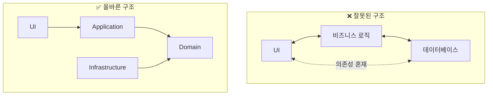
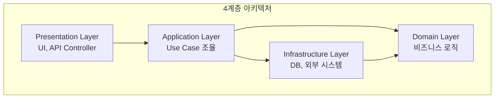
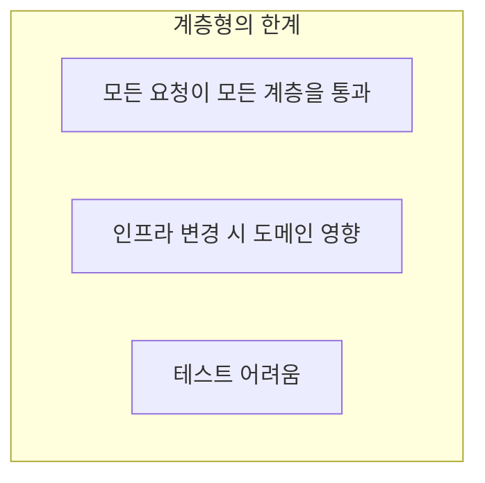
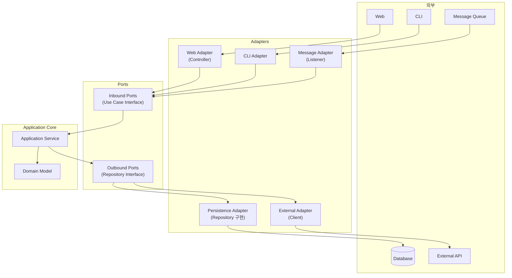
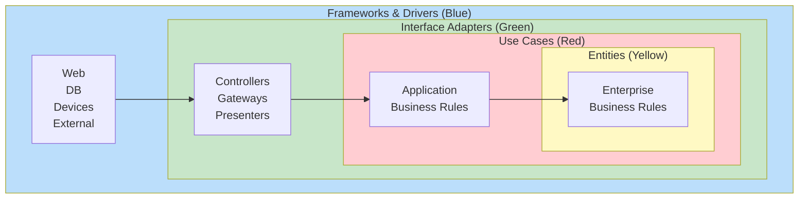
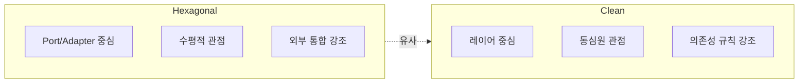
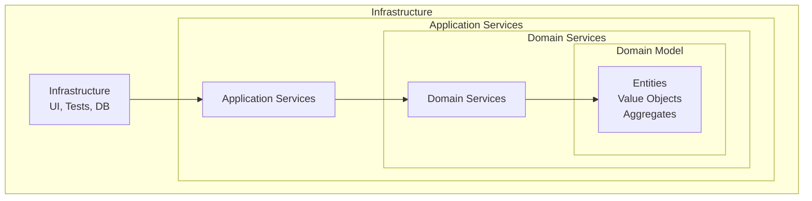
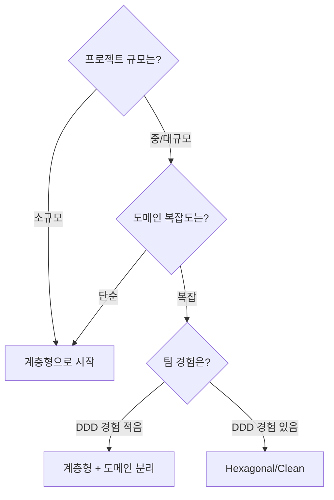
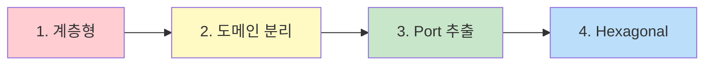

# 아키텍처 패턴

DDD를 효과적으로 구현하기 위한 아키텍처 패턴들을 살펴봅니다.

## 왜 아키텍처가 중요한가?



**핵심 원칙: 도메인은 어떤 것에도 의존하지 않는다**

## Layered Architecture (계층형 아키텍처)

### 기본 구조



### 각 계층의 역할

| 계층 | 역할 | 포함 요소 |
|------|------|----------|
| **Presentation** | 사용자 인터페이스, API | Controller, View, DTO |
| **Application** | 유스케이스 조율, 트랜잭션 | Application Service, Command/Query |
| **Domain** | 비즈니스 로직 | Entity, Value Object, Aggregate, Domain Service |
| **Infrastructure** | 기술적 구현 | Repository 구현, 외부 API 연동 |

### 의존성 규칙

```java
// ✅ 올바른 의존 방향
presentation → application → domain ← infrastructure

// ❌ 잘못된 의존 방향
domain → infrastructure  // 도메인이 인프라에 의존하면 안 됨
```

### 한계점



## Hexagonal Architecture (헥사고날 아키텍처)

### 개념

**Ports and Adapters**라고도 불립니다. 도메인을 중심에 두고 외부와의 연결을 Port와 Adapter로 추상화합니다.



### Port와 Adapter

**Port (인터페이스):**
- **Inbound Port:** 외부에서 애플리케이션으로 들어오는 요청 정의
- **Outbound Port:** 애플리케이션에서 외부로 나가는 요청 정의

**Adapter (구현체):**
- **Primary/Driving Adapter:** 애플리케이션을 호출 (Controller, CLI)
- **Secondary/Driven Adapter:** 애플리케이션이 호출 (Repository, Client)

### 구현 예시

```java
// === Inbound Port (Use Case Interface) ===
// 도메인 계층에 위치
public interface ConfirmOrderUseCase {
    void confirm(OrderId orderId);
}

// === Application Service (Use Case 구현) ===
@Service
@Transactional
public class OrderService implements ConfirmOrderUseCase {

    private final LoadOrderPort loadOrderPort;      // Outbound Port
    private final SaveOrderPort saveOrderPort;      // Outbound Port
    private final SendNotificationPort notificationPort;  // Outbound Port

    @Override
    public void confirm(OrderId orderId) {
        Order order = loadOrderPort.loadById(orderId);
        order.confirm();
        saveOrderPort.save(order);
        notificationPort.sendConfirmation(order);
    }
}

// === Outbound Ports ===
// 도메인 계층에 위치
public interface LoadOrderPort {
    Order loadById(OrderId id);
}

public interface SaveOrderPort {
    void save(Order order);
}

public interface SendNotificationPort {
    void sendConfirmation(Order order);
}

// === Primary Adapter (Controller) ===
@RestController
@RequestMapping("/api/orders")
public class OrderController {

    private final ConfirmOrderUseCase confirmOrderUseCase;

    @PostMapping("/{orderId}/confirm")
    public ResponseEntity<Void> confirm(@PathVariable String orderId) {
        confirmOrderUseCase.confirm(OrderId.of(orderId));
        return ResponseEntity.ok().build();
    }
}

// === Secondary Adapter (Repository 구현) ===
@Repository
public class OrderPersistenceAdapter implements LoadOrderPort, SaveOrderPort {

    private final OrderJpaRepository jpaRepository;
    private final OrderMapper mapper;

    @Override
    public Order loadById(OrderId id) {
        return jpaRepository.findById(id.getValue())
            .map(mapper::toDomain)
            .orElseThrow(() -> new OrderNotFoundException(id));
    }

    @Override
    public void save(Order order) {
        OrderEntity entity = mapper.toEntity(order);
        jpaRepository.save(entity);
    }
}

// === Secondary Adapter (External API) ===
@Component
public class NotificationAdapter implements SendNotificationPort {

    private final NotificationClient client;

    @Override
    public void sendConfirmation(Order order) {
        client.send(new NotificationRequest(
            order.getCustomerId().getValue(),
            "주문이 확정되었습니다: " + order.getId()
        ));
    }
}
```

### 패키지 구조

```
com.example.order/
├── adapter/
│   ├── in/
│   │   └── web/
│   │       ├── OrderController.java
│   │       └── OrderRequest.java
│   └── out/
│       ├── persistence/
│       │   ├── OrderPersistenceAdapter.java
│       │   ├── OrderEntity.java
│       │   └── OrderMapper.java
│       └── notification/
│           └── NotificationAdapter.java
│
├── application/
│   ├── port/
│   │   ├── in/
│   │   │   └── ConfirmOrderUseCase.java
│   │   └── out/
│   │       ├── LoadOrderPort.java
│   │       ├── SaveOrderPort.java
│   │       └── SendNotificationPort.java
│   └── service/
│       └── OrderService.java
│
└── domain/
    ├── Order.java
    ├── OrderLine.java
    ├── OrderId.java
    └── Money.java
```

### 장점

| 장점 | 설명 |
|------|------|
| **테스트 용이** | Port를 Mock으로 대체 가능 |
| **기술 독립** | Adapter만 변경하면 기술 교체 가능 |
| **명확한 경계** | 도메인과 외부의 경계가 명확 |
| **유연성** | 새 Adapter 추가로 다양한 인터페이스 지원 |

## Clean Architecture

### 개념

Uncle Bob(Robert C. Martin)이 제안한 아키텍처로, 의존성이 **항상 안쪽으로** 향합니다.



### 의존성 규칙

```
외부 → Adapters → Use Cases → Entities

핵심: 안쪽 원은 바깥쪽 원에 대해 아무것도 모른다
```

### 각 레이어

| 레이어 | 역할 | DDD 매핑 |
|--------|------|----------|
| **Entities** | 핵심 비즈니스 규칙 | Entity, Value Object, Aggregate |
| **Use Cases** | 애플리케이션 비즈니스 규칙 | Application Service |
| **Interface Adapters** | 데이터 변환 | Controller, Repository 구현 |
| **Frameworks & Drivers** | 프레임워크, 도구 | Spring, JPA, Kafka |

### Hexagonal vs Clean



**실제로는 동일한 원칙을 다른 관점에서 설명**

## Onion Architecture

### 개념

Jeffrey Palermo가 제안한 아키텍처로, Clean Architecture와 유사하지만 **도메인 모델을 더 강조**합니다.



### 핵심 원칙

1. **도메인 모델이 중심**
2. **의존성은 안쪽으로만**
3. **외부 관심사는 최외곽에**

## 실전: 어떤 아키텍처를 선택할까?

### 선택 가이드



### 실용적 조언

| 상황 | 권장 |
|------|------|
| **스타트업, MVP** | 계층형으로 빠르게 시작, 나중에 리팩터링 |
| **복잡한 도메인** | Hexagonal/Clean으로 도메인 보호 |
| **마이크로서비스** | Hexagonal이 서비스 경계와 잘 맞음 |
| **레거시 통합** | ACL + Hexagonal로 격리 |

### 점진적 전환



**1단계: 계층형**
```
src/
├── controller/
├── service/
├── repository/
└── entity/
```

**2단계: 도메인 분리**
```
src/
├── controller/
├── application/
├── domain/          # 분리!
│   ├── model/
│   └── repository/  # Interface
└── infrastructure/
    └── persistence/ # 구현
```

**3단계: Port 추출**
```
src/
├── adapter/in/web/
├── adapter/out/persistence/
├── application/
│   ├── port/in/
│   └── port/out/
└── domain/
```

## 공통 원칙

어떤 아키텍처를 선택하든 지켜야 할 원칙:

### 1. Dependency Inversion

```java
// ❌ 도메인이 인프라에 의존
public class Order {
    private JpaOrderRepository repository;  // JPA 의존
}

// ✅ 인프라가 도메인에 의존
// Domain
public interface OrderRepository {
    Order findById(OrderId id);
}

// Infrastructure
@Repository
public class JpaOrderRepository implements OrderRepository {
    // JPA 구현
}
```

### 2. 도메인 순수성

```java
// ❌ 도메인에 프레임워크 어노테이션
@Entity
@Table(name = "orders")
public class Order {
    @Id
    private Long id;
}

// ✅ 순수한 도메인
public class Order {
    private OrderId id;
}

// Infrastructure에서 매핑
@Entity
@Table(name = "orders")
public class OrderEntity {
    @Id
    private String id;
}
```

### 3. 외부 의존성 격리

```java
// ❌ 도메인에서 외부 라이브러리 직접 사용
public class Order {
    public void sendNotification() {
        // Kafka 직접 사용
        kafkaTemplate.send("orders", this);
    }
}

// ✅ Port로 추상화
// Domain
public interface NotificationPort {
    void notify(Order order);
}

// Infrastructure
@Component
public class KafkaNotificationAdapter implements NotificationPort {
    private final KafkaTemplate kafkaTemplate;

    public void notify(Order order) {
        kafkaTemplate.send("orders", toEvent(order));
    }
}
```

## 다음 단계

- [CQRS](../cqrs/) - Command Query Responsibility Segregation
- [테스트 전략](../testing/) - 아키텍처별 테스트 방법
