# 아키텍처 패턴

DDD를 효과적으로 구현하기 위한 아키텍처 패턴들을 살펴봅니다.

## 왜 아키텍처가 중요한가?

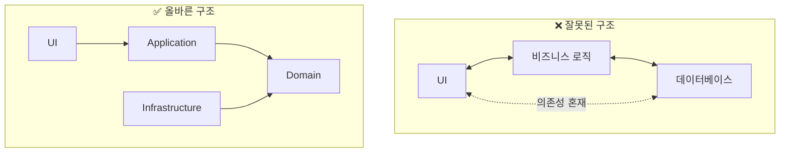

**핵심 원칙: 도메인은 어떤 것에도 의존하지 않는다**

## Layered Architecture (계층형 아키텍처)

### 기본 구조

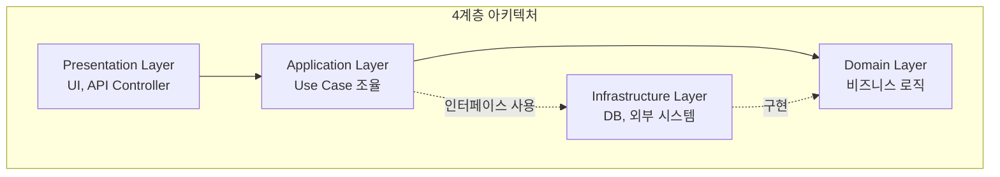

> **참고:** 점선은 의존성 역전(DIP)을 나타냅니다. Application은 인터페이스를 통해 Infrastructure를 사용하고, Infrastructure는 Domain에 정의된 인터페이스를 구현합니다.

### 각 계층의 역할

| 계층 | 역할 | 포함 요소 |
|------|------|----------|
| **Presentation** | 사용자 인터페이스, API | Controller, View, DTO |
| **Application** | 유스케이스 조율, 트랜잭션 | Application Service, Command/Query |
| **Domain** | 비즈니스 로직 | Entity, Value Object, Aggregate, Domain Service |
| **Infrastructure** | 기술적 구현 | Repository 구현, 외부 API 연동 |

### 의존성 규칙

```java
// ✅ 올바른 의존 방향
presentation → application → domain ← infrastructure

// ❌ 잘못된 의존 방향
domain → infrastructure  // 도메인이 인프라에 의존하면 안 됨
```

### 한계점

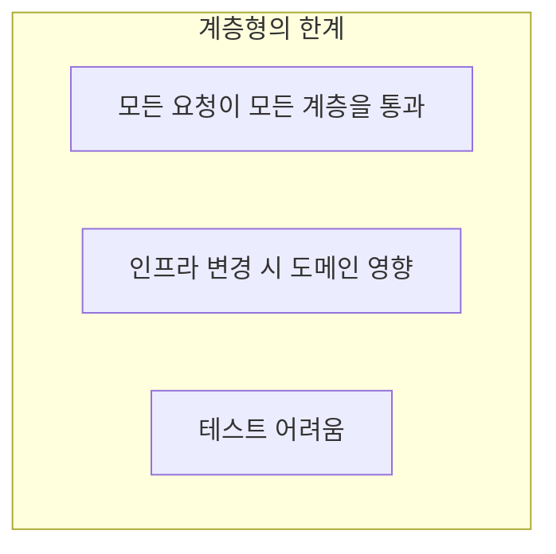

## Hexagonal Architecture (헥사고날 아키텍처)

### 개념

**Ports and Adapters**라고도 불립니다. 도메인을 중심에 두고 외부와의 연결을 Port와 Adapter로 추상화합니다.

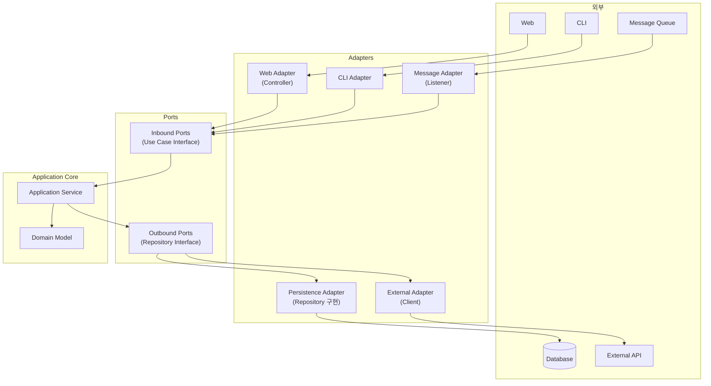

### Port와 Adapter

**Port (인터페이스):**
- **Inbound Port:** 외부에서 애플리케이션으로 들어오는 요청 정의
- **Outbound Port:** 애플리케이션에서 외부로 나가는 요청 정의

**Adapter (구현체):**
- **Primary/Driving Adapter:** 애플리케이션을 호출 (Controller, CLI)
- **Secondary/Driven Adapter:** 애플리케이션이 호출 (Repository, Client)

### 구현 예시

```java
// === Inbound Port (Use Case Interface) ===
// Application 계층에 위치 (외부에서 애플리케이션을 호출하는 인터페이스)
public interface ConfirmOrderUseCase {
    void confirm(OrderId orderId);
}

// === Application Service (Use Case 구현) ===
@Service
@Transactional
public class OrderService implements ConfirmOrderUseCase {

    private final LoadOrderPort loadOrderPort;      // Outbound Port
    private final SaveOrderPort saveOrderPort;      // Outbound Port
    private final SendNotificationPort notificationPort;  // Outbound Port

    @Override
    public void confirm(OrderId orderId) {
        Order order = loadOrderPort.loadById(orderId);
        order.confirm();
        saveOrderPort.save(order);
        notificationPort.sendConfirmation(order);
    }
}

// === Outbound Ports ===
// Application 계층에 정의 (도메인이 외부에 의존하지 않도록 추상화)
public interface LoadOrderPort {
    Order loadById(OrderId id);
}

public interface SaveOrderPort {
    void save(Order order);
}

public interface SendNotificationPort {
    void sendConfirmation(Order order);
}

// === Primary Adapter (Controller) ===
@RestController
@RequestMapping("/api/orders")
public class OrderController {

    private final ConfirmOrderUseCase confirmOrderUseCase;

    @PostMapping("/{orderId}/confirm")
    public ResponseEntity<Void> confirm(@PathVariable String orderId) {
        confirmOrderUseCase.confirm(OrderId.of(orderId));
        return ResponseEntity.ok().build();
    }
}

// === Secondary Adapter (Repository 구현) ===
@Repository
public class OrderPersistenceAdapter implements LoadOrderPort, SaveOrderPort {

    private final OrderJpaRepository jpaRepository;
    private final OrderMapper mapper;

    @Override
    public Order loadById(OrderId id) {
        return jpaRepository.findById(id.getValue())
            .map(mapper::toDomain)
            .orElseThrow(() -> new OrderNotFoundException(id));
    }

    @Override
    public void save(Order order) {
        OrderEntity entity = mapper.toEntity(order);
        jpaRepository.save(entity);
    }
}

// === Secondary Adapter (External API) ===
@Component
public class NotificationAdapter implements SendNotificationPort {

    private final NotificationClient client;

    @Override
    public void sendConfirmation(Order order) {
        client.send(new NotificationRequest(
            order.getCustomerId().getValue(),
            "주문이 확정되었습니다: " + order.getId()
        ));
    }
}
```

### 패키지 구조

```
com.example.order/
├── adapter/
│   ├── in/
│   │   └── web/
│   │       ├── OrderController.java
│   │       └── OrderRequest.java
│   └── out/
│       ├── persistence/
│       │   ├── OrderPersistenceAdapter.java
│       │   ├── OrderEntity.java
│       │   └── OrderMapper.java
│       └── notification/
│           └── NotificationAdapter.java
│
├── application/
│   ├── port/
│   │   ├── in/
│   │   │   └── ConfirmOrderUseCase.java
│   │   └── out/
│   │       ├── LoadOrderPort.java
│   │       ├── SaveOrderPort.java
│   │       └── SendNotificationPort.java
│   └── service/
│       └── OrderService.java
│
└── domain/
    ├── Order.java
    ├── OrderLine.java
    ├── OrderId.java
    └── Money.java
```

### 장점

| 장점 | 설명 |
|------|------|
| **테스트 용이** | Port를 Mock으로 대체 가능 |
| **기술 독립** | Adapter만 변경하면 기술 교체 가능 |
| **명확한 경계** | 도메인과 외부의 경계가 명확 |
| **유연성** | 새 Adapter 추가로 다양한 인터페이스 지원 |

### Port 명명 규칙

> **참고:** 아키텍처마다 Port/Interface 명명 규칙이 다릅니다.

| 아키텍처 | Inbound | Outbound | 예시 |
|----------|---------|----------|------|
| **Hexagonal** | `XxxUseCase` | `XxxPort` | `ConfirmOrderUseCase`, `SaveOrderPort` |
| **Clean** | `XxxUseCase` | `XxxGateway`, `XxxRepository` | `CreateOrderUseCase`, `PaymentGateway` |
| **Onion** | 직접 Service 호출 | `XxxRepository`, `XxxService` | `OrderRepository`, `PaymentService` |

**일관성이 중요합니다:** 프로젝트 내에서 하나의 규칙을 선택하고 지키세요.

## Clean Architecture

### 개념

Uncle Bob(Robert C. Martin)이 제안한 아키텍처로, 의존성이 **항상 안쪽으로** 향합니다.

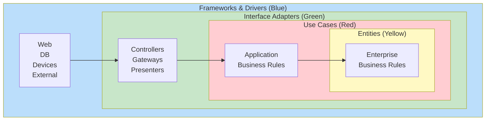

### 의존성 규칙

```
외부 → Adapters → Use Cases → Entities

핵심: 안쪽 원은 바깥쪽 원에 대해 아무것도 모른다
```

### 각 레이어

| 레이어 | 역할 | DDD 매핑 |
|--------|------|----------|
| **Entities** | 핵심 비즈니스 규칙 | Entity, Value Object, Aggregate |
| **Use Cases** | 애플리케이션 비즈니스 규칙 | Application Service |
| **Interface Adapters** | 데이터 변환 | Controller, Repository 구현 |
| **Frameworks & Drivers** | 프레임워크, 도구 | Spring, JPA, Kafka |

### Clean Architecture 구현 예시

#### 패키지 구조

```
com.example.order/
├── entity/                      # Entities (가장 안쪽)
│   ├── Order.java
│   ├── OrderLine.java
│   └── OrderId.java
│
├── usecase/                     # Use Cases
│   ├── port/
│   │   ├── in/
│   │   │   ├── CreateOrderUseCase.java
│   │   │   └── GetOrderQuery.java
│   │   └── out/
│   │       ├── OrderRepository.java
│   │       └── PaymentGateway.java
│   └── interactor/
│       ├── CreateOrderInteractor.java
│       └── GetOrderInteractor.java
│
├── adapter/                     # Interface Adapters
│   ├── controller/
│   │   ├── OrderController.java
│   │   └── OrderViewModel.java
│   ├── presenter/
│   │   └── OrderPresenter.java
│   └── gateway/
│       ├── OrderRepositoryImpl.java
│       └── PaymentGatewayImpl.java
│
└── framework/                   # Frameworks & Drivers
    ├── web/
    │   └── SpringWebConfig.java
    └── persistence/
        ├── JpaOrderEntity.java
        └── JpaOrderRepository.java
```

#### Use Case (Interactor) 구현

```java
// === Input Port (Use Case Interface) ===
public interface CreateOrderUseCase {
    CreateOrderOutput execute(CreateOrderInput input);
}

// Input/Output 객체 (Use Case 레이어에 속함)
public record CreateOrderInput(
    String customerId,
    List<OrderLineInput> lines
) {}

public record CreateOrderOutput(
    String orderId,
    String status,
    BigDecimal totalAmount
) {}

// === Interactor (Use Case 구현) ===
// 주의: Interactor는 Presenter를 직접 의존하면 안 됨 (의존성 규칙 위반)
// Output 객체를 반환하고, Controller가 Presenter를 사용
public class CreateOrderInteractor implements CreateOrderUseCase {

    private final OrderRepository orderRepository;
    private final PaymentGateway paymentGateway;

    @Override
    public CreateOrderOutput execute(CreateOrderInput input) {
        // 1. Entity 생성 (비즈니스 로직은 Entity에)
        Order order = Order.create(
            CustomerId.of(input.customerId()),
            toOrderLines(input.lines())
        );

        // 2. Repository를 통해 저장
        orderRepository.save(order);

        // 3. 외부 시스템 호출
        paymentGateway.reserve(order.getTotalAmount());

        // 4. Output 객체 직접 생성 (Presenter 의존 X)
        return new CreateOrderOutput(
            order.getId().getValue(),
            order.getStatus().name(),
            order.getTotalAmount().getAmount()
        );
    }
}

// === Output Port (Repository Interface) ===
public interface OrderRepository {
    void save(Order order);
    Optional<Order> findById(OrderId id);
}

// === Gateway Interface ===
public interface PaymentGateway {
    void reserve(Money amount);
}
```

#### Controller → Use Case 연결

```java
// === Controller (Interface Adapter) ===
@RestController
@RequestMapping("/api/orders")
public class OrderController {

    private final CreateOrderUseCase createOrderUseCase;
    private final GetOrderQuery getOrderQuery;

    @PostMapping
    public ResponseEntity<OrderResponse> create(
            @RequestBody OrderRequest request) {

        // Request → Input 변환
        CreateOrderInput input = new CreateOrderInput(
            request.customerId(),
            request.lines().stream()
                .map(this::toLineInput)
                .toList()
        );

        // Use Case 실행
        CreateOrderOutput output = createOrderUseCase.execute(input);

        // Output → Response 변환
        return ResponseEntity.ok(toResponse(output));
    }
}
```

#### Repository 구현 (Gateway)

```java
// === Gateway 구현 (Framework 레이어) ===
@Repository
public class OrderRepositoryImpl implements OrderRepository {

    private final JpaOrderRepository jpaRepository;
    private final OrderDataMapper mapper;

    @Override
    public void save(Order order) {
        JpaOrderEntity entity = mapper.toJpaEntity(order);
        jpaRepository.save(entity);
    }

    @Override
    public Optional<Order> findById(OrderId id) {
        return jpaRepository.findById(id.getValue())
            .map(mapper::toDomain);
    }
}

// JPA Entity (Framework 레이어)
@Entity
@Table(name = "orders")
public class JpaOrderEntity {
    @Id
    private String id;
    private String customerId;
    private String status;
    private BigDecimal totalAmount;

    @OneToMany(mappedBy = "order", cascade = CascadeType.ALL)
    private List<JpaOrderLineEntity> lines;
}
```

### Hexagonal vs Clean

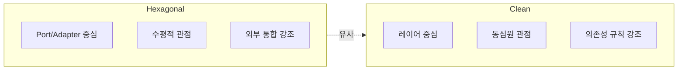

**실제로는 동일한 원칙을 다른 관점에서 설명**

## Onion Architecture

### 개념

Jeffrey Palermo가 제안한 아키텍처로, Clean Architecture와 유사하지만 **도메인 모델을 더 강조**합니다.

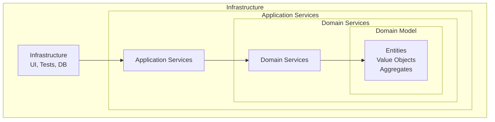

### 핵심 원칙

1. **도메인 모델이 중심**
2. **의존성은 안쪽으로만**
3. **외부 관심사는 최외곽에**

### 각 레이어 상세

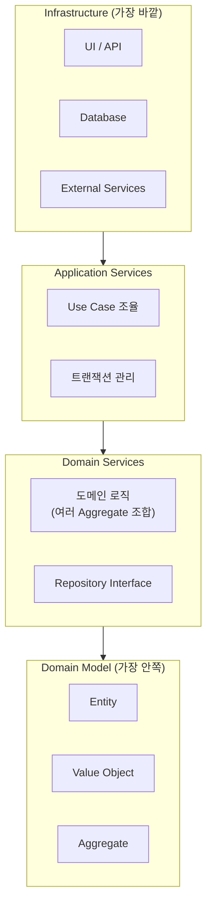

| 레이어 | 포함 요소 | 의존 방향 |
|--------|----------|----------|
| **Domain Model** | Entity, VO, Aggregate | 없음 (순수) |
| **Domain Services** | Domain Service, Repository Interface | → Domain Model |
| **Application Services** | Application Service, DTO | → Domain Services |
| **Infrastructure** | Controller, Repository 구현, DB | → Application Services |

### Onion Architecture 구현 예시

#### 패키지 구조

```
com.example.order/
├── domain/
│   ├── model/                    # Domain Model (가장 안쪽)
│   │   ├── Order.java
│   │   ├── OrderLine.java
│   │   ├── OrderId.java
│   │   ├── Money.java
│   │   └── OrderStatus.java
│   │
│   ├── service/                  # Domain Services
│   │   ├── OrderDomainService.java
│   │   └── PricingService.java
│   │
│   └── repository/               # Repository Interface
│       └── OrderRepository.java
│
├── application/                  # Application Services
│   ├── service/
│   │   └── OrderApplicationService.java
│   ├── command/
│   │   └── CreateOrderCommand.java
│   └── dto/
│       └── OrderDto.java
│
└── infrastructure/               # Infrastructure (가장 바깥)
    ├── web/
    │   ├── OrderController.java
    │   └── OrderRequest.java
    ├── persistence/
    │   ├── JpaOrderRepository.java
    │   ├── OrderEntity.java
    │   └── OrderMapper.java
    └── external/
        └── PaymentGateway.java
```

#### Domain Model (가장 안쪽)

```java
// 순수한 도메인 - 어떤 프레임워크에도 의존하지 않음
public class Order {
    private final OrderId id;
    private final CustomerId customerId;
    private final List<OrderLine> orderLines;
    private OrderStatus status;
    private Money totalAmount;

    // Factory Method
    public static Order create(CustomerId customerId, List<OrderLine> lines) {
        Order order = new Order(OrderId.generate(), customerId, lines);
        order.calculateTotal();
        return order;
    }

    // 비즈니스 로직
    public void confirm() {
        if (this.status != OrderStatus.PENDING) {
            throw new IllegalStateException("확정할 수 없는 상태: " + status);
        }
        this.status = OrderStatus.CONFIRMED;
    }

    public void addLine(OrderLine line) {
        validateCanModify();
        this.orderLines.add(line);
        calculateTotal();
    }

    public void applyDiscount(Money discountedTotal) {
        validateCanModify();
        this.totalAmount = discountedTotal;
    }

    private void validateCanModify() {
        if (this.status != OrderStatus.PENDING) {
            throw new IllegalStateException("수정할 수 없는 상태: " + status);
        }
    }

    private void calculateTotal() {
        this.totalAmount = orderLines.stream()
            .map(OrderLine::getAmount)
            .reduce(Money.ZERO, Money::add);
    }

    // Getters
    public OrderId getId() { return id; }
    public Money getTotalAmount() { return totalAmount; }
    public OrderStatus getStatus() { return status; }
}

// Value Object
// Currency는 java.util.Currency 또는 커스텀 enum 사용
public record Money(BigDecimal amount, String currencyCode) {
    public static final Money ZERO = new Money(BigDecimal.ZERO, "KRW");

    public static Money of(long amount) {
        return new Money(BigDecimal.valueOf(amount), "KRW");
    }

    public Money add(Money other) {
        validateSameCurrency(other);
        return new Money(this.amount.add(other.amount), this.currencyCode);
    }

    public Money multiply(int quantity) {
        return new Money(this.amount.multiply(BigDecimal.valueOf(quantity)), currencyCode);
    }

    public Money applyDiscount(Percentage discount) {
        BigDecimal discountAmount = this.amount.multiply(discount.value())
            .divide(BigDecimal.valueOf(100), RoundingMode.HALF_UP);
        return new Money(this.amount.subtract(discountAmount), currencyCode);
    }

    private void validateSameCurrency(Money other) {
        if (!this.currencyCode.equals(other.currencyCode)) {
            throw new IllegalArgumentException("통화가 다릅니다");
        }
    }

    public BigDecimal getAmount() {
        return amount;
    }
}
```

#### Domain Services

```java
// Domain Service - 여러 Aggregate를 조합하는 도메인 로직
public class PricingService {

    // 외부 의존성 없이 순수 도메인 로직
    public Money calculateDiscountedPrice(
            Order order,
            Customer customer,
            DiscountPolicy policy) {

        Money basePrice = order.getTotalAmount();
        Percentage discount = policy.getDiscountRate(customer.getGrade());

        return basePrice.applyDiscount(discount);
    }
}

// Repository Interface (도메인에 정의)
public interface OrderRepository {
    Order save(Order order);
    Optional<Order> findById(OrderId id);
    List<Order> findByCustomerId(CustomerId customerId);
}

// 외부 서비스 Interface (도메인에 정의)
public interface PaymentService {
    PaymentResult processPayment(OrderId orderId, Money amount);
}
```

#### Application Services

```java
@Service
@Transactional
public class OrderApplicationService {

    private final OrderRepository orderRepository;
    private final CustomerRepository customerRepository;
    private final PricingService pricingService;
    private final PaymentService paymentService;
    private final EventPublisher eventPublisher;

    // Use Case: 주문 생성
    public OrderDto createOrder(CreateOrderCommand command) {
        // 1. 고객 조회
        Customer customer = customerRepository.findById(command.customerId())
            .orElseThrow(() -> new CustomerNotFoundException(command.customerId()));

        // 2. 도메인 객체 생성
        Order order = Order.create(
            customer.getId(),
            command.toOrderLines()
        );

        // 3. 할인 적용 (Domain Service 사용)
        Money finalPrice = pricingService.calculateDiscountedPrice(
            order, customer, DiscountPolicy.standard()
        );
        order.applyDiscount(finalPrice);

        // 4. 저장
        Order savedOrder = orderRepository.save(order);

        // 5. 이벤트 발행
        eventPublisher.publish(new OrderCreatedEvent(savedOrder));

        // 6. DTO 변환
        return OrderDto.from(savedOrder);
    }

    // Use Case: 주문 확정
    public void confirmOrder(OrderId orderId) {
        Order order = orderRepository.findById(orderId)
            .orElseThrow(() -> new OrderNotFoundException(orderId));

        // 결제 처리 (Infrastructure 호출)
        PaymentResult result = paymentService.processPayment(
            orderId, order.getTotalAmount()
        );

        if (result.isSuccess()) {
            order.confirm();
            orderRepository.save(order);
            eventPublisher.publish(new OrderConfirmedEvent(order));
        } else {
            throw new PaymentFailedException(result.getReason());
        }
    }
}
```

#### Infrastructure (가장 바깥)

```java
// === Web Layer ===
@RestController
@RequestMapping("/api/orders")
public class OrderController {

    private final OrderApplicationService orderService;

    @PostMapping
    public ResponseEntity<OrderResponse> createOrder(
            @Valid @RequestBody CreateOrderRequest request) {

        CreateOrderCommand command = request.toCommand();
        OrderDto result = orderService.createOrder(command);

        return ResponseEntity.status(HttpStatus.CREATED)
            .body(OrderResponse.from(result));
    }

    @PostMapping("/{orderId}/confirm")
    public ResponseEntity<Void> confirmOrder(@PathVariable String orderId) {
        orderService.confirmOrder(OrderId.of(orderId));
        return ResponseEntity.ok().build();
    }
}

// === Persistence Layer ===
@Repository
public class JpaOrderRepository implements OrderRepository {

    private final OrderJpaRepository jpaRepository;
    private final OrderMapper mapper;

    @Override
    public Order save(Order order) {
        OrderEntity entity = mapper.toEntity(order);
        OrderEntity saved = jpaRepository.save(entity);
        return mapper.toDomain(saved);
    }

    @Override
    public Optional<Order> findById(OrderId id) {
        return jpaRepository.findById(id.getValue())
            .map(mapper::toDomain);
    }
}

// === External Service Implementation ===
@Component
public class ExternalPaymentService implements PaymentService {

    private final PaymentApiClient apiClient;

    @Override
    public PaymentResult processPayment(OrderId orderId, Money amount) {
        PaymentRequest request = new PaymentRequest(
            orderId.getValue(),
            amount.getAmount(),
            amount.getCurrency().name()
        );

        PaymentApiResponse response = apiClient.pay(request);
        return PaymentResult.from(response);
    }
}
```

### Onion vs Clean vs Hexagonal

| 관점 | Onion | Clean | Hexagonal |
|------|-------|-------|-----------|
| **중심 개념** | Domain Model | Use Case | Port/Adapter |
| **레이어 표현** | 양파 껍질 | 동심원 | 육각형 |
| **강조점** | 도메인 순수성 | 의존성 규칙 | 외부 통합 |
| **Domain Service** | 별도 레이어 | Entity에 포함 | 명시적 구분 없음 |
| **실무 적용** | DDD 프로젝트 | 범용 | 마이크로서비스 |

## 실전: 어떤 아키텍처를 선택할까?

### 선택 가이드

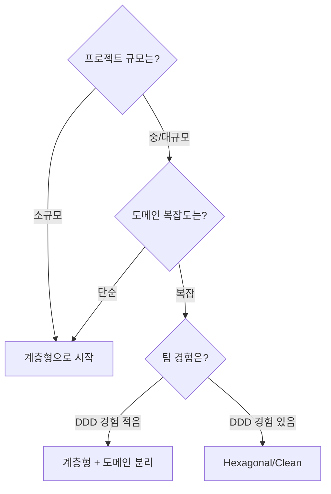

### 실용적 조언

| 상황 | 권장 |
|------|------|
| **스타트업, MVP** | 계층형으로 빠르게 시작, 나중에 리팩터링 |
| **복잡한 도메인** | Hexagonal/Clean으로 도메인 보호 |
| **마이크로서비스** | Hexagonal이 서비스 경계와 잘 맞음 |
| **레거시 통합** | ACL + Hexagonal로 격리 |

### 점진적 전환

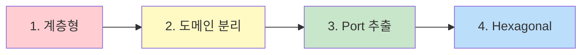

**1단계: 계층형**
```
src/
├── controller/
├── service/
├── repository/
└── entity/
```

**2단계: 도메인 분리**
```
src/
├── controller/
├── application/
├── domain/          # 분리!
│   ├── model/
│   └── repository/  # Interface
└── infrastructure/
    └── persistence/ # 구현
```

**3단계: Port 추출**
```
src/
├── adapter/in/web/
├── adapter/out/persistence/
├── application/
│   ├── port/in/
│   └── port/out/
└── domain/
```

## 공통 원칙

어떤 아키텍처를 선택하든 지켜야 할 원칙:

### 1. Dependency Inversion

```java
// ❌ 도메인이 인프라에 의존
public class Order {
    private JpaOrderRepository repository;  // JPA 의존
}

// ✅ 인프라가 도메인에 의존
// Domain
public interface OrderRepository {
    Order findById(OrderId id);
}

// Infrastructure
@Repository
public class JpaOrderRepository implements OrderRepository {
    // JPA 구현
}
```

### 2. 도메인 순수성

```java
// ❌ 도메인에 프레임워크 어노테이션
@Entity
@Table(name = "orders")
public class Order {
    @Id
    private Long id;
}

// ✅ 순수한 도메인
public class Order {
    private OrderId id;
}

// Infrastructure에서 매핑
@Entity
@Table(name = "orders")
public class OrderEntity {
    @Id
    private String id;
}
```

### 3. 외부 의존성 격리

```java
// ❌ 도메인에서 외부 라이브러리 직접 사용
public class Order {
    public void sendNotification() {
        // Kafka 직접 사용
        kafkaTemplate.send("orders", this);
    }
}

// ✅ Port로 추상화
// Domain
public interface NotificationPort {
    void notify(Order order);
}

// Infrastructure
@Component
public class KafkaNotificationAdapter implements NotificationPort {
    private final KafkaTemplate kafkaTemplate;

    public void notify(Order order) {
        kafkaTemplate.send("orders", toEvent(order));
    }
}
```

## 아키텍처별 테스트 전략

각 아키텍처는 테스트 방법도 다릅니다.

### 테스트 피라미드

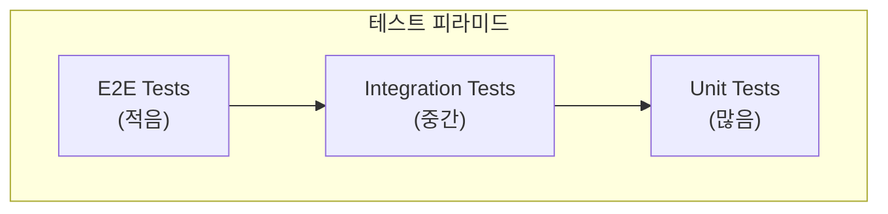

### Hexagonal Architecture 테스트

```java
// === 1. 도메인 테스트 (순수 Unit Test) ===
class OrderTest {

    @Test
    void 주문_생성_시_총액이_계산된다() {
        // Given
        List<OrderLine> lines = List.of(
            new OrderLine(ProductId.of("P1"), 2, Money.of(10000)),
            new OrderLine(ProductId.of("P2"), 1, Money.of(5000))
        );

        // When
        Order order = Order.create(CustomerId.of("C1"), lines);

        // Then
        assertThat(order.getTotalAmount()).isEqualTo(Money.of(25000));
    }

    @Test
    void PENDING_상태에서만_확정_가능하다() {
        Order order = createPendingOrder();

        order.confirm();

        assertThat(order.getStatus()).isEqualTo(OrderStatus.CONFIRMED);
    }
}

// === 2. Application Service 테스트 (Port Mock) ===
class OrderServiceTest {

    @Mock
    private LoadOrderPort loadOrderPort;

    @Mock
    private SaveOrderPort saveOrderPort;

    @InjectMocks
    private OrderService orderService;

    @Test
    void 주문_확정_시_저장된다() {
        // Given
        Order order = createPendingOrder();
        when(loadOrderPort.loadById(any())).thenReturn(order);

        // When
        orderService.confirmOrder(order.getId());

        // Then
        verify(saveOrderPort).save(argThat(o ->
            o.getStatus() == OrderStatus.CONFIRMED
        ));
    }
}

// === 3. Adapter 테스트 (통합 테스트) ===
@DataJpaTest
class OrderPersistenceAdapterTest {

    @Autowired
    private OrderJpaRepository jpaRepository;

    private OrderPersistenceAdapter adapter;

    @BeforeEach
    void setUp() {
        adapter = new OrderPersistenceAdapter(jpaRepository, new OrderMapper());
    }

    @Test
    void 주문을_저장하고_조회한다() {
        // Given
        Order order = createOrder();

        // When
        adapter.save(order);
        Optional<Order> found = adapter.findById(order.getId());

        // Then
        assertThat(found).isPresent();
        assertThat(found.get().getId()).isEqualTo(order.getId());
    }
}

// === 4. Controller 테스트 (Web Layer) ===
@WebMvcTest(OrderController.class)
class OrderControllerTest {

    @Autowired
    private MockMvc mockMvc;

    @MockBean
    private ConfirmOrderUseCase confirmOrderUseCase;

    @Test
    void 주문_확정_API를_호출한다() throws Exception {
        mockMvc.perform(post("/api/orders/{id}/confirm", "order-123"))
            .andExpect(status().isOk());

        verify(confirmOrderUseCase).confirm(OrderId.of("order-123"));
    }
}
```

### Clean Architecture 테스트

```java
// === Use Case (Interactor) 테스트 ===
class CreateOrderInteractorTest {

    @Mock
    private OrderRepository orderRepository;

    @Mock
    private PaymentGateway paymentGateway;

    @InjectMocks
    private CreateOrderInteractor interactor;

    @Test
    void 주문_생성_성공() {
        // Given
        List<OrderLineInput> lines = List.of(
            new OrderLineInput("product-1", 2, BigDecimal.valueOf(10000))
        );
        CreateOrderInput input = new CreateOrderInput("customer-1", lines);

        // When
        CreateOrderOutput output = interactor.execute(input);

        // Then
        verify(orderRepository).save(any(Order.class));
        verify(paymentGateway).reserve(any(Money.class));
        assertThat(output.orderId()).isNotNull();
        assertThat(output.status()).isEqualTo("PENDING");
    }
}
```

### Onion Architecture 테스트

```java
// === Domain Service 테스트 ===
class PricingServiceTest {

    private PricingService pricingService = new PricingService();

    @Test
    void VIP_고객은_10프로_할인받는다() {
        // Given
        Order order = createOrderWithTotal(Money.of(100000));
        Customer vipCustomer = Customer.withGrade(Grade.VIP);
        DiscountPolicy policy = DiscountPolicy.standard();

        // When
        Money discounted = pricingService.calculateDiscountedPrice(
            order, vipCustomer, policy
        );

        // Then
        assertThat(discounted).isEqualTo(Money.of(90000));
    }
}

// === Application Service 테스트 ===
@ExtendWith(MockitoExtension.class)
class OrderApplicationServiceTest {

    @Mock private OrderRepository orderRepository;
    @Mock private CustomerRepository customerRepository;
    @Mock private PricingService pricingService;
    @Mock private PaymentService paymentService;
    @Mock private EventPublisher eventPublisher;

    @InjectMocks
    private OrderApplicationService service;

    @Test
    void 주문_확정_시_결제_후_이벤트_발행() {
        // Given
        Order order = createPendingOrder();
        when(orderRepository.findById(any())).thenReturn(Optional.of(order));
        when(paymentService.processPayment(any(), any()))
            .thenReturn(PaymentResult.success());

        // When
        service.confirmOrder(order.getId());

        // Then
        InOrder inOrder = inOrder(paymentService, orderRepository, eventPublisher);
        inOrder.verify(paymentService).processPayment(any(), any());
        inOrder.verify(orderRepository).save(any());
        inOrder.verify(eventPublisher).publish(any(OrderConfirmedEvent.class));
    }
}
```

### 테스트 전략 비교

| 아키텍처 | Domain Test | Service Test | Adapter Test |
|----------|-------------|--------------|--------------|
| **Layered** | Entity 단위 | Mock Repository | @DataJpaTest |
| **Hexagonal** | Entity 단위 | Mock Port | Adapter 통합 |
| **Clean** | Entity 단위 | Mock Gateway | Gateway 통합 |
| **Onion** | Entity + Domain Service | Mock Repository | Infrastructure 통합 |

## 아키텍처 상세 비교

### 종합 비교표

| 기준 | Layered | Hexagonal | Clean | Onion |
|------|---------|-----------|-------|-------|
| **학습 곡선** | 낮음 | 중간 | 높음 | 중간 |
| **초기 개발 속도** | 빠름 | 중간 | 느림 | 중간 |
| **유지보수성** | 보통 | 높음 | 높음 | 높음 |
| **테스트 용이성** | 보통 | 높음 | 높음 | 높음 |
| **기술 독립성** | 낮음 | 높음 | 높음 | 높음 |
| **코드량** | 적음 | 중간 | 많음 | 중간 |
| **팀 규모** | 소규모 | 중규모 | 대규모 | 중규모 |

### 패키지/파일 수 비교 (동일 기능 기준)

```
기능: 주문 생성 API

Layered (약 5개 파일):
├── OrderController.java
├── OrderService.java
├── OrderRepository.java
├── Order.java
└── OrderDto.java

Hexagonal (약 10개 파일):
├── adapter/in/web/OrderController.java
├── adapter/in/web/OrderRequest.java
├── adapter/out/persistence/OrderPersistenceAdapter.java
├── adapter/out/persistence/OrderEntity.java
├── adapter/out/persistence/OrderMapper.java
├── application/port/in/CreateOrderUseCase.java
├── application/port/out/SaveOrderPort.java
├── application/service/OrderService.java
├── domain/Order.java
└── domain/OrderId.java

Clean (약 12개 파일):
├── entity/Order.java
├── entity/OrderId.java
├── usecase/port/in/CreateOrderUseCase.java
├── usecase/port/out/OrderRepository.java
├── usecase/interactor/CreateOrderInteractor.java
├── usecase/CreateOrderInput.java
├── usecase/CreateOrderOutput.java
├── adapter/controller/OrderController.java
├── adapter/presenter/OrderPresenter.java
├── adapter/gateway/OrderRepositoryImpl.java
├── framework/persistence/JpaOrderEntity.java
└── framework/persistence/JpaOrderRepository.java
```

### 선택 의사결정 트리

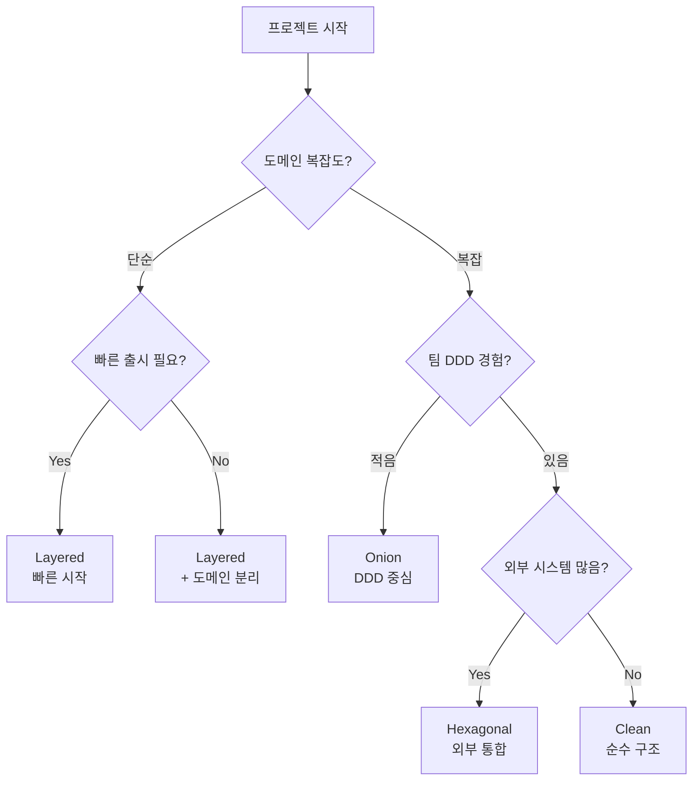

### 마이그레이션 경로

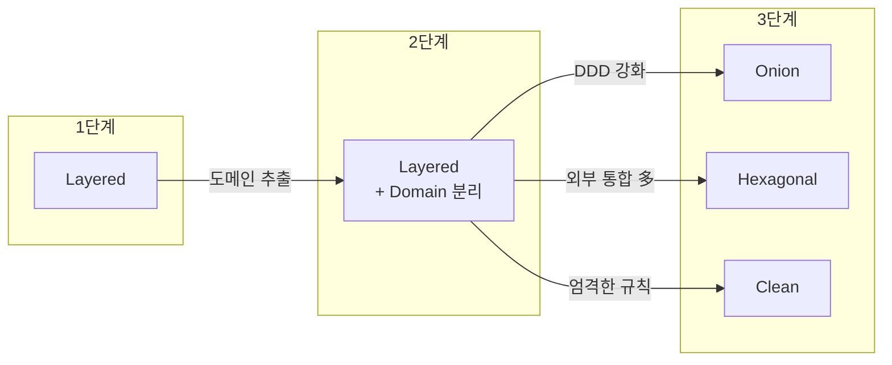

## 흔한 실수 (Anti-patterns)

### ❌ 도메인 오염

```java
// ❌ 도메인에 JPA 어노테이션
@Entity
public class Order {
    @Id @GeneratedValue
    private Long id;

    @Transactional  // 비즈니스 로직에 트랜잭션 어노테이션
    public void confirm() { ... }
}

// ✅ 도메인은 순수하게
public class Order {
    private OrderId id;
    public void confirm() { ... }
}
```

### ❌ 빈약한 도메인 (Anemic Domain)

```java
// ❌ 로직이 Service에 있고 Entity는 데이터만
public class Order {
    private Long id;
    private String status;
    // getter, setter만...
}

public class OrderService {
    public void confirm(Order order) {
        if (order.getStatus().equals("PENDING")) {
            order.setStatus("CONFIRMED");  // 로직이 Service에!
        }
    }
}

// ✅ 도메인에 로직 포함
public class Order {
    private OrderStatus status;

    public void confirm() {
        if (this.status != OrderStatus.PENDING) {
            throw new IllegalStateException("확정 불가");
        }
        this.status = OrderStatus.CONFIRMED;
    }
}
```

### ❌ 순환 의존성

```java
// ❌ A → B → C → A 순환
OrderService → PaymentService → NotificationService → OrderService

// ✅ 이벤트로 분리
OrderService.confirm()
  → publish(OrderConfirmedEvent)
    → PaymentEventHandler (별도 트랜잭션)
    → NotificationEventHandler (별도 트랜잭션)
```

### ❌ Port 없이 직접 의존

```java
// ❌ Application이 Infrastructure 직접 의존
public class OrderService {
    private final JpaOrderRepository repository;  // JPA 직접 의존
    private final KafkaTemplate kafka;            // Kafka 직접 의존
}

// ✅ Port를 통해 추상화
public class OrderService {
    private final SaveOrderPort saveOrderPort;    // 인터페이스
    private final EventPublisherPort eventPort;   // 인터페이스
}
```

### ❌ 레이어 우회

```java
// ❌ Controller에서 Repository 직접 호출
@RestController
public class OrderController {
    private final OrderRepository repository;  // Application 건너뜀!

    @GetMapping("/orders/{id}")
    public Order getOrder(@PathVariable String id) {
        return repository.findById(id);  // 어디서 검증? 권한 체크?
    }
}

// ✅ Application 레이어 통과
@RestController
public class OrderController {
    private final GetOrderQuery getOrderQuery;

    @GetMapping("/orders/{id}")
    public OrderResponse getOrder(@PathVariable String id) {
        return getOrderQuery.execute(id);  // 검증, 권한, 변환 처리
    }
}
```

## 실무 체크리스트

### 아키텍처 선택 전 확인

- [ ] 팀의 DDD 경험 수준 파악
- [ ] 프로젝트 예상 수명 (단기/장기)
- [ ] 외부 시스템 통합 개수
- [ ] 도메인 복잡도 평가
- [ ] 향후 확장 가능성

### 아키텍처 적용 후 확인

- [ ] 도메인 계층에 프레임워크 의존성 없음
- [ ] Repository Interface가 도메인에 정의됨
- [ ] 의존성 방향이 안쪽으로만 향함
- [ ] 테스트가 외부 의존성 없이 가능
- [ ] 새 기능 추가 시 도메인만 수정

## 다음 단계

- [CQRS](../cqrs) - Command Query Responsibility Segregation
- [테스트 전략](../testing) - 아키텍처별 테스트 방법
- [Anti-patterns](../anti-patterns) - 피해야 할 실수들
