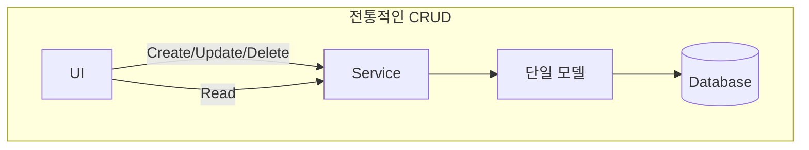
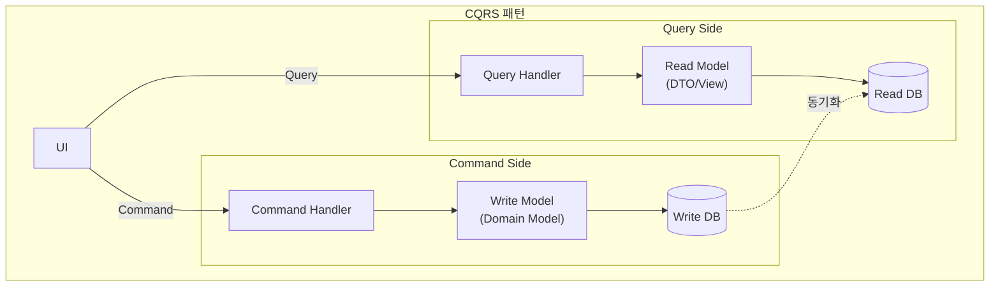
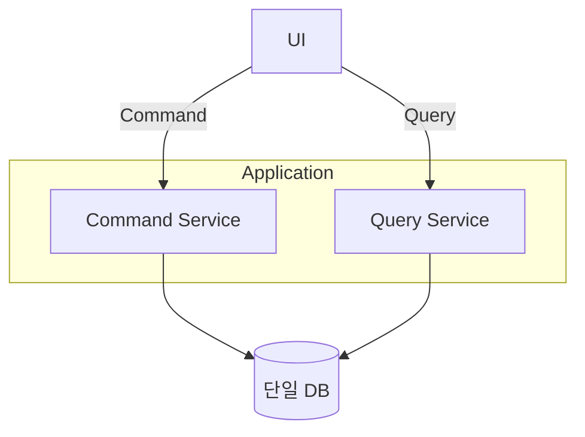
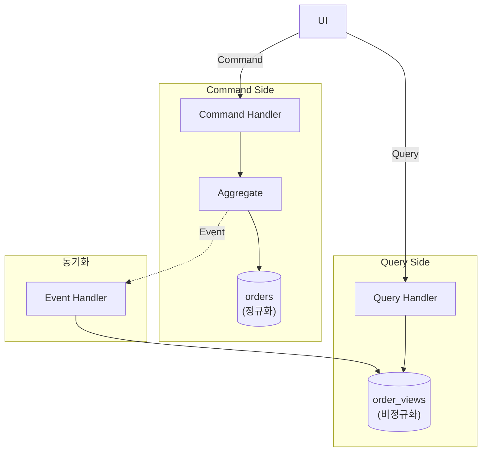
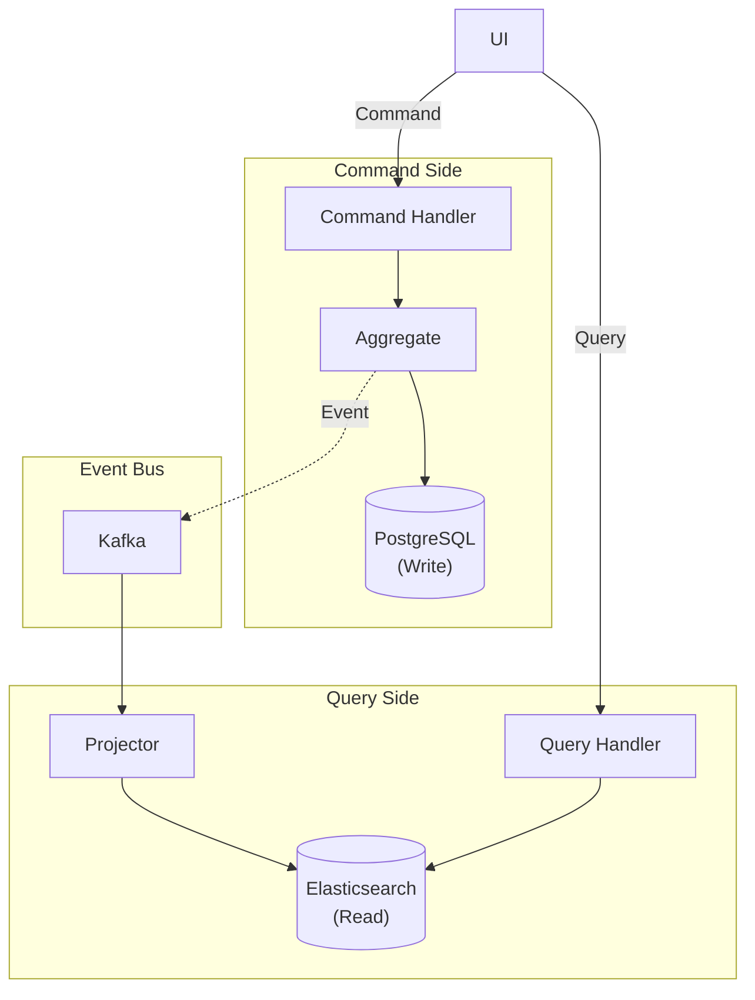
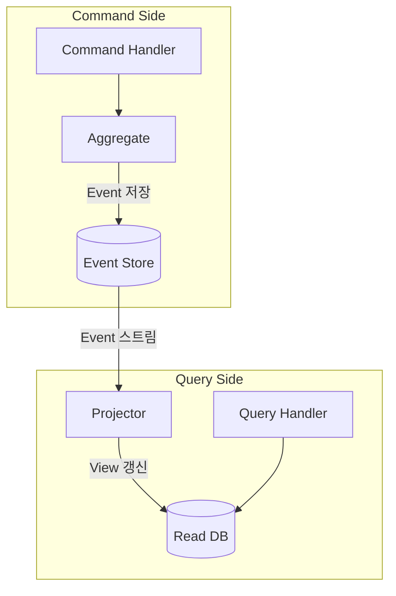
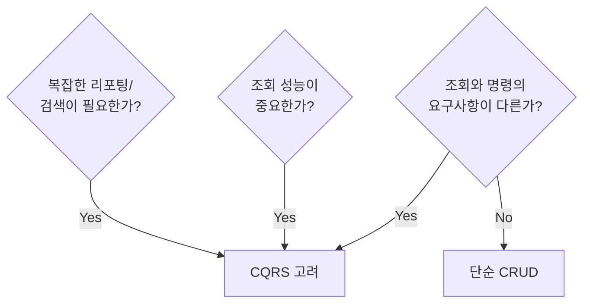

# CQRS (Command Query Responsibility Segregation)

명령(쓰기)과 조회(읽기)의 책임을 분리하는 패턴입니다.

## 왜 CQRS인가?

### 전통적인 CRUD의 한계



**문제점:**
- 복잡한 조회를 위해 도메인 모델을 오염시킴
- 조회와 명령의 최적화 요구사항이 다름
- 스케일링이 어려움

### CQRS 구조



## 구현 수준

### Level 1: 단일 DB, 코드 분리

가장 간단한 형태입니다.



```java
// Command Service - 도메인 모델 사용
@Service
@Transactional
public class OrderCommandService {

    private final OrderRepository orderRepository;

    public OrderId createOrder(CreateOrderCommand command) {
        Order order = Order.create(
            command.getCustomerId(),
            command.getOrderLines()
        );
        return orderRepository.save(order).getId();
    }

    public void confirmOrder(ConfirmOrderCommand command) {
        Order order = orderRepository.findById(command.getOrderId())
            .orElseThrow();
        order.confirm();
        orderRepository.save(order);
    }
}

// Query Service - DTO 직접 조회
@Service
@Transactional(readOnly = true)
public class OrderQueryService {

    private final OrderQueryRepository queryRepository;

    public OrderDetailView getOrderDetail(String orderId) {
        return queryRepository.findOrderDetailById(orderId)
            .orElseThrow(() -> new OrderNotFoundException(orderId));
    }

    public Page<OrderSummaryView> getOrderList(OrderSearchCriteria criteria, Pageable pageable) {
        return queryRepository.searchOrders(criteria, pageable);
    }
}

// Query 전용 Repository
public interface OrderQueryRepository {

    @Query("""
        SELECT new com.example.order.query.OrderDetailView(
            o.id, o.status, o.totalAmount, o.createdAt,
            c.name, c.email
        )
        FROM OrderEntity o
        JOIN o.customer c
        WHERE o.id = :orderId
        """)
    Optional<OrderDetailView> findOrderDetailById(@Param("orderId") String orderId);

    @Query("""
        SELECT new com.example.order.query.OrderSummaryView(
            o.id, o.status, o.totalAmount, o.createdAt
        )
        FROM OrderEntity o
        WHERE (:status IS NULL OR o.status = :status)
        AND (:customerId IS NULL OR o.customerId = :customerId)
        """)
    Page<OrderSummaryView> searchOrders(
        @Param("status") OrderStatus status,
        @Param("customerId") String customerId,
        Pageable pageable
    );
}

// Query 결과 DTO
public record OrderDetailView(
    String orderId,
    String status,
    BigDecimal totalAmount,
    LocalDateTime createdAt,
    String customerName,
    String customerEmail
) {}

public record OrderSummaryView(
    String orderId,
    String status,
    BigDecimal totalAmount,
    LocalDateTime createdAt
) {}
```

### Level 2: 분리된 Read Model

조회 전용 테이블/뷰를 사용합니다.



```java
// Write Side: Domain Event 발행
public class Order extends AggregateRoot<OrderId> {

    public void confirm() {
        this.status = OrderStatus.CONFIRMED;
        registerEvent(new OrderConfirmedEvent(
            this.id,
            this.customerId,
            this.totalAmount,
            LocalDateTime.now()
        ));
    }
}

// Read Model 동기화
@Component
public class OrderViewProjector {

    private final OrderViewRepository viewRepository;

    @TransactionalEventListener
    public void on(OrderCreatedEvent event) {
        OrderView view = new OrderView();
        view.setOrderId(event.getOrderId().getValue());
        view.setCustomerId(event.getCustomerId().getValue());
        view.setStatus("PENDING");
        view.setTotalAmount(event.getTotalAmount().amount());
        view.setCreatedAt(event.getCreatedAt());
        viewRepository.save(view);
    }

    @TransactionalEventListener
    public void on(OrderConfirmedEvent event) {
        OrderView view = viewRepository.findById(event.getOrderId().getValue())
            .orElseThrow();
        view.setStatus("CONFIRMED");
        view.setConfirmedAt(event.getConfirmedAt());
        viewRepository.save(view);
    }

    @TransactionalEventListener
    public void on(OrderCancelledEvent event) {
        OrderView view = viewRepository.findById(event.getOrderId().getValue())
            .orElseThrow();
        view.setStatus("CANCELLED");
        view.setCancelledAt(event.getCancelledAt());
        view.setCancellationReason(event.getReason());
        viewRepository.save(view);
    }
}

// Read Model Entity (비정규화)
@Entity
@Table(name = "order_views")
public class OrderView {
    @Id
    private String orderId;
    private String customerId;
    private String customerName;     // 비정규화: Customer 테이블 조인 불필요
    private String customerEmail;    // 비정규화
    private String status;
    private BigDecimal totalAmount;
    private LocalDateTime createdAt;
    private LocalDateTime confirmedAt;
    private LocalDateTime cancelledAt;
    private String cancellationReason;
    private int itemCount;           // 비정규화: 집계 값
}

// Query는 단순해짐
@Service
public class OrderQueryService {

    private final OrderViewRepository viewRepository;

    public OrderView getOrder(String orderId) {
        return viewRepository.findById(orderId).orElseThrow();
    }

    public Page<OrderView> searchOrders(String customerId, String status, Pageable pageable) {
        return viewRepository.findByCustomerIdAndStatus(customerId, status, pageable);
    }
}
```

### Level 3: 분리된 DB

완전히 다른 DB를 사용합니다.



```java
// Event 발행 (Kafka)
@Component
public class OrderEventPublisher {

    private final KafkaTemplate<String, DomainEvent> kafkaTemplate;

    @TransactionalEventListener(phase = TransactionPhase.AFTER_COMMIT)
    public void publishToKafka(OrderConfirmedEvent event) {
        kafkaTemplate.send("order-events", event.getOrderId().getValue(), event);
    }
}

// Read Side: Elasticsearch Projector
@Component
public class ElasticsearchOrderProjector {

    private final ElasticsearchOperations elasticsearchOperations;

    @KafkaListener(topics = "order-events", groupId = "order-view-projector")
    public void handle(DomainEvent event) {
        if (event instanceof OrderCreatedEvent e) {
            OrderDocument doc = new OrderDocument();
            doc.setOrderId(e.getOrderId().getValue());
            doc.setCustomerId(e.getCustomerId().getValue());
            doc.setStatus("PENDING");
            doc.setTotalAmount(e.getTotalAmount().amount());
            doc.setCreatedAt(e.getCreatedAt());
            elasticsearchOperations.save(doc);
        } else if (event instanceof OrderConfirmedEvent e) {
            OrderDocument doc = elasticsearchOperations.get(
                e.getOrderId().getValue(), OrderDocument.class);
            doc.setStatus("CONFIRMED");
            doc.setConfirmedAt(e.getConfirmedAt());
            elasticsearchOperations.save(doc);
        }
    }
}

// Read Model: Elasticsearch Document
@Document(indexName = "orders")
public class OrderDocument {
    @Id
    private String orderId;
    private String customerId;
    private String customerName;
    private String status;
    private BigDecimal totalAmount;
    private LocalDateTime createdAt;
    private LocalDateTime confirmedAt;
    // Full-text search용 필드
    private String searchableText;
}

// Query Service: Elasticsearch 사용
@Service
public class OrderQueryService {

    private final ElasticsearchOperations elasticsearchOperations;

    public SearchHits<OrderDocument> search(String keyword, String status, Pageable pageable) {
        Query query = NativeQuery.builder()
            .withQuery(q -> q
                .bool(b -> b
                    .must(m -> m.match(t -> t.field("searchableText").query(keyword)))
                    .filter(f -> f.term(t -> t.field("status").value(status)))
                )
            )
            .withPageable(pageable)
            .build();

        return elasticsearchOperations.search(query, OrderDocument.class);
    }
}
```

## CQRS + Event Sourcing

CQRS는 Event Sourcing과 자주 함께 사용됩니다.



```java
// Event Store
public interface OrderEventStore {
    void append(OrderId orderId, List<DomainEvent> events, long expectedVersion);
    List<DomainEvent> getEvents(OrderId orderId);
}

// Command Handler with Event Sourcing
@Service
public class OrderCommandHandler {

    private final OrderEventStore eventStore;

    public void handle(ConfirmOrderCommand command) {
        // 1. 이벤트 스트림에서 Aggregate 복원
        List<DomainEvent> events = eventStore.getEvents(command.getOrderId());
        Order order = Order.fromEvents(events);

        // 2. 명령 실행
        order.confirm();

        // 3. 새 이벤트 저장
        eventStore.append(
            command.getOrderId(),
            order.getDomainEvents(),
            events.size()  // Optimistic concurrency
        );
    }
}

// Aggregate: 이벤트로부터 복원
public class Order {

    public static Order fromEvents(List<DomainEvent> events) {
        Order order = new Order();
        for (DomainEvent event : events) {
            order.apply(event);
        }
        return order;
    }

    private void apply(DomainEvent event) {
        if (event instanceof OrderCreatedEvent e) {
            this.id = e.getOrderId();
            this.customerId = e.getCustomerId();
            this.status = OrderStatus.PENDING;
        } else if (event instanceof OrderConfirmedEvent e) {
            this.status = OrderStatus.CONFIRMED;
            this.confirmedAt = e.getConfirmedAt();
        }
        // ...
    }
}
```

## 실전 가이드

### 언제 CQRS를 사용할까?



### CQRS가 적합한 경우

| 상황 | 이유 |
|------|------|
| **복잡한 도메인** | Write 모델을 순수하게 유지 |
| **조회 성능 중요** | Read 모델 최적화 가능 |
| **다양한 조회 형태** | 목적별 Read 모델 생성 |
| **이벤트 기반 아키텍처** | Event Sourcing과 자연스럽게 결합 |

### CQRS가 과한 경우

| 상황 | 이유 |
|------|------|
| **단순 CRUD** | 복잡성만 증가 |
| **즉시 일관성 필수** | 결과적 일관성의 지연 문제 |
| **소규모 프로젝트** | 오버엔지니어링 |

### 주의사항

**1. 결과적 일관성**

```java
// Command 실행 후 즉시 Query하면 이전 데이터가 보일 수 있음
orderCommandService.confirmOrder(orderId);
// 동기화 지연!
OrderView view = orderQueryService.getOrder(orderId);
// view.status가 아직 PENDING일 수 있음
```

**해결책:**
- UI에서 낙관적 업데이트
- Command 응답에 결과 포함
- WebSocket으로 실시간 동기화

**2. 동기화 실패**

```java
@Component
public class OrderViewProjector {

    private final OrderViewRepository viewRepository;
    private final FailedEventRepository failedEventRepository;

    @KafkaListener(topics = "order-events")
    public void handle(DomainEvent event) {
        try {
            project(event);
        } catch (Exception e) {
            // 실패한 이벤트 저장 (재처리용)
            failedEventRepository.save(new FailedEvent(event, e.getMessage()));
            throw e;  // 재시도를 위해 예외 전파
        }
    }
}
```

## Controller 설계

```java
// Command Controller
@RestController
@RequestMapping("/api/orders")
public class OrderCommandController {

    private final OrderCommandService commandService;

    @PostMapping
    public ResponseEntity<CreateOrderResponse> createOrder(@RequestBody CreateOrderRequest request) {
        OrderId orderId = commandService.createOrder(request.toCommand());
        return ResponseEntity.created(URI.create("/api/orders/" + orderId))
            .body(new CreateOrderResponse(orderId.getValue()));
    }

    @PostMapping("/{orderId}/confirm")
    public ResponseEntity<Void> confirmOrder(@PathVariable String orderId) {
        commandService.confirmOrder(new ConfirmOrderCommand(OrderId.of(orderId)));
        return ResponseEntity.ok().build();
    }
}

// Query Controller
@RestController
@RequestMapping("/api/orders")
public class OrderQueryController {

    private final OrderQueryService queryService;

    @GetMapping("/{orderId}")
    public ResponseEntity<OrderDetailView> getOrder(@PathVariable String orderId) {
        return ResponseEntity.ok(queryService.getOrderDetail(orderId));
    }

    @GetMapping
    public ResponseEntity<Page<OrderSummaryView>> searchOrders(
        @RequestParam(required = false) String customerId,
        @RequestParam(required = false) OrderStatus status,
        Pageable pageable
    ) {
        return ResponseEntity.ok(queryService.searchOrders(customerId, status, pageable));
    }
}
```

## 다음 단계

- [테스트 전략](../testing/) - CQRS 시스템 테스트
- [안티패턴](../anti-patterns/) - CQRS 적용 시 흔한 실수
