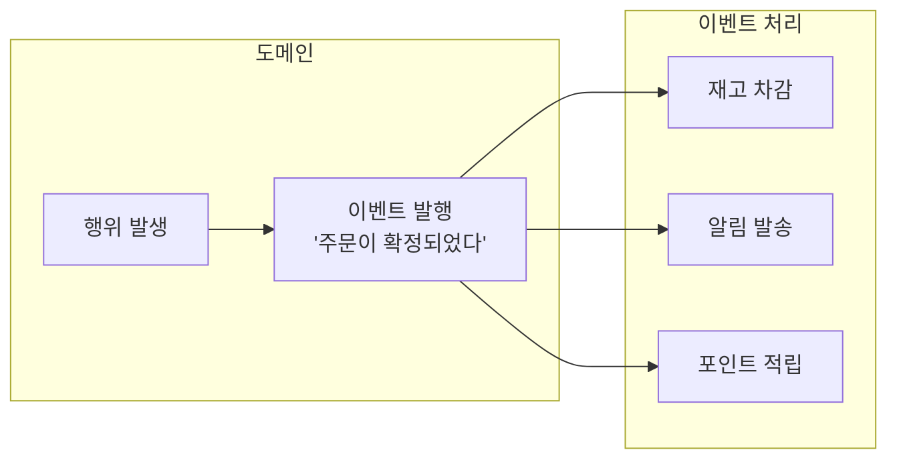
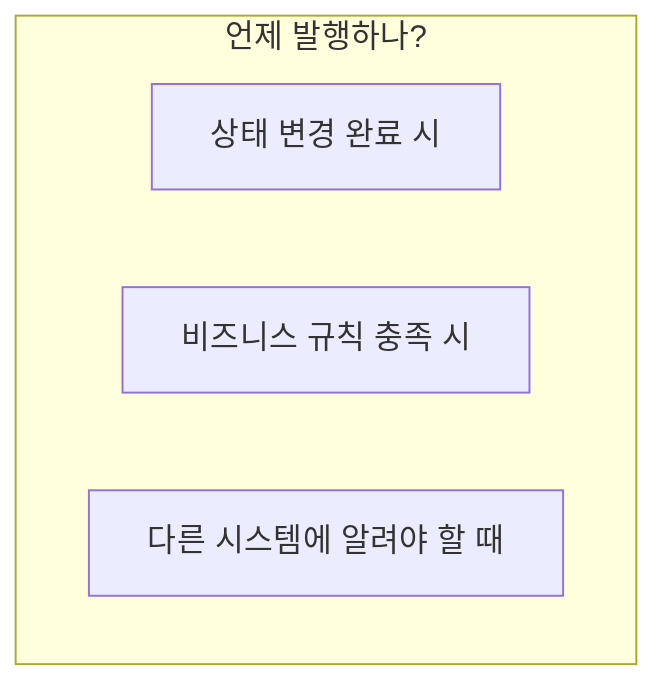
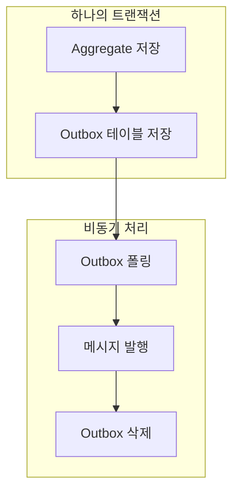
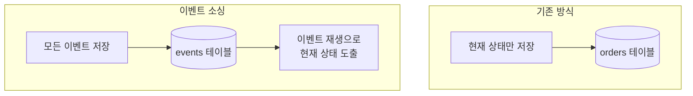

# 도메인 이벤트 (Domain Events)

도메인에서 발생한 중요한 사건을 이벤트로 표현하고 활용하는 방법입니다.

## 도메인 이벤트란?

**도메인 이벤트**는 도메인 전문가가 관심 가지는 **비즈니스적으로 의미 있는 사건**입니다.



### 특징

| 특성 | 설명 | 예시 |
|------|------|------|
| **과거형 명명** | 이미 일어난 사실 | OrderConfirmed (O), ConfirmOrder (X) |
| **불변성** | 발행 후 변경 불가 | 이벤트 데이터는 readonly |
| **자기 완결적** | 필요한 정보 포함 | orderId, 시점, 관련 데이터 |

## 이벤트 설계

### 기본 구조

```java
public abstract class DomainEvent {
    private final String eventId;
    private final Instant occurredAt;

    protected DomainEvent() {
        this.eventId = UUID.randomUUID().toString();
        this.occurredAt = Instant.now();
    }

    public String getEventId() {
        return eventId;
    }

    public Instant getOccurredAt() {
        return occurredAt;
    }
}
```

### 구체 이벤트 정의

```java
public class OrderConfirmedEvent extends DomainEvent {
    private final OrderId orderId;
    private final CustomerId customerId;
    private final Money totalAmount;
    private final List<OrderLineSnapshot> orderLines;

    public OrderConfirmedEvent(Order order) {
        super();
        this.orderId = order.getId();
        this.customerId = order.getCustomerId();
        this.totalAmount = order.getTotalAmount();
        this.orderLines = order.getOrderLines().stream()
            .map(OrderLineSnapshot::from)
            .toList();
    }

    // Getters...

    // 이벤트 전용 스냅샷 (불변)
    public record OrderLineSnapshot(
        ProductId productId,
        String productName,
        int quantity,
        Money amount
    ) {
        public static OrderLineSnapshot from(OrderLine line) {
            return new OrderLineSnapshot(
                line.getProductId(),
                line.getProductName(),
                line.getQuantity(),
                line.getAmount()
            );
        }
    }
}
```

### 이벤트 발행 시점



```java
public class Order extends AggregateRoot {

    public void confirm() {
        validateConfirmable();

        this.status = OrderStatus.CONFIRMED;
        this.confirmedAt = LocalDateTime.now();

        // 상태 변경 후 이벤트 등록
        registerEvent(new OrderConfirmedEvent(this));
    }

    public void ship(TrackingNumber trackingNumber) {
        validateShippable();

        this.status = OrderStatus.SHIPPED;
        this.trackingNumber = trackingNumber;

        registerEvent(new OrderShippedEvent(this.id, trackingNumber));
    }

    public void cancel(CancellationReason reason) {
        validateCancellable();

        this.status = OrderStatus.CANCELLED;
        this.cancelledAt = LocalDateTime.now();
        this.cancellationReason = reason;

        registerEvent(new OrderCancelledEvent(this.id, reason));
    }
}
```

## 이벤트 발행 구현

### 방법 1: Spring ApplicationEvent

```java
// Aggregate Root 기반 클래스
public abstract class AggregateRoot {
    @Transient
    private final List<DomainEvent> domainEvents = new ArrayList<>();

    protected void registerEvent(DomainEvent event) {
        domainEvents.add(event);
    }

    public List<DomainEvent> getDomainEvents() {
        return Collections.unmodifiableList(domainEvents);
    }

    public void clearDomainEvents() {
        domainEvents.clear();
    }
}

// Repository에서 저장 시 발행
@Repository
public class JpaOrderRepository implements OrderRepository {
    private final OrderJpaRepository jpaRepository;
    private final ApplicationEventPublisher eventPublisher;

    @Override
    public Order save(Order order) {
        OrderEntity entity = mapper.toEntity(order);
        jpaRepository.save(entity);

        // 저장 성공 후 이벤트 발행
        order.getDomainEvents().forEach(eventPublisher::publishEvent);
        order.clearDomainEvents();

        return order;
    }
}
```

### 방법 2: Spring Data의 @DomainEvents

```java
@Entity
public class OrderEntity extends AbstractAggregateRoot<OrderEntity> {

    public void confirm() {
        this.status = OrderStatus.CONFIRMED;

        // AbstractAggregateRoot의 메서드
        registerEvent(new OrderConfirmedEvent(this.id));
    }
}

// Repository save() 호출 시 자동으로 이벤트 발행됨
```

### 방법 3: Transactional Outbox Pattern

신뢰성 있는 이벤트 발행을 위한 패턴입니다.



```java
// Outbox 엔티티
@Entity
@Table(name = "outbox_events")
public class OutboxEvent {
    @Id
    private String id;
    private String aggregateType;
    private String aggregateId;
    private String eventType;
    private String payload;  // JSON
    private Instant createdAt;
    private boolean published;
}

// 저장 시 Outbox에도 저장
@Transactional
public void confirmOrder(OrderId orderId) {
    Order order = orderRepository.findById(orderId).orElseThrow();
    order.confirm();

    orderRepository.save(order);

    // 같은 트랜잭션에서 Outbox 저장
    OutboxEvent outbox = OutboxEvent.builder()
        .aggregateType("Order")
        .aggregateId(orderId.getValue())
        .eventType("OrderConfirmed")
        .payload(toJson(new OrderConfirmedEvent(order)))
        .build();
    outboxRepository.save(outbox);
}

// 별도 스케줄러가 Outbox 폴링하여 Kafka 발행
@Scheduled(fixedDelay = 1000)
public void publishOutboxEvents() {
    List<OutboxEvent> events = outboxRepository.findUnpublished();
    for (OutboxEvent event : events) {
        kafkaTemplate.send("domain-events", event.getPayload());
        event.markAsPublished();
        outboxRepository.save(event);
    }
}
```

## 이벤트 처리

### 동기 처리 (같은 트랜잭션)

```java
@Component
public class OrderEventHandler {

    // BEFORE_COMMIT: 트랜잭션 커밋 직전에 실행
    // 주의: 핸들러 예외 시 트랜잭션이 롤백됨
    @TransactionalEventListener(phase = TransactionPhase.BEFORE_COMMIT)
    public void handleOrderConfirmed(OrderConfirmedEvent event) {
        // 주문 확정과 함께 반드시 성공해야 하는 로직
        // 실패 시 전체 트랜잭션 롤백됨
        auditService.recordConfirmation(event.getOrderId());
    }
}
```

**TransactionPhase 선택 가이드:**

| Phase | 실행 시점 | 핸들러 실패 시 | 사용 사례 |
|-------|----------|---------------|----------|
| **BEFORE_COMMIT** | 커밋 직전 | 전체 롤백 | 필수 후속 작업 |
| **AFTER_COMMIT** | 커밋 완료 후 | 롤백 불가 | 알림, 외부 연동 |
| **AFTER_ROLLBACK** | 롤백 후 | - | 보상 트랜잭션 |

### 비동기 처리 (별도 트랜잭션)

```java
@Component
public class NotificationEventHandler {

    // 트랜잭션 커밋 후 비동기 처리
    @Async
    @TransactionalEventListener(phase = TransactionPhase.AFTER_COMMIT)
    public void handleOrderConfirmed(OrderConfirmedEvent event) {
        // 알림 발송 (실패해도 주문에 영향 없음)
        notificationService.sendOrderConfirmation(
            event.getCustomerId(),
            event.getOrderId()
        );
    }
}
```

### Kafka를 통한 이벤트 처리

```java
// 이벤트 발행
@Component
public class OrderEventPublisher {
    private final KafkaTemplate<String, OrderEvent> kafkaTemplate;

    @TransactionalEventListener(phase = TransactionPhase.AFTER_COMMIT)
    public void publishToKafka(OrderConfirmedEvent event) {
        kafkaTemplate.send(
            "order-events",
            event.getOrderId().getValue(),  // Key: 순서 보장
            toKafkaEvent(event)
        );
    }
}

// 이벤트 소비
@Component
public class InventoryEventConsumer {

    @KafkaListener(topics = "order-events", groupId = "inventory-service")
    public void handleOrderEvent(ConsumerRecord<String, OrderEvent> record) {
        OrderEvent event = record.value();

        if ("OrderConfirmed".equals(event.getType())) {
            // 재고 차감
            inventoryService.reserveStock(event.getOrderLines());
        }
    }
}
```

## 이벤트 설계 가이드

### 이벤트에 포함할 정보

```java
// ❌ 너무 적은 정보
public class OrderConfirmedEvent {
    private OrderId orderId;  // ID만으로는 추가 조회 필요
}

// ❌ 너무 많은 정보
public class OrderConfirmedEvent {
    private Order order;  // 전체 Aggregate 포함
}

// ✅ 적절한 정보
public class OrderConfirmedEvent {
    private OrderId orderId;
    private CustomerId customerId;
    private Money totalAmount;
    private List<OrderLineSnapshot> orderLines;  // 필요한 스냅샷
    private Instant confirmedAt;
}
```

### 이벤트 버전 관리

```java
// 버전이 포함된 이벤트
public class OrderConfirmedEventV2 extends DomainEvent {
    private static final int VERSION = 2;

    private OrderId orderId;
    private CustomerId customerId;
    private Money totalAmount;
    private ShippingAddress shippingAddress;  // V2에서 추가

    // 하위 호환성을 위한 변환
    public OrderConfirmedEventV1 toV1() {
        return new OrderConfirmedEventV1(orderId, customerId, totalAmount);
    }
}
```

## 이벤트 소싱 (Event Sourcing)

이벤트를 상태의 원본으로 사용하는 패턴입니다.



```java
// 이벤트로부터 Aggregate 복원
public class Order {
    private OrderId id;
    private OrderStatus status;
    private List<OrderLine> orderLines;

    // 이벤트 스트림으로부터 복원
    public static Order fromEvents(List<DomainEvent> events) {
        Order order = new Order();
        for (DomainEvent event : events) {
            order.apply(event);
        }
        return order;
    }

    private void apply(DomainEvent event) {
        if (event instanceof OrderCreatedEvent e) {
            this.id = e.getOrderId();
            this.status = OrderStatus.PENDING;
            this.orderLines = new ArrayList<>(e.getOrderLines());
        } else if (event instanceof OrderConfirmedEvent e) {
            this.status = OrderStatus.CONFIRMED;
        } else if (event instanceof OrderCancelledEvent e) {
            this.status = OrderStatus.CANCELLED;
        }
    }
}

// Event Store
public interface OrderEventStore {
    void append(OrderId orderId, DomainEvent event);
    List<DomainEvent> getEvents(OrderId orderId);
}

// Repository
public class EventSourcedOrderRepository implements OrderRepository {
    private final OrderEventStore eventStore;

    @Override
    public Optional<Order> findById(OrderId id) {
        List<DomainEvent> events = eventStore.getEvents(id);
        if (events.isEmpty()) {
            return Optional.empty();
        }
        return Optional.of(Order.fromEvents(events));
    }

    @Override
    public Order save(Order order) {
        for (DomainEvent event : order.getDomainEvents()) {
            eventStore.append(order.getId(), event);
        }
        order.clearDomainEvents();
        return order;
    }
}
```

### 이벤트 소싱 장단점

| 장점 | 단점 |
|------|------|
| 완전한 감사 추적 | 복잡성 증가 |
| 시간 여행 (과거 상태 재현) | 이벤트 스키마 진화 어려움 |
| 이벤트 기반 통합에 적합 | 쿼리 성능 (CQRS 필요) |

## 실전 팁

### 1. 이벤트 명명 규칙

```
- 과거형 사용: OrderConfirmed, PaymentCompleted
- 도메인 용어 사용: OrderShipped (O), OrderStatusChangedToShipped (X)
- 명확한 접두사: Order + Confirmed = OrderConfirmed
```

### 2. 멱등성 처리

```java
@Component
public class PaymentEventHandler {
    private final ProcessedEventRepository processedEvents;

    @KafkaListener(topics = "order-events")
    public void handle(OrderConfirmedEvent event) {
        // 이미 처리된 이벤트인지 확인
        if (processedEvents.exists(event.getEventId())) {
            log.info("이미 처리된 이벤트: {}", event.getEventId());
            return;
        }

        // 비즈니스 로직 처리
        paymentService.requestPayment(event);

        // 처리 완료 기록
        processedEvents.save(event.getEventId());
    }
}
```

### 3. 실패 처리

```java
@Component
public class StockEventHandler {

    @RetryableTopic(
        attempts = "3",
        backoff = @Backoff(delay = 1000, multiplier = 2)
    )
    @KafkaListener(topics = "order-events")
    public void handle(OrderConfirmedEvent event) {
        // 3회 재시도 후 실패 시 DLT로 이동
        stockService.reserve(event.getOrderLines());
    }

    @DltHandler
    public void handleDlt(OrderConfirmedEvent event) {
        // Dead Letter Topic 처리
        alertService.notifyStockReservationFailed(event);
    }
}
```

## 다음 단계

- [실습 예제](../../examples/) - Spring Boot로 구현하는 주문 도메인
