# 전략적 설계 (Strategic Design)

복잡한 도메인을 어떻게 나누고 통합할지 결정하는 고수준 설계입니다.

## 개요

전략적 설계는 **"큰 그림"**을 그리는 과정입니다:

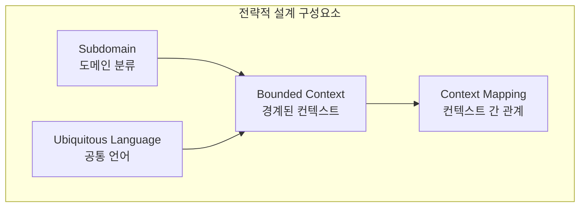

| 구성요소 | 질문 | 산출물 |
|---------|------|--------|
| **Subdomain** | 비즈니스의 핵심은 무엇인가? | 도메인 분류 |
| **Ubiquitous Language** | 어떤 언어로 소통할 것인가? | 용어 사전 |
| **Bounded Context** | 시스템을 어떻게 나눌 것인가? | 컨텍스트 경계 |
| **Context Mapping** | 시스템 간 어떻게 통합할 것인가? | 통합 전략 |

## Subdomain (하위 도메인)

### 개념

비즈니스 도메인을 **중요도와 특성**에 따라 분류합니다.

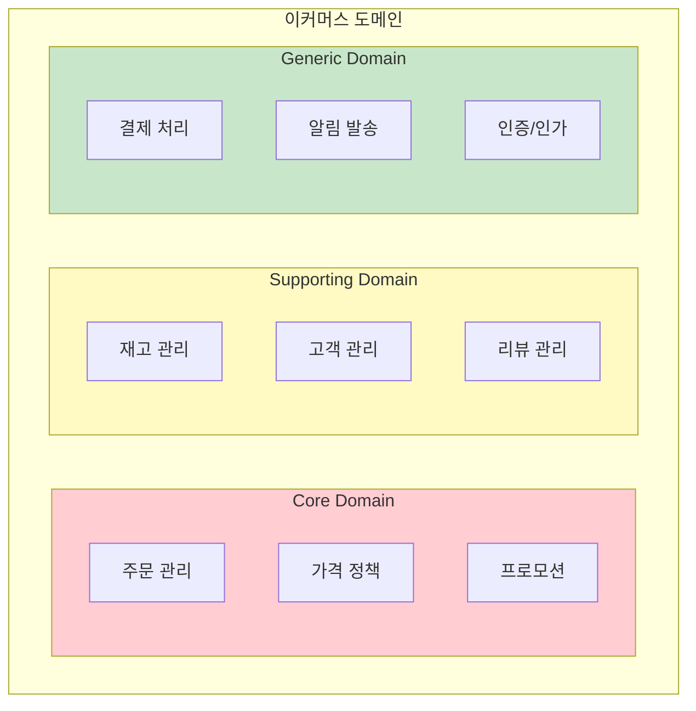

### Subdomain 유형

| 유형 | 특성 | 투자 | 예시 |
|------|------|------|------|
| **Core Domain** | 비즈니스 핵심 경쟁력 | 최우선 투자, 최고의 개발자 | 배달앱의 배차 알고리즘 |
| **Supporting Domain** | 핵심을 지원하지만 차별화 아님 | 적절한 투자 | 재고 관리, 고객 관리 |
| **Generic Domain** | 모든 비즈니스에 공통 | 외부 솔루션 활용 | 결제, 인증, 이메일 |

### 실제 사례: 쿠팡

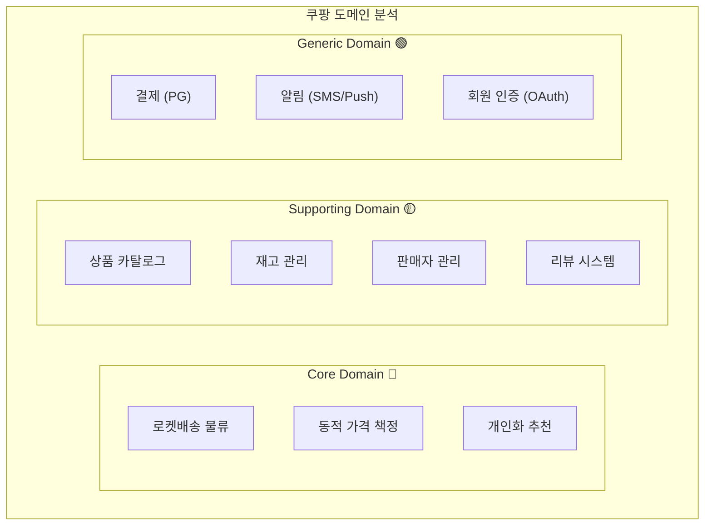

**분석:**
- **Core:** 로켓배송, 가격 알고리즘, 추천 → 직접 개발, 최고 인력 투입
- **Supporting:** 카탈로그, 재고 → 자체 개발하되 실용적 수준
- **Generic:** 결제, 알림 → 외부 서비스 연동

### Subdomain 식별 가이드

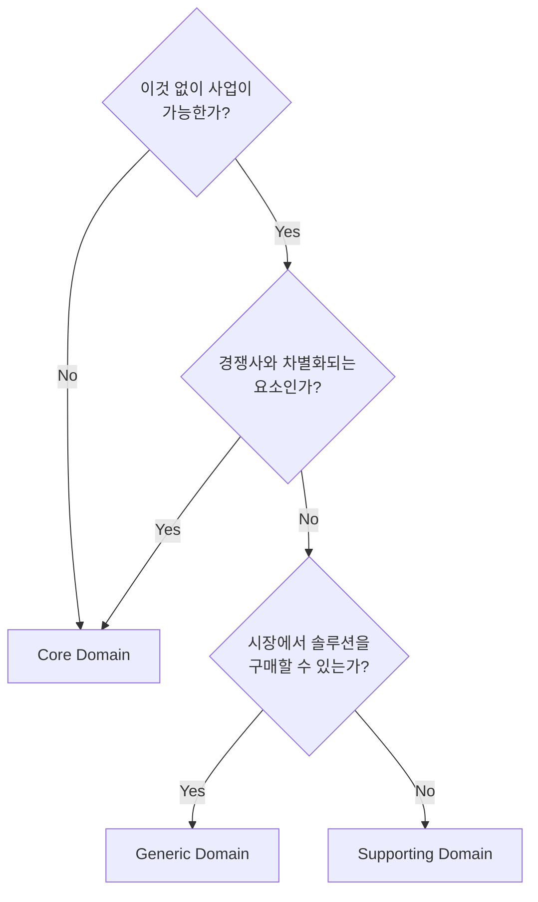

## Ubiquitous Language (유비쿼터스 언어)

### 왜 필요한가?

개발자와 비즈니스 전문가가 서로 다른 용어를 사용하면 오해가 발생합니다.

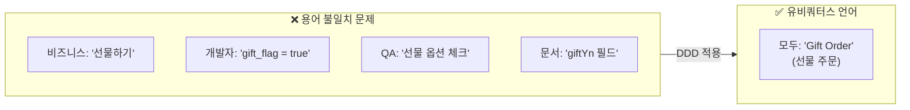

### 용어 사전 작성법

**1. 명사 (Entity, Value Object)**

| 용어 | 정의 | 코드 | 동의어/오해 소지 |
|------|------|------|-----------------|
| 주문(Order) | 고객이 상품 구매를 위해 생성한 요청 | `Order` | 구매, 오더 |
| 주문 항목(Order Line) | 주문 내 개별 상품과 수량 | `OrderLine` | 주문 아이템, 상세 |
| 배송지(Shipping Address) | 상품을 받을 주소 | `ShippingAddress` | 수령지, 도착지 |
| 금액(Money) | 통화와 금액을 포함한 화폐 단위 | `Money` | 가격, 비용 |

**2. 동사 (행위, Command)**

| 용어 | 정의 | 코드 | 선행 조건 | 결과 |
|------|------|------|----------|------|
| 주문 생성 | 새로운 주문을 만듦 | `Order.create()` | 유효한 상품, 고객 | 주문 생성됨 |
| 주문 확정 | 주문을 처리 상태로 변경 | `order.confirm()` | PENDING 상태 | CONFIRMED 상태, 재고 차감 |
| 주문 취소 | 주문을 취소 상태로 변경 | `order.cancel()` | PENDING/CONFIRMED | CANCELLED 상태, 재고 복원 |

**3. 이벤트 (과거에 발생한 사실)**

| 용어 | 정의 | 코드 | 후속 처리 |
|------|------|------|----------|
| 주문 생성됨 | 새 주문이 생성된 사실 | `OrderCreatedEvent` | 재고 예약, 알림 |
| 주문 확정됨 | 주문이 확정된 사실 | `OrderConfirmedEvent` | 결제 요청, 포장 시작 |
| 주문 취소됨 | 주문이 취소된 사실 | `OrderCancelledEvent` | 재고 복원, 환불 |

### 코드에 반영하기

```java
// ❌ 기술 용어, 약어 사용
public class OrdSvc {
    public void updOrdSts(Long ordId, int sts) {
        OrdEntity ord = ordRepo.findById(ordId);
        ord.setSts(sts);
        ordRepo.save(ord);
    }
}

// ✅ 비즈니스 용어 사용
public class OrderService {
    public void confirmOrder(OrderId orderId) {
        Order order = orderRepository.findById(orderId);
        order.confirm();  // "주문을 확정한다"
        orderRepository.save(order);
    }

    public void cancelOrder(OrderId orderId, CancellationReason reason) {
        Order order = orderRepository.findById(orderId);
        order.cancel(reason);  // "주문을 취소한다"
        orderRepository.save(order);
    }
}
```

### 테스트에서도 동일한 언어

```java
@Nested
@DisplayName("주문 확정")
class OrderConfirmation {

    @Test
    @DisplayName("대기 중인 주문을 확정하면 상태가 CONFIRMED가 된다")
    void 대기중인_주문_확정_성공() {
        // given: 대기 중인 주문이 있을 때
        Order pendingOrder = createPendingOrder();

        // when: 주문을 확정하면
        pendingOrder.confirm();

        // then: 상태가 CONFIRMED가 된다
        assertThat(pendingOrder.getStatus()).isEqualTo(OrderStatus.CONFIRMED);
    }

    @Test
    @DisplayName("이미 확정된 주문은 다시 확정할 수 없다")
    void 이미_확정된_주문_재확정_불가() {
        // given: 이미 확정된 주문
        Order confirmedOrder = createConfirmedOrder();

        // when & then: 다시 확정하면 예외 발생
        assertThatThrownBy(() -> confirmedOrder.confirm())
            .isInstanceOf(OrderCannotBeConfirmedException.class)
            .hasMessageContaining("이미 확정된 주문");
    }
}
```

## Bounded Context (경계된 컨텍스트)

### 개념

Bounded Context는 **특정 도메인 모델이 적용되는 명시적 경계**입니다.

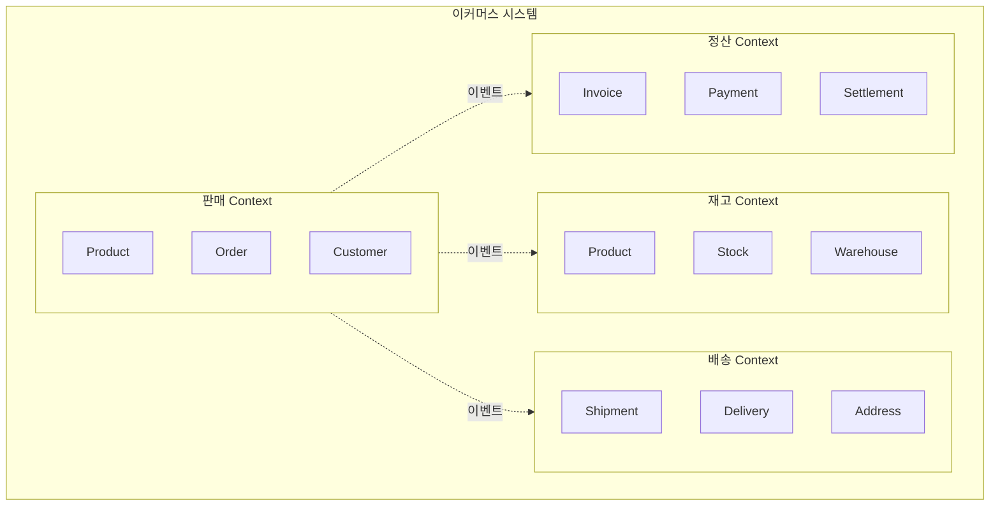

### 같은 용어, 다른 의미 (동음이의어)

**"Customer"** 라는 용어가 각 Context에서 다른 의미:

```java
// 판매 Context의 Customer
// "누가 주문하는가?"
public class Customer {
    private CustomerId id;
    private String name;
    private Email email;
    private MembershipGrade grade;  // VIP, Gold, Silver
    private Money availablePoints;

    public Money getDiscount(Order order) {
        return grade.calculateDiscount(order.getTotalAmount());
    }
}

// 배송 Context의 Customer (Recipient)
// "누가 받는가?"
public class Recipient {
    private String name;
    private PhoneNumber phone;
    private Address address;
    private DeliveryPreference preference;  // 문 앞, 경비실

    public boolean canReceiveAt(TimeSlot slot) {
        return preference.isAvailable(slot);
    }
}

// 정산 Context의 Customer (Payer)
// "누가 돈을 내는가?"
public class Payer {
    private String name;
    private TaxId taxId;
    private BillingAddress billingAddress;
    private List<PaymentMethod> paymentMethods;

    public boolean requiresTaxInvoice() {
        return taxId != null;
    }
}
```

### Bounded Context 식별 방법

**1. 언어적 단서**

```
"고객이..." → 어떤 고객? 구매 고객? 수령인? 결제자?
"상품이..." → 어떤 상품? 판매 상품? 재고 품목? 배송 물품?
"주문이..." → 어떤 주문? 판매 주문? 출고 지시? 배송 요청?
```

**2. 조직적 단서**

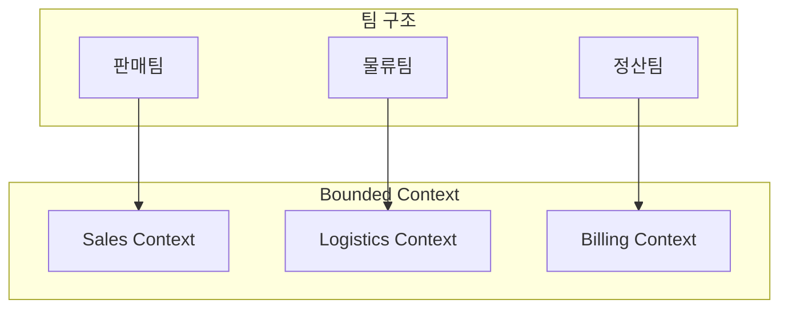

**Conway's Law:** "시스템 구조는 조직 구조를 따른다"

**3. 비즈니스 프로세스 단서**

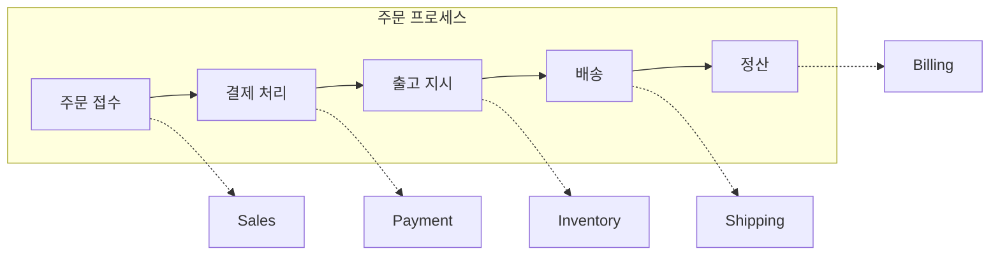

### Context 경계 결정 체크리스트

```
✅ 같은 Context로 묶어야 하는 경우:
- [ ] 강한 트랜잭션 일관성이 필요하다
- [ ] 같은 팀이 담당한다
- [ ] 같은 언어(용어)를 사용한다
- [ ] 함께 배포되어야 한다

❌ 다른 Context로 분리해야 하는 경우:
- [ ] 같은 용어가 다른 의미로 사용된다
- [ ] 다른 팀이 담당한다
- [ ] 독립적으로 변경/배포할 수 있다
- [ ] 결과적 일관성으로 충분하다
```

## Context Mapping (컨텍스트 매핑)

### 개념

Context 간의 관계와 통합 방식을 정의합니다.

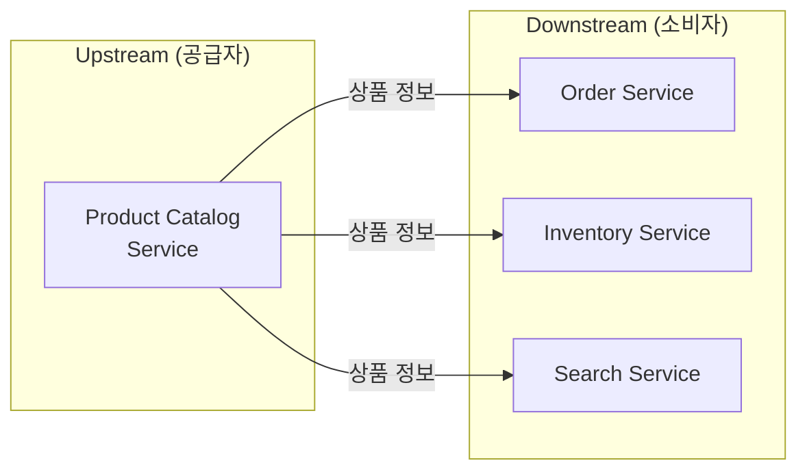

### 통합 패턴 상세

#### 1. Partnership (파트너십)

두 팀이 **긴밀하게 협력**하여 통합합니다.

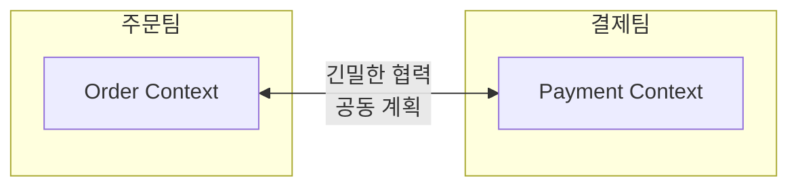

**특징:**
- 양 팀이 API 변경 시 함께 조율
- 정기적인 통합 미팅
- 공동 테스트

**적합한 상황:**
- 같은 제품팀 내 다른 서비스
- 강한 의존 관계

---

#### 2. Shared Kernel (공유 커널)

두 Context가 **일부 모델을 공유**합니다.

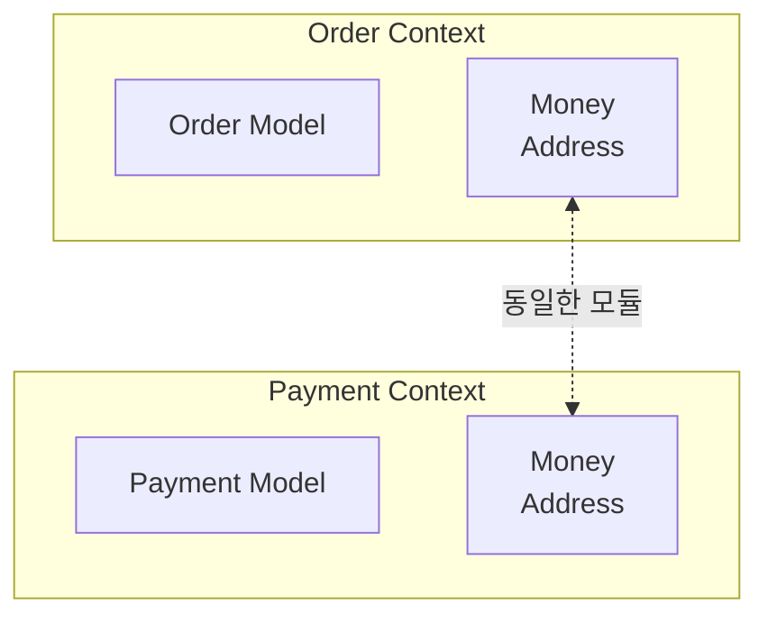

```java
// shared-kernel 모듈
public record Money(BigDecimal amount, Currency currency) {
    public Money add(Money other) {
        validateSameCurrency(other);
        return new Money(this.amount.add(other.amount), this.currency);
    }
}

public record Address(String zipCode, String city, String street, String detail) {
    public String fullAddress() {
        return String.format("(%s) %s %s %s", zipCode, city, street, detail);
    }
}
```

**장점:** 중복 제거, 일관성
**단점:** 변경 시 양쪽 영향, 결합도 증가

**적합한 상황:**
- 정말 동일한 개념 (Money, Address 등)
- 변경이 드문 안정적인 모델

---

#### 3. Customer-Supplier (고객-공급자)

Upstream이 API를 제공하고, Downstream이 소비합니다.

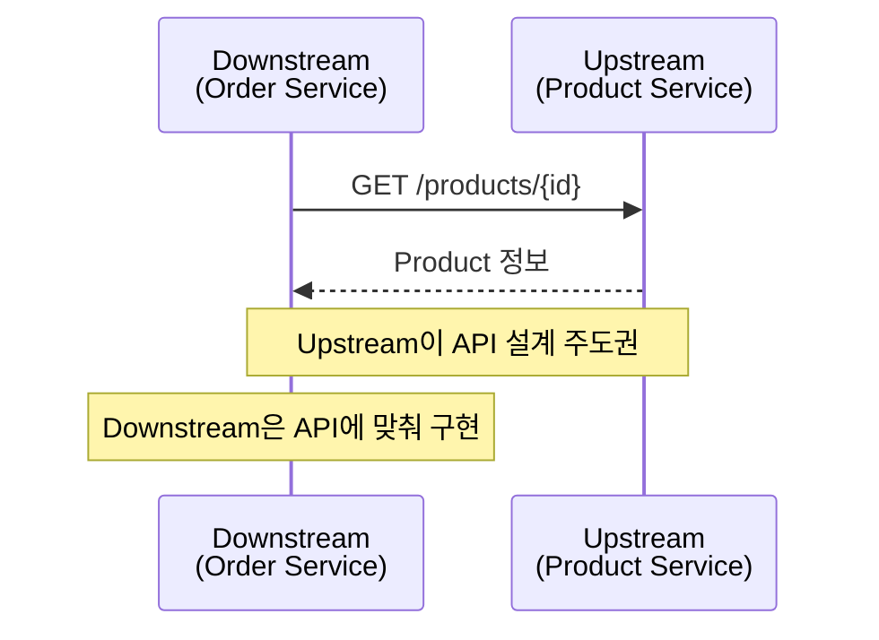

```java
// Downstream: Product Service Client
@FeignClient(name = "product-service")
public interface ProductServiceClient {

    @GetMapping("/products/{id}")
    ProductResponse getProduct(@PathVariable String id);

    @GetMapping("/products")
    List<ProductResponse> getProducts(@RequestParam List<String> ids);
}

// Downstream에서 사용
@Service
public class OrderService {
    private final ProductServiceClient productClient;

    public Order createOrder(CreateOrderCommand command) {
        // Upstream에서 상품 정보 조회
        ProductResponse product = productClient.getProduct(command.getProductId());

        // Downstream 모델로 변환하여 사용
        OrderLine orderLine = OrderLine.create(
            ProductId.of(product.id()),
            product.name(),
            Money.of(product.price()),
            command.getQuantity()
        );

        return Order.create(command.getCustomerId(), List.of(orderLine));
    }
}
```

**역할:**
- **Upstream:** API 제공, 변경 시 Downstream에 통보
- **Downstream:** API 소비, 요구사항 전달

---

#### 4. Conformist (순응자)

Downstream이 Upstream 모델을 **그대로 따릅니다**.

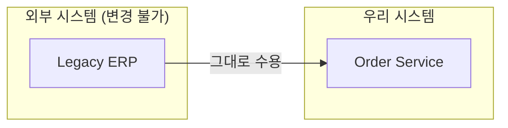

**특징:**
- Upstream 모델을 변환 없이 사용
- Upstream 변경에 종속

**적합한 상황:**
- 외부 시스템 (변경 불가)
- 협상력이 없는 관계
- 간단한 통합

---

#### 5. Anti-Corruption Layer (부패 방지 계층)

외부 모델이 내부를 오염시키지 않도록 **번역 계층**을 둡니다.

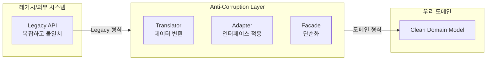

```java
// 레거시 시스템의 응답 (변경 불가)
public class LegacyOrderResponse {
    private String ord_no;           // 다른 네이밍
    private int sts_cd;              // 매직 넘버 (0=대기, 1=확정, 9=취소)
    private String cust_nm;          // 약어
    private long ord_amt;            // 원 단위 숫자
    private String dlv_addr1;        // 주소1
    private String dlv_addr2;        // 주소2
    private String rcv_nm;           // 수령인
    private String rcv_tel;          // 전화번호
}

// Anti-Corruption Layer: Translator
@Component
public class LegacyOrderTranslator {

    public Order translate(LegacyOrderResponse legacy) {
        return Order.reconstitute(
            OrderId.of(legacy.getOrd_no()),
            translateStatus(legacy.getSts_cd()),
            translateCustomer(legacy),
            translateShippingAddress(legacy),
            Money.won(legacy.getOrd_amt())
        );
    }

    private OrderStatus translateStatus(int statusCode) {
        return switch (statusCode) {
            case 0 -> OrderStatus.PENDING;
            case 1 -> OrderStatus.CONFIRMED;
            case 2 -> OrderStatus.SHIPPED;
            case 3 -> OrderStatus.DELIVERED;
            case 9 -> OrderStatus.CANCELLED;
            default -> throw new UnknownLegacyStatusException(statusCode);
        };
    }

    private ShippingAddress translateShippingAddress(LegacyOrderResponse legacy) {
        return new ShippingAddress(
            extractZipCode(legacy.getDlv_addr1()),
            extractCity(legacy.getDlv_addr1()),
            legacy.getDlv_addr1(),
            legacy.getDlv_addr2(),
            legacy.getRcv_nm(),
            formatPhoneNumber(legacy.getRcv_tel())
        );
    }
}

// Adapter: Repository 구현
@Repository
public class LegacyOrderAdapter implements OrderReader {
    private final LegacyOrderClient legacyClient;
    private final LegacyOrderTranslator translator;

    @Override
    public Optional<Order> findById(OrderId id) {
        try {
            LegacyOrderResponse response = legacyClient.getOrder(id.getValue());
            return Optional.of(translator.translate(response));
        } catch (LegacyNotFoundException e) {
            return Optional.empty();
        }
    }
}
```

**장점:** 내부 모델 보호, 레거시 변경에 격리
**단점:** 추가 복잡성, 성능 오버헤드

---

#### 6. Open Host Service + Published Language

**표준화된 API와 데이터 형식**으로 통합합니다.

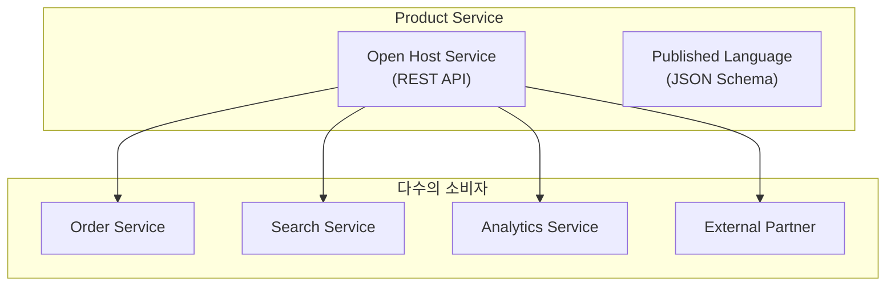

```json
// Published Language: 표준화된 이벤트 스키마
{
  "$schema": "https://json-schema.org/draft/2020-12/schema",
  "title": "OrderConfirmedEvent",
  "type": "object",
  "properties": {
    "eventId": { "type": "string", "format": "uuid" },
    "eventType": { "const": "ORDER_CONFIRMED" },
    "occurredAt": { "type": "string", "format": "date-time" },
    "payload": {
      "type": "object",
      "properties": {
        "orderId": { "type": "string" },
        "customerId": { "type": "string" },
        "totalAmount": {
          "type": "object",
          "properties": {
            "amount": { "type": "number" },
            "currency": { "type": "string" }
          }
        },
        "orderLines": {
          "type": "array",
          "items": {
            "type": "object",
            "properties": {
              "productId": { "type": "string" },
              "quantity": { "type": "integer" }
            }
          }
        }
      }
    }
  }
}
```

---

#### 7. Separate Ways (분리된 길)

통합하지 않고 **각자 구현**합니다.

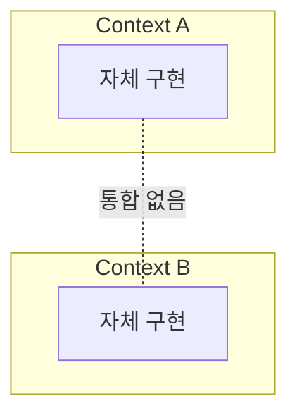

**적합한 상황:**
- 통합 비용 > 중복 비용
- 간단한 기능
- 서로 다른 요구사항

### Context Map 예시: 이커머스

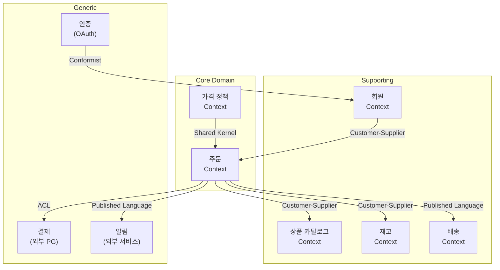

| 관계 | 설명 |
|------|------|
| **ORDER → CATALOG** | 주문 생성 시 상품 정보 조회 |
| **ORDER → INV** | 주문 확정 시 재고 확인/차감 요청 |
| **ORDER → PAY** | 외부 PG 연동, ACL로 보호 |
| **ORDER → SHIP, NOTI** | 이벤트 기반 느슨한 통합 |
| **PRICE ↔ ORDER** | 가격 계산 로직 공유 (Shared Kernel) |

## EventStorming으로 전략적 설계

### EventStorming이란?

도메인 전문가와 개발자가 **함께 모여** 도메인을 탐색하는 워크숍 기법입니다.

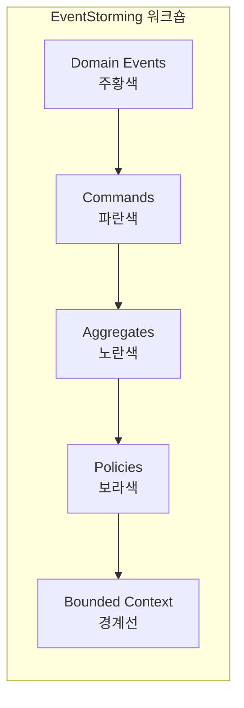

### EventStorming 결과물

```
┌─────────────────────────────────────────────────────────────────┐
│                          Order Context                          │
│  ┌──────────┐    ┌──────────┐    ┌──────────┐    ┌──────────┐  │
│  │ 주문생성 │ => │ Order    │ => │ 주문확정 │ => │ Order    │  │
│  │ 요청됨   │    │          │    │ 요청됨   │    │          │  │
│  │ (Command)│    │(Aggregate│    │(Command) │    │(Aggregate│  │
│  └──────────┘    └──────────┘    └──────────┘    └──────────┘  │
│        │              │               │               │         │
│        ▼              ▼               ▼               ▼         │
│  ┌──────────┐    ┌──────────┐    ┌──────────┐    ┌──────────┐  │
│  │ 주문     │    │ 재고확인 │    │ 주문     │    │ 결제요청 │  │
│  │ 생성됨   │    │ (Policy) │    │ 확정됨   │    │ (Policy) │  │
│  │ (Event)  │    │          │    │ (Event)  │    │          │  │
│  └──────────┘    └──────────┘    └──────────┘    └──────────┘  │
└─────────────────────────────────────────────────────────────────┘
                              │
                              ▼
┌─────────────────────────────────────────────────────────────────┐
│                        Inventory Context                        │
│  ┌──────────┐    ┌──────────┐    ┌──────────┐                  │
│  │ 재고차감 │ => │ Stock    │ => │ 재고     │                  │
│  │ 요청됨   │    │          │    │ 차감됨   │                  │
│  │ (Command)│    │(Aggregate│    │ (Event)  │                  │
│  └──────────┘    └──────────┘    └──────────┘                  │
└─────────────────────────────────────────────────────────────────┘
```

## 다음 단계

- [전술적 설계](../tactical-design/) - Entity, Value Object, Aggregate 패턴
- [아키텍처](../architecture/) - Hexagonal, Clean Architecture
