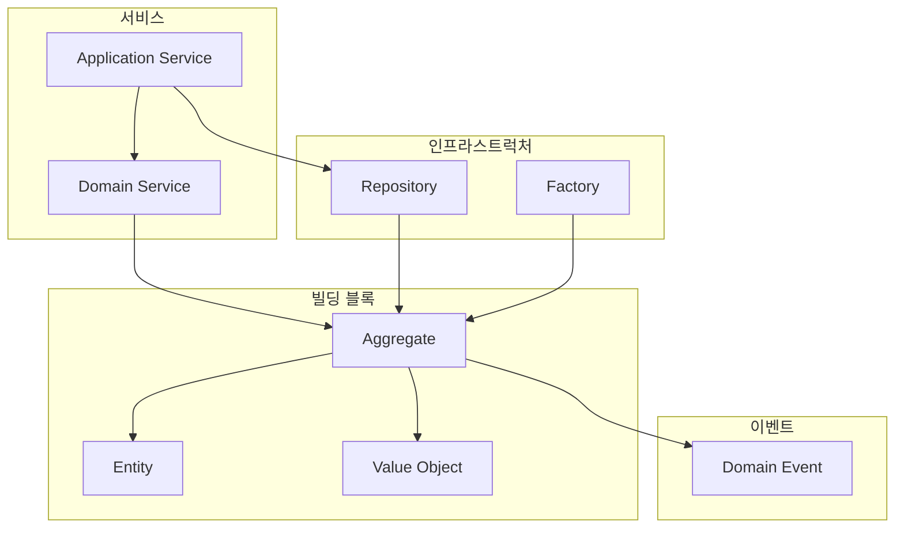
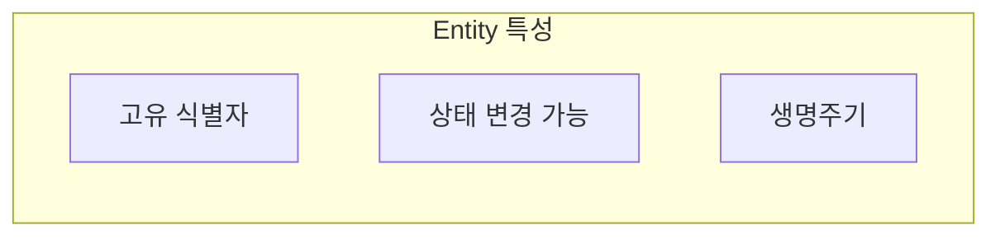
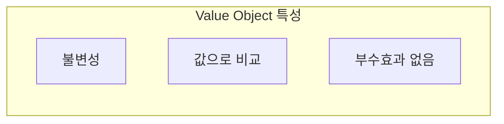
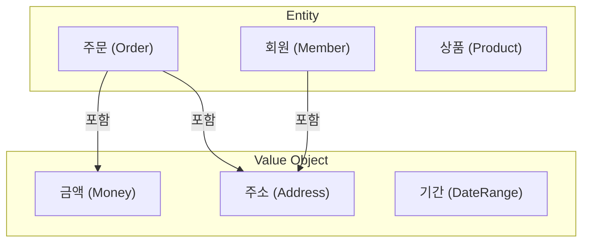
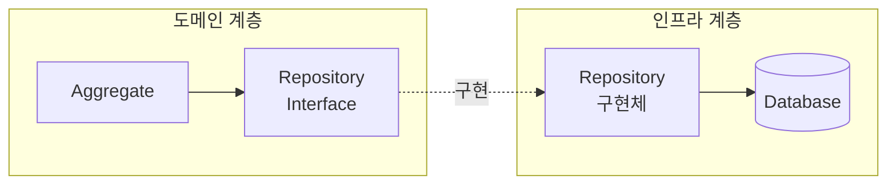
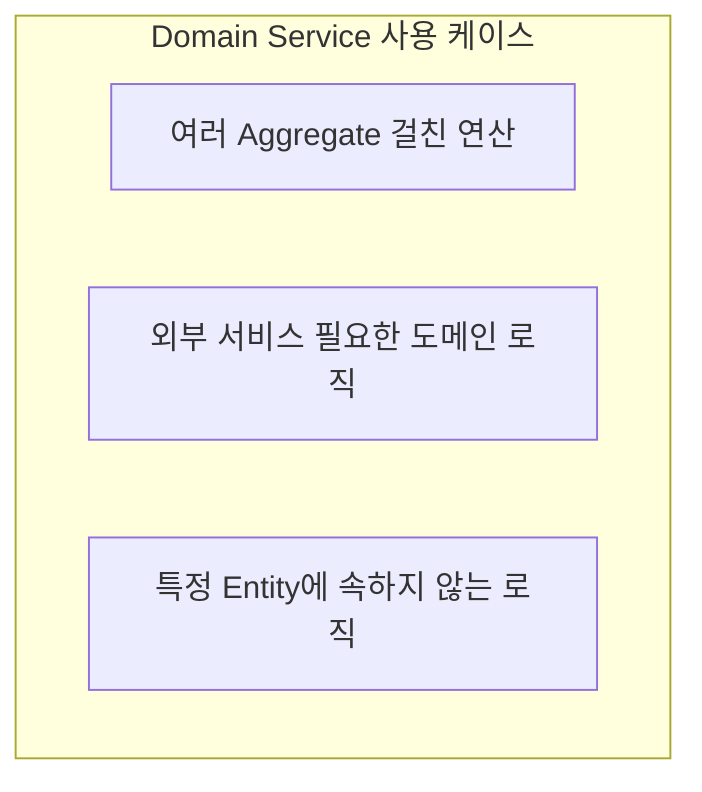
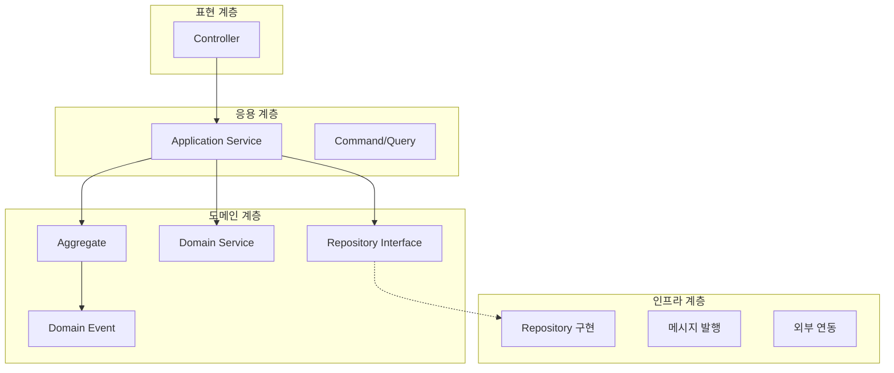
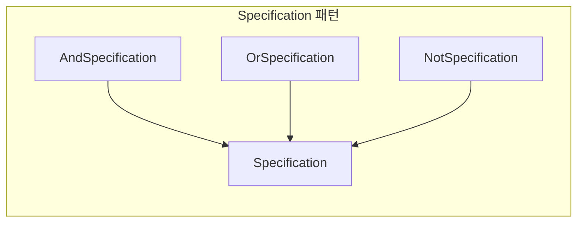
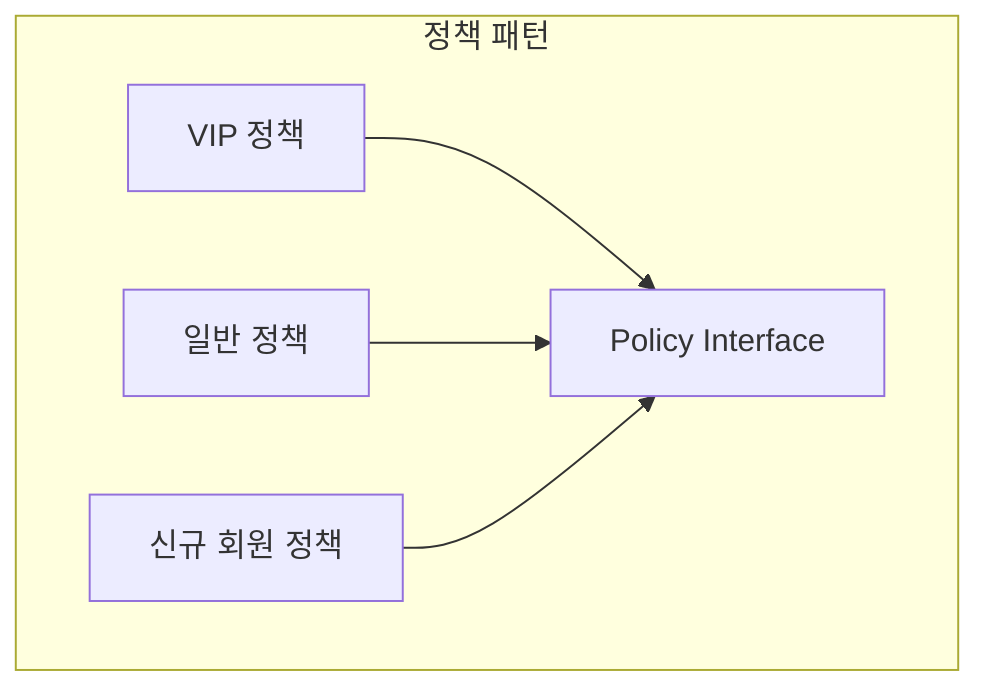
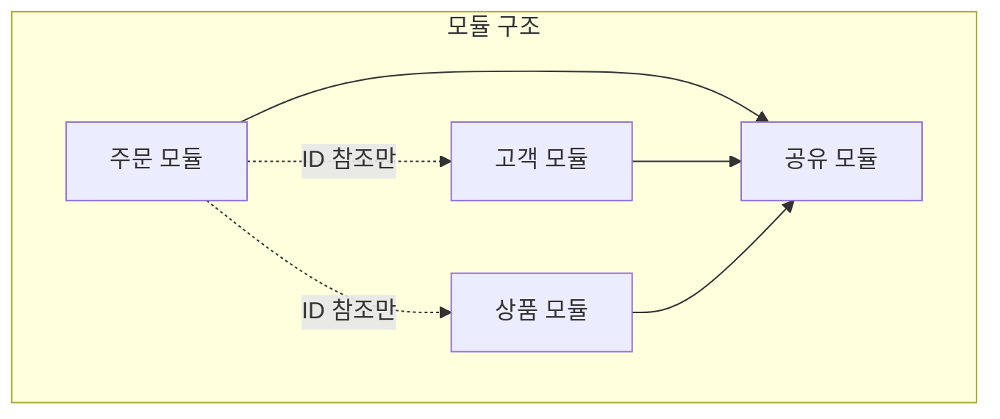

# 전술적 설계 (Tactical Design)

도메인 모델을 구체적으로 구현하기 위한 패턴들입니다.

## 전술적 설계 요소 개요



## Entity (엔티티)

### 정의

**식별자(Identity)**로 구분되는 도메인 객체입니다.



### 특징

| 특성 | 설명 | 예시 |
|------|------|------|
| **Identity** | 고유 식별자로 구분 | 주문번호, 회원ID |
| **Mutability** | 상태가 변경될 수 있음 | 주문 상태: PENDING → CONFIRMED |
| **Lifecycle** | 생성, 변경, 소멸의 생명주기 | 회원 가입 → 활동 → 탈퇴 |

### 구현 예시

```java
public class Order {
    private final OrderId id;  // Identity - 불변
    private OrderStatus status;  // 상태 - 가변
    private final CustomerId customerId;
    private ShippingAddress shippingAddress;  // 변경 가능
    private final List<OrderLine> orderLines;
    private final LocalDateTime createdAt;

    // 식별자 기반 동등성
    @Override
    public boolean equals(Object o) {
        if (this == o) return true;
        if (!(o instanceof Order order)) return false;
        return id.equals(order.id);  // ID만으로 비교
    }

    @Override
    public int hashCode() {
        return Objects.hash(id);
    }

    // 비즈니스 행위
    public void confirm() {
        validateConfirmable();
        this.status = OrderStatus.CONFIRMED;
        registerEvent(new OrderConfirmedEvent(this.id));
    }

    public void changeShippingAddress(ShippingAddress newAddress) {
        validateAddressChangeable();
        this.shippingAddress = newAddress;
        registerEvent(new ShippingAddressChangedEvent(this.id, newAddress));
    }

    private void validateConfirmable() {
        if (this.status != OrderStatus.PENDING) {
            throw new IllegalOrderStateException(
                "주문 상태가 PENDING일 때만 확정할 수 있습니다. 현재: " + this.status
            );
        }
    }
}
```

### 식별자 설계

```java
// ✅ 도메인 식별자 (권장)
public record OrderId(String value) {
    public OrderId {
        Objects.requireNonNull(value, "OrderId는 null일 수 없습니다");
        if (value.isBlank()) {
            throw new IllegalArgumentException("OrderId는 빈 값일 수 없습니다");
        }
    }

    public static OrderId generate() {
        return new OrderId("ORD-" + UUID.randomUUID().toString().substring(0, 8));
    }

    public static OrderId of(String value) {
        return new OrderId(value);
    }
}

// 사용
Order order = new Order(OrderId.generate(), customerId, orderLines);
```

## Value Object (값 객체)

### 정의

**속성 값**으로 동등성이 결정되는 불변 객체입니다.



### 특징

| 특성 | 설명 | 예시 |
|------|------|------|
| **Immutability** | 생성 후 변경 불가 | Money(1000, KRW) |
| **Value Equality** | 모든 속성이 같으면 같은 객체 | 1000원 == 1000원 |
| **Self-Contained** | 자체적으로 유효성 검증 | 금액은 음수 불가 |

### 구현 예시

```java
// Money Value Object
public record Money(BigDecimal amount, Currency currency) {

    // 생성 시 유효성 검증
    public Money {
        Objects.requireNonNull(amount, "금액은 필수입니다");
        Objects.requireNonNull(currency, "통화는 필수입니다");
        if (amount.compareTo(BigDecimal.ZERO) < 0) {
            throw new IllegalArgumentException("금액은 0 이상이어야 합니다");
        }
    }

    // 팩토리 메서드
    public static Money won(long amount) {
        return new Money(BigDecimal.valueOf(amount), Currency.KRW);
    }

    public static Money ZERO = new Money(BigDecimal.ZERO, Currency.KRW);

    // 불변 연산 - 새 객체 반환
    public Money add(Money other) {
        validateSameCurrency(other);
        return new Money(this.amount.add(other.amount), this.currency);
    }

    public Money multiply(int quantity) {
        return new Money(this.amount.multiply(BigDecimal.valueOf(quantity)), this.currency);
    }

    public boolean isGreaterThan(Money other) {
        validateSameCurrency(other);
        return this.amount.compareTo(other.amount) > 0;
    }

    private void validateSameCurrency(Money other) {
        if (!this.currency.equals(other.currency)) {
            throw new CurrencyMismatchException(this.currency, other.currency);
        }
    }
}
```

```java
// Address Value Object
public record Address(
    String zipCode,
    String city,
    String street,
    String detail
) {
    public Address {
        Objects.requireNonNull(zipCode, "우편번호는 필수입니다");
        Objects.requireNonNull(city, "도시는 필수입니다");
        Objects.requireNonNull(street, "도로명은 필수입니다");

        if (!zipCode.matches("\\d{5}")) {
            throw new InvalidAddressException("우편번호는 5자리 숫자여야 합니다");
        }
    }

    public String fullAddress() {
        return String.format("(%s) %s %s %s", zipCode, city, street, detail);
    }
}
```

### Entity vs Value Object



| 구분 | Entity | Value Object |
|------|--------|--------------|
| **동등성** | ID로 비교 | 모든 속성으로 비교 |
| **가변성** | 변경 가능 | 불변 |
| **생명주기** | 독립적 | Entity에 종속 |
| **예시** | 주문, 회원 | 금액, 주소 |

### Value Object로 만들어야 하는 것들

```java
// ❌ Primitive Obsession (원시 타입 집착)
public class Order {
    private String orderId;        // 그냥 String
    private int totalAmount;       // 그냥 int
    private String customerEmail;  // 그냥 String
}

// ✅ Value Object 사용
public class Order {
    private OrderId id;            // 도메인 식별자
    private Money totalAmount;     // 금액 VO
    private Email customerEmail;   // 이메일 VO
}
```

## Repository (리포지토리)

### 정의

Aggregate의 **영속성을 추상화**하는 인터페이스입니다.



### 인터페이스 설계

```java
// 도메인 계층에 위치
public interface OrderRepository {

    // 저장
    Order save(Order order);

    // 조회
    Optional<Order> findById(OrderId id);

    // 도메인 특화 조회
    List<Order> findByCustomerId(CustomerId customerId);

    List<Order> findPendingOrdersOlderThan(LocalDateTime dateTime);

    // 삭제 (논리 삭제 권장)
    void delete(Order order);

    // 존재 확인
    boolean existsById(OrderId id);
}
```

### 구현체

```java
// 인프라 계층에 위치
@Repository
public class JpaOrderRepository implements OrderRepository {

    private final OrderJpaRepository jpaRepository;
    private final OrderMapper mapper;

    @Override
    public Order save(Order order) {
        OrderEntity entity = mapper.toEntity(order);
        OrderEntity saved = jpaRepository.save(entity);
        return mapper.toDomain(saved);
    }

    @Override
    public Optional<Order> findById(OrderId id) {
        return jpaRepository.findById(id.getValue())
            .map(mapper::toDomain);
    }

    @Override
    public List<Order> findPendingOrdersOlderThan(LocalDateTime dateTime) {
        return jpaRepository.findByStatusAndCreatedAtBefore(
                OrderStatus.PENDING, dateTime)
            .stream()
            .map(mapper::toDomain)
            .toList();
    }
}
```

### Repository 설계 원칙

1. **Aggregate Root만 Repository를 가짐**

```java
// ✅ Aggregate Root(Order)만 Repository
interface OrderRepository {
    Order save(Order order);
}

// ❌ Aggregate 내부 객체는 Repository 없음
// interface OrderLineRepository { ... }  // 잘못된 설계
```

2. **Collection처럼 동작**

```java
// 마치 컬렉션에 추가하듯
orderRepository.save(order);

// 마치 컬렉션에서 찾듯
Order order = orderRepository.findById(orderId)
    .orElseThrow(() -> new OrderNotFoundException(orderId));
```

## Domain Service (도메인 서비스)

### 언제 사용하나?

특정 Entity나 Value Object에 속하기 어려운 **도메인 로직**을 담습니다.



### 예시 1: 할인 계산

```java
// 할인 정책이 여러 요소를 고려해야 할 때
@DomainService
public class DiscountCalculator {

    private final MemberGradeReader memberGradeReader;
    private final PromotionReader promotionReader;

    public Money calculateDiscount(Order order, CustomerId customerId) {
        MemberGrade grade = memberGradeReader.getGrade(customerId);
        List<Promotion> promotions = promotionReader.getActivePromotions();

        Money gradeDiscount = calculateGradeDiscount(order, grade);
        Money promotionDiscount = calculatePromotionDiscount(order, promotions);

        return gradeDiscount.add(promotionDiscount);
    }

    private Money calculateGradeDiscount(Order order, MemberGrade grade) {
        return order.getTotalAmount().multiply(grade.getDiscountRate());
    }

    private Money calculatePromotionDiscount(Order order, List<Promotion> promotions) {
        return promotions.stream()
            .filter(p -> p.isApplicableTo(order))
            .map(p -> p.calculateDiscount(order))
            .reduce(Money.ZERO, Money::add);
    }
}
```

### 예시 2: 재고 확인

```java
@DomainService
public class StockValidator {

    private final StockReader stockReader;

    public void validateStock(Order order) {
        for (OrderLine line : order.getOrderLines()) {
            Stock stock = stockReader.getStock(line.getProductId());

            if (!stock.isAvailable(line.getQuantity())) {
                throw new InsufficientStockException(
                    line.getProductId(),
                    line.getQuantity(),
                    stock.getAvailableQuantity()
                );
            }
        }
    }
}
```

### Domain Service vs Application Service

```java
// Domain Service: 도메인 로직
@DomainService
public class OrderValidator {
    public void validate(Order order) {
        // 순수한 도메인 규칙 검증
    }
}

// Application Service: 유스케이스 조율
@Service
@Transactional
public class OrderApplicationService {

    private final OrderRepository orderRepository;
    private final OrderValidator orderValidator;  // 도메인 서비스 사용
    private final EventPublisher eventPublisher;

    public OrderId createOrder(CreateOrderCommand command) {
        // 1. 도메인 객체 생성
        Order order = Order.create(command.getCustomerId(), command.getOrderLines());

        // 2. 도메인 서비스로 검증
        orderValidator.validate(order);

        // 3. 저장
        Order saved = orderRepository.save(order);

        // 4. 이벤트 발행
        eventPublisher.publish(saved.getDomainEvents());

        return saved.getId();
    }
}
```

| 구분 | Domain Service | Application Service |
|------|---------------|---------------------|
| **위치** | 도메인 계층 | 응용 계층 |
| **역할** | 도메인 로직 | 유스케이스 조율 |
| **트랜잭션** | 모름 | 관리 |
| **의존성** | 도메인 객체만 | 도메인 + 인프라 |

## Factory (팩토리)

### 언제 사용하나?

Aggregate 생성이 복잡할 때 **생성 로직을 캡슐화**합니다.

```java
// 간단한 경우: 정적 팩토리 메서드
public class Order {
    public static Order create(CustomerId customerId, List<OrderLine> lines) {
        return new Order(OrderId.generate(), customerId, lines);
    }
}

// 복잡한 경우: Factory 클래스
@Component
public class OrderFactory {

    private final CustomerReader customerReader;
    private final ProductReader productReader;

    public Order create(CreateOrderCommand command) {
        // 고객 검증
        Customer customer = customerReader.getCustomer(command.getCustomerId());
        customer.validateCanOrder();

        // 주문 항목 생성
        List<OrderLine> orderLines = command.getItems().stream()
            .map(this::createOrderLine)
            .toList();

        // 주문 생성
        return Order.create(
            customer.getId(),
            orderLines,
            customer.getDefaultShippingAddress()
        );
    }

    private OrderLine createOrderLine(OrderItemRequest request) {
        Product product = productReader.getProduct(request.getProductId());
        return OrderLine.create(
            product.getId(),
            product.getName(),
            product.getPrice(),
            request.getQuantity()
        );
    }
}
```

## 계층 구조



## Specification (명세) 패턴

### 정의

**비즈니스 규칙을 객체로 캡슐화**하여 재사용 가능하게 만드는 패턴입니다.



### 기본 구현

```java
// Specification 인터페이스
public interface Specification<T> {
    boolean isSatisfiedBy(T candidate);

    default Specification<T> and(Specification<T> other) {
        return new AndSpecification<>(this, other);
    }

    default Specification<T> or(Specification<T> other) {
        return new OrSpecification<>(this, other);
    }

    default Specification<T> not() {
        return new NotSpecification<>(this);
    }
}

// 복합 Specification
public class AndSpecification<T> implements Specification<T> {
    private final Specification<T> first;
    private final Specification<T> second;

    public AndSpecification(Specification<T> first, Specification<T> second) {
        this.first = first;
        this.second = second;
    }

    @Override
    public boolean isSatisfiedBy(T candidate) {
        return first.isSatisfiedBy(candidate) && second.isSatisfiedBy(candidate);
    }
}

public class OrSpecification<T> implements Specification<T> {
    private final Specification<T> first;
    private final Specification<T> second;

    public OrSpecification(Specification<T> first, Specification<T> second) {
        this.first = first;
        this.second = second;
    }

    @Override
    public boolean isSatisfiedBy(T candidate) {
        return first.isSatisfiedBy(candidate) || second.isSatisfiedBy(candidate);
    }
}

public class NotSpecification<T> implements Specification<T> {
    private final Specification<T> spec;

    public NotSpecification(Specification<T> spec) {
        this.spec = spec;
    }

    @Override
    public boolean isSatisfiedBy(T candidate) {
        return !spec.isSatisfiedBy(candidate);
    }
}
```

### 주문 도메인 예시

```java
// 구체적인 주문 Specification들
public class OrderSpecifications {

    // 최소 금액 검증
    public static Specification<Order> hasMinimumAmount(Money minimum) {
        return order -> order.getTotalAmount().isGreaterThanOrEqual(minimum);
    }

    // 특정 상태 검증
    public static Specification<Order> hasStatus(OrderStatus status) {
        return order -> order.getStatus() == status;
    }

    // 확정 가능 여부
    public static Specification<Order> isConfirmable() {
        return hasStatus(OrderStatus.PENDING)
            .and(hasMinimumAmount(Money.won(10000)));
    }

    // 취소 가능 여부
    public static Specification<Order> isCancellable() {
        return hasStatus(OrderStatus.PENDING)
            .or(hasStatus(OrderStatus.CONFIRMED));
    }

    // 배송 가능 여부
    public static Specification<Order> isShippable() {
        return hasStatus(OrderStatus.CONFIRMED)
            .and(order -> order.hasValidShippingAddress())
            .and(order -> !order.getOrderLines().isEmpty());
    }
}

// 사용 예시
public class Order {

    public void confirm() {
        if (!OrderSpecifications.isConfirmable().isSatisfiedBy(this)) {
            throw new OrderCannotBeConfirmedException(this.id);
        }
        this.status = OrderStatus.CONFIRMED;
        registerEvent(new OrderConfirmedEvent(this.id));
    }

    public void cancel(CancellationReason reason) {
        if (!OrderSpecifications.isCancellable().isSatisfiedBy(this)) {
            throw new OrderCannotBeCancelledException(this.id, this.status);
        }
        this.status = OrderStatus.CANCELLED;
        this.cancellationReason = reason;
        registerEvent(new OrderCancelledEvent(this.id, reason));
    }
}
```

### Repository와 함께 사용

```java
// JPA Specification (Spring Data JPA)
public class OrderJpaSpecifications {

    public static org.springframework.data.jpa.domain.Specification<OrderEntity>
            hasStatus(OrderStatus status) {
        return (root, query, cb) ->
            cb.equal(root.get("status"), status);
    }

    public static org.springframework.data.jpa.domain.Specification<OrderEntity>
            hasMinimumAmount(Money minimum) {
        return (root, query, cb) ->
            cb.greaterThanOrEqualTo(root.get("totalAmount"), minimum.amount());
    }

    public static org.springframework.data.jpa.domain.Specification<OrderEntity>
            createdBetween(LocalDateTime start, LocalDateTime end) {
        return (root, query, cb) ->
            cb.between(root.get("createdAt"), start, end);
    }

    public static org.springframework.data.jpa.domain.Specification<OrderEntity>
            belongsToCustomer(CustomerId customerId) {
        return (root, query, cb) ->
            cb.equal(root.get("customerId"), customerId.getValue());
    }
}

// Repository에서 사용
@Repository
public class JpaOrderRepository implements OrderRepository {

    private final OrderJpaRepository jpaRepository;

    @Override
    public List<Order> findConfirmableOrders() {
        var spec = OrderJpaSpecifications.hasStatus(OrderStatus.PENDING)
            .and(OrderJpaSpecifications.hasMinimumAmount(Money.won(10000)));

        return jpaRepository.findAll(spec).stream()
            .map(mapper::toDomain)
            .toList();
    }
}
```

### Specification 패턴의 장점

| 장점 | 설명 |
|------|------|
| **재사용성** | 비즈니스 규칙을 여러 곳에서 재사용 |
| **가독성** | 복잡한 조건을 명확하게 표현 |
| **테스트 용이** | 각 규칙을 독립적으로 테스트 |
| **조합 가능** | and, or, not으로 복잡한 규칙 구성 |

---

## Policy (정책) 패턴

### 정의

**비즈니스 정책을 독립적인 객체로 분리**하여 교체 가능하게 만드는 패턴입니다.



### 할인 정책 예시

```java
// 할인 정책 인터페이스
public interface DiscountPolicy {
    Money calculateDiscount(Order order, Customer customer);
    boolean isApplicable(Order order, Customer customer);
}

// VIP 할인 정책
public class VipDiscountPolicy implements DiscountPolicy {
    private static final BigDecimal DISCOUNT_RATE = new BigDecimal("0.10");

    @Override
    public boolean isApplicable(Order order, Customer customer) {
        return customer.getGrade() == CustomerGrade.VIP;
    }

    @Override
    public Money calculateDiscount(Order order, Customer customer) {
        return order.getTotalAmount().multiply(DISCOUNT_RATE);
    }
}

// 첫 주문 할인 정책
public class FirstOrderDiscountPolicy implements DiscountPolicy {
    private static final Money DISCOUNT_AMOUNT = Money.won(5000);

    @Override
    public boolean isApplicable(Order order, Customer customer) {
        return customer.getOrderCount() == 0;
    }

    @Override
    public Money calculateDiscount(Order order, Customer customer) {
        return DISCOUNT_AMOUNT;
    }
}

// 대량 구매 할인 정책
public class BulkOrderDiscountPolicy implements DiscountPolicy {
    private static final int MINIMUM_QUANTITY = 10;
    private static final BigDecimal DISCOUNT_RATE = new BigDecimal("0.05");

    @Override
    public boolean isApplicable(Order order, Customer customer) {
        return order.getTotalQuantity() >= MINIMUM_QUANTITY;
    }

    @Override
    public Money calculateDiscount(Order order, Customer customer) {
        return order.getTotalAmount().multiply(DISCOUNT_RATE);
    }
}

// 정책 조합
@DomainService
public class DiscountCalculator {

    private final List<DiscountPolicy> policies;

    public DiscountCalculator(List<DiscountPolicy> policies) {
        this.policies = policies;
    }

    public Money calculateTotalDiscount(Order order, Customer customer) {
        return policies.stream()
            .filter(policy -> policy.isApplicable(order, customer))
            .map(policy -> policy.calculateDiscount(order, customer))
            .reduce(Money.ZERO, Money::add);
    }
}
```

### 배송비 정책 예시

```java
// 배송비 정책 인터페이스
public interface ShippingPolicy {
    Money calculateShippingFee(Order order, ShippingAddress address);
}

// 기본 배송비 정책
public class StandardShippingPolicy implements ShippingPolicy {
    private static final Money BASE_FEE = Money.won(3000);
    private static final Money FREE_SHIPPING_THRESHOLD = Money.won(50000);

    @Override
    public Money calculateShippingFee(Order order, ShippingAddress address) {
        if (order.getTotalAmount().isGreaterThanOrEqual(FREE_SHIPPING_THRESHOLD)) {
            return Money.ZERO;
        }
        return BASE_FEE;
    }
}

// 도서산간 배송비 정책
public class RemoteAreaShippingPolicy implements ShippingPolicy {
    private static final Money REMOTE_SURCHARGE = Money.won(5000);
    private final ShippingPolicy delegate;
    private final RemoteAreaChecker remoteAreaChecker;

    @Override
    public Money calculateShippingFee(Order order, ShippingAddress address) {
        Money baseFee = delegate.calculateShippingFee(order, address);

        if (remoteAreaChecker.isRemoteArea(address)) {
            return baseFee.add(REMOTE_SURCHARGE);
        }
        return baseFee;
    }
}
```

---

## Module (모듈) 조직

### 패키지 구조

도메인의 복잡도가 높아지면 **모듈로 분리**하여 관리합니다.

```
src/main/java/com/example/
├── order/                          # 주문 모듈
│   ├── domain/
│   │   ├── Order.java
│   │   ├── OrderLine.java
│   │   ├── OrderId.java
│   │   ├── OrderStatus.java
│   │   ├── OrderRepository.java   # Repository Interface
│   │   ├── OrderFactory.java
│   │   └── event/
│   │       ├── OrderCreatedEvent.java
│   │       └── OrderConfirmedEvent.java
│   ├── application/
│   │   ├── OrderCommandService.java
│   │   ├── OrderQueryService.java
│   │   └── dto/
│   │       ├── CreateOrderCommand.java
│   │       └── OrderResponse.java
│   └── infrastructure/
│       ├── persistence/
│       │   ├── JpaOrderRepository.java
│       │   ├── OrderEntity.java
│       │   └── OrderMapper.java
│       └── event/
│           └── KafkaOrderEventPublisher.java
│
├── customer/                       # 고객 모듈
│   ├── domain/
│   │   ├── Customer.java
│   │   ├── CustomerId.java
│   │   └── CustomerRepository.java
│   ├── application/
│   │   └── CustomerService.java
│   └── infrastructure/
│       └── persistence/
│           └── JpaCustomerRepository.java
│
├── product/                        # 상품 모듈
│   ├── domain/
│   ├── application/
│   └── infrastructure/
│
└── shared/                         # 공유 모듈
    ├── domain/
    │   ├── Money.java
    │   ├── Address.java
    │   └── AggregateRoot.java
    └── infrastructure/
        └── event/
            └── DomainEventPublisher.java
```

### 모듈 간 의존성



### 모듈 간 통신

```java
// ❌ 직접 의존 (피해야 함)
public class Order {
    private Customer customer;  // 다른 모듈 Aggregate 직접 참조
}

// ✅ ID로 참조
public class Order {
    private CustomerId customerId;  // ID만 참조
}

// 필요시 Application Service에서 조회
@Service
public class OrderApplicationService {

    private final OrderRepository orderRepository;
    private final CustomerReader customerReader;  // Port/Interface

    public OrderDetailResponse getOrderDetail(OrderId orderId) {
        Order order = orderRepository.findById(orderId).orElseThrow();
        Customer customer = customerReader.findById(order.getCustomerId());

        return OrderDetailResponse.of(order, customer);
    }
}
```

---

## Builder 패턴 (복잡한 생성)

### Aggregate Builder

복잡한 Aggregate 생성 시 Builder 패턴을 활용합니다.

```java
public class Order {
    private final OrderId id;
    private final CustomerId customerId;
    private final List<OrderLine> orderLines;
    private final ShippingAddress shippingAddress;
    private final Money totalAmount;
    private OrderStatus status;

    private Order(Builder builder) {
        this.id = builder.id;
        this.customerId = builder.customerId;
        this.orderLines = List.copyOf(builder.orderLines);
        this.shippingAddress = builder.shippingAddress;
        this.totalAmount = calculateTotalAmount(builder.orderLines);
        this.status = OrderStatus.PENDING;

        validate();
    }

    private void validate() {
        if (orderLines.isEmpty()) {
            throw new EmptyOrderException("주문에는 최소 1개 이상의 항목이 필요합니다");
        }
    }

    public static Builder builder() {
        return new Builder();
    }

    public static class Builder {
        private OrderId id;
        private CustomerId customerId;
        private List<OrderLine> orderLines = new ArrayList<>();
        private ShippingAddress shippingAddress;

        public Builder id(OrderId id) {
            this.id = id;
            return this;
        }

        public Builder customerId(CustomerId customerId) {
            this.customerId = customerId;
            return this;
        }

        public Builder addOrderLine(ProductId productId, String productName,
                                    Money price, int quantity) {
            this.orderLines.add(OrderLine.create(productId, productName, price, quantity));
            return this;
        }

        public Builder shippingAddress(ShippingAddress address) {
            this.shippingAddress = address;
            return this;
        }

        public Order build() {
            if (id == null) {
                id = OrderId.generate();
            }
            return new Order(this);
        }
    }
}

// 사용 예시
Order order = Order.builder()
    .customerId(CustomerId.of("CUST-001"))
    .addOrderLine(productId1, "노트북", Money.won(1200000), 1)
    .addOrderLine(productId2, "마우스", Money.won(50000), 2)
    .shippingAddress(new ShippingAddress("12345", "서울시", "강남구", "101호"))
    .build();
```

---

## Null Object 패턴

### 정의

null 체크를 피하기 위해 **특수한 'null' 객체**를 사용합니다.

```java
// Null Object 패턴 적용
public interface DiscountPolicy {
    Money calculateDiscount(Order order);

    // Null Object
    DiscountPolicy NONE = order -> Money.ZERO;
}

// 사용
public class Order {
    private final DiscountPolicy discountPolicy;

    public Order(CustomerId customerId, DiscountPolicy discountPolicy) {
        this.customerId = customerId;
        // null 대신 NONE 사용
        this.discountPolicy = discountPolicy != null ? discountPolicy : DiscountPolicy.NONE;
    }

    public Money calculateFinalAmount() {
        // null 체크 불필요
        Money discount = discountPolicy.calculateDiscount(this);
        return totalAmount.subtract(discount);
    }
}
```

### Optional과의 비교

```java
// Optional 사용
public Optional<Discount> getDiscount() {
    return Optional.ofNullable(discount);
}

// Null Object 사용 (권장: 도메인 로직에서)
public Discount getDiscount() {
    return discount != null ? discount : Discount.NONE;
}
```

---

## 전술적 설계 체크리스트

### Entity 체크리스트

```
[ ] 고유 식별자가 있는가?
[ ] 식별자로 동등성을 비교하는가?
[ ] 비즈니스 행위가 메서드로 표현되어 있는가?
[ ] 유효하지 않은 상태가 될 수 없는가?
[ ] setter 대신 행위 메서드를 사용하는가?
```

### Value Object 체크리스트

```
[ ] 불변인가?
[ ] 모든 속성으로 동등성을 비교하는가?
[ ] 자체적으로 유효성을 검증하는가?
[ ] 부수효과가 없는가? (새 객체 반환)
[ ] 의미 있는 도메인 개념을 표현하는가?
```

### Repository 체크리스트

```
[ ] Aggregate Root만 Repository가 있는가?
[ ] 인터페이스가 도메인 계층에 있는가?
[ ] 컬렉션처럼 동작하는가?
[ ] 도메인 특화 메서드가 있는가?
```

### Domain Service 체크리스트

```
[ ] 특정 Entity에 속하지 않는 로직인가?
[ ] 여러 Aggregate에 걸친 연산인가?
[ ] 무상태인가?
[ ] 도메인 계층에만 의존하는가?
```

## 다음 단계

- [Aggregate 심화](../aggregate/) - Aggregate 설계 원칙과 트랜잭션 경계
- [도메인 이벤트](../domain-events/) - 이벤트 기반 설계
