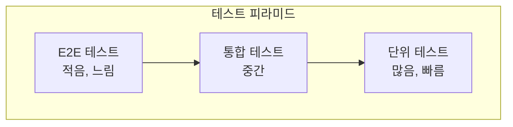
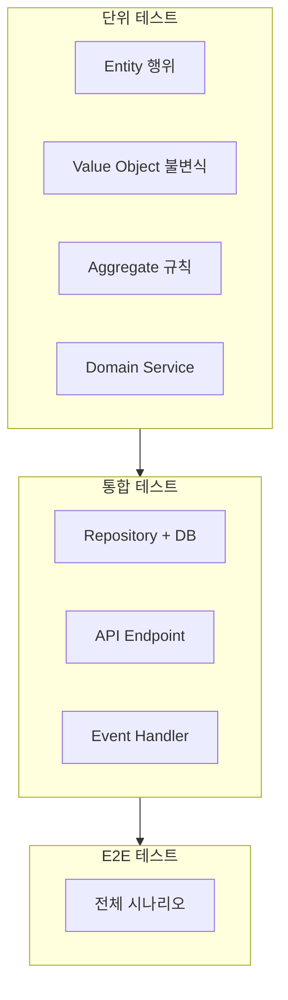

# DDD 테스트 전략

도메인 모델과 DDD 아키텍처에 적합한 테스트 전략을 살펴봅니다.

## 테스트 피라미드



| 테스트 유형 | 범위 | 속도 | 비용 |
|------------|------|------|------|
| **단위 테스트** | 도메인 모델, 서비스 | 빠름 | 낮음 |
| **통합 테스트** | Repository, 외부 연동 | 중간 | 중간 |
| **E2E 테스트** | 전체 시스템 | 느림 | 높음 |

## 도메인 모델 단위 테스트

### 왜 중요한가?

도메인 모델은 비즈니스 로직의 핵심입니다. **의존성 없이 빠르게 테스트**할 수 있어야 합니다.

### Entity 테스트

```java
class OrderTest {

    @Nested
    @DisplayName("주문 생성")
    class CreateOrder {

        @Test
        @DisplayName("유효한 정보로 주문을 생성할 수 있다")
        void createWithValidData() {
            // given
            var customerId = CustomerId.of("CUST-001");
            var address = createValidAddress();
            var orderLines = List.of(
                new OrderLineRequest(ProductId.of("PROD-001"), "상품1", Money.won(10000), 2)
            );

            // when
            Order order = Order.create(customerId, address, orderLines);

            // then
            assertThat(order.getId()).isNotNull();
            assertThat(order.getStatus()).isEqualTo(OrderStatus.PENDING);
            assertThat(order.getTotalAmount()).isEqualTo(Money.won(20000));
            assertThat(order.getOrderLines()).hasSize(1);
        }

        @Test
        @DisplayName("주문 항목 없이 생성하면 예외가 발생한다")
        void failWithEmptyOrderLines() {
            // given
            var customerId = CustomerId.of("CUST-001");
            var address = createValidAddress();

            // when & then
            assertThatThrownBy(() -> Order.create(customerId, address, List.of()))
                .isInstanceOf(IllegalArgumentException.class)
                .hasMessageContaining("최소 1개");
        }

        @Test
        @DisplayName("최대 금액을 초과하면 예외가 발생한다")
        void failWithExceedingMaxAmount() {
            // given
            var orderLines = List.of(
                new OrderLineRequest(ProductId.of("PROD-001"), "비싼상품", Money.won(100_000_001), 1)
            );

            // when & then
            assertThatThrownBy(() -> Order.create(customerId, address, orderLines))
                .isInstanceOf(IllegalArgumentException.class)
                .hasMessageContaining("최대 금액");
        }
    }

    @Nested
    @DisplayName("주문 확정")
    class ConfirmOrder {

        @Test
        @DisplayName("PENDING 상태의 주문을 확정할 수 있다")
        void confirmPendingOrder() {
            // given
            Order order = createPendingOrder();

            // when
            order.confirm();

            // then
            assertThat(order.getStatus()).isEqualTo(OrderStatus.CONFIRMED);
            assertThat(order.getConfirmedAt()).isNotNull();
        }

        @Test
        @DisplayName("주문 확정 시 OrderConfirmedEvent가 발행된다")
        void publishEventWhenConfirmed() {
            // given
            Order order = createPendingOrder();

            // when
            order.confirm();

            // then
            assertThat(order.getDomainEvents())
                .hasSize(1)
                .first()
                .isInstanceOf(OrderConfirmedEvent.class);
        }

        @Test
        @DisplayName("이미 확정된 주문은 다시 확정할 수 없다")
        void cannotConfirmAlreadyConfirmed() {
            // given
            Order order = createPendingOrder();
            order.confirm();
            order.clearDomainEvents();

            // when & then
            assertThatThrownBy(order::confirm)
                .isInstanceOf(IllegalOrderStateException.class)
                .hasMessageContaining("PENDING");
        }

        @Test
        @DisplayName("취소된 주문은 확정할 수 없다")
        void cannotConfirmCancelledOrder() {
            // given
            Order order = createPendingOrder();
            order.cancel("테스트");

            // when & then
            assertThatThrownBy(order::confirm)
                .isInstanceOf(IllegalOrderStateException.class);
        }
    }

    @Nested
    @DisplayName("주문 취소")
    class CancelOrder {

        @ParameterizedTest
        @EnumSource(value = OrderStatus.class, names = {"PENDING", "CONFIRMED"})
        @DisplayName("PENDING 또는 CONFIRMED 상태에서 취소할 수 있다")
        void canCancelPendingOrConfirmed(OrderStatus status) {
            // given
            Order order = createOrderWithStatus(status);

            // when
            order.cancel("단순 변심");

            // then
            assertThat(order.getStatus()).isEqualTo(OrderStatus.CANCELLED);
            assertThat(order.getCancellationReason()).isEqualTo("단순 변심");
        }

        @ParameterizedTest
        @EnumSource(value = OrderStatus.class, names = {"SHIPPED", "DELIVERED"})
        @DisplayName("SHIPPED 이후 상태에서는 취소할 수 없다")
        void cannotCancelAfterShipped(OrderStatus status) {
            // given
            Order order = createOrderWithStatus(status);

            // when & then
            assertThatThrownBy(() -> order.cancel("테스트"))
                .isInstanceOf(IllegalOrderStateException.class);
        }
    }
}
```

### Value Object 테스트

```java
class MoneyTest {

    @Test
    @DisplayName("같은 금액과 통화는 동일하다")
    void equalityByValue() {
        // given
        Money money1 = Money.won(10000);
        Money money2 = Money.won(10000);

        // then
        assertThat(money1).isEqualTo(money2);
        assertThat(money1.hashCode()).isEqualTo(money2.hashCode());
    }

    @Test
    @DisplayName("금액을 더할 수 있다")
    void addMoney() {
        // given
        Money money1 = Money.won(10000);
        Money money2 = Money.won(5000);

        // when
        Money result = money1.add(money2);

        // then
        assertThat(result).isEqualTo(Money.won(15000));
        // 원본은 변경되지 않음 (불변성)
        assertThat(money1).isEqualTo(Money.won(10000));
    }

    @Test
    @DisplayName("다른 통화와는 연산할 수 없다")
    void cannotAddDifferentCurrency() {
        // given
        Money won = Money.won(10000);
        Money usd = new Money(BigDecimal.valueOf(10), Currency.getInstance("USD"));

        // when & then
        assertThatThrownBy(() -> won.add(usd))
            .isInstanceOf(IllegalArgumentException.class)
            .hasMessageContaining("통화가 다릅니다");
    }

    @Test
    @DisplayName("음수 금액은 생성할 수 없다")
    void cannotCreateNegativeAmount() {
        assertThatThrownBy(() -> Money.won(-1000))
            .isInstanceOf(IllegalArgumentException.class);
    }
}

class ShippingAddressTest {

    @Test
    @DisplayName("유효한 주소를 생성할 수 있다")
    void createValidAddress() {
        // when
        ShippingAddress address = new ShippingAddress(
            "12345", "서울시", "강남대로 123", "101호",
            "홍길동", "010-1234-5678"
        );

        // then
        assertThat(address.fullAddress())
            .isEqualTo("(12345) 서울시 강남대로 123 101호");
    }

    @Test
    @DisplayName("잘못된 우편번호는 예외가 발생한다")
    void invalidZipCode() {
        assertThatThrownBy(() -> new ShippingAddress(
            "1234", "서울시", "강남대로 123", "101호",  // 4자리 우편번호
            "홍길동", "010-1234-5678"
        ))
            .isInstanceOf(IllegalArgumentException.class)
            .hasMessageContaining("우편번호");
    }
}
```

### Aggregate 불변식 테스트

```java
class OrderInvariantTest {

    @Test
    @DisplayName("주문 총액은 항상 주문 항목 합계와 일치한다")
    void totalAmountEqualsOrderLinesSum() {
        // given
        Order order = Order.create(
            customerId, address,
            List.of(
                new OrderLineRequest(productId1, "상품1", Money.won(10000), 2),  // 20000
                new OrderLineRequest(productId2, "상품2", Money.won(5000), 3)    // 15000
            )
        );

        // then
        Money expectedTotal = Money.won(35000);
        assertThat(order.getTotalAmount()).isEqualTo(expectedTotal);

        // 주문 항목 제거 후에도 일관성 유지
        order.removeOrderLine(order.getOrderLines().get(0).getId());
        assertThat(order.getTotalAmount()).isEqualTo(Money.won(15000));
    }

    @Test
    @DisplayName("주문에는 항상 최소 1개의 항목이 있어야 한다")
    void minimumOneOrderLine() {
        // given
        Order order = Order.create(
            customerId, address,
            List.of(new OrderLineRequest(productId, "상품", Money.won(10000), 1))
        );

        // when & then: 마지막 항목 제거 시도
        assertThatThrownBy(() ->
            order.removeOrderLine(order.getOrderLines().get(0).getId())
        )
            .isInstanceOf(IllegalArgumentException.class)
            .hasMessageContaining("최소 1개");
    }
}
```

## Application Service 테스트

Application Service는 **Mock을 사용**하여 도메인과 분리해서 테스트합니다.

```java
@ExtendWith(MockitoExtension.class)
class OrderServiceTest {

    @Mock
    private OrderRepository orderRepository;

    @Mock
    private ApplicationEventPublisher eventPublisher;

    @InjectMocks
    private OrderService orderService;

    @Test
    @DisplayName("주문을 확정하면 저장되고 이벤트가 발행된다")
    void confirmOrder() {
        // given
        OrderId orderId = OrderId.of("ORD-001");
        Order order = spy(createPendingOrder(orderId));

        when(orderRepository.findById(orderId)).thenReturn(Optional.of(order));

        // when
        orderService.confirmOrder(new ConfirmOrderCommand(orderId));

        // then
        verify(order).confirm();
        verify(orderRepository).save(order);
        verify(eventPublisher).publishEvent(any(OrderConfirmedEvent.class));
    }

    @Test
    @DisplayName("존재하지 않는 주문을 확정하면 예외가 발생한다")
    void confirmNotFoundOrder() {
        // given
        OrderId orderId = OrderId.of("NOT-EXIST");
        when(orderRepository.findById(orderId)).thenReturn(Optional.empty());

        // when & then
        assertThatThrownBy(() ->
            orderService.confirmOrder(new ConfirmOrderCommand(orderId))
        )
            .isInstanceOf(OrderNotFoundException.class);

        verify(orderRepository, never()).save(any());
    }
}
```

## Repository 통합 테스트

실제 DB와 함께 테스트합니다.

```java
@DataJpaTest
@AutoConfigureTestDatabase(replace = AutoConfigureTestDatabase.Replace.NONE)
@Testcontainers
class JpaOrderRepositoryTest {

    @Container
    static PostgreSQLContainer<?> postgres = new PostgreSQLContainer<>("postgres:15");

    @DynamicPropertySource
    static void configureProperties(DynamicPropertyRegistry registry) {
        registry.add("spring.datasource.url", postgres::getJdbcUrl);
        registry.add("spring.datasource.username", postgres::getUsername);
        registry.add("spring.datasource.password", postgres::getPassword);
    }

    @Autowired
    private JpaOrderRepository repository;

    @Autowired
    private TestEntityManager entityManager;

    @Test
    @DisplayName("주문을 저장하고 조회할 수 있다")
    void saveAndFind() {
        // given
        Order order = Order.create(customerId, address, orderLines);

        // when
        Order saved = repository.save(order);
        entityManager.flush();
        entityManager.clear();

        // then
        Order found = repository.findById(saved.getId()).orElseThrow();
        assertThat(found.getId()).isEqualTo(saved.getId());
        assertThat(found.getStatus()).isEqualTo(OrderStatus.PENDING);
        assertThat(found.getOrderLines()).hasSize(1);
    }

    @Test
    @DisplayName("고객별 주문 목록을 조회할 수 있다")
    void findByCustomerId() {
        // given
        Order order1 = repository.save(Order.create(customerId, address, orderLines));
        Order order2 = repository.save(Order.create(customerId, address, orderLines));
        Order otherOrder = repository.save(Order.create(otherCustomerId, address, orderLines));
        entityManager.flush();

        // when
        List<Order> orders = repository.findByCustomerId(customerId);

        // then
        assertThat(orders)
            .hasSize(2)
            .extracting(Order::getId)
            .containsExactlyInAnyOrder(order1.getId(), order2.getId());
    }
}
```

## API 통합 테스트

```java
@SpringBootTest(webEnvironment = SpringBootTest.WebEnvironment.RANDOM_PORT)
@Testcontainers
class OrderApiIntegrationTest {

    @Container
    static PostgreSQLContainer<?> postgres = new PostgreSQLContainer<>("postgres:15");

    @Autowired
    private TestRestTemplate restTemplate;

    @Autowired
    private OrderRepository orderRepository;

    @Test
    @DisplayName("주문 생성 API")
    void createOrder() {
        // given
        CreateOrderRequest request = new CreateOrderRequest(
            "CUST-001",
            new ShippingAddressRequest("12345", "서울시", "강남대로", "101호", "홍길동", "010-1234-5678"),
            List.of(new OrderLineRequestDto("PROD-001", "상품1", 10000L, 2))
        );

        // when
        ResponseEntity<CreateOrderResponse> response = restTemplate.postForEntity(
            "/api/orders",
            request,
            CreateOrderResponse.class
        );

        // then
        assertThat(response.getStatusCode()).isEqualTo(HttpStatus.CREATED);
        assertThat(response.getBody().orderId()).isNotNull();

        // DB 확인
        Order saved = orderRepository.findById(OrderId.of(response.getBody().orderId()))
            .orElseThrow();
        assertThat(saved.getStatus()).isEqualTo(OrderStatus.PENDING);
    }

    @Test
    @DisplayName("주문 확정 API")
    void confirmOrder() {
        // given
        Order order = orderRepository.save(createPendingOrder());

        // when
        ResponseEntity<Void> response = restTemplate.postForEntity(
            "/api/orders/{orderId}/confirm",
            null,
            Void.class,
            order.getId().getValue()
        );

        // then
        assertThat(response.getStatusCode()).isEqualTo(HttpStatus.OK);

        Order confirmed = orderRepository.findById(order.getId()).orElseThrow();
        assertThat(confirmed.getStatus()).isEqualTo(OrderStatus.CONFIRMED);
    }
}
```

## 이벤트 핸들러 테스트

```java
@SpringBootTest
class OrderEventHandlerTest {

    @Autowired
    private ApplicationEventPublisher eventPublisher;

    @Autowired
    private OrderViewRepository orderViewRepository;

    @Test
    @DisplayName("OrderConfirmedEvent 발행 시 OrderView가 업데이트된다")
    void updateViewOnConfirmed() {
        // given
        String orderId = "ORD-001";
        orderViewRepository.save(new OrderView(orderId, "PENDING"));

        OrderConfirmedEvent event = new OrderConfirmedEvent(
            OrderId.of(orderId),
            CustomerId.of("CUST-001"),
            Money.won(10000),
            LocalDateTime.now()
        );

        // when
        eventPublisher.publishEvent(event);

        // then
        OrderView updated = orderViewRepository.findById(orderId).orElseThrow();
        assertThat(updated.getStatus()).isEqualTo("CONFIRMED");
    }
}
```

## 테스트 유틸리티

### Test Fixture

```java
public class OrderFixtures {

    public static Order createPendingOrder() {
        return Order.create(
            CustomerId.of("CUST-001"),
            createValidAddress(),
            createDefaultOrderLines()
        );
    }

    public static Order createConfirmedOrder() {
        Order order = createPendingOrder();
        order.confirm();
        order.clearDomainEvents();
        return order;
    }

    public static Order createOrderWithStatus(OrderStatus status) {
        Order order = createPendingOrder();
        switch (status) {
            case CONFIRMED -> order.confirm();
            case SHIPPED -> { order.confirm(); order.ship(TrackingNumber.generate()); }
            case CANCELLED -> order.cancel("테스트");
        }
        order.clearDomainEvents();
        return order;
    }

    public static ShippingAddress createValidAddress() {
        return new ShippingAddress(
            "12345", "서울시", "강남대로 123", "101호",
            "홍길동", "010-1234-5678"
        );
    }

    public static List<OrderLineRequest> createDefaultOrderLines() {
        return List.of(
            new OrderLineRequest(ProductId.of("PROD-001"), "상품1", Money.won(10000), 1)
        );
    }
}
```

### Test Builder

```java
public class OrderBuilder {

    private CustomerId customerId = CustomerId.of("CUST-001");
    private ShippingAddress address = OrderFixtures.createValidAddress();
    private List<OrderLineRequest> orderLines = OrderFixtures.createDefaultOrderLines();
    private OrderStatus targetStatus = OrderStatus.PENDING;

    public static OrderBuilder anOrder() {
        return new OrderBuilder();
    }

    public OrderBuilder withCustomerId(String customerId) {
        this.customerId = CustomerId.of(customerId);
        return this;
    }

    public OrderBuilder withOrderLine(String productId, String name, long price, int qty) {
        this.orderLines = List.of(
            new OrderLineRequest(ProductId.of(productId), name, Money.won(price), qty)
        );
        return this;
    }

    public OrderBuilder confirmed() {
        this.targetStatus = OrderStatus.CONFIRMED;
        return this;
    }

    public OrderBuilder cancelled() {
        this.targetStatus = OrderStatus.CANCELLED;
        return this;
    }

    public Order build() {
        Order order = Order.create(customerId, address, orderLines);
        if (targetStatus == OrderStatus.CONFIRMED) {
            order.confirm();
        } else if (targetStatus == OrderStatus.CANCELLED) {
            order.cancel("테스트");
        }
        order.clearDomainEvents();
        return order;
    }
}

// 사용
Order order = OrderBuilder.anOrder()
    .withCustomerId("VIP-001")
    .withOrderLine("EXPENSIVE-001", "고가상품", 1000000, 1)
    .confirmed()
    .build();
```

## 테스트 전략 정리



| 테스트 대상 | 유형 | 특징 |
|------------|------|------|
| **Entity, VO** | 단위 | Mock 없이, 빠름 |
| **Application Service** | 단위 | Repository Mock |
| **Repository** | 통합 | 실제 DB (Testcontainers) |
| **API** | 통합 | 전체 스택 |
| **시나리오** | E2E | 사용자 관점 |

## 다음 단계

- [안티패턴](../anti-patterns/) - 테스트 시 흔한 실수
