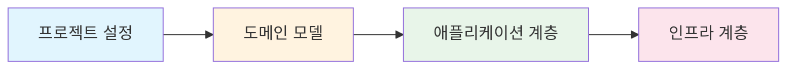

Spring Boot로 DDD 패턴을 적용한 주문 도메인을 구현합니다.

## 학습 순서

## 목차

1. [프로젝트 설정](setup/) - 프로젝트 구조와 의존성
2. [주문 도메인](order-domain/) - Aggregate, Entity, Value Object 구현
3. [애플리케이션 계층](application-layer/) - Use Case와 서비스 구현
