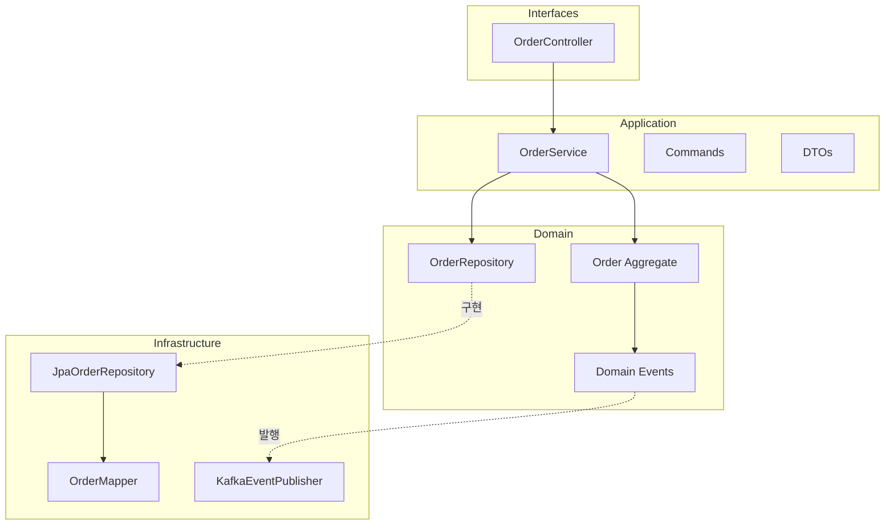

# 애플리케이션 계층 구현

Use Case를 조율하는 Application Service와 인프라 계층을 구현합니다.

## 애플리케이션 서비스

### OrderService

```java
package com.example.order.application.service;

import com.example.order.application.command.*;
import com.example.order.application.dto.OrderResponse;
import com.example.order.domain.event.DomainEvent;
import com.example.order.domain.model.*;
import com.example.order.domain.repository.OrderRepository;
import com.example.order.domain.exception.OrderNotFoundException;

import org.springframework.context.ApplicationEventPublisher;
import org.springframework.stereotype.Service;
import org.springframework.transaction.annotation.Transactional;

import java.util.List;

@Service
@Transactional(readOnly = true)
public class OrderService {

    private final OrderRepository orderRepository;
    private final ApplicationEventPublisher eventPublisher;

    public OrderService(
        OrderRepository orderRepository,
        ApplicationEventPublisher eventPublisher
    ) {
        this.orderRepository = orderRepository;
        this.eventPublisher = eventPublisher;
    }

    // === Command (쓰기) ===

    @Transactional
    public OrderId createOrder(CreateOrderCommand command) {
        // 도메인 객체 생성
        Order order = Order.create(
            command.customerId(),
            command.shippingAddress(),
            command.orderLines()
        );

        // 저장
        Order saved = orderRepository.save(order);

        // 이벤트 발행
        publishEvents(saved);

        return saved.getId();
    }

    @Transactional
    public void confirmOrder(ConfirmOrderCommand command) {
        Order order = findOrder(command.orderId());

        // 도메인 로직 실행
        order.confirm();

        // 저장 및 이벤트 발행
        orderRepository.save(order);
        publishEvents(order);
    }

    @Transactional
    public void cancelOrder(CancelOrderCommand command) {
        Order order = findOrder(command.orderId());

        order.cancel(command.reason());

        orderRepository.save(order);
        publishEvents(order);
    }

    @Transactional
    public void changeShippingAddress(ChangeShippingAddressCommand command) {
        Order order = findOrder(command.orderId());

        order.changeShippingAddress(command.newAddress());

        orderRepository.save(order);
    }

    // === Query (읽기) ===

    public OrderResponse getOrder(OrderId orderId) {
        Order order = findOrder(orderId);
        return OrderResponse.from(order);
    }

    public List<OrderResponse> getOrdersByCustomer(CustomerId customerId) {
        return orderRepository.findByCustomerId(customerId).stream()
            .map(OrderResponse::from)
            .toList();
    }

    // === Helper ===

    private Order findOrder(OrderId orderId) {
        return orderRepository.findById(orderId)
            .orElseThrow(() -> new OrderNotFoundException(orderId));
    }

    private void publishEvents(Order order) {
        for (DomainEvent event : order.getDomainEvents()) {
            eventPublisher.publishEvent(event);
        }
        order.clearDomainEvents();
    }
}
```

## Command 객체

### CreateOrderCommand

```java
package com.example.order.application.command;

import com.example.order.domain.model.*;

import java.util.List;

public record CreateOrderCommand(
    CustomerId customerId,
    ShippingAddress shippingAddress,
    List<OrderLineRequest> orderLines
) {
    public CreateOrderCommand {
        if (orderLines == null || orderLines.isEmpty()) {
            throw new IllegalArgumentException("주문 항목은 필수입니다");
        }
    }
}
```

### ConfirmOrderCommand

```java
package com.example.order.application.command;

import com.example.order.domain.model.OrderId;

public record ConfirmOrderCommand(OrderId orderId) {
    public ConfirmOrderCommand {
        if (orderId == null) {
            throw new IllegalArgumentException("주문 ID는 필수입니다");
        }
    }
}
```

### CancelOrderCommand

```java
package com.example.order.application.command;

import com.example.order.domain.model.OrderId;

public record CancelOrderCommand(
    OrderId orderId,
    String reason
) {
    public CancelOrderCommand {
        if (orderId == null) {
            throw new IllegalArgumentException("주문 ID는 필수입니다");
        }
        if (reason == null || reason.isBlank()) {
            throw new IllegalArgumentException("취소 사유는 필수입니다");
        }
    }
}
```

## DTO

### OrderResponse

```java
package com.example.order.application.dto;

import com.example.order.domain.model.*;

import java.math.BigDecimal;
import java.time.LocalDateTime;
import java.util.List;

public record OrderResponse(
    String orderId,
    String customerId,
    String status,
    String statusDescription,
    BigDecimal totalAmount,
    String currency,
    List<OrderLineResponse> orderLines,
    ShippingAddressResponse shippingAddress,
    LocalDateTime createdAt,
    LocalDateTime confirmedAt,
    LocalDateTime cancelledAt,
    String cancellationReason
) {

    public static OrderResponse from(Order order) {
        return new OrderResponse(
            order.getId().value(),
            order.getCustomerId().value(),
            order.getStatus().name(),
            order.getStatus().getDescription(),
            order.getTotalAmount().amount(),
            order.getTotalAmount().currency().getCurrencyCode(),
            order.getOrderLines().stream()
                .map(OrderLineResponse::from)
                .toList(),
            ShippingAddressResponse.from(order.getShippingAddress()),
            order.getCreatedAt(),
            order.getConfirmedAt(),
            order.getCancelledAt(),
            order.getCancellationReason()
        );
    }

    public record OrderLineResponse(
        String productId,
        String productName,
        BigDecimal price,
        int quantity,
        BigDecimal amount
    ) {
        public static OrderLineResponse from(OrderLine line) {
            return new OrderLineResponse(
                line.getProductId().value(),
                line.getProductName(),
                line.getPrice().amount(),
                line.getQuantity(),
                line.getAmount().amount()
            );
        }
    }

    public record ShippingAddressResponse(
        String zipCode,
        String city,
        String street,
        String detail,
        String fullAddress,
        String receiverName,
        String receiverPhone
    ) {
        public static ShippingAddressResponse from(ShippingAddress address) {
            return new ShippingAddressResponse(
                address.zipCode(),
                address.city(),
                address.street(),
                address.detail(),
                address.fullAddress(),
                address.receiverName(),
                address.receiverPhone()
            );
        }
    }
}
```

## REST Controller

```java
package com.example.order.interfaces.rest;

import com.example.order.application.command.*;
import com.example.order.application.dto.OrderResponse;
import com.example.order.application.service.OrderService;
import com.example.order.domain.model.*;

import org.springframework.http.ResponseEntity;
import org.springframework.web.bind.annotation.*;

import java.net.URI;
import java.util.List;

@RestController
@RequestMapping("/api/orders")
public class OrderController {

    private final OrderService orderService;

    public OrderController(OrderService orderService) {
        this.orderService = orderService;
    }

    @PostMapping
    public ResponseEntity<CreateOrderResponse> createOrder(
        @RequestBody CreateOrderRequest request
    ) {
        CreateOrderCommand command = request.toCommand();
        OrderId orderId = orderService.createOrder(command);

        return ResponseEntity
            .created(URI.create("/api/orders/" + orderId.value()))
            .body(new CreateOrderResponse(orderId.value(), "주문이 생성되었습니다"));
    }

    @GetMapping("/{orderId}")
    public ResponseEntity<OrderResponse> getOrder(@PathVariable String orderId) {
        OrderResponse response = orderService.getOrder(OrderId.of(orderId));
        return ResponseEntity.ok(response);
    }

    @GetMapping
    public ResponseEntity<List<OrderResponse>> getOrdersByCustomer(
        @RequestParam String customerId
    ) {
        List<OrderResponse> orders = orderService.getOrdersByCustomer(
            CustomerId.of(customerId)
        );
        return ResponseEntity.ok(orders);
    }

    @PostMapping("/{orderId}/confirm")
    public ResponseEntity<Void> confirmOrder(@PathVariable String orderId) {
        orderService.confirmOrder(new ConfirmOrderCommand(OrderId.of(orderId)));
        return ResponseEntity.ok().build();
    }

    @PostMapping("/{orderId}/cancel")
    public ResponseEntity<Void> cancelOrder(
        @PathVariable String orderId,
        @RequestBody CancelOrderRequest request
    ) {
        orderService.cancelOrder(new CancelOrderCommand(
            OrderId.of(orderId),
            request.reason()
        ));
        return ResponseEntity.ok().build();
    }
}

// Request DTOs
record CreateOrderRequest(
    String customerId,
    ShippingAddressRequest shippingAddress,
    List<OrderLineRequestDto> orderLines
) {
    public CreateOrderCommand toCommand() {
        return new CreateOrderCommand(
            CustomerId.of(customerId),
            new ShippingAddress(
                shippingAddress.zipCode(),
                shippingAddress.city(),
                shippingAddress.street(),
                shippingAddress.detail(),
                shippingAddress.receiverName(),
                shippingAddress.receiverPhone()
            ),
            orderLines.stream()
                .map(line -> new OrderLineRequest(
                    ProductId.of(line.productId()),
                    line.productName(),
                    Money.won(line.price()),
                    line.quantity()
                ))
                .toList()
        );
    }
}

record ShippingAddressRequest(
    String zipCode,
    String city,
    String street,
    String detail,
    String receiverName,
    String receiverPhone
) {}

record OrderLineRequestDto(
    String productId,
    String productName,
    long price,
    int quantity
) {}

record CreateOrderResponse(String orderId, String message) {}
record CancelOrderRequest(String reason) {}
```

## 인프라 계층: JPA Repository

### OrderEntity

```java
package com.example.order.infrastructure.persistence.entity;

import jakarta.persistence.*;
import java.math.BigDecimal;
import java.time.LocalDateTime;
import java.util.ArrayList;
import java.util.List;

@Entity
@Table(name = "orders")
public class OrderEntity {

    @Id
    private String id;

    @Column(nullable = false)
    private String customerId;

    @Enumerated(EnumType.STRING)
    @Column(nullable = false)
    private OrderStatusJpa status;

    @Column(nullable = false)
    private BigDecimal totalAmount;

    @Column(nullable = false)
    private String currency;

    // Embedded Address
    @Embedded
    private ShippingAddressEmbeddable shippingAddress;

    @OneToMany(mappedBy = "order", cascade = CascadeType.ALL, orphanRemoval = true)
    private List<OrderLineEntity> orderLines = new ArrayList<>();

    @Column(nullable = false)
    private LocalDateTime createdAt;

    private LocalDateTime confirmedAt;
    private LocalDateTime cancelledAt;
    private String cancellationReason;

    @Version
    private Long version;

    // Getters, Setters...
}

@Embeddable
class ShippingAddressEmbeddable {
    private String zipCode;
    private String city;
    private String street;
    private String detail;
    private String receiverName;
    private String receiverPhone;

    // Getters, Setters...
}

enum OrderStatusJpa {
    PENDING, CONFIRMED, SHIPPED, DELIVERED, CANCELLED
}
```

### OrderLineEntity

```java
package com.example.order.infrastructure.persistence.entity;

import jakarta.persistence.*;
import java.math.BigDecimal;

@Entity
@Table(name = "order_lines")
public class OrderLineEntity {

    @Id
    private String id;

    @ManyToOne(fetch = FetchType.LAZY)
    @JoinColumn(name = "order_id", nullable = false)
    private OrderEntity order;

    @Column(nullable = false)
    private String productId;

    @Column(nullable = false)
    private String productName;

    @Column(nullable = false)
    private BigDecimal price;

    @Column(nullable = false)
    private int quantity;

    // Getters, Setters...
}
```

### JpaOrderRepository

```java
package com.example.order.infrastructure.persistence.repository;

import com.example.order.domain.model.*;
import com.example.order.domain.repository.OrderRepository;
import com.example.order.infrastructure.persistence.entity.*;
import com.example.order.infrastructure.persistence.mapper.OrderMapper;

import org.springframework.stereotype.Repository;

import java.util.List;
import java.util.Optional;

@Repository
public class JpaOrderRepository implements OrderRepository {

    private final OrderJpaRepository jpaRepository;
    private final OrderMapper mapper;

    public JpaOrderRepository(OrderJpaRepository jpaRepository, OrderMapper mapper) {
        this.jpaRepository = jpaRepository;
        this.mapper = mapper;
    }

    @Override
    public Order save(Order order) {
        OrderEntity entity = mapper.toEntity(order);
        OrderEntity saved = jpaRepository.save(entity);
        return mapper.toDomain(saved);
    }

    @Override
    public Optional<Order> findById(OrderId id) {
        return jpaRepository.findById(id.value())
            .map(mapper::toDomain);
    }

    @Override
    public List<Order> findByCustomerId(CustomerId customerId) {
        return jpaRepository.findByCustomerId(customerId.value()).stream()
            .map(mapper::toDomain)
            .toList();
    }

    @Override
    public List<Order> findByStatus(OrderStatus status) {
        OrderStatusJpa statusJpa = OrderStatusJpa.valueOf(status.name());
        return jpaRepository.findByStatus(statusJpa).stream()
            .map(mapper::toDomain)
            .toList();
    }

    @Override
    public boolean existsById(OrderId id) {
        return jpaRepository.existsById(id.value());
    }
}

// Spring Data JPA Repository
interface OrderJpaRepository extends JpaRepository<OrderEntity, String> {
    List<OrderEntity> findByCustomerId(String customerId);
    List<OrderEntity> findByStatus(OrderStatusJpa status);
}
```

### OrderMapper

```java
package com.example.order.infrastructure.persistence.mapper;

import com.example.order.domain.model.*;
import com.example.order.infrastructure.persistence.entity.*;

import org.springframework.stereotype.Component;

import java.util.Currency;
import java.util.stream.Collectors;

@Component
public class OrderMapper {

    public OrderEntity toEntity(Order order) {
        OrderEntity entity = new OrderEntity();
        entity.setId(order.getId().value());
        entity.setCustomerId(order.getCustomerId().value());
        entity.setStatus(OrderStatusJpa.valueOf(order.getStatus().name()));
        entity.setTotalAmount(order.getTotalAmount().amount());
        entity.setCurrency(order.getTotalAmount().currency().getCurrencyCode());
        entity.setShippingAddress(toEmbeddable(order.getShippingAddress()));
        entity.setCreatedAt(order.getCreatedAt());
        entity.setConfirmedAt(order.getConfirmedAt());
        entity.setCancelledAt(order.getCancelledAt());
        entity.setCancellationReason(order.getCancellationReason());

        // Order Lines
        entity.getOrderLines().clear();
        for (OrderLine line : order.getOrderLines()) {
            OrderLineEntity lineEntity = toLineEntity(line, entity);
            entity.getOrderLines().add(lineEntity);
        }

        return entity;
    }

    public Order toDomain(OrderEntity entity) {
        return Order.reconstitute(
            OrderId.of(entity.getId()),
            CustomerId.of(entity.getCustomerId()),
            entity.getOrderLines().stream()
                .map(this::toLineDomain)
                .collect(Collectors.toList()),
            toDomain(entity.getShippingAddress()),
            OrderStatus.valueOf(entity.getStatus().name()),
            new Money(entity.getTotalAmount(), Currency.getInstance(entity.getCurrency())),
            entity.getCreatedAt(),
            entity.getConfirmedAt(),
            entity.getCancelledAt(),
            entity.getCancellationReason()
        );
    }

    private ShippingAddressEmbeddable toEmbeddable(ShippingAddress address) {
        ShippingAddressEmbeddable embeddable = new ShippingAddressEmbeddable();
        embeddable.setZipCode(address.zipCode());
        embeddable.setCity(address.city());
        embeddable.setStreet(address.street());
        embeddable.setDetail(address.detail());
        embeddable.setReceiverName(address.receiverName());
        embeddable.setReceiverPhone(address.receiverPhone());
        return embeddable;
    }

    private ShippingAddress toDomain(ShippingAddressEmbeddable embeddable) {
        return new ShippingAddress(
            embeddable.getZipCode(),
            embeddable.getCity(),
            embeddable.getStreet(),
            embeddable.getDetail(),
            embeddable.getReceiverName(),
            embeddable.getReceiverPhone()
        );
    }

    private OrderLineEntity toLineEntity(OrderLine line, OrderEntity order) {
        OrderLineEntity entity = new OrderLineEntity();
        entity.setId(line.getId().value());
        entity.setOrder(order);
        entity.setProductId(line.getProductId().value());
        entity.setProductName(line.getProductName());
        entity.setPrice(line.getPrice().amount());
        entity.setQuantity(line.getQuantity());
        return entity;
    }

    private OrderLine toLineDomain(OrderLineEntity entity) {
        // OrderLine의 패키지 프라이빗 생성자를 위한 리플렉션 또는
        // 별도의 reconstitute 메서드 필요
        return OrderLine.reconstitute(
            OrderLineId.of(entity.getId()),
            ProductId.of(entity.getProductId()),
            entity.getProductName(),
            Money.won(entity.getPrice()),
            entity.getQuantity()
        );
    }
}
```

## 이벤트 핸들러

### 도메인 이벤트 처리

```java
package com.example.order.infrastructure.event;

import com.example.order.domain.event.*;

import org.springframework.context.event.EventListener;
import org.springframework.scheduling.annotation.Async;
import org.springframework.stereotype.Component;
import org.springframework.transaction.event.TransactionPhase;
import org.springframework.transaction.event.TransactionalEventListener;

import lombok.extern.slf4j.Slf4j;

@Slf4j
@Component
public class OrderEventHandler {

    // 트랜잭션 커밋 후 로깅
    @TransactionalEventListener(phase = TransactionPhase.AFTER_COMMIT)
    public void handleOrderCreated(OrderCreatedEvent event) {
        log.info("주문 생성됨: {}", event.getAggregateId());
    }

    @TransactionalEventListener(phase = TransactionPhase.AFTER_COMMIT)
    public void handleOrderConfirmed(OrderConfirmedEvent event) {
        log.info("주문 확정됨: {}", event.getAggregateId());
    }

    @TransactionalEventListener(phase = TransactionPhase.AFTER_COMMIT)
    public void handleOrderCancelled(OrderCancelledEvent event) {
        log.info("주문 취소됨: {}, 사유: {}",
            event.getAggregateId(), event.getReason());
    }
}
```

### Kafka 이벤트 발행

```java
package com.example.order.infrastructure.event;

import com.example.order.domain.event.*;

import org.springframework.kafka.core.KafkaTemplate;
import org.springframework.stereotype.Component;
import org.springframework.transaction.event.TransactionPhase;
import org.springframework.transaction.event.TransactionalEventListener;

@Component
public class KafkaEventPublisher {

    private static final String TOPIC = "order-events";

    private final KafkaTemplate<String, Object> kafkaTemplate;

    public KafkaEventPublisher(KafkaTemplate<String, Object> kafkaTemplate) {
        this.kafkaTemplate = kafkaTemplate;
    }

    @TransactionalEventListener(phase = TransactionPhase.AFTER_COMMIT)
    public void publishOrderCreated(OrderCreatedEvent event) {
        kafkaTemplate.send(TOPIC, event.getAggregateId(), toKafkaEvent(event));
    }

    @TransactionalEventListener(phase = TransactionPhase.AFTER_COMMIT)
    public void publishOrderConfirmed(OrderConfirmedEvent event) {
        kafkaTemplate.send(TOPIC, event.getAggregateId(), toKafkaEvent(event));
    }

    private OrderEventPayload toKafkaEvent(DomainEvent event) {
        return new OrderEventPayload(
            event.getEventId(),
            event.getClass().getSimpleName(),
            event.getAggregateId(),
            event.getOccurredAt().toString()
        );
    }
}

record OrderEventPayload(
    String eventId,
    String eventType,
    String orderId,
    String occurredAt
) {}
```

## API 테스트

```bash
# 1. 주문 생성
curl -X POST http://localhost:8080/api/orders \
  -H "Content-Type: application/json" \
  -d '{
    "customerId": "CUST-001",
    "shippingAddress": {
      "zipCode": "12345",
      "city": "서울시",
      "street": "강남대로 123",
      "detail": "101호",
      "receiverName": "홍길동",
      "receiverPhone": "010-1234-5678"
    },
    "orderLines": [
      {
        "productId": "PROD-001",
        "productName": "맥북 프로",
        "price": 2500000,
        "quantity": 1
      }
    ]
  }'

# Response
# {"orderId":"ORD-A1B2C3D4","message":"주문이 생성되었습니다"}

# 2. 주문 조회
curl http://localhost:8080/api/orders/ORD-A1B2C3D4

# 3. 주문 확정
curl -X POST http://localhost:8080/api/orders/ORD-A1B2C3D4/confirm

# 4. 주문 취소
curl -X POST http://localhost:8080/api/orders/ORD-A1B2C3D4/cancel \
  -H "Content-Type: application/json" \
  -d '{"reason": "단순 변심"}'
```

## 정리



| 계층 | 역할 | 주요 클래스 |
|------|------|------------|
| **Interfaces** | HTTP API 제공 | OrderController |
| **Application** | 유스케이스 조율 | OrderService, Commands |
| **Domain** | 비즈니스 로직 | Order, OrderLine, Money |
| **Infrastructure** | 기술 구현 | JpaOrderRepository, Mapper |

## 다음 단계

- [부록](../../appendix/) - 용어 사전, 참고 자료
