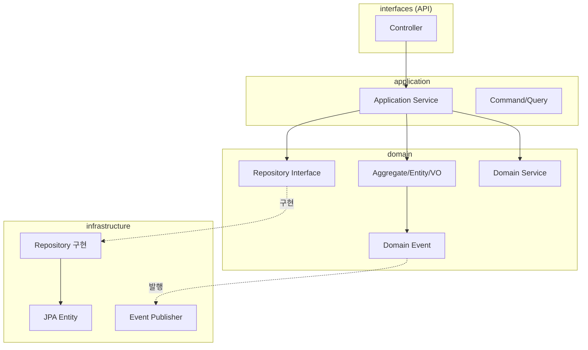
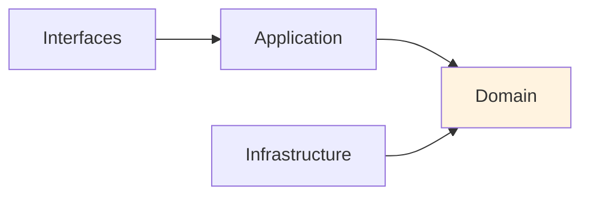

# 프로젝트 설정

DDD 예제 프로젝트의 구조와 의존성을 설정합니다.

## 프로젝트 구조

```
order-service/
├── src/main/java/com/example/order/
│   ├── domain/                    # 도메인 계층
│   │   ├── model/                 # Aggregate, Entity, VO
│   │   │   ├── Order.java
│   │   │   ├── OrderLine.java
│   │   │   ├── OrderId.java
│   │   │   └── Money.java
│   │   ├── event/                 # 도메인 이벤트
│   │   │   ├── OrderCreatedEvent.java
│   │   │   └── OrderConfirmedEvent.java
│   │   ├── repository/            # Repository 인터페이스
│   │   │   └── OrderRepository.java
│   │   └── service/               # 도메인 서비스
│   │       └── OrderValidator.java
│   │
│   ├── application/               # 응용 계층
│   │   ├── service/               # Application Service
│   │   │   └── OrderService.java
│   │   ├── command/               # Command 객체
│   │   │   └── CreateOrderCommand.java
│   │   └── dto/                   # DTO
│   │       └── OrderResponse.java
│   │
│   ├── infrastructure/            # 인프라 계층
│   │   ├── persistence/           # JPA 구현
│   │   │   ├── entity/
│   │   │   ├── repository/
│   │   │   └── mapper/
│   │   └── event/                 # 이벤트 발행
│   │       └── KafkaEventPublisher.java
│   │
│   └── interfaces/                # 인터페이스 계층 (API)
│       └── rest/
│           └── OrderController.java
│
├── build.gradle.kts
└── docker-compose.yml
```

## 의존성 설정

### build.gradle.kts

```kotlin
plugins {
    java
    id("org.springframework.boot") version "3.2.1"
    id("io.spring.dependency-management") version "1.1.4"
}

group = "com.example"
version = "0.0.1-SNAPSHOT"

java {
    sourceCompatibility = JavaVersion.VERSION_21
}

repositories {
    mavenCentral()
}

dependencies {
    // Spring Boot
    implementation("org.springframework.boot:spring-boot-starter-web")
    implementation("org.springframework.boot:spring-boot-starter-data-jpa")
    implementation("org.springframework.boot:spring-boot-starter-validation")

    // Kafka (이벤트 발행용)
    implementation("org.springframework.kafka:spring-kafka")

    // Database
    runtimeOnly("com.h2database:h2")
    runtimeOnly("org.postgresql:postgresql")

    // Lombok (선택)
    compileOnly("org.projectlombok:lombok")
    annotationProcessor("org.projectlombok:lombok")

    // Test
    testImplementation("org.springframework.boot:spring-boot-starter-test")
    testImplementation("org.springframework.kafka:spring-kafka-test")
}

tasks.withType<Test> {
    useJUnitPlatform()
}
```

## 계층별 역할



### 의존성 규칙



| 규칙 | 설명 |
|------|------|
| **Domain은 독립적** | 다른 계층에 의존하지 않음 |
| **안쪽으로만 의존** | Interfaces → Application → Domain |
| **Infrastructure는 Domain 구현** | Repository Interface의 구현체 제공 |

## application.yml

```yaml
spring:
  application:
    name: order-service

  datasource:
    url: jdbc:h2:mem:orderdb
    driver-class-name: org.h2.Driver
    username: sa
    password:

  jpa:
    hibernate:
      ddl-auto: create-drop
    show-sql: true
    properties:
      hibernate:
        format_sql: true

  h2:
    console:
      enabled: true
      path: /h2-console

  kafka:
    bootstrap-servers: localhost:9092
    producer:
      key-serializer: org.apache.kafka.common.serialization.StringSerializer
      value-serializer: org.springframework.kafka.support.serializer.JsonSerializer
```

## 핵심 기반 클래스

### AggregateRoot

```java
package com.example.order.domain.model;

import java.util.ArrayList;
import java.util.Collections;
import java.util.List;

public abstract class AggregateRoot<ID> {

    private final List<DomainEvent> domainEvents = new ArrayList<>();

    public abstract ID getId();

    protected void registerEvent(DomainEvent event) {
        domainEvents.add(event);
    }

    public List<DomainEvent> getDomainEvents() {
        return Collections.unmodifiableList(domainEvents);
    }

    public void clearDomainEvents() {
        domainEvents.clear();
    }
}
```

### DomainEvent

```java
package com.example.order.domain.event;

import java.time.Instant;
import java.util.UUID;

public abstract class DomainEvent {

    private final String eventId;
    private final Instant occurredAt;

    protected DomainEvent() {
        this.eventId = UUID.randomUUID().toString();
        this.occurredAt = Instant.now();
    }

    public String getEventId() {
        return eventId;
    }

    public Instant getOccurredAt() {
        return occurredAt;
    }

    public abstract String getAggregateId();
}
```

### Entity 기반 클래스

```java
package com.example.order.domain.model;

import java.util.Objects;

public abstract class Entity<ID> {

    public abstract ID getId();

    @Override
    public boolean equals(Object o) {
        if (this == o) return true;
        if (o == null || getClass() != o.getClass()) return false;
        Entity<?> entity = (Entity<?>) o;
        return Objects.equals(getId(), entity.getId());
    }

    @Override
    public int hashCode() {
        return Objects.hash(getId());
    }
}
```

## Docker Compose (개발환경)

```yaml
version: '3.8'

services:
  postgres:
    image: postgres:15
    container_name: order-postgres
    environment:
      POSTGRES_DB: orderdb
      POSTGRES_USER: order
      POSTGRES_PASSWORD: order123
    ports:
      - "5432:5432"
    volumes:
      - postgres-data:/var/lib/postgresql/data

  kafka:
    image: apache/kafka:3.6.1
    container_name: kafka
    ports:
      - "9092:9092"
    environment:
      KAFKA_NODE_ID: 1
      KAFKA_PROCESS_ROLES: broker,controller
      KAFKA_LISTENERS: PLAINTEXT://0.0.0.0:9092,CONTROLLER://0.0.0.0:9093
      KAFKA_ADVERTISED_LISTENERS: PLAINTEXT://localhost:9092
      KAFKA_CONTROLLER_LISTENER_NAMES: CONTROLLER
      KAFKA_LISTENER_SECURITY_PROTOCOL_MAP: CONTROLLER:PLAINTEXT,PLAINTEXT:PLAINTEXT
      KAFKA_CONTROLLER_QUORUM_VOTERS: 1@kafka:9093
      KAFKA_OFFSETS_TOPIC_REPLICATION_FACTOR: 1
      CLUSTER_ID: MkU3OEVBNTcwNTJENDM2Qk

volumes:
  postgres-data:
```

## 패키지 구조 원칙

### 1. 도메인 중심 패키지

```
// ❌ 기술 중심
com.example.order
├── controller
├── service
├── repository
└── entity

// ✅ 도메인 중심
com.example.order
├── domain           # 핵심 비즈니스 로직
├── application      # 유스케이스
├── infrastructure   # 기술 구현
└── interfaces       # 외부 인터페이스
```

### 2. 하위 도메인별 분리

```
com.example
├── order/           # 주문 도메인
│   ├── domain
│   ├── application
│   └── ...
├── inventory/       # 재고 도메인
│   ├── domain
│   └── ...
└── shipping/        # 배송 도메인
    ├── domain
    └── ...
```

## 다음 단계

- [주문 도메인](../order-domain/) - Aggregate, Entity, Value Object 구현
