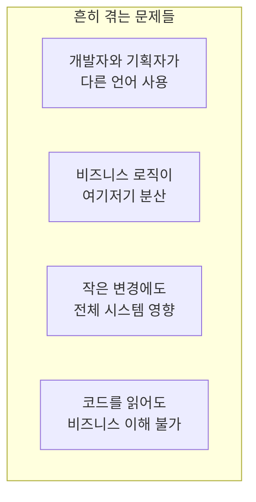
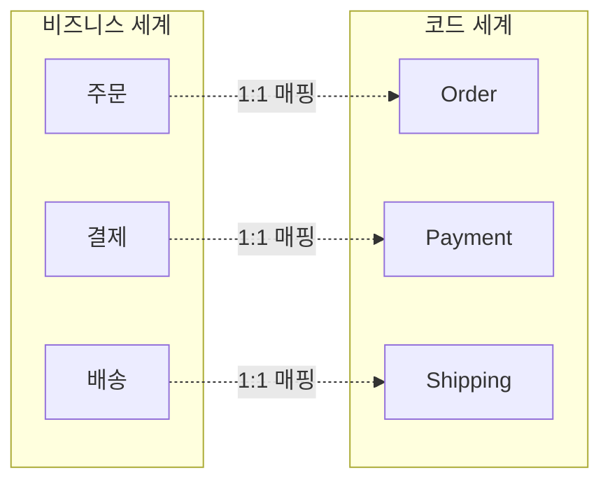
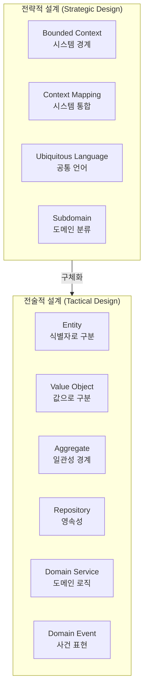
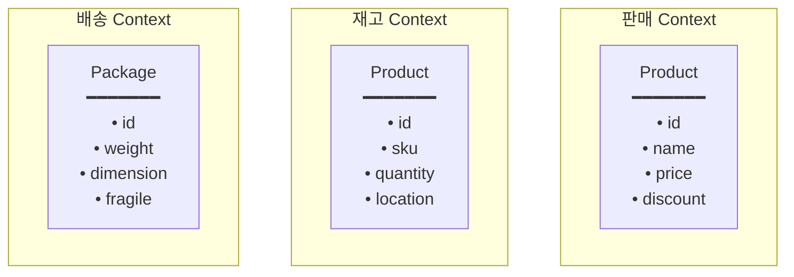
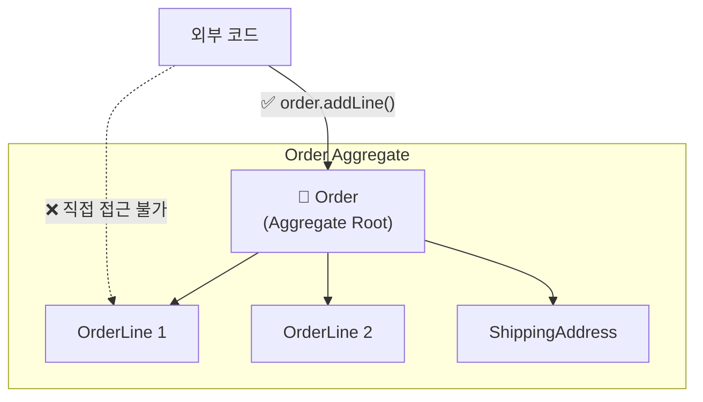
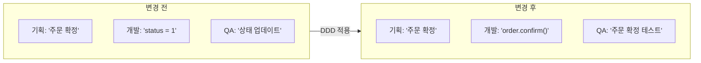
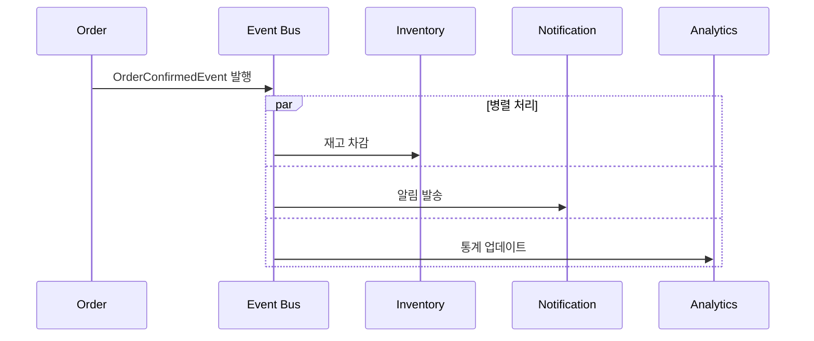
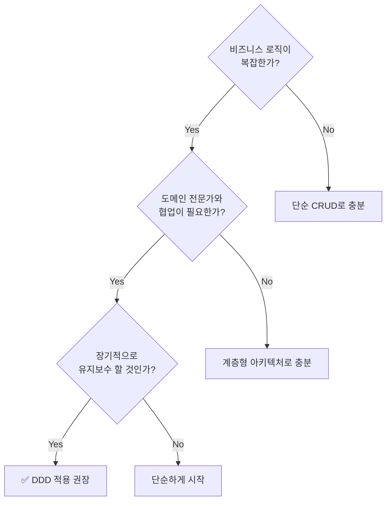
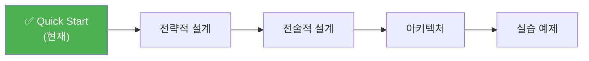

# 5분 만에 이해하는 DDD

DDD의 핵심 개념을 빠르게 살펴봅니다.

## DDD가 해결하는 문제

### 실제 프로젝트에서 겪는 문제들



**실제 대화 예시:**

```
기획자: "고객이 주문을 취소하면 포인트 환불해주세요"
개발자: "아, 그러면 order 테이블의 status를 9로 바꾸고,
        point 테이블에서 해당 user_id로 INSERT 하면 되죠?"
기획자: "...네? status 9가 뭐예요?"
```

→ **DDD는 이 간극을 메웁니다**

## 핵심 아이디어

DDD는 한 문장으로 요약됩니다:

> **"비즈니스 도메인을 코드에 그대로 반영하라"**



## Before vs After: 실제 코드 비교

### 시나리오: 주문 확정

**비즈니스 규칙:**
- 대기 중인 주문만 확정할 수 있다
- 확정 시 재고를 차감한다
- 확정 시 고객에게 알림을 보낸다

### ❌ 기존 방식: 데이터 중심 (Transaction Script)

```java
@Service
public class OrderService {

    public void confirmOrder(Long orderId) {
        // 1. 데이터 조회
        OrderEntity order = orderRepository.findById(orderId)
            .orElseThrow(() -> new RuntimeException("주문 없음"));

        // 2. 상태 검증 (매직 넘버)
        if (order.getStatus() != 0) {  // 0이 뭐지? PENDING?
            throw new RuntimeException("확정 불가");
        }

        // 3. 상태 변경
        order.setStatus(1);  // 1이 뭐지? CONFIRMED?
        order.setConfirmedAt(LocalDateTime.now());

        // 4. 재고 차감 (여기서 해야 하나?)
        for (OrderItemEntity item : order.getItems()) {
            ProductEntity product = productRepository.findById(item.getProductId())
                .orElseThrow();
            int newStock = product.getStock() - item.getQuantity();
            if (newStock < 0) {
                throw new RuntimeException("재고 부족");
            }
            product.setStock(newStock);
            productRepository.save(product);
        }

        // 5. 알림 (여기서 해야 하나?)
        notificationService.send(order.getUserId(), "주문 확정됨");

        orderRepository.save(order);
    }
}
```

**문제점:**

| 문제 | 설명 |
|------|------|
| **매직 넘버** | `status = 0, 1`이 무슨 의미인지 모름 |
| **빈약한 모델** | Entity는 getter/setter만 있는 데이터 컨테이너 |
| **로직 분산** | 검증, 재고, 알림이 한 메서드에 혼재 |
| **테스트 어려움** | DB, 외부 서비스 의존으로 단위 테스트 불가 |
| **변경 위험** | 다른 곳에서도 status를 직접 변경할 수 있음 |

### ✅ DDD 방식: 도메인 중심

```java
// 도메인 모델 - 비즈니스 로직이 객체 안에
public class Order extends AggregateRoot<OrderId> {
    private OrderId id;
    private CustomerId customerId;
    private OrderStatus status;
    private List<OrderLine> orderLines;

    // 비즈니스 행위가 메서드로 표현됨
    public void confirm() {
        // 불변식 검증
        if (this.status != OrderStatus.PENDING) {
            throw new OrderCannotBeConfirmedException(
                "대기 중인 주문만 확정할 수 있습니다. 현재 상태: " + this.status
            );
        }

        // 상태 변경
        this.status = OrderStatus.CONFIRMED;
        this.confirmedAt = LocalDateTime.now();

        // 도메인 이벤트 발행 (재고, 알림은 이벤트 구독자가 처리)
        registerEvent(new OrderConfirmedEvent(this));
    }

    public Money calculateTotal() {
        return orderLines.stream()
            .map(OrderLine::getAmount)
            .reduce(Money.ZERO, Money::add);
    }
}

// 애플리케이션 서비스 - 흐름만 조율
@Service
@Transactional
public class OrderApplicationService {

    public void confirmOrder(OrderId orderId) {
        Order order = orderRepository.findById(orderId)
            .orElseThrow(() -> new OrderNotFoundException(orderId));

        order.confirm();  // 도메인 객체에 위임

        orderRepository.save(order);
        // 이벤트는 인프라에서 자동 발행
    }
}

// 이벤트 핸들러들 - 관심사 분리
@Component
public class InventoryEventHandler {
    @EventListener
    public void on(OrderConfirmedEvent event) {
        inventoryService.reserveStock(event.getOrderLines());
    }
}

@Component
public class NotificationEventHandler {
    @EventListener
    public void on(OrderConfirmedEvent event) {
        notificationService.sendOrderConfirmation(event.getCustomerId());
    }
}
```

**개선점:**

| 개선 | 설명 |
|------|------|
| **명확한 의도** | `order.confirm()`으로 비즈니스 의도 표현 |
| **풍부한 모델** | Order가 자신의 불변식을 스스로 보호 |
| **관심사 분리** | 재고, 알림은 이벤트 핸들러로 분리 |
| **테스트 용이** | Order 단위 테스트 가능 |
| **변경 안전** | status는 confirm() 메서드로만 변경 가능 |

## DDD의 두 가지 설계 수준



| 구분 | 초점 | 질문 | 주요 산출물 |
|------|------|------|-----------|
| **전략적 설계** | 큰 그림, 경계 | "시스템을 어떻게 나눌까?" | Context Map, 용어 사전 |
| **전술적 설계** | 세부 구현, 패턴 | "도메인을 어떻게 모델링할까?" | 도메인 모델, 코드 |

## 핵심 용어 한눈에 보기

### 1. Bounded Context (경계된 컨텍스트)

같은 용어도 맥락에 따라 다른 의미를 가집니다.



**같은 "상품"이 각 Context에서:**
- **판매:** "얼마에 팔 것인가" (가격, 할인)
- **재고:** "몇 개 있는가" (수량, 위치)
- **배송:** "어떻게 보낼 것인가" (무게, 크기)

→ 각 Context는 자신만의 모델을 가짐

### 2. Aggregate (집합체)

트랜잭션 일관성을 유지하는 객체들의 묶음입니다.



**규칙:**
- 외부에서는 반드시 **Aggregate Root**(Order)를 통해서만 접근
- **하나의 트랜잭션 = 하나의 Aggregate** 수정
- Aggregate 내부의 일관성은 Root가 책임

### 3. Ubiquitous Language (유비쿼터스 언어)

개발자와 비즈니스 전문가가 **동일한 용어**를 사용합니다.



| 비즈니스 용어 | 코드 | 테스트 |
|--------------|------|--------|
| 주문을 **생성**한다 | `Order.create()` | `주문_생성_테스트()` |
| 주문을 **확정**한다 | `order.confirm()` | `주문_확정_테스트()` |
| 주문을 **취소**한다 | `order.cancel()` | `주문_취소_테스트()` |
| **배송지**를 변경한다 | `order.changeShippingAddress()` | `배송지_변경_테스트()` |

### 4. Domain Event (도메인 이벤트)

도메인에서 발생한 중요한 사건을 표현합니다.



**이벤트의 특징:**
- **과거형 명명:** `OrderConfirmed` (확정되었다)
- **불변:** 발행 후 변경 불가
- **자기 완결적:** 처리에 필요한 정보 포함

## 언제 DDD를 적용해야 할까?



### DDD가 적합한 경우

| 상황 | 예시 |
|------|------|
| **복잡한 비즈니스 규칙** | 금융, 보험, 물류, 의료 |
| **빈번한 요구사항 변경** | 스타트업, 신규 사업 |
| **도메인 전문가 존재** | 협업 가능한 현업 담당자 |
| **장기 운영 시스템** | 5년 이상 유지보수 예상 |

### DDD가 과한 경우

| 상황 | 대안 |
|------|------|
| **단순 CRUD** | Spring Data REST |
| **프로토타입** | 빠른 구현 우선 |
| **소규모 팀** | 단순 계층형 아키텍처 |
| **짧은 수명 프로젝트** | 실용적 접근 |

## DDD 도입 효과

### 실제 사례 비교

```
📊 도입 전 (A 프로젝트)
- 신규 기능 개발: 평균 2주
- 버그 수정: 평균 3일 (사이드 이펙트 파악 어려움)
- 신규 개발자 온보딩: 1개월
- 비즈니스 변경 대응: "코드 다 뜯어고쳐야 해요"

📊 도입 후 (B 프로젝트)
- 신규 기능 개발: 평균 1주
- 버그 수정: 평균 1일 (영향 범위 명확)
- 신규 개발자 온보딩: 2주 (코드가 문서 역할)
- 비즈니스 변경 대응: "이 Aggregate만 수정하면 돼요"
```

## 다음 단계

핵심 개념을 이해했다면, 이제 깊이 있게 살펴봅시다:



- [전략적 설계](../concepts/strategic-design/) - Bounded Context, Context Mapping, Subdomain
- [전술적 설계](../concepts/tactical-design/) - Entity, Value Object, Aggregate
- [아키텍처](../concepts/architecture/) - Hexagonal, Clean Architecture
