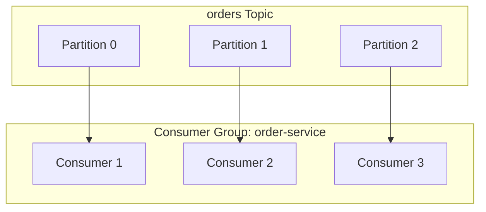
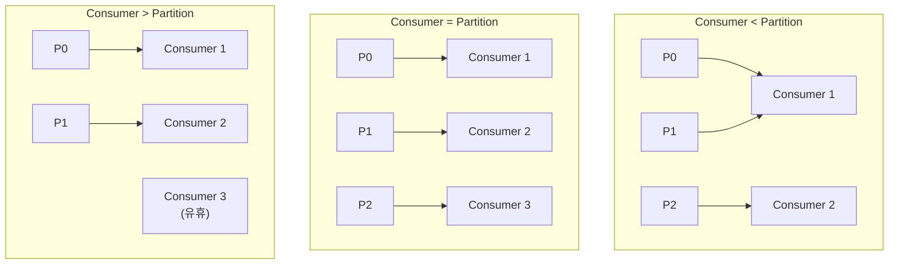
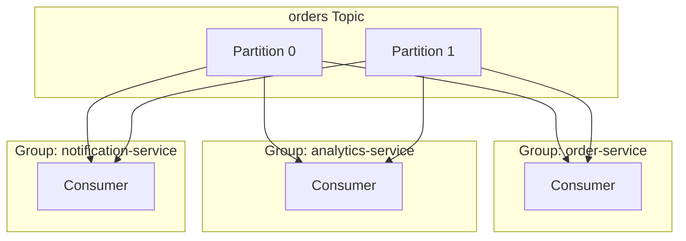
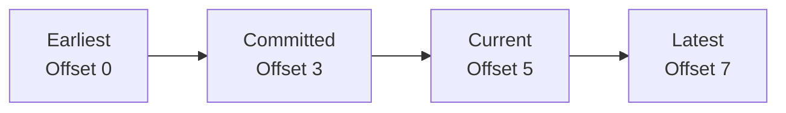
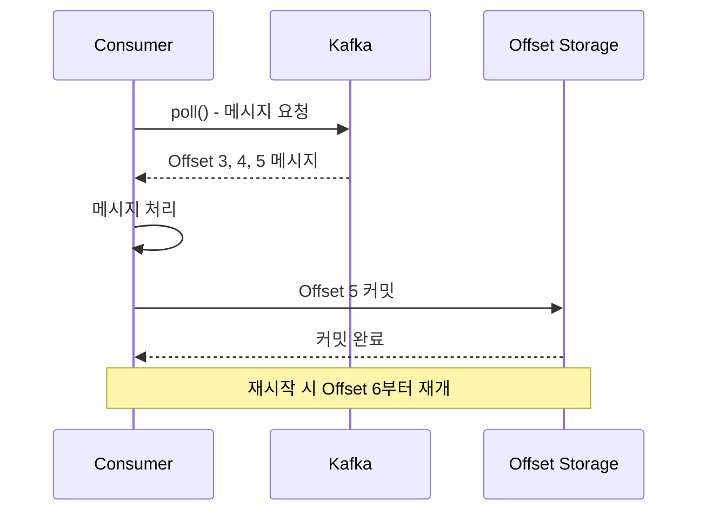
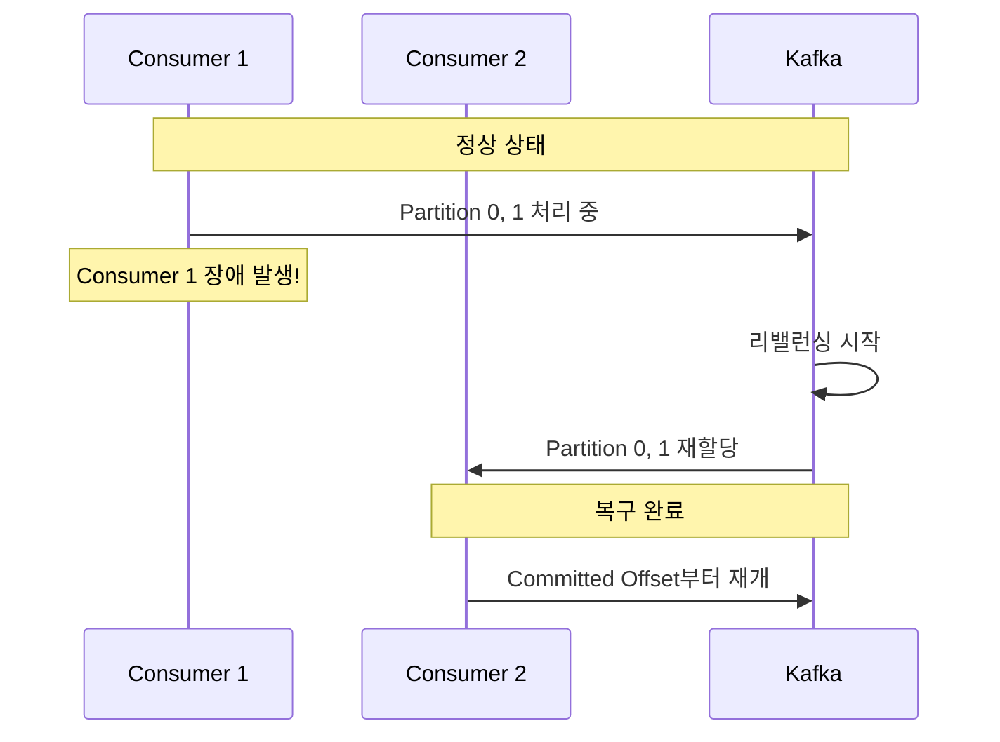
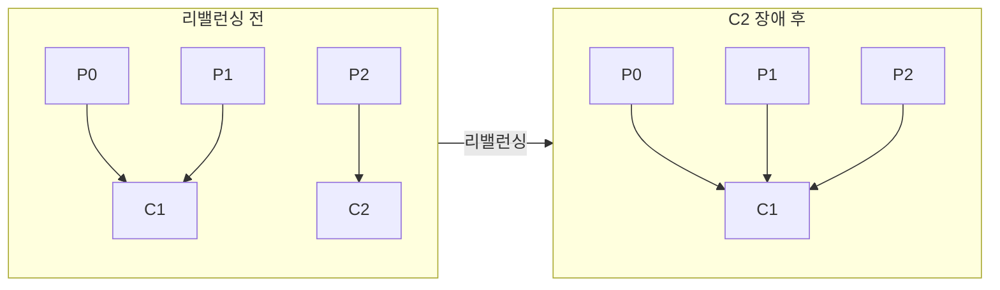
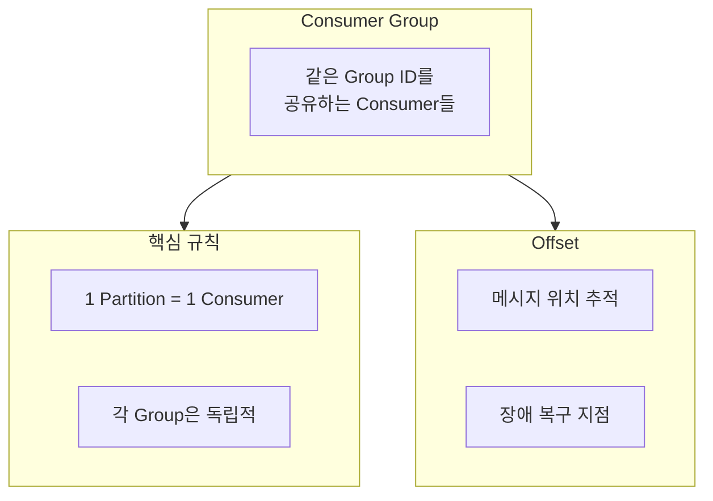

# Consumer Group & Offset

병렬 처리와 진행 상태 관리의 핵심 개념을 이해합니다.

## Consumer Group이란?

**Consumer Group**은 동일한 목적을 가진 Consumer들의 논리적 그룹입니다.



### 핵심 규칙

> **하나의 Partition은 Consumer Group 내에서 하나의 Consumer만 읽을 수 있다**

이 규칙이 중요한 이유:
- **순서 보장**: 같은 Partition의 메시지는 순서대로 처리
- **중복 방지**: 같은 메시지를 여러 Consumer가 동시에 처리하지 않음

## Consumer 수와 Partition 수



| 상황 | 결과 |
|------|------|
| Consumer < Partition | 일부 Consumer가 여러 Partition 담당 |
| Consumer = Partition | 최적 (1:1 매핑) |
| Consumer > Partition | 일부 Consumer 유휴 상태 |

## 여러 Consumer Group

서로 다른 Consumer Group은 **독립적으로** 메시지를 소비합니다.



각 그룹은:
- 모든 메시지를 독립적으로 수신
- 별도의 Offset 관리
- 서로 영향 없이 병렬 처리

## Offset이란?

**Offset**은 Partition 내 메시지의 순차적 위치 번호입니다.

```
Partition 0:
┌─────┬─────┬─────┬─────┬─────┬─────┬─────┐
│  0  │  1  │  2  │  3  │  4  │  5  │  6  │
└─────┴─────┴─────┴─────┴─────┴─────┴─────┘
                    ↑           ↑
            Current Offset    Latest Offset
              (읽은 위치)      (최신 메시지)
```

### Offset 종류



| Offset 종류 | 설명 |
|------------|------|
| **Earliest** | 가장 오래된 메시지 위치 |
| **Committed** | 마지막으로 커밋된 위치 |
| **Current** | 현재 Consumer가 읽고 있는 위치 |
| **Latest** | 가장 최신 메시지 위치 |

## Offset 커밋

Consumer가 메시지를 성공적으로 처리했음을 Kafka에 알리는 과정입니다.



### 자동 커밋 vs 수동 커밋

```yaml
# application.yml
spring:
  kafka:
    consumer:
      enable-auto-commit: true   # 자동 커밋 (기본값)
      auto-commit-interval: 5000 # 5초마다 커밋
```

| 방식 | 장점 | 단점 |
|------|------|------|
| **자동 커밋** | 구현 간단 | 처리 실패 시 데이터 유실 가능 |
| **수동 커밋** | 정확한 제어 | 구현 복잡 |

### 수동 커밋 예시

```java
@KafkaListener(topics = "orders")
public void consume(ConsumerRecord<String, String> record,
                    Acknowledgment ack) {
    try {
        processOrder(record.value());
        ack.acknowledge();  // 성공 시 커밋
    } catch (Exception e) {
        // 커밋하지 않음 - 재처리됨
        log.error("처리 실패", e);
    }
}
```

## 장애 복구 시나리오

### Consumer 장애 시



### 리밸런싱 (Rebalancing)

Consumer Group 내 Partition 재분배 과정:

**트리거 조건:**
- Consumer 추가/제거
- Consumer 장애
- Partition 수 변경



## auto.offset.reset 설정

Consumer Group이 처음 시작하거나 Offset 정보가 없을 때의 동작:

```yaml
spring:
  kafka:
    consumer:
      auto-offset-reset: earliest  # 또는 latest
```

| 설정 | 동작 |
|------|------|
| **earliest** | 가장 오래된 메시지부터 읽기 |
| **latest** | 새로운 메시지만 읽기 |
| **none** | Offset 없으면 에러 발생 |

## 정리



| 개념 | 역할 |
|------|------|
| **Consumer Group** | 병렬 처리, 부하 분산 |
| **Offset** | 진행 상태 관리, 장애 복구 |
| **Rebalancing** | 자동 장애 복구 |

## 다음 단계

- [Replication](/docs/concepts/replication/) - 데이터 복제와 고가용성
