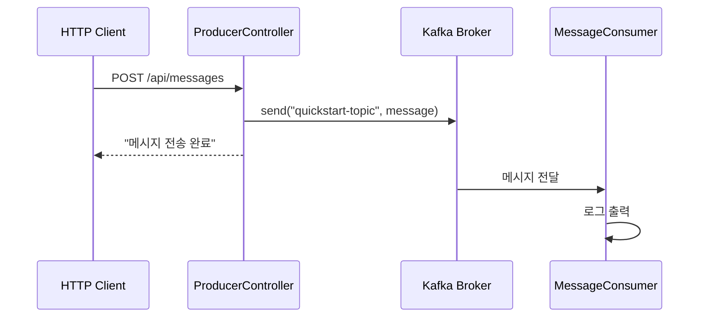

# Quick Start

5분 만에 Kafka 메시지 송수신을 경험해보세요.

## 전체 흐름


## 준비물

- **Docker Desktop** 또는 Docker Engine
- **Java 17+**
- **IDE** (IntelliJ IDEA, VS Code 등)

## Step 1: Kafka 시작

프로젝트 루트에서 Docker Compose로 Kafka를 실행합니다.

```bash
cd docker
docker-compose up -d
```

정상 실행 확인:

```bash
docker-compose ps
```

예상 결과:
```
NAME      COMMAND                  STATUS
kafka     "/etc/kafka/docker..."   Up
```

## Step 2: 예제 프로젝트 실행

새 터미널에서 Quick Start 예제를 실행합니다.

```bash
cd examples/quick-start
./gradlew bootRun
```

> **Windows 사용자:** `gradlew.bat bootRun`

실행 완료 시 다음 로그가 표시됩니다:
```
Started QuickStartApplication in X.XXX seconds
```

## Step 3: 메시지 전송

새 터미널에서 REST API로 메시지를 전송합니다.

```bash
curl -X POST http://localhost:8080/api/messages \
  -H "Content-Type: text/plain" \
  -d "Hello Kafka!"
```

응답:
```
메시지 전송 완료: Hello Kafka!
```

## Step 4: 메시지 수신 확인

Spring Boot 애플리케이션 로그에서 Consumer가 메시지를 수신한 것을 확인합니다.

```
INFO  c.e.quickstart.MessageConsumer : 메시지 수신: Hello Kafka!
```

**축하합니다!** Kafka를 통한 메시지 송수신에 성공했습니다.

## 종료

```bash
# Spring Boot 애플리케이션: Ctrl+C

# Kafka 종료
cd docker
docker-compose down
```

## 무엇이 일어났나요?



1. **HTTP 요청**: curl로 메시지를 전송했습니다
2. **Producer**: `ProducerController`가 메시지를 Kafka에 발행했습니다
3. **Kafka Broker**: 메시지를 `quickstart-topic`에 저장했습니다
4. **Consumer**: `MessageConsumer`가 메시지를 수신하고 로그로 출력했습니다

## 트러블슈팅

### Kafka 연결 실패

```
Connection to node -1 could not be established
```

**해결방법:**
1. Docker가 실행 중인지 확인: `docker ps`
2. Kafka 컨테이너 상태 확인: `docker-compose ps`
3. Kafka 재시작: `docker-compose restart`

### 포트 충돌

```
Port 9092 is already in use
```

**해결방법:**
1. 기존 Kafka 프로세스 종료
2. 또는 `docker-compose.yml`에서 포트 변경

### Gradle 빌드 실패

```
Could not resolve dependencies
```

**해결방법:**
1. Java 17+ 설치 확인: `java -version`
2. Gradle 캐시 정리: `./gradlew clean`

## 다음 단계

- [개념 이해](/docs/kafka/concepts/) - Kafka의 핵심 구성요소 학습
- [실습 예제](/docs/kafka/examples/) - 더 복잡한 예제 실습
