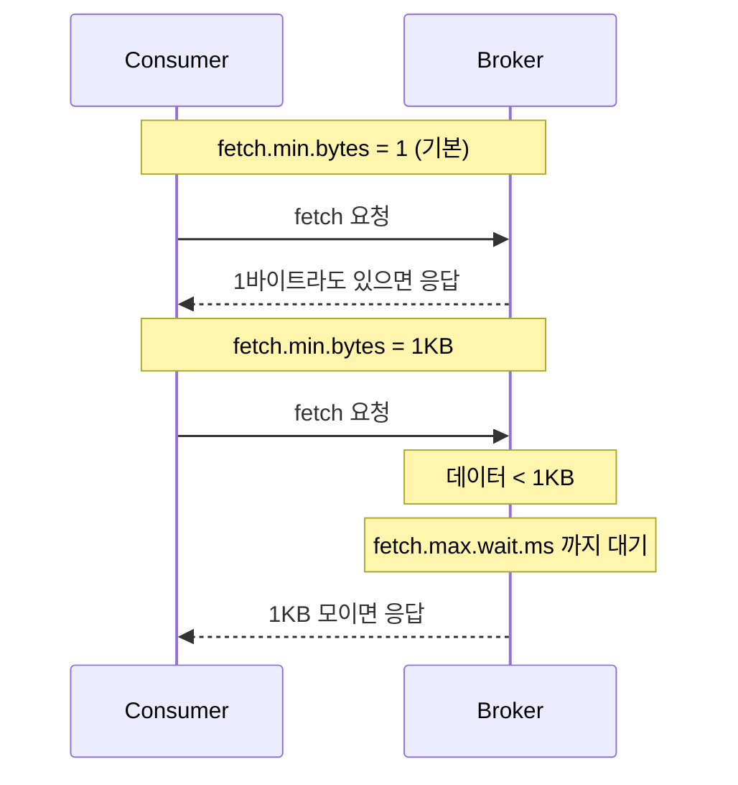
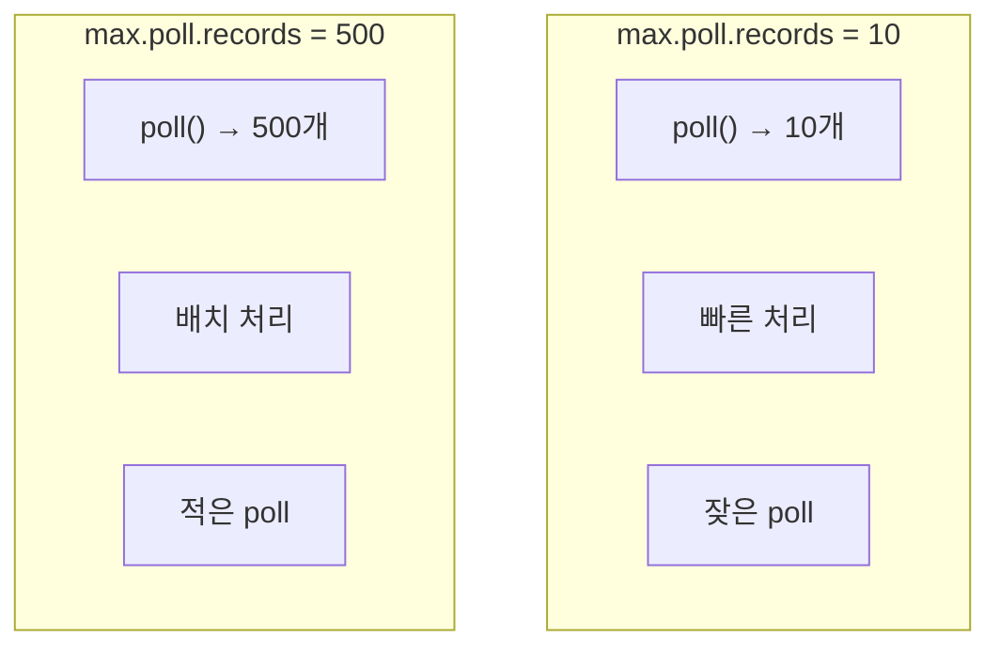
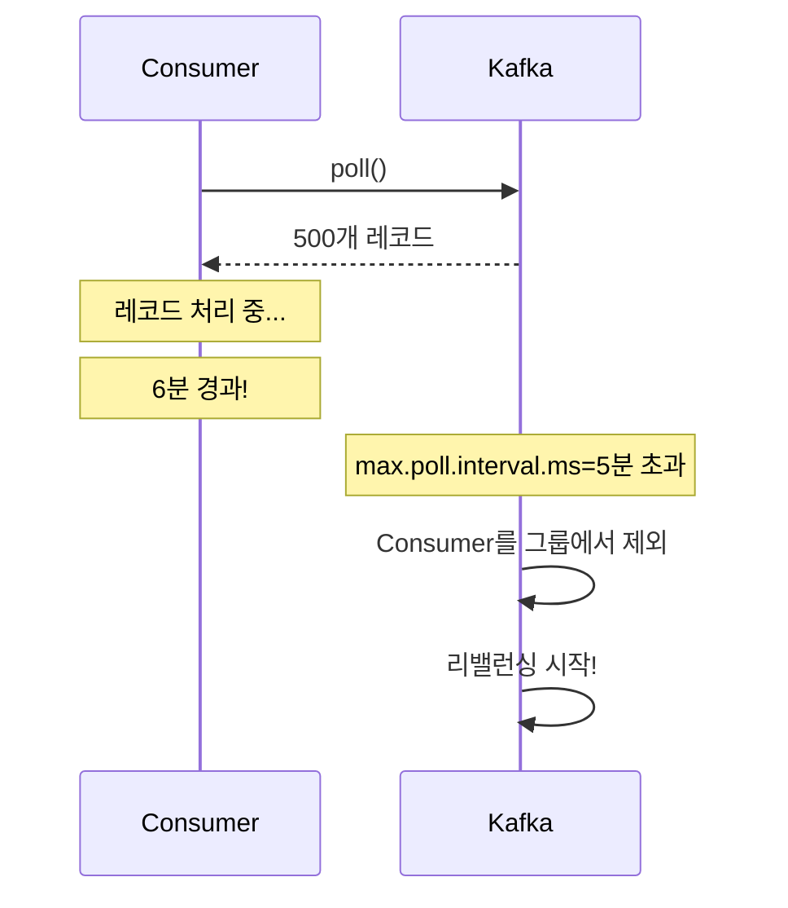
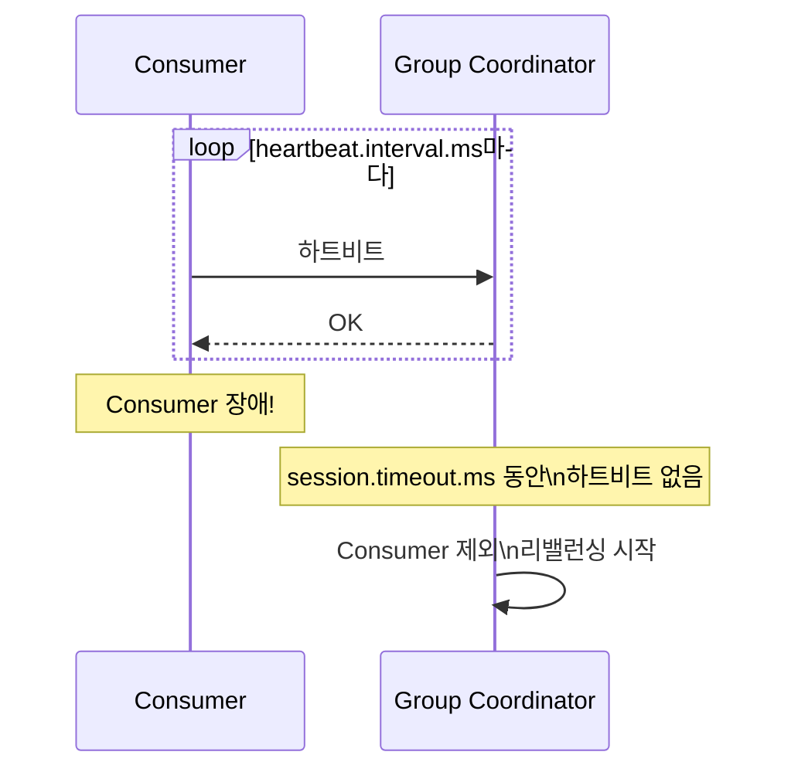
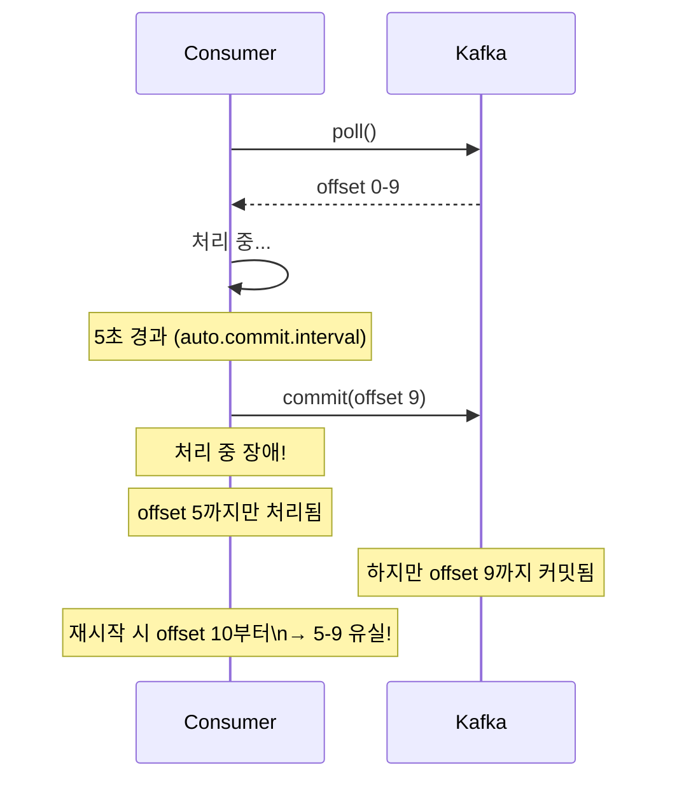
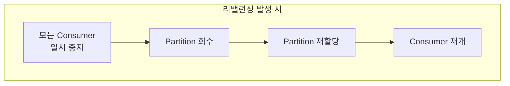
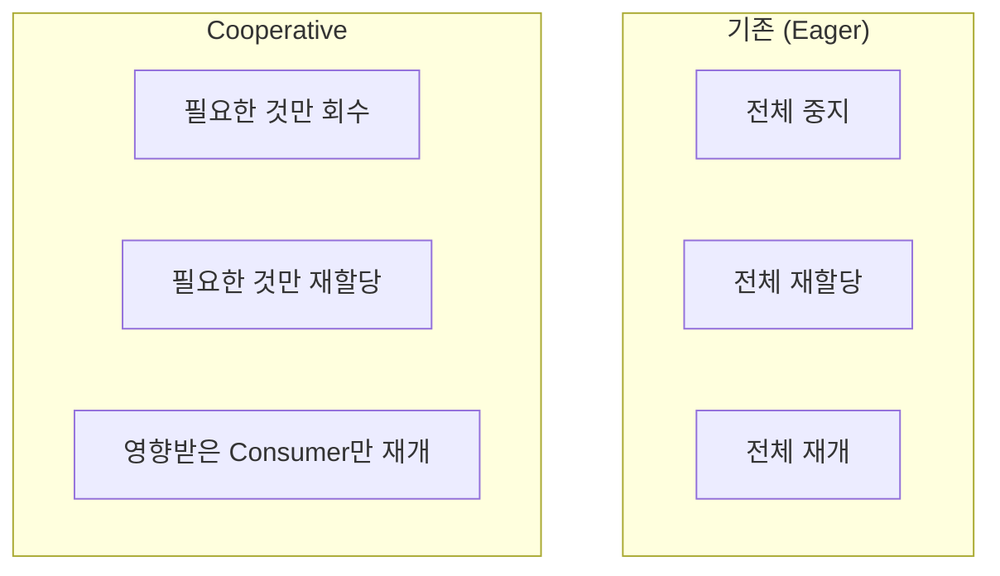
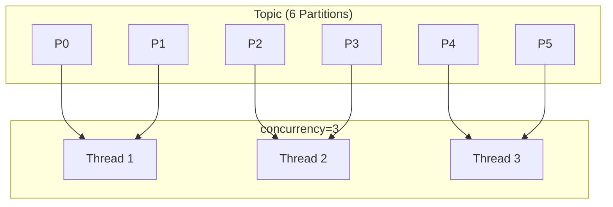
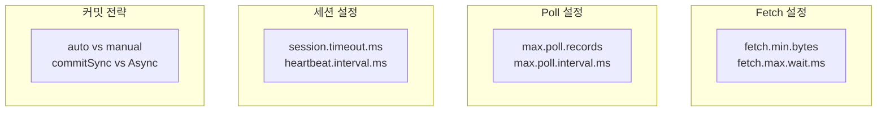

# Consumer 튜닝

Consumer 성능 최적화와 안정적인 운영을 위한 설정을 이해합니다.

## Consumer 내부 구조

```mermaid
flowchart LR
    subgraph Kafka["Kafka"]
        BROKER[Broker]
    end

    subgraph Consumer["Consumer 내부"]
        FETCH[Fetcher]
        POLL[poll()]
        PROCESS[메시지 처리]
        COMMIT[Offset 커밋]
    end

    subgraph Application["애플리케이션"]
        LOGIC[비즈니스 로직]
    end

    BROKER -->|fetch.min.bytes\nfetch.max.wait.ms| FETCH
    FETCH -->|max.poll.records| POLL
    POLL --> PROCESS
    PROCESS --> LOGIC
    PROCESS --> COMMIT
```

## 핵심 설정 개요

| 설정 | 기본값 | 영향 |
|------|--------|------|
| `fetch.min.bytes` | 1 | 최소 페치 크기 |
| `fetch.max.wait.ms` | 500ms | 페치 대기 시간 |
| `max.poll.records` | 500 | poll당 최대 레코드 |
| `max.poll.interval.ms` | 5분 | poll 간격 최대값 |
| `session.timeout.ms` | 45초 | 세션 타임아웃 |
| `heartbeat.interval.ms` | 3초 | 하트비트 간격 |

## Fetch 설정

### fetch.min.bytes

Broker가 응답하기 위한 최소 데이터 크기입니다.



### fetch.max.wait.ms

`fetch.min.bytes`를 충족하지 못해도 응답하는 최대 대기 시간입니다.

```yaml
spring:
  kafka:
    consumer:
      fetch-min-size: 1  # 기본값
      fetch-max-wait: 500  # 500ms (기본값)
```

| 설정 조합 | 효과 | 사용 사례 |
|----------|------|----------|
| min=1, wait=500 | 즉시 응답 | 지연 최소화 |
| min=1KB, wait=500 | 배치 우선 | 처리량 증가 |
| min=1KB, wait=100 | 빠른 응답 | 균형 |

## Poll 설정

### max.poll.records

한 번의 `poll()` 호출로 가져오는 최대 레코드 수입니다.



### max.poll.interval.ms

**가장 중요한 설정 중 하나입니다.**

두 `poll()` 호출 사이의 최대 허용 시간입니다.



### 설정 가이드

```yaml
spring:
  kafka:
    consumer:
      properties:
        max.poll.records: 500  # 기본값
        max.poll.interval.ms: 300000  # 5분 (기본값)
```

**규칙:** `max.poll.interval.ms` > (레코드당 처리시간 × `max.poll.records`)

```java
// 예: 레코드당 100ms 처리 시간
// max.poll.records = 500
// 필요 시간: 100ms × 500 = 50초
// max.poll.interval.ms는 최소 60초 이상 권장
```

## 세션 및 하트비트 설정

### 관계 이해



### 설정 관계

```yaml
spring:
  kafka:
    consumer:
      properties:
        session.timeout.ms: 45000  # 세션 타임아웃
        heartbeat.interval.ms: 3000  # 하트비트 간격
```

**권장 규칙:**
- `session.timeout.ms` >= 3 × `heartbeat.interval.ms`
- 일반적으로 `heartbeat.interval.ms`는 `session.timeout.ms`의 1/3

### 설정 시나리오

| 환경 | session.timeout | heartbeat.interval | 효과 |
|------|----------------|-------------------|------|
| **빠른 감지** | 10초 | 3초 | 빠른 리밸런싱, 잦은 false positive |
| **안정적** | 45초 | 15초 | 느린 감지, 안정적 |
| **GC 이슈** | 60초+ | 20초 | GC pause 허용 |

## Offset 커밋 전략

### 자동 커밋

```yaml
spring:
  kafka:
    consumer:
      enable-auto-commit: true  # 기본값
      auto-commit-interval: 5000  # 5초마다 커밋
```



### 수동 커밋

```yaml
spring:
  kafka:
    consumer:
      enable-auto-commit: false
    listener:
      ack-mode: manual  # 또는 manual_immediate
```

#### commitSync vs commitAsync

```java
@KafkaListener(topics = "my-topic")
public void listen(ConsumerRecord<String, String> record,
                   Consumer<?, ?> consumer) {
    try {
        process(record);

        // 동기 커밋: 커밋 완료까지 블로킹
        consumer.commitSync();

        // 비동기 커밋: 즉시 반환, 콜백으로 결과 확인
        consumer.commitAsync((offsets, exception) -> {
            if (exception != null) {
                log.error("커밋 실패", exception);
            }
        });
    } catch (Exception e) {
        // 커밋 안함 → 재처리
    }
}
```

| 방식 | 장점 | 단점 |
|------|------|------|
| **commitSync** | 확실한 커밋 | 성능 저하 |
| **commitAsync** | 높은 성능 | 실패 시 처리 복잡 |

#### Spring Kafka의 Acknowledgment

```java
@KafkaListener(topics = "my-topic")
public void listen(String message, Acknowledgment ack) {
    process(message);
    ack.acknowledge();  // 커밋
}
```

### AckMode 옵션

```yaml
spring:
  kafka:
    listener:
      ack-mode: manual  # 옵션 선택
```

| AckMode | 동작 |
|---------|------|
| `RECORD` | 레코드마다 커밋 |
| `BATCH` | poll()의 모든 레코드 처리 후 커밋 |
| `MANUAL` | acknowledge() 호출 시 커밋 |
| `MANUAL_IMMEDIATE` | acknowledge() 즉시 커밋 |

## 리밸런싱 최적화

### 리밸런싱 비용



### Cooperative Rebalancing (권장)

Kafka 2.4+ 에서 지원하는 점진적 리밸런싱입니다.

```yaml
spring:
  kafka:
    consumer:
      properties:
        partition.assignment.strategy: org.apache.kafka.clients.consumer.CooperativeStickyAssignor
```



### Static Membership

Consumer 재시작 시 리밸런싱을 방지합니다.

```yaml
spring:
  kafka:
    consumer:
      properties:
        group.instance.id: consumer-${HOSTNAME}  # 고정 ID
        session.timeout.ms: 300000  # 5분
```

Consumer가 5분 내에 재시작하면 같은 Partition을 유지합니다.

## 처리량 vs 지연시간

### 처리량 최적화

```yaml
spring:
  kafka:
    consumer:
      fetch-min-size: 1048576  # 1MB
      fetch-max-wait: 500
      properties:
        max.poll.records: 1000
        fetch.max.bytes: 52428800  # 50MB
```

### 지연시간 최적화

```yaml
spring:
  kafka:
    consumer:
      fetch-min-size: 1
      fetch-max-wait: 100  # 100ms
      properties:
        max.poll.records: 100
```

### 균형잡힌 설정

```yaml
spring:
  kafka:
    consumer:
      fetch-min-size: 1
      fetch-max-wait: 500
      properties:
        max.poll.records: 500
        max.poll.interval.ms: 300000
        session.timeout.ms: 45000
        heartbeat.interval.ms: 3000
```

## 병렬 처리

### Concurrency 설정

```yaml
spring:
  kafka:
    listener:
      concurrency: 3  # 3개의 Consumer 스레드
```



**규칙:** concurrency <= Partition 수

## Consumer Lag 관리

### Lag이란?

```
Partition 0:
├── Latest Offset: 1000
├── Consumer Offset: 800
└── Lag: 200
```

### Lag 발생 원인과 해결

| 원인 | 해결책 |
|------|--------|
| 처리 속도 느림 | concurrency 증가, 처리 로직 최적화 |
| Partition 부족 | Partition 수 증가 |
| 네트워크 문제 | fetch 설정 최적화 |
| 재처리 | seek을 통한 위치 조정 |

## 정리



| 목표 | 주요 설정 |
|------|----------|
| **처리량 ↑** | fetch.min.bytes ↑, max.poll.records ↑ |
| **지연시간 ↓** | fetch.max.wait ↓, max.poll.records ↓ |
| **안정성** | 적절한 session/heartbeat 설정 |
| **정확성** | 수동 커밋 |

## 다음 단계

- [에러 처리 심화](../error-handling/) - 에러 처리 패턴과 Dead Letter Topic
