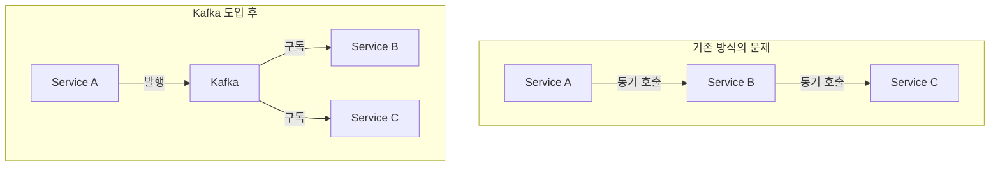
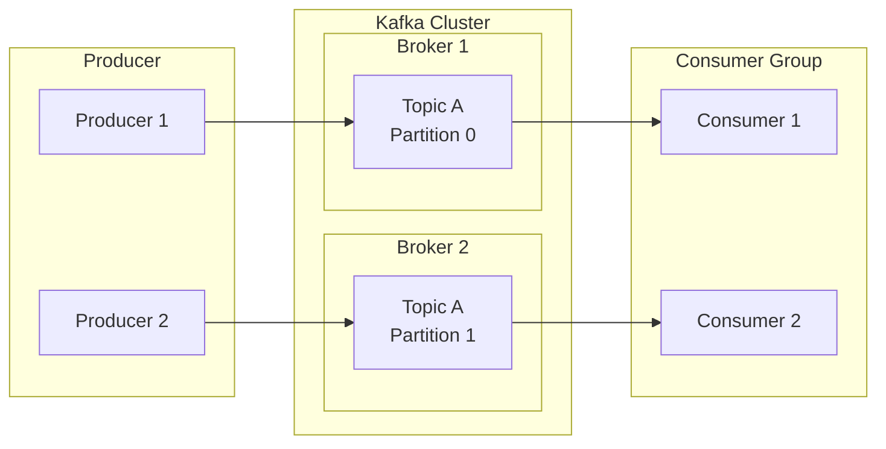
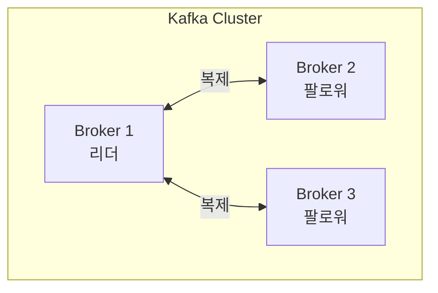
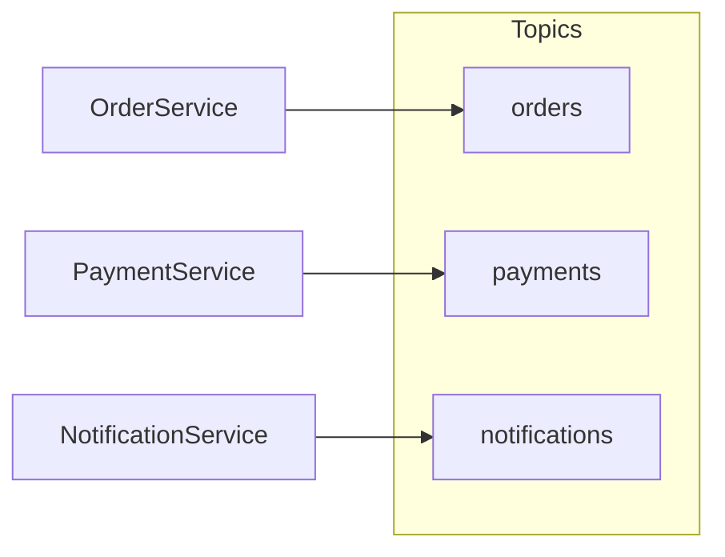
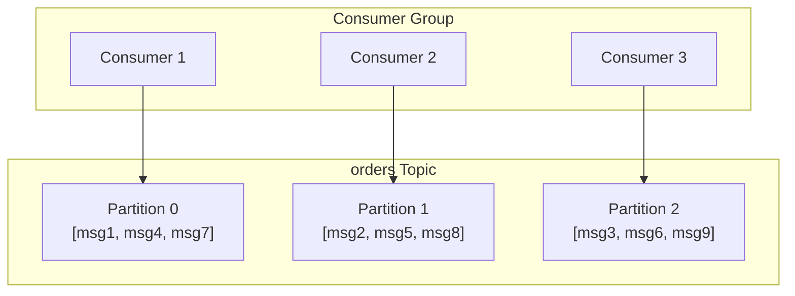
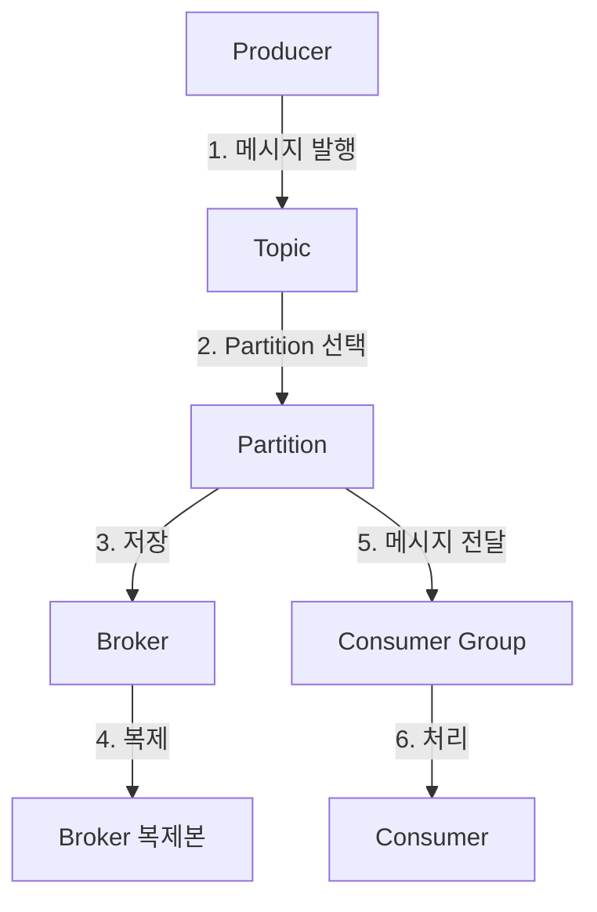

# Kafka 핵심 구성요소

Kafka의 5가지 핵심 구성요소를 이해합니다.

## 왜 Kafka가 필요한가?

Kafka는 세 가지 본질적 문제를 해결합니다:

1. **비동기 처리**: 요청-응답을 분리하여 시스템 간 결합도를 낮춤
2. **고용량 처리**: 대량의 데이터를 실시간으로 처리
3. **고가용성**: 장애 상황에서도 데이터 유실 없이 서비스 지속



## 전체 구조



## 1. Producer (생산자)

**역할:** 메시지를 Kafka에 발행하는 클라이언트

```java
// Spring Kafka에서의 Producer 예시
@Component
public class OrderProducer {
    private final KafkaTemplate<String, String> kafkaTemplate;

    public void sendOrder(String orderId, String orderData) {
        kafkaTemplate.send("orders", orderId, orderData);
    }
}
```

**핵심 개념:**
- 어떤 Topic에 메시지를 보낼지 결정
- Message Key를 통해 특정 Partition으로 라우팅 가능
- 동기/비동기 전송 선택 가능

## 2. Consumer (소비자)

**역할:** Kafka에서 메시지를 읽어가는 클라이언트

```java
// Spring Kafka에서의 Consumer 예시
@Component
public class OrderConsumer {
    @KafkaListener(topics = "orders", groupId = "order-service")
    public void consume(String message) {
        // 메시지 처리
    }
}
```

**핵심 개념:**
- Consumer Group에 속하여 병렬 처리
- Offset을 통해 읽은 위치 추적
- Pull 방식으로 메시지를 가져옴

## 3. Broker (브로커)

**역할:** 메시지를 저장하고 전달하는 Kafka 서버



**핵심 개념:**
- 여러 Broker가 클러스터를 구성
- 데이터를 디스크에 영속적으로 저장
- Leader/Follower 구조로 고가용성 보장

> **비유:** Broker는 우체국과 같습니다. 편지(메시지)를 받아서 보관하고, 수신자(Consumer)에게 전달합니다.

## 4. Topic (토픽)

**역할:** 메시지를 분류하는 논리적 채널



**핵심 개념:**
- 관련된 메시지들을 그룹화
- 여러 Partition으로 구성
- 이름으로 식별 (예: `orders`, `user-events`)

> **비유:** Topic은 TV 채널과 같습니다. 뉴스 채널, 스포츠 채널처럼 주제별로 구분됩니다.

## 5. Partition (파티션)

**역할:** Topic을 분할하여 병렬 처리를 가능하게 함



**핵심 개념:**
- 하나의 Partition 내에서는 순서 보장
- Message Key로 동일 Partition 라우팅 가능
- Partition 수 = 최대 병렬 처리 수

> **비유:** Partition은 마트의 계산대와 같습니다. 계산대가 많을수록 더 많은 고객을 동시에 처리할 수 있습니다.

## 구성요소 간 관계



## 정리

| 구성요소 | 역할 | 비유 |
|---------|------|------|
| **Producer** | 메시지 발행 | 편지 보내는 사람 |
| **Consumer** | 메시지 소비 | 편지 받는 사람 |
| **Broker** | 메시지 저장/전달 | 우체국 |
| **Topic** | 메시지 분류 | TV 채널 |
| **Partition** | 병렬 처리 단위 | 계산대 |

## 다음 단계

- [메시지 흐름](/kafka/concepts/message-flow/) - 메시지가 어떻게 전달되는지 자세히 알아보기
