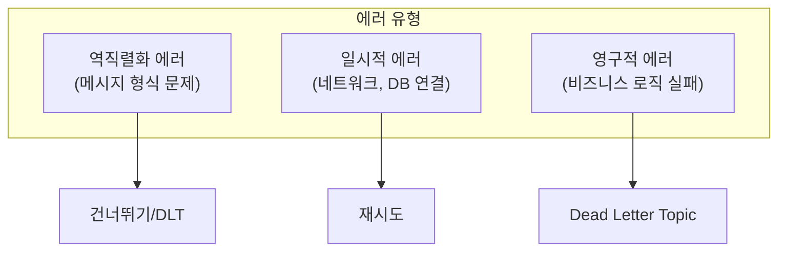
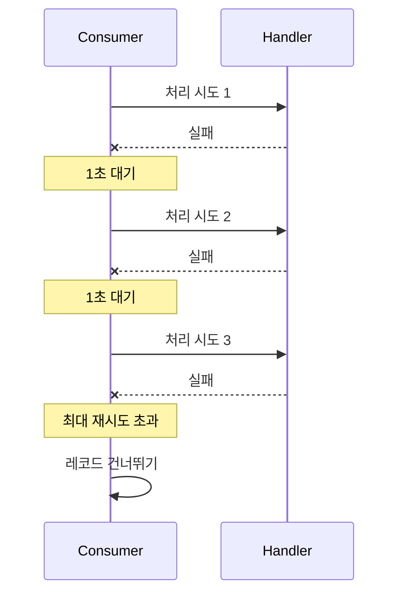
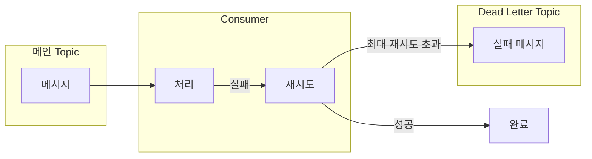
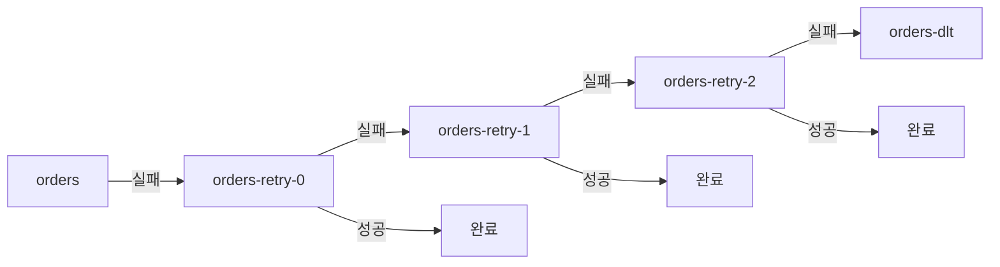
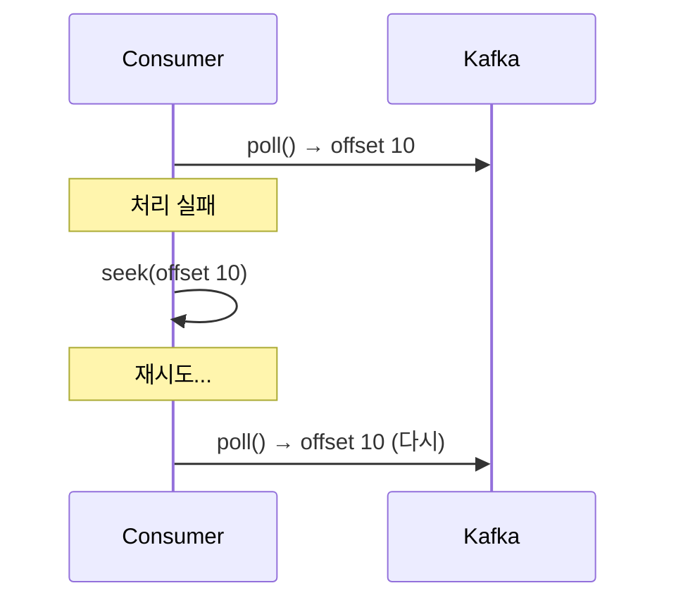
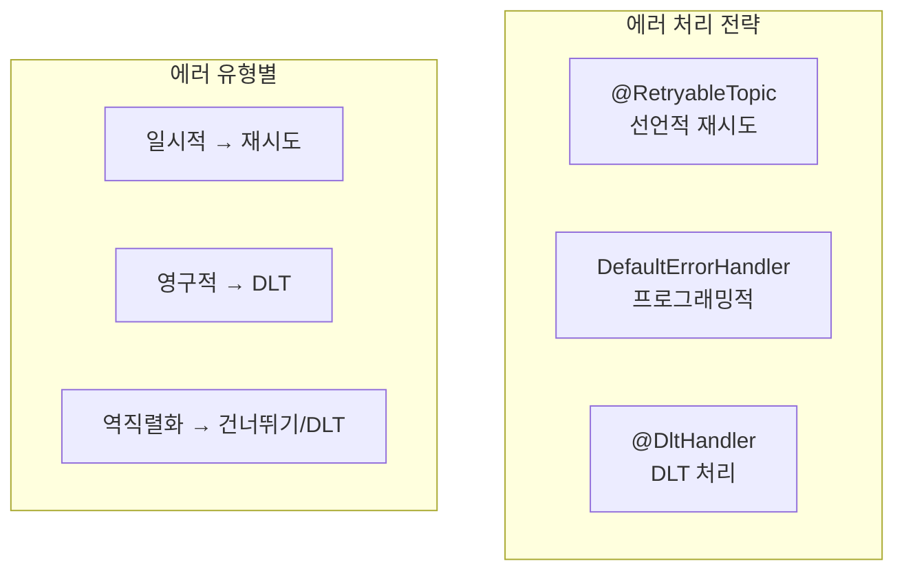

# 에러 처리 심화

Kafka Consumer의 에러 처리 전략과 Dead Letter Topic 패턴을 이해합니다.

## 에러 유형



| 유형 | 예시 | 처리 방법 |
|------|------|----------|
| **역직렬화** | JSON 파싱 실패 | 건너뛰기 또는 DLT |
| **일시적** | DB 연결 실패, 타임아웃 | 재시도 |
| **영구적** | 유효성 검증 실패 | DLT |

## 기본 에러 처리

### DefaultErrorHandler (Spring Kafka 2.8+)

```java
@Configuration
public class KafkaConfig {

    @Bean
    public DefaultErrorHandler errorHandler() {
        // 1초 간격으로 3회 재시도
        return new DefaultErrorHandler(
            new FixedBackOff(1000L, 3L)
        );
    }
}
```

### 재시도 전략

#### FixedBackOff



#### ExponentialBackOff

```java
@Bean
public DefaultErrorHandler errorHandler() {
    ExponentialBackOff backOff = new ExponentialBackOff(1000L, 2.0);
    backOff.setMaxElapsedTime(60000L);  // 최대 1분
    return new DefaultErrorHandler(backOff);
}
```

```
시도 1: 즉시
시도 2: 1초 후
시도 3: 2초 후
시도 4: 4초 후
시도 5: 8초 후
...
```

## Dead Letter Topic (DLT)

재시도 후에도 처리할 수 없는 메시지를 저장하는 별도 Topic입니다.

### 기본 흐름



### DeadLetterPublishingRecoverer

```java
@Configuration
public class KafkaConfig {

    @Bean
    public DefaultErrorHandler errorHandler(
            KafkaTemplate<String, Object> kafkaTemplate) {

        DeadLetterPublishingRecoverer recoverer =
            new DeadLetterPublishingRecoverer(kafkaTemplate);

        return new DefaultErrorHandler(
            recoverer,
            new FixedBackOff(1000L, 3L)
        );
    }
}
```

DLT Topic 명명 규칙: `원본-topic.DLT` (예: `orders.DLT`)

### DLT 커스터마이징

```java
@Bean
public DefaultErrorHandler errorHandler(
        KafkaTemplate<String, Object> kafkaTemplate) {

    // DLT Topic 이름 커스터마이징
    DeadLetterPublishingRecoverer recoverer =
        new DeadLetterPublishingRecoverer(kafkaTemplate,
            (record, exception) ->
                new TopicPartition(
                    record.topic() + "-dead-letter",
                    record.partition()
                ));

    // 특정 예외는 재시도하지 않음
    DefaultErrorHandler handler = new DefaultErrorHandler(
        recoverer,
        new FixedBackOff(1000L, 3L)
    );

    handler.addNotRetryableExceptions(
        ValidationException.class,
        NullPointerException.class
    );

    return handler;
}
```

## @RetryableTopic (권장)

Spring Kafka 2.7+ 에서 제공하는 선언적 재시도 및 DLT 처리입니다.

### 기본 사용법

```java
@Component
public class OrderConsumer {

    @RetryableTopic(
        attempts = "4",  // 원본 1회 + 재시도 3회
        backoff = @Backoff(delay = 1000, multiplier = 2)
    )
    @KafkaListener(topics = "orders")
    public void consume(OrderEvent event) {
        // 처리 로직
        processOrder(event);
    }

    @DltHandler
    public void handleDlt(OrderEvent event,
                          @Header(KafkaHeaders.RECEIVED_TOPIC) String topic,
                          @Header(KafkaHeaders.EXCEPTION_MESSAGE) String error) {
        log.error("DLT 수신 - Topic: {}, 에러: {}", topic, error);
        // DLT 메시지 처리 (알림, 로깅 등)
        alertService.sendAlert(event, error);
    }
}
```

### 재시도 Topic 구조



### 고급 설정

```java
@RetryableTopic(
    attempts = "4",
    backoff = @Backoff(delay = 1000, multiplier = 2, maxDelay = 10000),
    autoCreateTopics = "true",
    topicSuffixingStrategy = TopicSuffixingStrategy.SUFFIX_WITH_INDEX_VALUE,
    dltStrategy = DltStrategy.ALWAYS_RETRY_ON_ERROR,
    include = {RetryableException.class},  // 재시도할 예외
    exclude = {NonRetryableException.class}  // 재시도 안할 예외
)
@KafkaListener(topics = "orders")
public void consume(OrderEvent event) {
    // ...
}
```

### 설정 옵션

| 옵션 | 설명 | 기본값 |
|------|------|--------|
| `attempts` | 총 시도 횟수 | 3 |
| `backoff.delay` | 기본 대기 시간 | 1000ms |
| `backoff.multiplier` | 대기 시간 증가율 | 0 (고정) |
| `backoff.maxDelay` | 최대 대기 시간 | - |
| `include` | 재시도할 예외 | 모든 예외 |
| `exclude` | 재시도 안할 예외 | - |

## 역직렬화 에러 처리

### ErrorHandlingDeserializer

메시지 역직렬화 실패를 처리합니다.

```yaml
spring:
  kafka:
    consumer:
      key-deserializer: org.springframework.kafka.support.serializer.ErrorHandlingDeserializer
      value-deserializer: org.springframework.kafka.support.serializer.ErrorHandlingDeserializer
      properties:
        spring.deserializer.key.delegate.class: org.apache.kafka.common.serialization.StringDeserializer
        spring.deserializer.value.delegate.class: org.springframework.kafka.support.serializer.JsonDeserializer
        spring.json.trusted.packages: "com.example.*"
```

```java
@KafkaListener(topics = "orders")
public void consume(ConsumerRecord<String, OrderEvent> record) {
    if (record.value() == null) {
        // 역직렬화 실패
        log.error("역직렬화 실패: {}", new String(record.headers()
            .lastHeader("springDeserializerExceptionValue").value()));
        return;
    }
    processOrder(record.value());
}
```

## 에러 처리 패턴

### 패턴 1: 재시도 + DLT

가장 일반적인 패턴입니다.

```java
@RetryableTopic(attempts = "4")
@KafkaListener(topics = "orders")
public void consume(OrderEvent event) {
    validateAndProcess(event);
}

@DltHandler
public void handleDlt(OrderEvent event) {
    saveToFailedOrders(event);
    notifyAdmin(event);
}
```

### 패턴 2: 조건부 재시도

```java
@KafkaListener(topics = "orders")
public void consume(OrderEvent event) {
    try {
        processOrder(event);
    } catch (TemporaryException e) {
        // 재시도 가능 → 예외 던지기
        throw e;
    } catch (PermanentException e) {
        // 재시도 불가 → 로깅 후 건너뛰기
        log.error("처리 불가: {}", event, e);
        saveToFailedOrders(event, e);
    }
}
```

### 패턴 3: 수동 재처리

```java
@KafkaListener(topics = "orders-dlt")
public void processDlt(
        ConsumerRecord<String, OrderEvent> record,
        @Header(KafkaHeaders.EXCEPTION_MESSAGE) String error) {

    OrderEvent event = record.value();

    // 수동 검토 후 재처리
    if (canBeFixed(event)) {
        OrderEvent fixed = fixEvent(event);
        kafkaTemplate.send("orders", record.key(), fixed);
        log.info("재처리 완료: {}", record.key());
    } else {
        permanentlyFailed(event, error);
    }
}
```

## Seek을 이용한 재처리

### 특정 오프셋으로 이동

```java
@KafkaListener(topics = "orders", id = "orderListener")
public void consume(OrderEvent event) {
    processOrder(event);
}

// 필요 시 오프셋 재설정
public void reprocessFrom(long offset) {
    Consumer<?, ?> consumer = kafkaListenerEndpointRegistry
        .getListenerContainer("orderListener")
        .getConsumerFactory()
        .createConsumer();

    consumer.seek(new TopicPartition("orders", 0), offset);
}
```

### SeekToCurrentErrorHandler 동작



## 모니터링 및 알림

### DLT 메시지 알림

```java
@DltHandler
public void handleDlt(
        ConsumerRecord<String, OrderEvent> record,
        @Header(KafkaHeaders.EXCEPTION_MESSAGE) String error,
        @Header(KafkaHeaders.ORIGINAL_TOPIC) String originalTopic,
        @Header(KafkaHeaders.ORIGINAL_OFFSET) long originalOffset) {

    DltMessage dltMessage = DltMessage.builder()
        .key(record.key())
        .value(record.value())
        .originalTopic(originalTopic)
        .originalOffset(originalOffset)
        .error(error)
        .timestamp(Instant.now())
        .build();

    // Slack/이메일 알림
    alertService.sendDltAlert(dltMessage);

    // 메트릭 기록
    meterRegistry.counter("kafka.dlt.received",
        "topic", originalTopic).increment();
}
```

### DLT 대시보드 데이터

```java
@Scheduled(fixedRate = 60000)
public void collectDltMetrics() {
    // DLT Topic들의 메시지 수 집계
    Map<String, Long> dltCounts = dltTopics.stream()
        .collect(Collectors.toMap(
            topic -> topic,
            this::getMessageCount
        ));

    metricsService.recordDltCounts(dltCounts);
}
```

## 정리



| 상황 | 권장 처리 |
|------|----------|
| **일시적 에러** | 지수 백오프로 재시도 |
| **영구적 에러** | 즉시 DLT로 이동 |
| **역직렬화 에러** | 로깅 후 건너뛰기 |
| **DLT 적재** | 알림 + 수동 검토 |

## 다음 단계

- [모니터링 기초](../monitoring/) - Kafka 모니터링 및 메트릭
