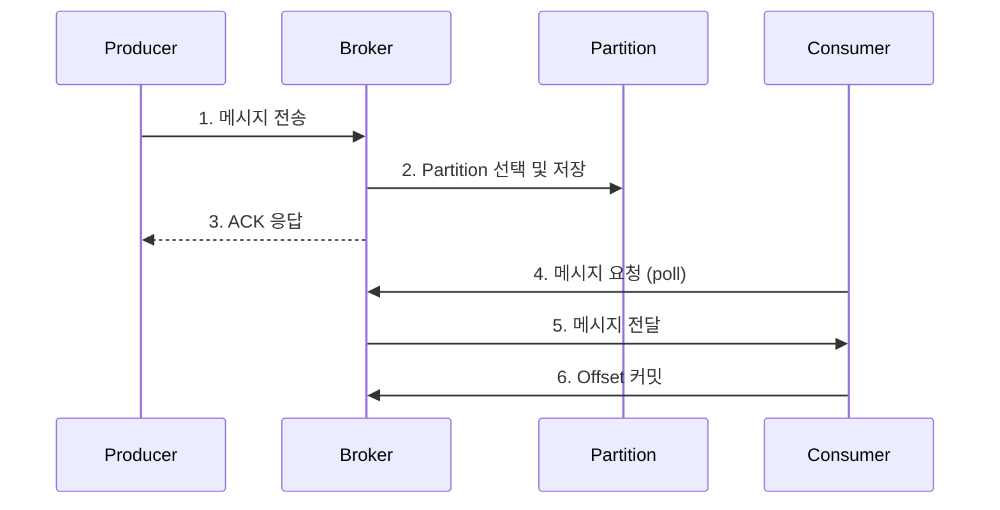
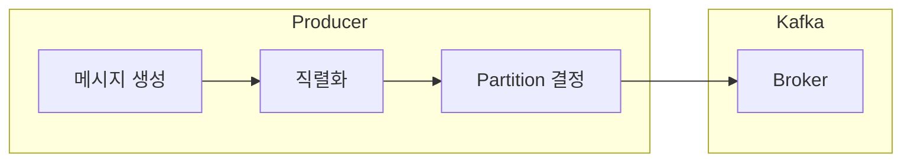
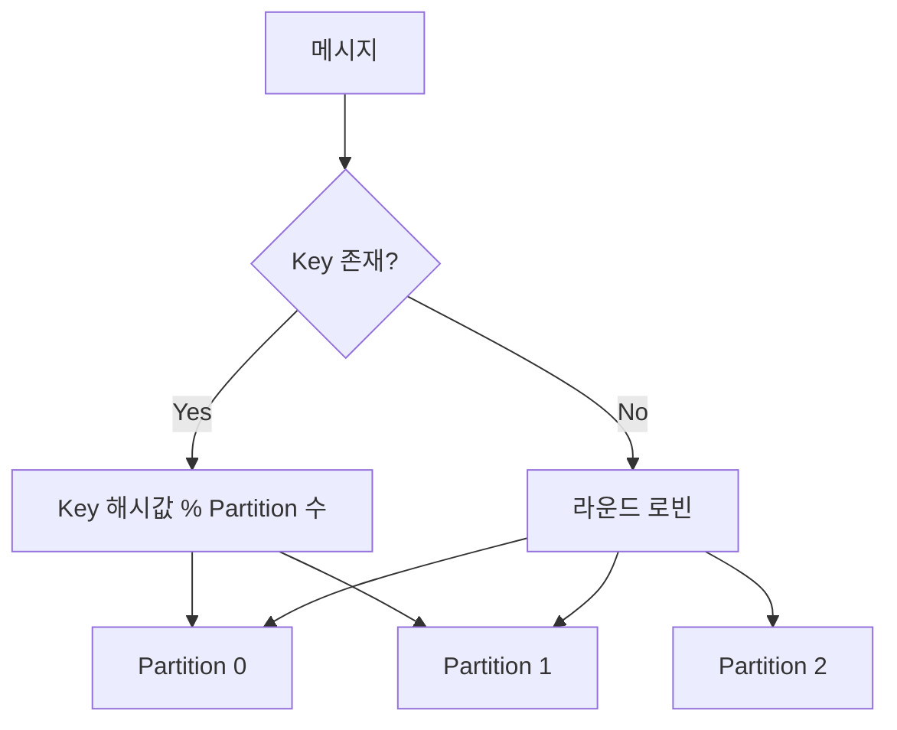
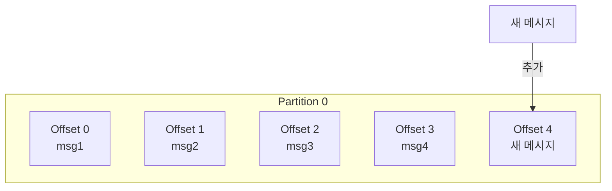
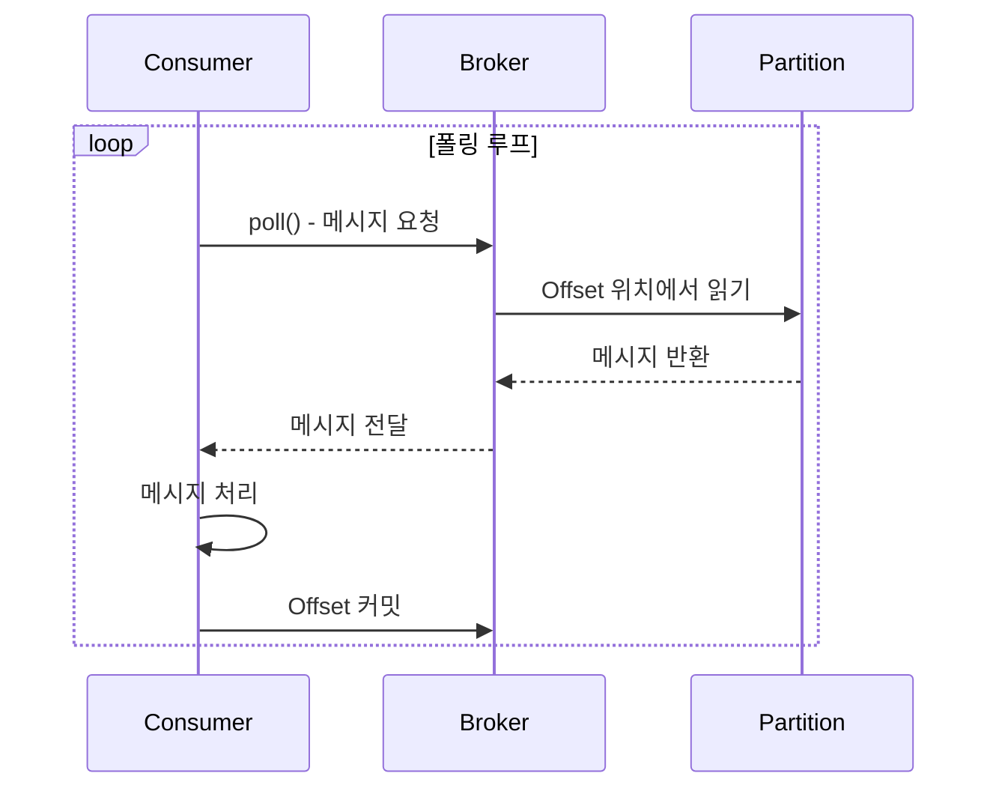
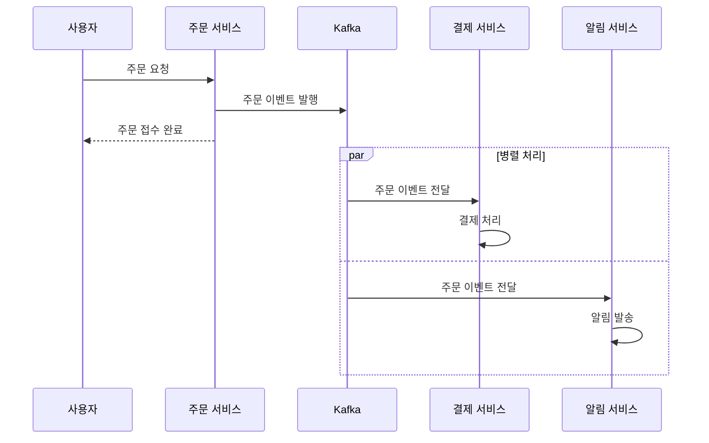
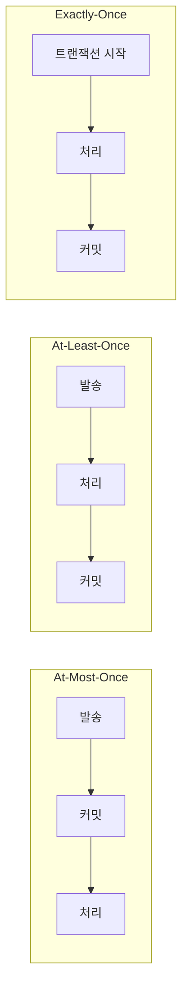

# 메시지 흐름

Kafka에서 메시지가 발행되고 소비되는 전체 과정을 이해합니다.

## 전체 흐름 개요



## 1단계: 메시지 발행 (Produce)

Producer가 메시지를 Kafka에 전송합니다.



### 발행 과정

1. **메시지 생성**: Key-Value 쌍으로 메시지 구성
2. **직렬화**: 객체를 바이트 배열로 변환
3. **Partition 결정**: Key 해시 또는 라운드 로빈
4. **전송**: 네트워크를 통해 Broker로 전송

```java
// Producer 코드 예시
kafkaTemplate.send("orders", orderId, orderJson);
//                  Topic    Key      Value
```

### Partition 결정 방식



- **Key 있음**: 동일 Key는 항상 동일 Partition으로
- **Key 없음**: 라운드 로빈으로 균등 분배

## 2단계: 메시지 저장 (Store)

Broker가 메시지를 Partition에 저장합니다.



### 저장 특성

| 특성 | 설명 |
|------|------|
| **순차 저장** | 메시지는 Partition 끝에 추가 (Append-only) |
| **불변성** | 저장된 메시지는 수정 불가 |
| **Offset 할당** | 각 메시지에 고유 순번 부여 |
| **영속성** | 디스크에 저장되어 재시작해도 유지 |

### Offset이란?

```
Partition 0: [0] [1] [2] [3] [4] [5] [6] [7]
                              ↑
                         현재 Consumer 위치
```

- 각 메시지의 고유 식별자 (순차 번호)
- Consumer는 Offset을 기준으로 읽은 위치 추적
- 0부터 시작하여 무한히 증가

## 3단계: 메시지 소비 (Consume)

Consumer가 Broker로부터 메시지를 가져옵니다.



### 소비 과정

1. **Poll**: Consumer가 Broker에 메시지 요청
2. **Fetch**: Broker가 Partition에서 메시지 읽기
3. **처리**: Consumer가 비즈니스 로직 실행
4. **커밋**: 처리 완료된 Offset 저장

```java
// Consumer 코드 예시
@KafkaListener(topics = "orders", groupId = "order-service")
public void consume(ConsumerRecord<String, String> record) {
    String key = record.key();
    String value = record.value();
    long offset = record.offset();

    // 비즈니스 로직 처리
    processOrder(value);

    // Offset은 자동으로 커밋됨 (기본 설정)
}
```

### Pull vs Push

Kafka는 **Pull 방식**을 사용합니다:

| 방식 | 설명 | 장점 |
|------|------|------|
| **Pull** | Consumer가 필요할 때 가져감 | Consumer 처리 속도에 맞춤 |
| Push | Broker가 Consumer에게 밀어냄 | Consumer 과부하 가능 |

## 전체 흐름 예시

주문 시스템에서의 메시지 흐름:



## 메시지 보장 수준



| 수준 | 설명 | 사용 사례 |
|------|------|----------|
| **At-Most-Once** | 최대 1번 (유실 가능) | 로그, 메트릭 |
| **At-Least-Once** | 최소 1번 (중복 가능) | 일반적인 이벤트 |
| **Exactly-Once** | 정확히 1번 | 금융 트랜잭션 |

## 다음 단계

- [Consumer Group & Offset](/kafka/concepts/consumer-group-offset/) - 병렬 처리와 상태 관리
