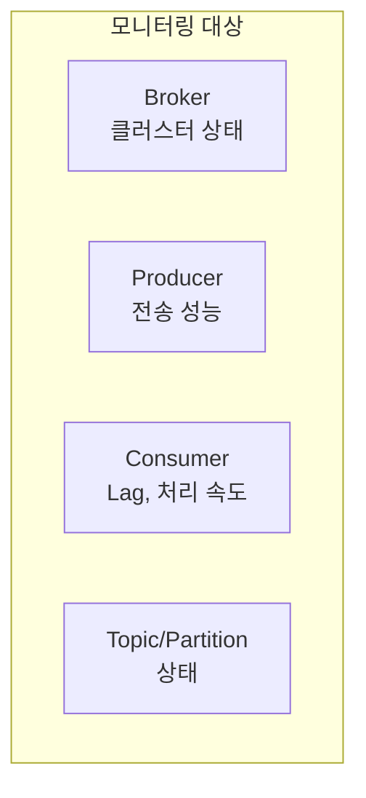
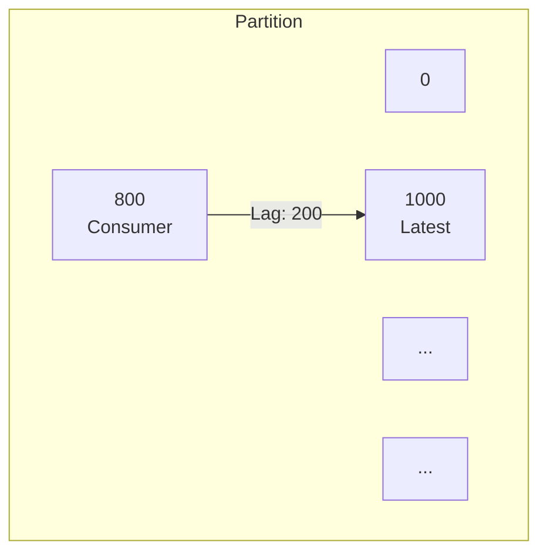
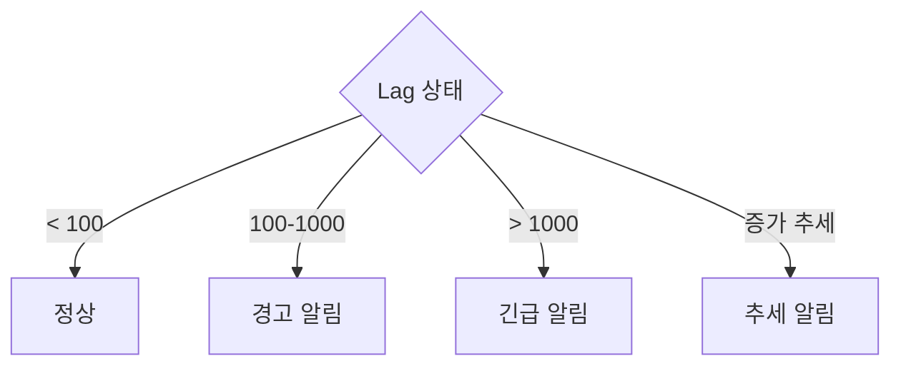
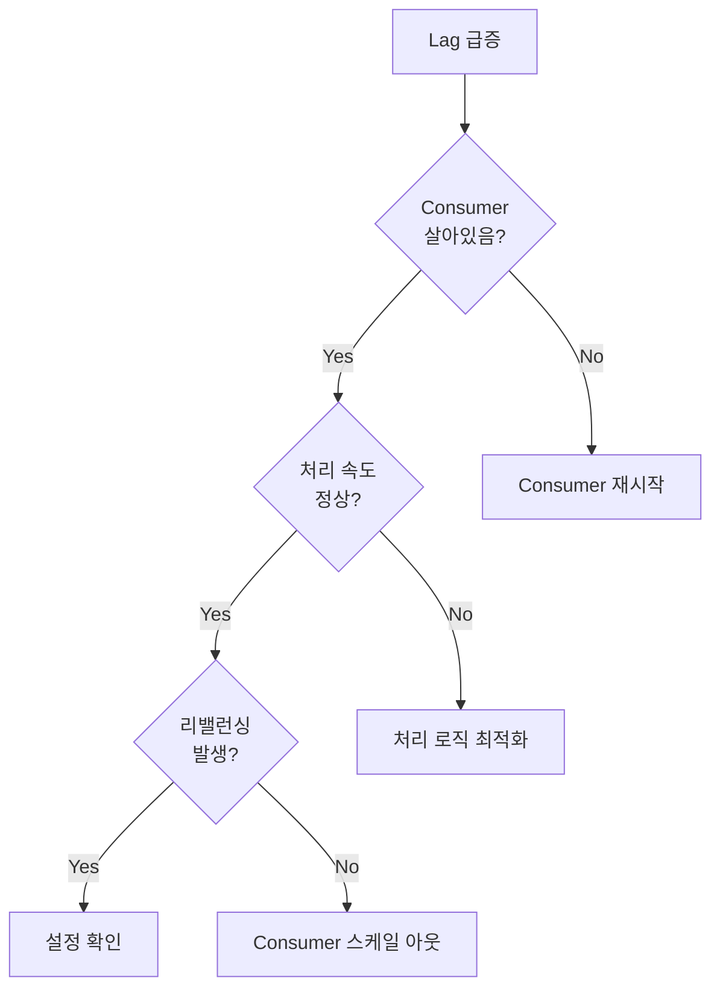
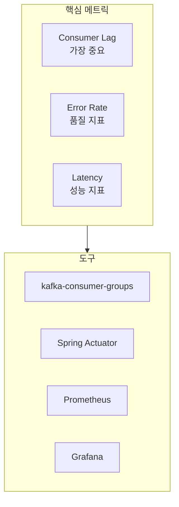

# 모니터링 기초

Kafka 클러스터와 애플리케이션의 핵심 메트릭을 이해합니다.

## 모니터링 대상



## Consumer Lag

가장 중요한 메트릭입니다.

### Lag이란?

```
Partition 0:
├── Log End Offset (LEO): 1000  (최신 메시지)
├── Consumer Offset: 800       (현재 위치)
└── Lag: 200                   (처리 대기)
```



### Lag 의미

| Lag 상태 | 의미 | 조치 |
|----------|------|------|
| **0** | 실시간 처리 | 정상 |
| **일정 수치** | 안정적 처리 | 정상 |
| **증가 추세** | 처리 속도 < 생산 속도 | 조치 필요 |
| **급증** | 처리 중단 | 긴급 조치 |

### Lag 모니터링

#### kafka-consumer-groups 명령어

```bash
kafka-consumer-groups.sh \
  --bootstrap-server localhost:9092 \
  --group order-service \
  --describe
```

출력:
```
GROUP           TOPIC           PARTITION  CURRENT-OFFSET  LOG-END-OFFSET  LAG
order-service   orders          0          800             1000            200
order-service   orders          1          750             900             150
order-service   orders          2          820             820             0
```

#### Spring Boot Actuator

```yaml
management:
  endpoints:
    web:
      exposure:
        include: health,metrics,kafka
```

```bash
curl http://localhost:8080/actuator/metrics/kafka.consumer.fetch.manager.records.lag
```

## Broker 메트릭

### 핵심 메트릭

| 메트릭 | 설명 | 주의 수준 |
|--------|------|----------|
| **UnderReplicatedPartitions** | 복제 부족 파티션 수 | > 0 |
| **ActiveControllerCount** | 활성 컨트롤러 수 | != 1 |
| **OfflinePartitionsCount** | 오프라인 파티션 수 | > 0 |
| **RequestHandlerAvgIdlePercent** | 핸들러 유휴율 | < 30% |

### JMX 메트릭 확인

```bash
# JMX 활성화 (브로커 시작 시)
KAFKA_JMX_OPTS="-Dcom.sun.management.jmxremote -Dcom.sun.management.jmxremote.port=9999"
```

### 주요 JMX Bean

```
kafka.server:type=ReplicaManager,name=UnderReplicatedPartitions
kafka.controller:type=KafkaController,name=ActiveControllerCount
kafka.server:type=BrokerTopicMetrics,name=MessagesInPerSec
kafka.network:type=RequestMetrics,name=TotalTimeMs,request=Produce
```

## Producer 메트릭

### Spring Kafka + Micrometer

```yaml
management:
  metrics:
    enable:
      kafka: true
```

### 핵심 메트릭

| 메트릭 | 설명 | 권장 |
|--------|------|------|
| `record-send-rate` | 초당 전송 레코드 | 모니터링 |
| `record-error-rate` | 초당 에러 수 | < 1% |
| `request-latency-avg` | 평균 요청 지연 | < 100ms |
| `batch-size-avg` | 평균 배치 크기 | 배치 효율 확인 |
| `buffer-exhausted-rate` | 버퍼 부족 빈도 | 0 |

```java
// Micrometer로 커스텀 메트릭 추가
@Component
public class KafkaMetrics {

    private final MeterRegistry meterRegistry;
    private final Counter successCounter;
    private final Counter errorCounter;

    public KafkaMetrics(MeterRegistry meterRegistry) {
        this.meterRegistry = meterRegistry;
        this.successCounter = meterRegistry.counter("kafka.producer.success");
        this.errorCounter = meterRegistry.counter("kafka.producer.error");
    }

    public void recordSuccess() {
        successCounter.increment();
    }

    public void recordError() {
        errorCounter.increment();
    }
}
```

## Consumer 메트릭

### 핵심 메트릭

| 메트릭 | 설명 | 주의 |
|--------|------|------|
| `records-lag` | 현재 Lag | 증가 추세 |
| `records-lag-max` | 최대 Lag | 임계값 초과 |
| `records-consumed-rate` | 초당 소비 레코드 | 급격한 감소 |
| `fetch-latency-avg` | 평균 fetch 지연 | 증가 추세 |
| `commit-latency-avg` | 평균 커밋 지연 | > 100ms |

### Lag 알림 설정

```java
@Component
public class LagMonitor {

    private final MeterRegistry meterRegistry;
    private final AlertService alertService;

    @Scheduled(fixedRate = 30000)  // 30초마다
    public void checkLag() {
        Gauge lagGauge = meterRegistry.find("kafka.consumer.fetch.manager.records.lag")
            .gauge();

        if (lagGauge != null && lagGauge.value() > 10000) {
            alertService.sendAlert(
                "Consumer Lag Critical",
                String.format("Current lag: %.0f", lagGauge.value())
            );
        }
    }
}
```

## Prometheus + Grafana

### JMX Exporter 설정

```yaml
# jmx_exporter_config.yaml
rules:
  - pattern: kafka.server<type=(.+), name=(.+)><>Value
    name: kafka_server_$1_$2
    type: GAUGE

  - pattern: kafka.consumer<type=(.+), name=(.+), (.+)=(.+)><>Value
    name: kafka_consumer_$1_$2
    labels:
      $3: $4
    type: GAUGE
```

### Spring Boot 설정

```yaml
management:
  endpoints:
    web:
      exposure:
        include: prometheus,health,metrics
  metrics:
    export:
      prometheus:
        enabled: true
```

### Grafana 대시보드 쿼리 예시

```promql
# Consumer Lag
sum(kafka_consumer_records_lag) by (topic, partition)

# 메시지 처리율
rate(kafka_consumer_records_consumed_total[5m])

# Producer 에러율
rate(kafka_producer_record_error_total[5m])
```

## 알림 설정 가이드

### Lag 기반 알림



### 알림 임계값 예시

| 메트릭 | Warning | Critical |
|--------|---------|----------|
| Consumer Lag | 1,000 | 10,000 |
| Producer Error Rate | 1% | 5% |
| Broker UnderReplicated | 1 | > 1 |
| Request Latency | 100ms | 500ms |

## 로깅 전략

### 구조화된 로깅

```java
@KafkaListener(topics = "orders")
public void consume(ConsumerRecord<String, OrderEvent> record) {
    MDC.put("topic", record.topic());
    MDC.put("partition", String.valueOf(record.partition()));
    MDC.put("offset", String.valueOf(record.offset()));
    MDC.put("key", record.key());

    try {
        processOrder(record.value());
        log.info("메시지 처리 완료");
    } catch (Exception e) {
        log.error("메시지 처리 실패", e);
        throw e;
    } finally {
        MDC.clear();
    }
}
```

### logback 설정

```xml
<appender name="KAFKA_LOG" class="ch.qos.logback.core.rolling.RollingFileAppender">
    <encoder class="net.logstash.logback.encoder.LogstashEncoder">
        <includeMdcKeyName>topic</includeMdcKeyName>
        <includeMdcKeyName>partition</includeMdcKeyName>
        <includeMdcKeyName>offset</includeMdcKeyName>
    </encoder>
</appender>
```

## 트러블슈팅

### Lag 급증 시



### 체크리스트

1. **Consumer 상태 확인**
   ```bash
   kafka-consumer-groups.sh --describe --group order-service
   ```

2. **리밸런싱 확인**
   ```bash
   grep "Rebalancing" /var/log/kafka/server.log
   ```

3. **네트워크 확인**
   ```bash
   netstat -an | grep 9092
   ```

4. **디스크 사용량 확인**
   ```bash
   df -h /var/lib/kafka
   ```

## 정리



| 우선순위 | 메트릭 | 도구 |
|---------|--------|------|
| 1 | Consumer Lag | CLI, Prometheus |
| 2 | Error Rate | Micrometer |
| 3 | Latency | Micrometer |
| 4 | Broker Health | JMX |

## 다음 단계

- [실습 예제](../../examples/) - 배운 개념을 직접 적용해보기
