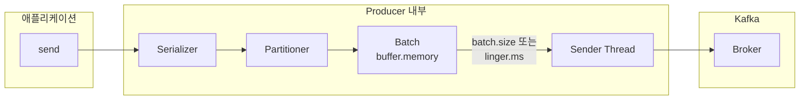
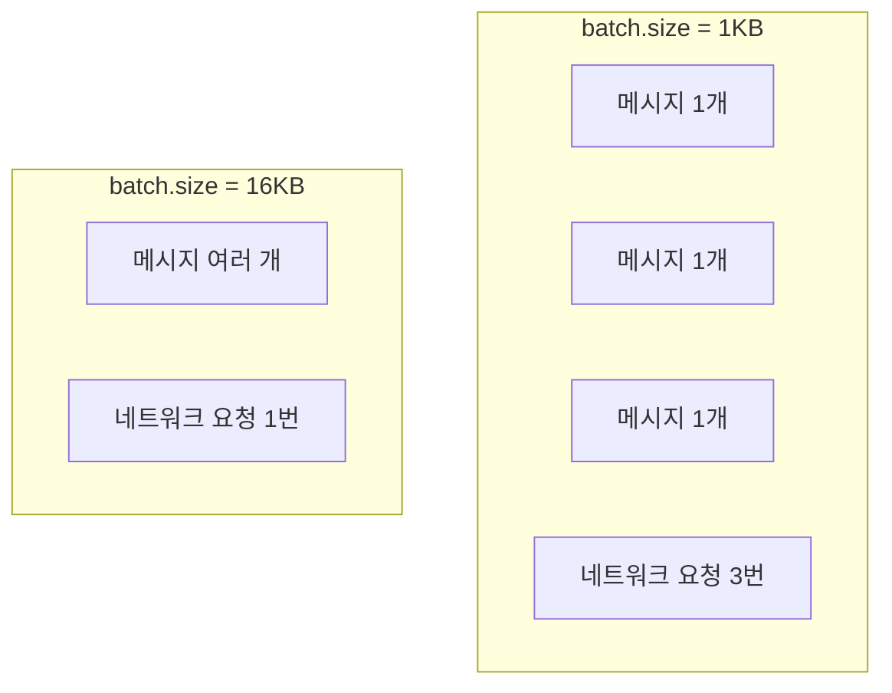
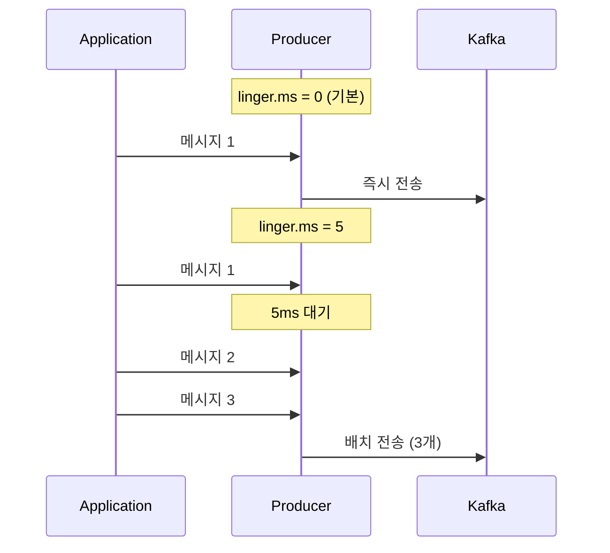
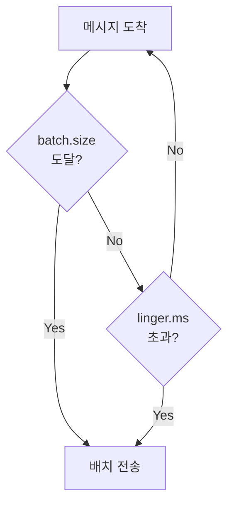
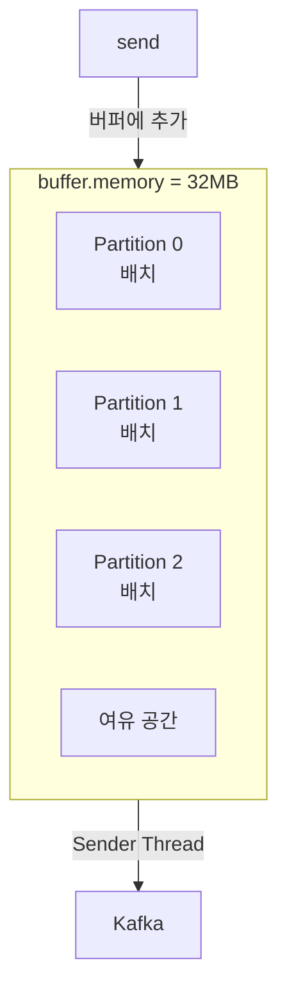
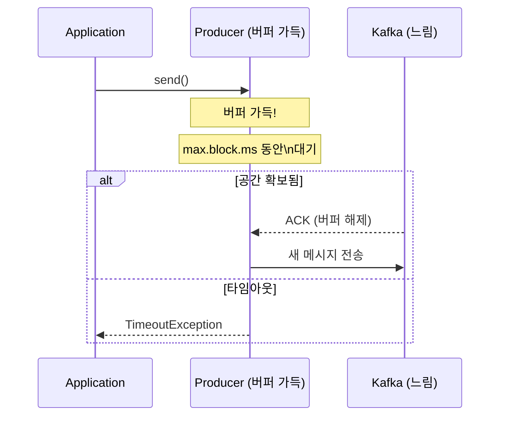
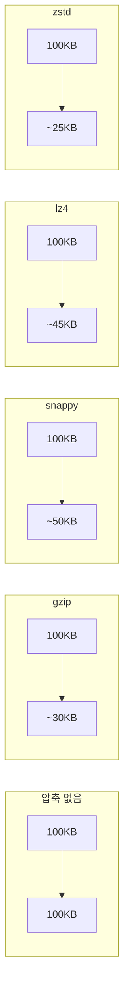
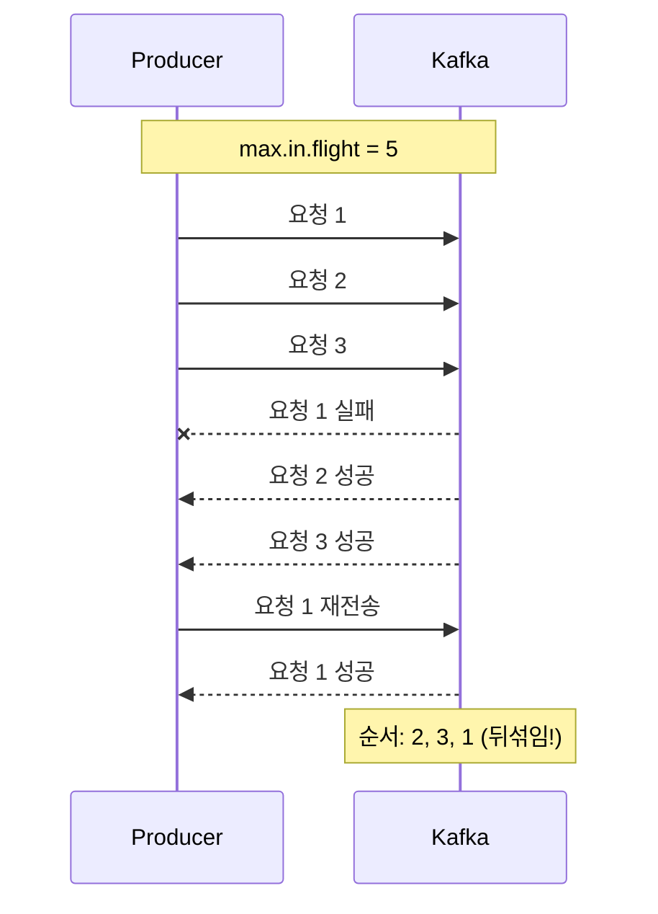
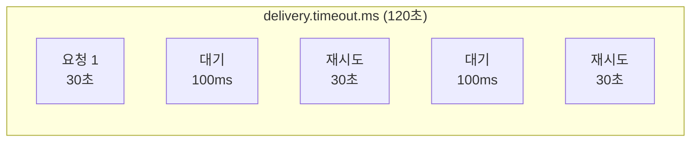
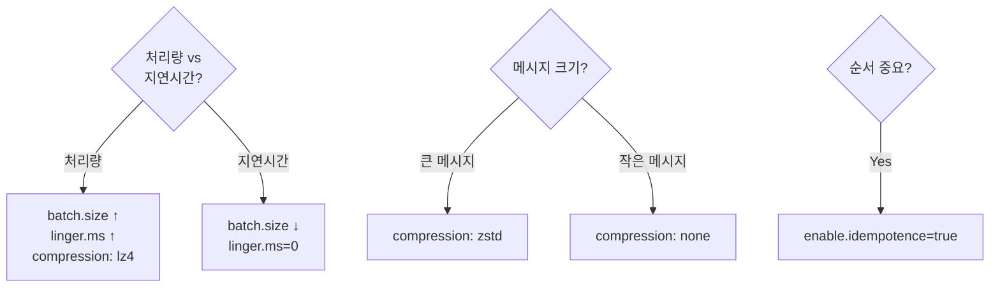

# Producer 튜닝

Producer 성능을 최적화하는 핵심 설정들을 이해합니다.

## Producer 내부 구조



## 핵심 설정 개요

| 설정 | 기본값 | 영향 |
|------|--------|------|
| `batch.size` | 16KB | 배치 크기 |
| `linger.ms` | 0ms | 배치 대기 시간 |
| `buffer.memory` | 32MB | 전체 버퍼 크기 |
| `compression.type` | none | 압축 방식 |
| `max.in.flight.requests.per.connection` | 5 | 동시 요청 수 |

## batch.size

한 번에 전송할 메시지 배치의 최대 크기입니다.

### 동작 원리



### 설정 가이드

```yaml
spring:
  kafka:
    producer:
      batch-size: 16384  # 16KB (기본값)
      # batch-size: 65536  # 64KB (처리량 중시)
      # batch-size: 1024   # 1KB (지연 시간 중시)
```

| 값 | 효과 | 적합한 경우 |
|----|------|------------|
| **작은 값** | 낮은 지연, 낮은 처리량 | 실시간 요구사항 |
| **큰 값** | 높은 처리량, 높은 지연 | 배치 처리 |

## linger.ms

배치가 가득 차지 않아도 전송하기까지 대기하는 시간입니다.

### 동작 원리



### 설정 가이드

```yaml
spring:
  kafka:
    producer:
      properties:
        linger.ms: 5  # 5ms 대기
```

| 값 | 효과 | 적합한 경우 |
|----|------|------------|
| **0 (기본)** | 즉시 전송 | 지연 시간 최소화 |
| **5-10ms** | 적당한 배칭 | 일반적 권장 |
| **100ms+** | 최대 배칭 | 대용량 배치 처리 |

### batch.size + linger.ms 조합



둘 중 하나의 조건이 만족되면 전송됩니다.

## buffer.memory

Producer가 사용할 수 있는 전체 버퍼 메모리입니다.

### 동작 원리



### 버퍼 부족 시



### 설정 가이드

```yaml
spring:
  kafka:
    producer:
      buffer-memory: 33554432  # 32MB (기본값)
      properties:
        max.block.ms: 60000  # 버퍼 대기 최대 시간
```

**권장:** `buffer.memory` > `batch.size` × Partition 수

## compression.type

메시지 압축 방식을 설정합니다.

### 압축 방식 비교



| 방식 | 압축률 | CPU 사용 | 속도 | 권장 |
|------|--------|---------|------|------|
| **none** | 0% | 최저 | 최고 | 작은 메시지 |
| **gzip** | 최고 | 최고 | 최저 | 저장 공간 중시 |
| **snappy** | 중간 | 낮음 | 높음 | **일반 권장** |
| **lz4** | 중간 | 낮음 | 최고 | 고성능 요구 |
| **zstd** | 높음 | 중간 | 높음 | Kafka 2.1+ |

### 설정

```yaml
spring:
  kafka:
    producer:
      compression-type: snappy  # 일반 권장
      # compression-type: lz4   # 고성능
      # compression-type: zstd  # 고압축
```

### 압축의 이점

```
원본 데이터: 100MB
├── 네트워크 전송: 100MB
├── 브로커 저장: 100MB
└── 복제 전송: 200MB (RF=3)

snappy 압축: 50MB
├── 네트워크 전송: 50MB (-50%)
├── 브로커 저장: 50MB (-50%)
└── 복제 전송: 100MB (-50%)
```

## max.in.flight.requests.per.connection

하나의 연결에서 ACK 대기 중인 최대 요청 수입니다.

### 순서 보장 문제



### 해결책

```yaml
# 방법 1: Idempotent Producer (권장)
spring:
  kafka:
    producer:
      properties:
        enable.idempotence: true  # Kafka 3.0+ 기본값
        max.in.flight.requests.per.connection: 5  # 5까지 안전

# 방법 2: in-flight를 1로 제한 (성능 저하)
spring:
  kafka:
    producer:
      properties:
        max.in.flight.requests.per.connection: 1
```

Idempotent Producer는 시퀀스 번호로 순서를 보장합니다.

## 재시도 설정

### 핵심 설정

```yaml
spring:
  kafka:
    producer:
      retries: 2147483647  # Integer.MAX_VALUE (기본값)
      properties:
        delivery.timeout.ms: 120000  # 전체 타임아웃
        retry.backoff.ms: 100  # 재시도 간격
        request.timeout.ms: 30000  # 단일 요청 타임아웃
```

### 타임아웃 관계



**규칙:** `delivery.timeout.ms` >= `request.timeout.ms` + `linger.ms`

## 프로필별 설정 예시

### 처리량 최적화 (Throughput)

```yaml
spring:
  kafka:
    producer:
      acks: all
      batch-size: 65536  # 64KB
      compression-type: lz4
      properties:
        linger.ms: 50
        buffer.memory: 67108864  # 64MB
```

### 지연 시간 최적화 (Latency)

```yaml
spring:
  kafka:
    producer:
      acks: 1  # 또는 all
      batch-size: 1024  # 1KB
      compression-type: none
      properties:
        linger.ms: 0
```

### 균형잡힌 설정 (Balanced)

```yaml
spring:
  kafka:
    producer:
      acks: all
      batch-size: 16384  # 16KB
      compression-type: snappy
      properties:
        linger.ms: 5
        enable.idempotence: true
```

## 설정 튜닝 가이드



## 정리

| 설정 | 처리량 ↑ | 지연시간 ↓ |
|------|----------|-----------|
| `batch.size` | ↑ 크게 | ↓ 작게 |
| `linger.ms` | ↑ 크게 | = 0 |
| `compression.type` | lz4/snappy | none |
| `buffer.memory` | ↑ 크게 | 영향 없음 |

## 다음 단계

- [Consumer 튜닝](../consumer-tuning/) - Consumer 성능 최적화
