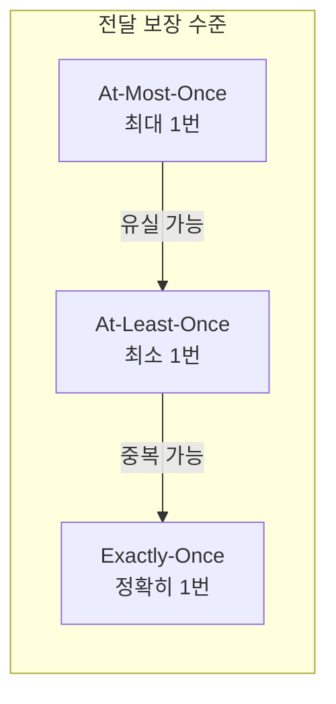
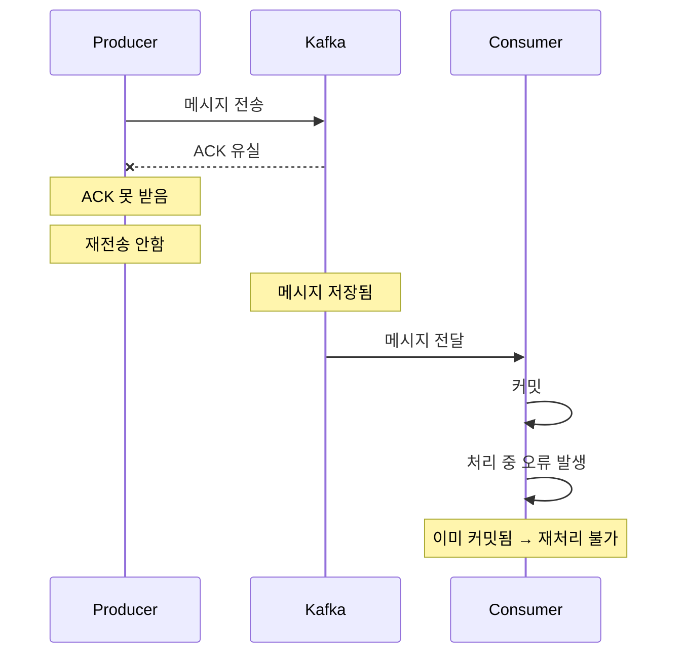
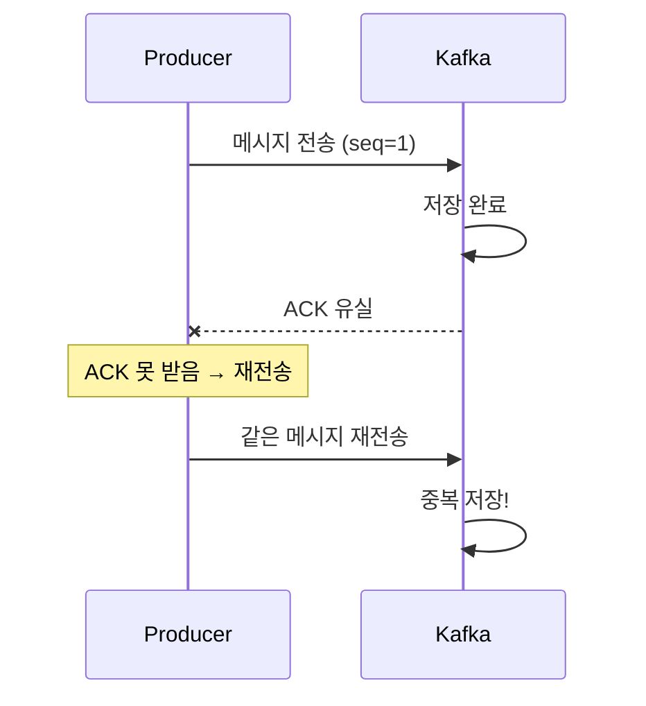
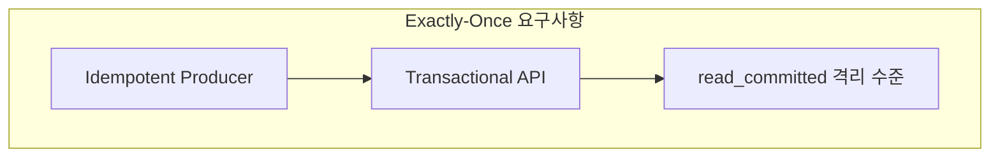
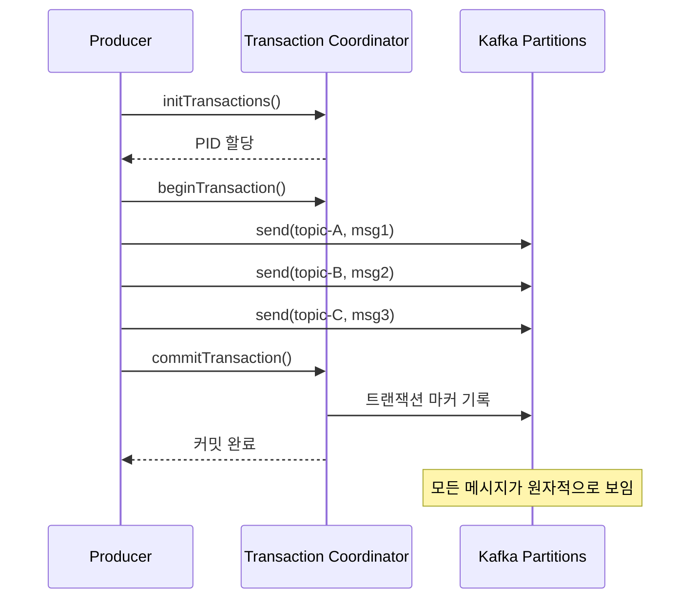
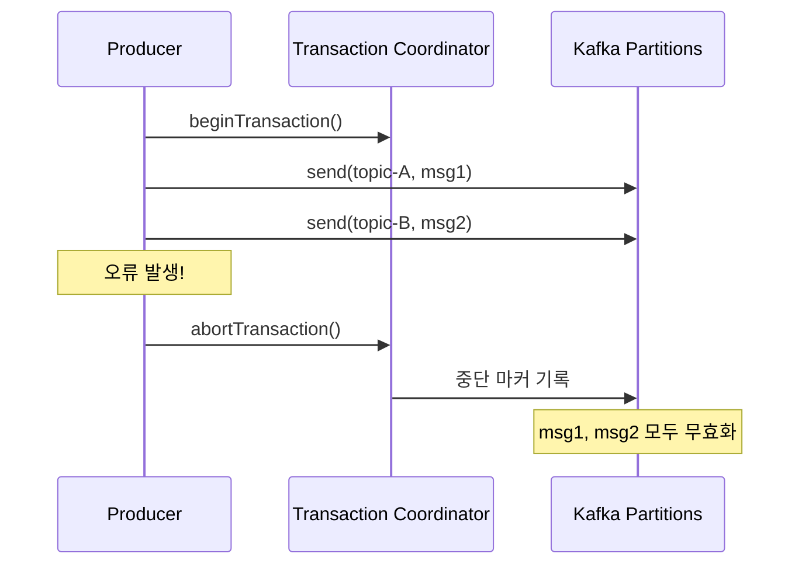
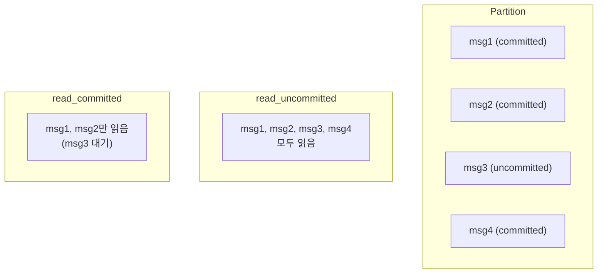
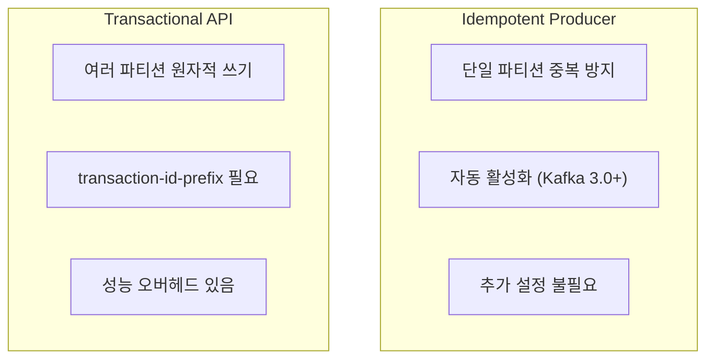
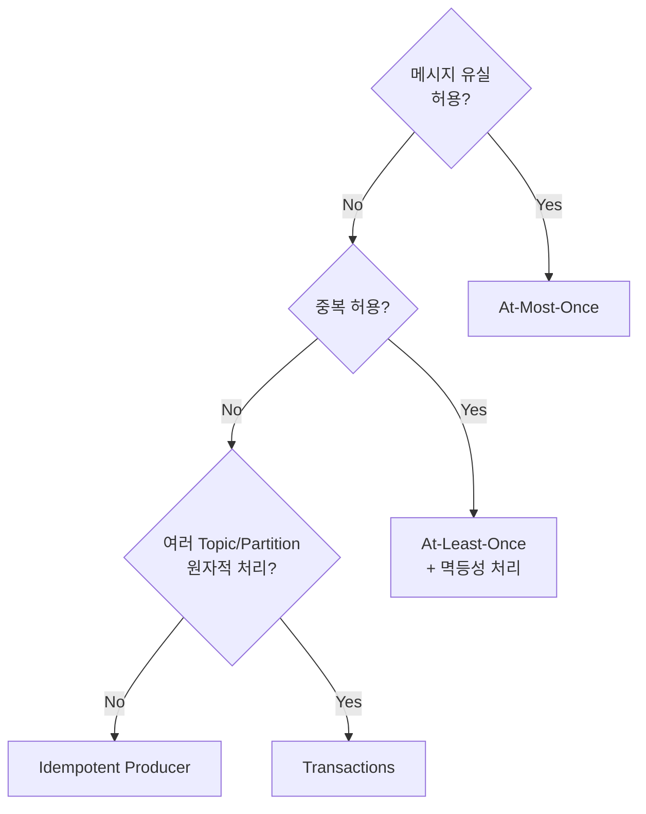
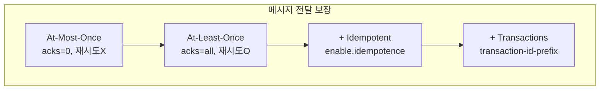

# 트랜잭션과 Exactly-Once Semantics

메시지 전달 보장 수준과 Kafka 트랜잭션을 이해합니다.

## 메시지 전달 보장 수준



### 비교

| 수준 | 유실 | 중복 | 성능 | 구현 복잡도 |
|------|------|------|------|-------------|
| **At-Most-Once** | O | X | 최고 | 낮음 |
| **At-Least-Once** | X | O | 높음 | 중간 |
| **Exactly-Once** | X | X | 중간 | 높음 |

## At-Most-Once

메시지를 **최대 한 번** 전달합니다. 유실될 수 있습니다.



### 구현 방법

```yaml
spring:
  kafka:
    producer:
      acks: 0  # 응답 대기 안함
      retries: 0  # 재시도 안함
```

**사용 사례:** 로그, 메트릭 등 유실해도 괜찮은 데이터

## At-Least-Once

메시지를 **최소 한 번** 전달합니다. 중복될 수 있습니다.



### 구현 방법

```yaml
spring:
  kafka:
    producer:
      acks: all
      retries: 3  # 재시도 활성화
    consumer:
      enable-auto-commit: false  # 수동 커밋
```

**사용 사례:** 일반적인 이벤트 처리 (멱등성 처리 필요)

## Exactly-Once Semantics (EOS)

메시지를 **정확히 한 번** 전달합니다. 유실도 중복도 없습니다.

### EOS 달성 조건



| 구성 요소 | 역할 |
|----------|------|
| **Idempotent Producer** | Producer → Broker 중복 방지 |
| **Transactional API** | 여러 메시지를 원자적으로 처리 |
| **read_committed** | 커밋된 메시지만 읽기 |

## Idempotent Producer 복습

> 이미 [심화 개념](../advanced-concepts/#idempotent-producer-멱등성-프로듀서)에서 다뤘지만, EOS의 기반이므로 다시 정리합니다.

```java
// Producer 설정
enable.idempotence = true  // Kafka 3.0+ 기본값

// 자동으로 설정됨
acks = all
retries = Integer.MAX_VALUE
max.in.flight.requests.per.connection = 5
```

**범위:** 단일 Producer → 단일 Partition의 중복 방지

## Kafka Transactions

여러 Partition에 걸친 **원자적 쓰기**를 보장합니다.

### 트랜잭션 흐름



### 트랜잭션 실패 시



## Spring Kafka 트랜잭션

### 설정

```yaml
spring:
  kafka:
    producer:
      transaction-id-prefix: tx-order-  # 트랜잭션 활성화
      acks: all
      properties:
        enable.idempotence: true
```

### 구현 방법 1: @Transactional

```java
@Service
public class OrderService {

    private final KafkaTemplate<String, OrderEvent> kafkaTemplate;

    @Transactional  // Kafka 트랜잭션
    public void processOrder(Order order) {
        // 여러 메시지가 원자적으로 전송됨
        kafkaTemplate.send("order-events", order.getId(),
            new OrderEvent(order, "CREATED"));

        kafkaTemplate.send("inventory-events", order.getId(),
            new InventoryEvent(order.getItems(), "RESERVE"));

        kafkaTemplate.send("notification-events", order.getId(),
            new NotificationEvent(order.getCustomerId(), "ORDER_RECEIVED"));

        // 하나라도 실패하면 모두 롤백
    }
}
```

### 구현 방법 2: executeInTransaction

```java
@Service
public class OrderService {

    private final KafkaTemplate<String, OrderEvent> kafkaTemplate;

    public void processOrder(Order order) {
        kafkaTemplate.executeInTransaction(operations -> {
            operations.send("order-events", order.getId(),
                new OrderEvent(order, "CREATED"));

            operations.send("inventory-events", order.getId(),
                new InventoryEvent(order.getItems(), "RESERVE"));

            // 예외 발생 시 자동 롤백
            if (order.getTotalAmount().compareTo(BigDecimal.ZERO) <= 0) {
                throw new IllegalStateException("Invalid order amount");
            }

            return true;
        });
    }
}
```

## Consumer의 Exactly-Once

### read_committed 격리 수준

```yaml
spring:
  kafka:
    consumer:
      isolation-level: read_committed  # 기본값: read_uncommitted
```



### Consume-Transform-Produce 패턴

입력을 읽어 변환 후 출력하는 패턴에서 EOS를 적용합니다.

```java
@Component
public class OrderProcessor {

    @KafkaListener(
        topics = "raw-orders",
        groupId = "order-processor"
    )
    @Transactional
    public void process(
            ConsumerRecord<String, RawOrder> record,
            @Header(KafkaHeaders.RECEIVED_PARTITION) int partition,
            Acknowledgment ack) {

        // 1. 메시지 처리
        ProcessedOrder processed = transform(record.value());

        // 2. 결과 전송 (트랜잭션 내)
        kafkaTemplate.send("processed-orders",
            record.key(), processed);

        // 3. 커밋 (트랜잭션 내)
        ack.acknowledge();

        // 모두 원자적으로 커밋됨
    }
}
```

## 트랜잭션 vs 멱등성



| 기능 | Idempotent | Transactional |
|------|------------|---------------|
| **범위** | 단일 Partition | 여러 Partition |
| **중복 방지** | O | O |
| **원자성** | X | O |
| **Consumer 격리** | X | O (read_committed) |
| **성능 영향** | 거의 없음 | 약간 있음 |

## 사용 가이드

### 언제 무엇을 사용하나?



### 권장 설정

```yaml
# 대부분의 경우 권장 (At-Least-Once + 멱등성)
spring:
  kafka:
    producer:
      acks: all
      properties:
        enable.idempotence: true  # Kafka 3.0+ 기본값

# 원자적 멀티 파티션 쓰기가 필요한 경우
spring:
  kafka:
    producer:
      transaction-id-prefix: tx-${spring.application.name}-
      acks: all
    consumer:
      isolation-level: read_committed
```

## 주의사항

### 트랜잭션 타임아웃

```yaml
spring:
  kafka:
    producer:
      properties:
        transaction.timeout.ms: 60000  # 기본 60초
```

트랜잭션이 타임아웃되면 자동으로 중단됩니다.

### 성능 고려

트랜잭션은 추가 오버헤드가 있습니다:

- 트랜잭션 코디네이터와의 통신
- 트랜잭션 마커 기록
- Consumer의 필터링 처리

**대안:** 비즈니스 로직에서 멱등성 보장

```java
// DB 유니크 제약조건으로 멱등성 보장
@Transactional
public void handleOrder(OrderEvent event) {
    if (orderRepository.existsByEventId(event.getEventId())) {
        log.info("이미 처리된 이벤트: {}", event.getEventId());
        return;
    }
    // 처리 로직
    orderRepository.save(order);
}
```

## 정리



| 개념 | 핵심 |
|------|------|
| **Idempotent Producer** | 단일 Partition 중복 방지 |
| **Transactions** | 여러 Partition 원자적 쓰기 |
| **read_committed** | 커밋된 메시지만 읽기 |

## 다음 단계

- [Producer 튜닝](../producer-tuning/) - 성능 최적화 설정
