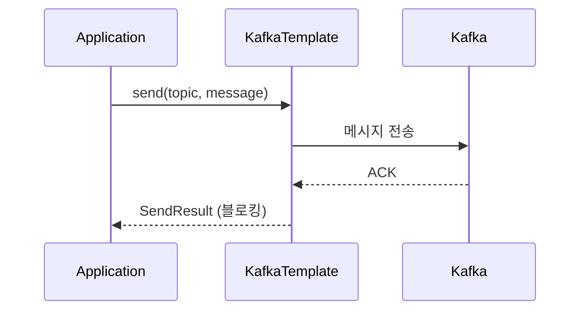
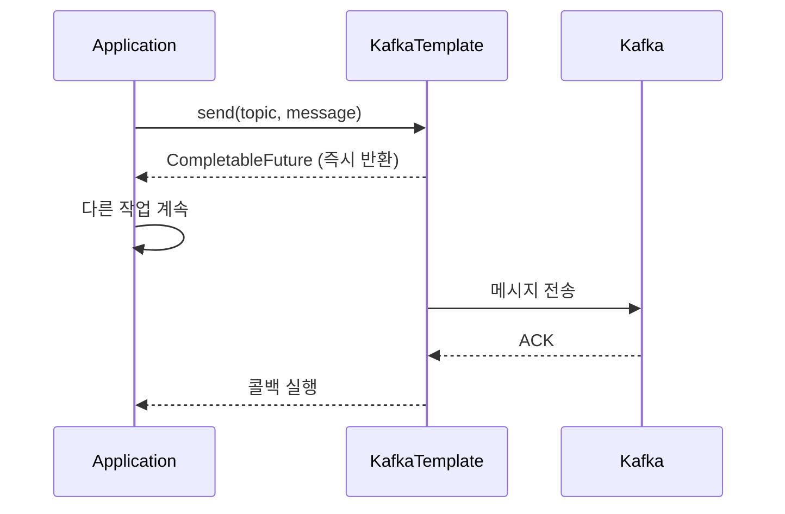
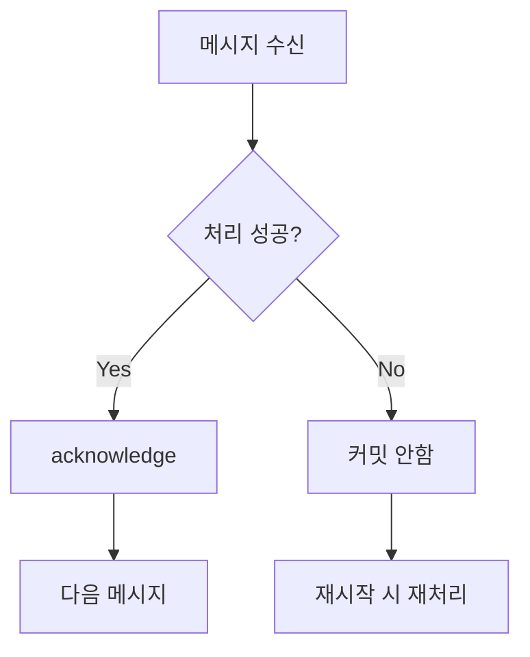
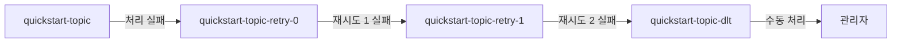

# 기본 Producer/Consumer 예제

Spring Kafka를 사용한 기본적인 메시지 송수신 구현을 설명합니다.

> **사전 학습**: [Quick Start](../../quick-start/)를 먼저 완료하면 이 문서를 더 쉽게 이해할 수 있습니다.

이 문서에서는 Quick Start의 단순한 예제를 확장하여 실무에서 사용하는 패턴들을 학습합니다.

---

## Producer 구현

### KafkaTemplate 주입

```java
@Service
public class MessageProducer {

    private final KafkaTemplate<String, String> kafkaTemplate;

    public MessageProducer(KafkaTemplate<String, String> kafkaTemplate) {
        this.kafkaTemplate = kafkaTemplate;
    }
}
```

> Spring Boot가 자동으로 `KafkaTemplate`을 생성하여 주입합니다.

### 동기 전송

Quick Start에서는 `send()`의 결과를 확인하지 않았습니다. 실무에서는 전송 결과를 확인해야 할 때가 많습니다.

```java
public void sendSync(String topic, String message) {
    try {
        SendResult<String, String> result = kafkaTemplate.send(topic, message).get();

        RecordMetadata metadata = result.getRecordMetadata();
        log.info("전송 완료 - Topic: {}, Partition: {}, Offset: {}",
                metadata.topic(),
                metadata.partition(),
                metadata.offset());
    } catch (Exception e) {
        log.error("전송 실패", e);
        throw new RuntimeException("메시지 전송 실패", e);
    }
}
```



### 비동기 전송

```java
public void sendAsync(String topic, String message) {
    CompletableFuture<SendResult<String, String>> future =
            kafkaTemplate.send(topic, message);

    future.whenComplete((result, ex) -> {
        if (ex == null) {
            log.info("전송 성공: {}", result.getRecordMetadata().offset());
        } else {
            log.error("전송 실패", ex);
        }
    });
}
```



### Key와 함께 전송

```java
public void sendWithKey(String topic, String key, String message) {
    kafkaTemplate.send(topic, key, message);
}
```

**Key 사용 시 장점:**
- 동일 Key는 동일 Partition으로 전송
- 순서 보장 필요 시 필수

### 특정 Partition으로 전송

```java
public void sendToPartition(String topic, int partition, String key, String message) {
    kafkaTemplate.send(topic, partition, key, message);
}
```

---

## Consumer 구현

### 기본 @KafkaListener

Quick Start에서 사용한 가장 기본적인 형태입니다.

```java
@Component
public class MessageConsumer {

    @KafkaListener(topics = "quickstart-topic", groupId = "quickstart-group")
    public void consume(String message) {
        log.info("메시지 수신: {}", message);
    }
}
```

### ConsumerRecord로 수신

메시지 외에 메타데이터도 필요할 때 사용합니다.

```java
@KafkaListener(topics = "quickstart-topic")
public void consume(ConsumerRecord<String, String> record) {
    log.info("Topic: {}", record.topic());
    log.info("Partition: {}", record.partition());
    log.info("Offset: {}", record.offset());
    log.info("Key: {}", record.key());
    log.info("Value: {}", record.value());
    log.info("Timestamp: {}", record.timestamp());
}
```

### 여러 Topic 구독

```java
@KafkaListener(topics = {"topic-a", "topic-b", "topic-c"})
public void consumeMultiple(String message) {
    log.info("메시지 수신: {}", message);
}
```

### 패턴으로 구독

```java
@KafkaListener(topicPattern = "order-.*")
public void consumePattern(String message) {
    // order-created, order-paid, order-shipped 등 모두 수신
    log.info("주문 이벤트: {}", message);
}
```

### 배치 수신

```java
@KafkaListener(topics = "quickstart-topic", batch = "true")
public void consumeBatch(List<String> messages) {
    log.info("배치 수신: {}건", messages.size());
    for (String message : messages) {
        process(message);
    }
}
```

---

## 수동 Offset 커밋

Quick Start에서는 자동 커밋을 사용했습니다. 메시지 처리 실패 시 재처리가 필요하다면 수동 커밋을 사용합니다.

### 설정

```yaml
spring:
  kafka:
    consumer:
      enable-auto-commit: false
    listener:
      ack-mode: manual
```

### 구현

```java
@KafkaListener(topics = "quickstart-topic")
public void consume(String message, Acknowledgment ack) {
    try {
        // 비즈니스 로직 처리
        processMessage(message);

        // 처리 성공 시 커밋
        ack.acknowledge();
    } catch (Exception e) {
        // 처리 실패 시 커밋하지 않음 → 재처리됨
        log.error("처리 실패", e);
    }
}
```



---

## 에러 처리

### ErrorHandler 설정

```java
@Configuration
public class KafkaConfig {

    @Bean
    public DefaultErrorHandler errorHandler() {
        return new DefaultErrorHandler(
            new FixedBackOff(1000L, 3L)  // 1초 간격, 3회 재시도
        );
    }
}
```

### @RetryableTopic 사용

```java
@RetryableTopic(
    attempts = "3",
    backoff = @Backoff(delay = 1000, multiplier = 2)
)
@KafkaListener(topics = "quickstart-topic")
public void consume(String message) {
    // 실패 시 자동 재시도
    // 3회 실패 시 quickstart-topic-dlt로 이동
    processMessage(message);
}
```

### Dead Letter Topic (DLT)



---

## 전체 예제 코드

Quick Start 예제를 확장한 버전입니다.

### Producer (REST API 확장)

Quick Start에서는 단순 문자열만 전송했습니다. 실무에서는 key와 함께 JSON 객체를 전송하는 경우가 많습니다.

```java
@RestController
@RequestMapping("/api/messages")
public class MessageController {

    private final KafkaTemplate<String, String> kafkaTemplate;

    public MessageController(KafkaTemplate<String, String> kafkaTemplate) {
        this.kafkaTemplate = kafkaTemplate;
    }

    // Quick Start와 동일한 단순 전송
    @PostMapping("/simple")
    public ResponseEntity<String> sendSimple(@RequestBody String message) {
        kafkaTemplate.send("quickstart-topic", message);
        return ResponseEntity.ok("메시지 전송 완료: " + message);
    }

    // 확장: Key와 Topic을 지정하여 전송
    @PostMapping("/advanced")
    public ResponseEntity<String> sendAdvanced(@RequestBody MessageRequest request) {
        kafkaTemplate.send(request.topic(), request.key(), request.message());
        return ResponseEntity.ok("메시지 전송 완료");
    }
}

record MessageRequest(String topic, String key, String message) {}
```

**API 사용 예시:**

```bash
# Quick Start와 동일한 방식
curl -X POST http://localhost:8080/api/messages/simple \
  -H "Content-Type: text/plain" \
  -d "Hello Kafka!"

# 확장된 방식 (Key와 Topic 지정)
curl -X POST http://localhost:8080/api/messages/advanced \
  -H "Content-Type: application/json" \
  -d '{"topic": "quickstart-topic", "key": "user-123", "message": "Hello!"}'
```

### Consumer (수동 커밋)

```java
@Component
@Slf4j
public class MessageConsumer {

    @KafkaListener(
        topics = "quickstart-topic",
        groupId = "quickstart-group"
    )
    public void consume(
            ConsumerRecord<String, String> record,
            Acknowledgment ack) {

        log.info("수신 - Partition: {}, Offset: {}, Key: {}, Value: {}",
                record.partition(),
                record.offset(),
                record.key(),
                record.value());

        try {
            processMessage(record.value());
            ack.acknowledge();
        } catch (Exception e) {
            log.error("처리 실패: {}", record.value(), e);
            // 재시도 로직 또는 DLT 전송
        }
    }

    private void processMessage(String message) {
        // 비즈니스 로직
    }
}
```

---

## 테스트

### 임베디드 Kafka

```java
@SpringBootTest
@EmbeddedKafka(partitions = 1, topics = {"quickstart-topic"})
class KafkaIntegrationTest {

    @Autowired
    private KafkaTemplate<String, String> kafkaTemplate;

    @Test
    void testSendAndReceive() throws Exception {
        kafkaTemplate.send("quickstart-topic", "test-message").get();

        // Consumer 검증 로직
    }
}
```

---

## 정리

| 구분 | 클래스/어노테이션 | 용도 |
|------|-----------------|------|
| **Producer** | `KafkaTemplate` | 메시지 전송 |
| **Consumer** | `@KafkaListener` | 메시지 수신 |
| **수동 커밋** | `Acknowledgment` | 처리 완료 확인 |
| **에러 처리** | `@RetryableTopic` | 재시도 및 DLT |

## Quick Start vs 기본 예제

| 항목 | Quick Start | 기본 예제 |
|------|-------------|-----------|
| 전송 방식 | Fire-and-forget | 동기/비동기 선택 |
| Offset 커밋 | 자동 | 수동 가능 |
| 에러 처리 | 없음 | 재시도 + DLT |
| Key 사용 | 없음 | 지원 |

---

## 다음 단계

- [주문 시스템](../order-system/) - 실전 예제
