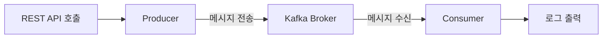
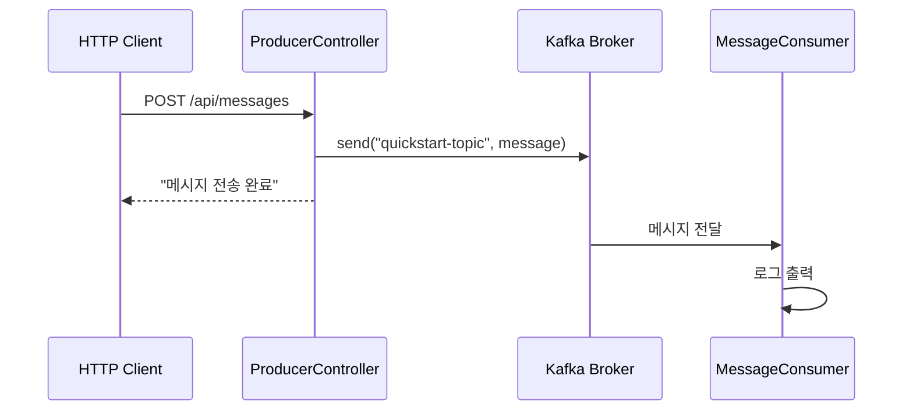

# Quick Start

5분 만에 Kafka 메시지 송수신을 경험해보세요.

## 전체 흐름



## 준비물

- **Docker Desktop** 또는 Docker Engine
- **Java 17+**
- **IDE** (IntelliJ IDEA, VS Code 등)

## Step 1: Kafka 시작

이 저장소의 루트 디렉토리에서 Docker Compose로 Kafka를 실행합니다.

```bash
# 저장소 루트의 docker 디렉토리로 이동
cd docker
docker-compose up -d
```

> **docker-compose.yml이 없다면?**
> [환경 구성 가이드](../examples/setup/)에서 docker-compose.yml 내용을 확인하고 `docker/docker-compose.yml`로 저장하세요.

정상 실행 확인:

```bash
docker-compose ps
```

예상 결과:
```
NAME      COMMAND                  STATUS
kafka     "/etc/kafka/docker..."   Up
```

> **참고:** Kafka가 완전히 시작되기까지 10-20초 정도 걸릴 수 있습니다.

## Step 2: 예제 프로젝트 실행

새 터미널에서 Quick Start 예제를 실행합니다.

```bash
# 저장소 루트에서 예제 디렉토리로 이동
cd examples/quick-start
./gradlew bootRun
```

> **Windows 사용자:** `gradlew.bat bootRun`

실행 완료 시 다음 로그가 표시됩니다:
```
Started QuickStartApplication in X.XXX seconds
```

## Step 3: 메시지 전송

새 터미널에서 REST API로 메시지를 전송합니다.

```bash
curl -X POST http://localhost:8080/api/messages \
  -H "Content-Type: text/plain" \
  -d "Hello Kafka!"
```

응답:
```
메시지 전송 완료: Hello Kafka!
```

## Step 4: 메시지 수신 확인

**Spring Boot 애플리케이션이 실행 중인 터미널**에서 Consumer가 메시지를 수신한 로그를 확인합니다.

```
INFO  c.e.quickstart.MessageConsumer : 메시지 수신: Hello Kafka!
```

**축하합니다!** Kafka를 통한 메시지 송수신에 성공했습니다.

## 종료

```bash
# Spring Boot 애플리케이션: Ctrl+C

# Kafka 종료 (docker 디렉토리에서)
cd docker
docker-compose down
```

---

## 무엇이 일어났나요?



1. **HTTP 요청**: curl로 메시지를 전송했습니다
2. **Producer**: `ProducerController`가 메시지를 Kafka에 발행했습니다
3. **Kafka Broker**: 메시지를 `quickstart-topic`에 저장했습니다
4. **Consumer**: `MessageConsumer`가 메시지를 수신하고 로그로 출력했습니다

> **토픽은 언제 생성되나요?**
> Kafka는 기본적으로 존재하지 않는 토픽에 메시지를 보내면 자동으로 토픽을 생성합니다 (`auto.create.topics.enable=true`).

---

## 코드 살펴보기

Quick Start 예제가 어떻게 구성되어 있는지 살펴봅니다.

### Producer (메시지 전송)

```java
// ProducerController.java
@RestController
@RequestMapping("/api/messages")
public class ProducerController {

    private static final String TOPIC = "quickstart-topic";
    private final KafkaTemplate<String, String> kafkaTemplate;

    public ProducerController(KafkaTemplate<String, String> kafkaTemplate) {
        this.kafkaTemplate = kafkaTemplate;
    }

    @PostMapping
    public String sendMessage(@RequestBody String message) {
        kafkaTemplate.send(TOPIC, message);
        return "메시지 전송 완료: " + message;
    }
}
```

**핵심 포인트:**
- `KafkaTemplate`: Spring Kafka가 제공하는 메시지 전송 클래스
- `send(topic, message)`: 지정한 토픽에 메시지를 전송

### Consumer (메시지 수신)

```java
// MessageConsumer.java
@Component
public class MessageConsumer {

    private static final Logger log = LoggerFactory.getLogger(MessageConsumer.class);

    @KafkaListener(topics = "quickstart-topic", groupId = "quickstart-group")
    public void consume(String message) {
        log.info("메시지 수신: {}", message);
    }
}
```

**핵심 포인트:**
- `@KafkaListener`: 지정한 토픽의 메시지를 자동으로 수신
- `groupId`: Consumer Group ID - 같은 그룹의 Consumer들은 메시지를 분배받음

### 설정 (application.yml)

```yaml
spring:
  kafka:
    bootstrap-servers: localhost:9092
    consumer:
      group-id: quickstart-group
      auto-offset-reset: earliest
    producer:
      key-serializer: org.apache.kafka.common.serialization.StringSerializer
      value-serializer: org.apache.kafka.common.serialization.StringSerializer
```

**핵심 포인트:**
- `bootstrap-servers`: Kafka 브로커 주소
- `auto-offset-reset: earliest`: Consumer 시작 시 가장 오래된 메시지부터 읽음

---

## 트러블슈팅

### Kafka 연결 실패

```
Connection to node -1 could not be established
```

**해결방법:**
1. Docker가 실행 중인지 확인: `docker ps`
2. Kafka 컨테이너 상태 확인: `docker-compose ps`
3. Kafka가 완전히 시작될 때까지 대기 (최대 30초)
4. Kafka 재시작: `docker-compose restart`

### 포트 충돌

```
Port 9092 is already in use
```

**해결방법:**
1. 기존 Kafka 프로세스 종료
2. 또는 `docker-compose.yml`에서 포트 변경

### Gradle 빌드 실패

```
Could not resolve dependencies
```

**해결방법:**
1. Java 17+ 설치 확인: `java -version`
2. Gradle 캐시 정리: `./gradlew clean`

### Consumer 로그가 안 보여요

메시지를 전송했는데 Consumer 로그가 출력되지 않는다면:

1. **Spring Boot가 실행 중인 터미널**을 확인하세요 (curl을 실행한 터미널이 아님)
2. 애플리케이션 시작 로그에서 `KafkaMessageListenerContainer` 관련 로그가 있는지 확인
3. 없다면 Kafka 연결에 문제가 있을 수 있습니다

---

## 다음 단계

Quick Start를 완료했다면, 다음 단계로 진행하세요:

| 목표 | 추천 문서 |
|------|----------|
| Kafka 개념 이해하기 | [핵심 구성요소](../concepts/core-components/) |
| 더 복잡한 예제 실습 | [기본 예제](../examples/basic/) |
| 프로덕션 설정 알아보기 | [환경 구성](../examples/setup/) |
