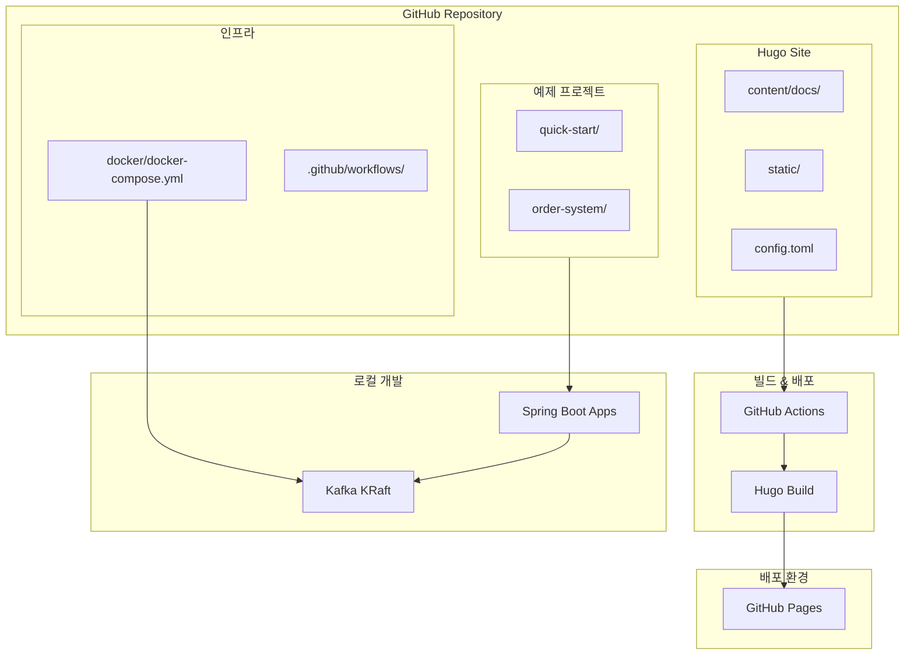
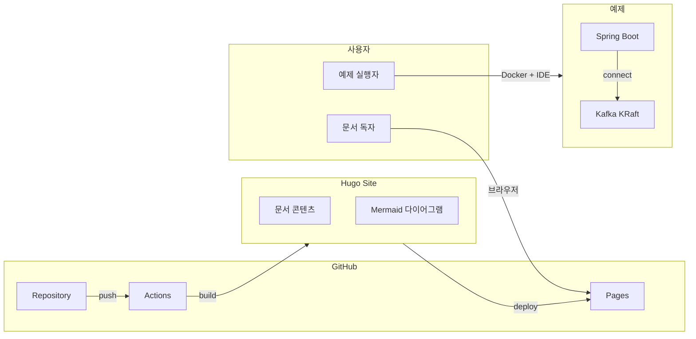
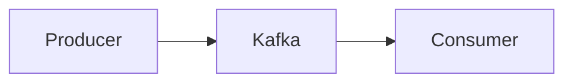

# Kafka Guidance 101 Architecture Document

## Introduction

이 문서는 Kafka Guidance 101 프로젝트의 전체 아키텍처를 정의합니다. Hugo 정적 사이트, Spring Boot 예제 프로젝트, GitHub Actions 배포 파이프라인을 포함한 기술적 설계를 다룹니다.

### Starter Template or Existing Project

- **Starter Template:** N/A (처음부터 구축)
- **Hugo Theme:** hugo-book (문서 사이트에 최적화된 테마)

### Change Log

| Date | Version | Description | Author |
|------|---------|-------------|--------|
| 2024-12-25 | 0.1 | 초안 작성 | BMad Master |

---

## High Level Architecture

### Technical Summary

Kafka Guidance 101은 Hugo 정적 사이트 생성기를 사용한 문서 사이트와 독립적인 Spring Boot 예제 프로젝트들로 구성됩니다. Monorepo 구조로 문서와 예제를 함께 관리하며, GitHub Actions를 통해 GitHub Pages에 자동 배포됩니다. Mermaid.js를 통해 다이어그램을 렌더링하고, Docker Compose로 로컬 Kafka 환경을 제공합니다.

### High Level Overview

1. **Architectural Style:** 정적 사이트 + 독립 예제 프로젝트
2. **Repository Structure:** Monorepo (문서 + 예제 + 인프라)
3. **배포:** GitHub Pages (정적 호스팅)
4. **예제 실행:** Docker Compose (Kafka KRaft) + Spring Boot

### High Level Project Diagram



### Architectural and Design Patterns

| Pattern | Description | Rationale |
|---------|-------------|-----------|
| **Static Site Generation** | Hugo로 빌드 시점에 HTML 생성 | 빠른 로딩, 무료 호스팅, SEO 친화적 |
| **Monorepo** | 문서 + 예제 + 인프라 통합 관리 | 버전 동기화, 단일 PR로 문서+코드 변경 |
| **Infrastructure as Code** | Docker Compose로 로컬 환경 정의 | 재현 가능한 개발 환경 |
| **CI/CD** | GitHub Actions 자동 배포 | 푸시 시 자동 빌드 및 배포 |

---

## Tech Stack

### Cloud Infrastructure

- **Provider:** GitHub (Pages + Actions)
- **Key Services:** GitHub Pages (호스팅), GitHub Actions (CI/CD)
- **비용:** 무료

### Technology Stack Table

| Category | Technology | Version | Purpose | Rationale |
|----------|------------|---------|---------|-----------|
| **Static Site** | Hugo | 0.121+ | 정적 사이트 생성 | 빠른 빌드, Go 템플릿, 다양한 테마 |
| **Theme** | hugo-book | latest | 문서 테마 | 깔끔한 UI, 사이드바 네비게이션, 검색 지원 |
| **Diagram** | Mermaid.js | 10.x | 다이어그램 렌더링 | Markdown 통합, 다양한 다이어그램 지원 |
| **Language** | Java | 17 | 예제 코드 | LTS 버전, Spring Boot 3.x 호환 |
| **Framework** | Spring Boot | 3.2.x | 예제 프로젝트 | 최신 LTS, Spring Kafka 통합 |
| **Kafka Client** | Spring Kafka | 3.1.x | Kafka 연동 | Spring Boot 통합, 자동 설정 |
| **Container** | Docker | 24.x | Kafka 로컬 실행 | 표준 컨테이너 런타임 |
| **Orchestration** | Docker Compose | 2.x | 멀티 컨테이너 관리 | 간편한 로컬 환경 구성 |
| **Kafka** | Apache Kafka | 3.6.x | 메시지 브로커 | KRaft 모드 지원, 최신 안정 버전 |
| **Build Tool** | Gradle | 8.x | Java 빌드 | Kotlin DSL, 빠른 빌드 |
| **CI/CD** | GitHub Actions | - | 자동 배포 | GitHub 통합, 무료 |

---

## Components

### Hugo Site Component

**Responsibility:** Markdown 문서를 정적 HTML 사이트로 변환

**Key Interfaces:**
- `content/docs/**/*.md` - 문서 소스
- `config.toml` - 사이트 설정
- `public/` - 빌드 결과물

**Dependencies:** hugo-book theme, Mermaid.js

**Technology Stack:** Hugo, Markdown, HTML/CSS/JS

### Example Projects Component

**Responsibility:** 실행 가능한 Spring Boot Kafka 예제 제공

**Key Interfaces:**
- 각 예제별 독립 실행 가능한 Spring Boot 프로젝트
- 공통 Docker Compose 파일 참조

**Dependencies:** Spring Boot, Spring Kafka, Kafka Broker

**Technology Stack:** Java 17, Spring Boot 3.2, Gradle

### Docker Infrastructure Component

**Responsibility:** 로컬 Kafka 개발 환경 제공

**Key Interfaces:**
- `docker/docker-compose.yml` - Kafka 클러스터 정의
- `localhost:9092` - Kafka Broker 접근점

**Dependencies:** Docker, Docker Compose

**Technology Stack:** Apache Kafka (KRaft mode)

### CI/CD Component

**Responsibility:** 자동 빌드 및 GitHub Pages 배포

**Key Interfaces:**
- `.github/workflows/deploy.yml` - 배포 워크플로우
- `main` 브랜치 푸시 트리거

**Dependencies:** GitHub Actions, Hugo

**Technology Stack:** GitHub Actions, Hugo CLI

### Component Diagram



---

## Source Tree

```
kafka-guidance-101/
├── .github/
│   └── workflows/
│       └── deploy.yml              # GitHub Actions 배포 워크플로우
├── content/                        # Hugo 콘텐츠
│   └── docs/
│       ├── _index.md               # 메인 페이지
│       ├── quick-start/
│       │   └── _index.md           # Quick Start 가이드
│       ├── concepts/
│       │   ├── _index.md           # 개념 이해 인덱스
│       │   ├── core-components.md  # 핵심 구성요소
│       │   ├── message-flow.md     # 메시지 흐름
│       │   ├── consumer-group-offset.md
│       │   ├── replication.md
│       │   └── advanced-concepts.md
│       ├── examples/
│       │   ├── _index.md           # 실습 예제 인덱스
│       │   ├── setup.md            # 환경 구성
│       │   ├── basic.md            # 기본 예제
│       │   └── order-system.md     # 주문 시스템
│       └── appendix/
│           ├── _index.md
│           ├── glossary.md         # 용어 사전
│           └── references.md       # 참고 자료
├── examples/                       # 예제 프로젝트
│   ├── quick-start/
│   │   ├── build.gradle.kts
│   │   ├── settings.gradle.kts
│   │   ├── src/
│   │   │   └── main/
│   │   │       ├── java/
│   │   │       │   └── com/example/quickstart/
│   │   │       │       ├── QuickStartApplication.java
│   │   │       │       ├── ProducerController.java
│   │   │       │       └── MessageConsumer.java
│   │   │       └── resources/
│   │   │           └── application.yml
│   │   └── README.md
│   └── order-system/
│       ├── build.gradle.kts
│       ├── src/
│       │   └── main/
│       │       └── java/
│       │           └── com/example/order/
│       │               ├── OrderSystemApplication.java
│       │               ├── domain/
│       │               │   ├── Order.java
│       │               │   └── OrderEvent.java
│       │               ├── producer/
│       │               │   └── OrderProducer.java
│       │               └── consumer/
│       │                   └── OrderConsumer.java
│       └── README.md
├── docker/
│   └── docker-compose.yml          # Kafka KRaft 설정
├── static/                         # Hugo 정적 파일
│   └── images/
├── themes/                         # Hugo 테마 (git submodule)
│   └── hugo-book/
├── config.toml                     # Hugo 설정
├── .gitignore
└── README.md                       # 프로젝트 소개
```

---

## Infrastructure and Deployment

### Infrastructure as Code

- **Tool:** Docker Compose
- **Location:** `docker/docker-compose.yml`
- **Approach:** 로컬 개발 환경 정의

### Docker Compose Configuration

```yaml
# docker/docker-compose.yml
version: '3.8'

services:
  kafka:
    image: apache/kafka:3.6.1
    hostname: kafka
    container_name: kafka
    ports:
      - "9092:9092"
    environment:
      KAFKA_NODE_ID: 1
      KAFKA_PROCESS_ROLES: broker,controller
      KAFKA_LISTENERS: PLAINTEXT://0.0.0.0:9092,CONTROLLER://0.0.0.0:9093
      KAFKA_ADVERTISED_LISTENERS: PLAINTEXT://localhost:9092
      KAFKA_CONTROLLER_LISTENER_NAMES: CONTROLLER
      KAFKA_LISTENER_SECURITY_PROTOCOL_MAP: CONTROLLER:PLAINTEXT,PLAINTEXT:PLAINTEXT
      KAFKA_CONTROLLER_QUORUM_VOTERS: 1@kafka:9093
      KAFKA_OFFSETS_TOPIC_REPLICATION_FACTOR: 1
      KAFKA_TRANSACTION_STATE_LOG_REPLICATION_FACTOR: 1
      KAFKA_TRANSACTION_STATE_LOG_MIN_ISR: 1
      KAFKA_LOG_DIRS: /var/lib/kafka/data
      CLUSTER_ID: MkU3OEVBNTcwNTJENDM2Qk
    volumes:
      - kafka-data:/var/lib/kafka/data

volumes:
  kafka-data:
```

### Deployment Strategy

- **Strategy:** GitHub Pages 정적 배포
- **CI/CD Platform:** GitHub Actions
- **Pipeline Configuration:** `.github/workflows/deploy.yml`

### GitHub Actions Workflow

```yaml
# .github/workflows/deploy.yml
name: Deploy Hugo Site

on:
  push:
    branches:
      - main
  workflow_dispatch:

permissions:
  contents: read
  pages: write
  id-token: write

concurrency:
  group: "pages"
  cancel-in-progress: false

defaults:
  run:
    shell: bash

jobs:
  build:
    runs-on: ubuntu-latest
    steps:
      - name: Checkout
        uses: actions/checkout@v4
        with:
          submodules: recursive
          fetch-depth: 0

      - name: Setup Hugo
        uses: peaceiris/actions-hugo@v2
        with:
          hugo-version: '0.121.0'
          extended: true

      - name: Setup Pages
        id: pages
        uses: actions/configure-pages@v4

      - name: Build
        env:
          HUGO_ENVIRONMENT: production
        run: |
          hugo \
            --minify \
            --baseURL "${{ steps.pages.outputs.base_url }}/"

      - name: Upload artifact
        uses: actions/upload-pages-artifact@v2
        with:
          path: ./public

  deploy:
    environment:
      name: github-pages
      url: ${{ steps.deployment.outputs.page_url }}
    runs-on: ubuntu-latest
    needs: build
    steps:
      - name: Deploy to GitHub Pages
        id: deployment
        uses: actions/deploy-pages@v3
```

### Environments

- **Development:** 로컬 Hugo 서버 (`hugo server -D`)
- **Production:** GitHub Pages

### Promotion Flow

```
Local Development
      │
      ▼
   Git Push (main)
      │
      ▼
 GitHub Actions Build
      │
      ▼
 GitHub Pages Deploy
      │
      ▼
  Production Site
```

---

## Mermaid.js Integration

### Hugo Book Theme Configuration

Hugo Book 테마는 Mermaid.js를 기본 지원합니다. `config.toml`에서 활성화:

```toml
# config.toml
[params]
  BookToC = true
  BookMenuBundle = '/menu'
  BookSection = 'docs'
  BookRepo = 'https://github.com/username/kafka-guidance-101'
  BookEditPath = 'edit/main/content'

  # Mermaid support
  BookMermaid = true
```

### Usage in Markdown

````markdown

````

---

## Coding Standards

### Core Standards

- **Languages & Runtimes:** Java 17, Spring Boot 3.2.x
- **Build Tool:** Gradle (Kotlin DSL)
- **Code Style:** Google Java Style Guide

### Naming Conventions

| Element | Convention | Example |
|---------|------------|---------|
| Package | lowercase | `com.example.quickstart` |
| Class | PascalCase | `OrderProducer` |
| Method | camelCase | `sendMessage()` |
| Constant | UPPER_SNAKE | `TOPIC_NAME` |

### Critical Rules

- **모든 예제는 독립 실행 가능:** 각 예제 프로젝트는 다른 예제에 의존하지 않음
- **application.yml 사용:** properties 대신 yml 형식 사용
- **KafkaTemplate 사용:** 저수준 Producer API 대신 Spring 추상화 사용
- **@KafkaListener 사용:** 선언적 Consumer 설정

### Java Specifics

- **Record 사용:** 불변 데이터 클래스에 Java Record 사용
- **var 사용:** 지역 변수 타입 추론 활용
- **Optional 반환:** null 대신 Optional 사용

---

## Test Strategy

### Testing Philosophy

- **Approach:** 예제별 단위 테스트 + 통합 테스트
- **Coverage Goals:** 핵심 로직 80% 이상
- **Test Pyramid:** Unit > Integration

### Test Types

#### Unit Tests

- **Framework:** JUnit 5
- **Mocking:** Mockito
- **Location:** `src/test/java/`

#### Integration Tests

- **Scope:** Kafka 연동 테스트
- **Infrastructure:** Embedded Kafka (spring-kafka-test)
- **Location:** `src/test/java/` (with @EmbeddedKafka)

---

## Security

이 프로젝트는 공개 문서 사이트이므로 보안 요구사항이 최소화됩니다.

### Secrets Management

- **Development:** 로컬 환경 변수
- **Production:** GitHub Secrets (필요시)

### Dependency Security

- **Scanning:** GitHub Dependabot (자동)
- **Update Policy:** 보안 취약점 발견 시 즉시 업데이트

---

## Next Steps

### Development Prompt

이 Architecture 문서를 기반으로 Epic 1 Story 1.1부터 구현을 시작하세요:

1. Hugo 프로젝트 초기화 (`hugo new site .`)
2. hugo-book 테마 추가 (git submodule)
3. config.toml 설정
4. 기본 페이지 생성 및 로컬 테스트

### Checklist

- [ ] Hugo 설치 확인
- [ ] Docker 설치 확인
- [ ] Java 17 설치 확인
- [ ] GitHub Repository 생성
- [ ] GitHub Pages 설정

---

*Generated from PRD: Kafka Guidance 101*
