# Kafka Guidance 프로젝트 브레인스토밍 세션 결과

## 세션 개요

| 항목 | 내용 |
|------|------|
| **주제** | Kafka 가이드 프로젝트 방향 설정 |
| **제약조건** | GitHub Pages + Hugo 정적 사이트 |
| **목표** | Java/Spring Boot 예제 포함 Kafka 가이드 문서 (학습 목적 포함) |
| **사용 기법** | First Principles Thinking, Mind Mapping, Role Playing |
| **세션 상태** | First Principles ✅, Mind Mapping ✅, Role Playing ✅ |

---

## First Principles 분석

### 본질적 문제 정의

> **Kafka가 해결하려는 본질적 문제:**
> 비동기 혹은 준실시간 고용량 데이터 처리를 위한 고가용성 인프라

### 핵심 구성 요소

- Producer
- Consumer
- Broker
- Topic
- Partition

### 본질적 문제와 해결 요소 매핑

| 본질적 문제 | 해결 요소 | 메커니즘 |
|-------------|-----------|----------|
| **고용량 처리** | Partition, Topic | 데이터 분산 + 논리적 분류 |
| **고가용성** | Broker | 클러스터 구성 + Replication |
| **비동기/준실시간** | Producer, Consumer | 발행/구독 분리 (Decoupling) |

---

## 심화 개념 분석

### 1. Consumer Group

**정의:** 병렬 처리 + 중복 방지 + 순서 보장을 위한 논리적 그룹

**핵심 규칙:**

| 규칙 | 설명 |
|------|------|
| **1:1 매핑** | 같은 Group 내에서 1 Partition = 1 Consumer만 담당 |
| **중복 방지** | 같은 메시지를 두 번 처리하지 않음 |
| **순서 보장** | Partition 내 순서가 유지됨 |

**추가 인사이트:**
- 각 Consumer Group은 독립적 → 같은 메시지를 여러 Group이 각자 처리 가능 (Pub/Sub 패턴)

**다이어그램:**

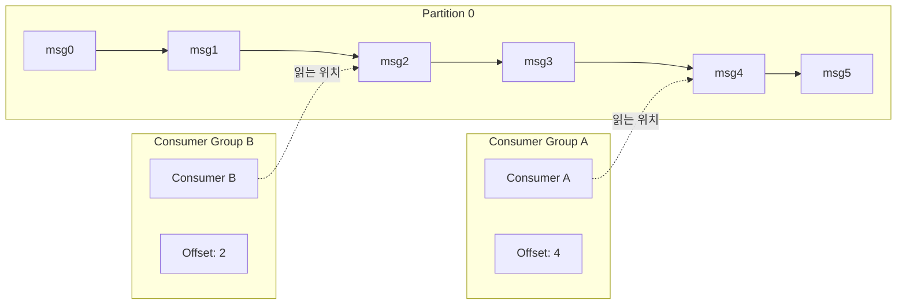

### 2. Offset

**정의:** Consumer Group별 읽기 위치 추적 → 재시작 시 복구 + 중복/누락 방지

**Offset이 해결하는 문제:**
- Consumer 재시작 시 처음부터 다시 읽는 문제 방지
- 어디까지 읽었는지 몰라서 발생하는 중복/누락 방지

**다이어그램:**

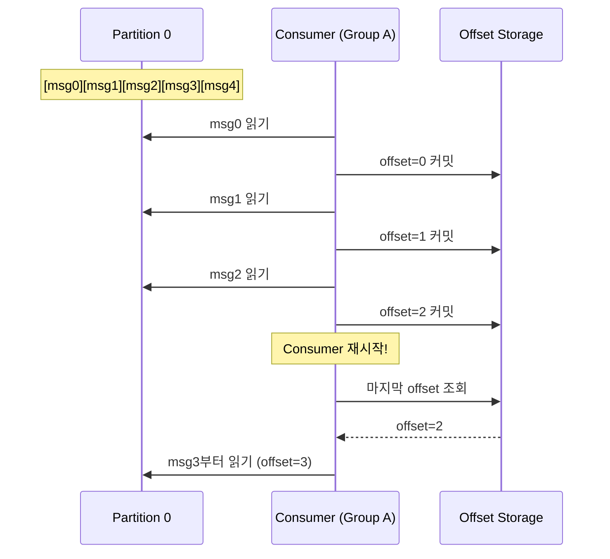

### 3. Replication (Leader/Follower)

**정의:** 데이터 복제를 통한 고가용성 실현 메커니즘

**본질적 문제:**
- Broker 1대가 죽으면 그 안의 데이터가 손실됨
- 단일 장애점(Single Point of Failure) 제거 필요

**핵심 개념:**

| 개념 | 설명 |
|------|------|
| **Leader** | 모든 읽기/쓰기 요청 처리 |
| **Follower** | Leader 데이터를 복제하여 대기 |
| **Leader Election** | Leader 장애 시 Follower → Leader 자동 승격 |
| **Replication Factor** | 복제본 수 (권장: 3) |
| **ISR (In-Sync Replicas)** | 동기화 완료된 Replica, Election 후보 |

**Trade-off 분석:**

| 구분 | 내용 |
|------|------|
| **장점** | 안정성(내결함성) 증가 |
| **단점** | 저장 비용 ↑, 네트워크 비용 ↑, E2E 지연 ↑ |

**다이어그램 - Replication 동작:**

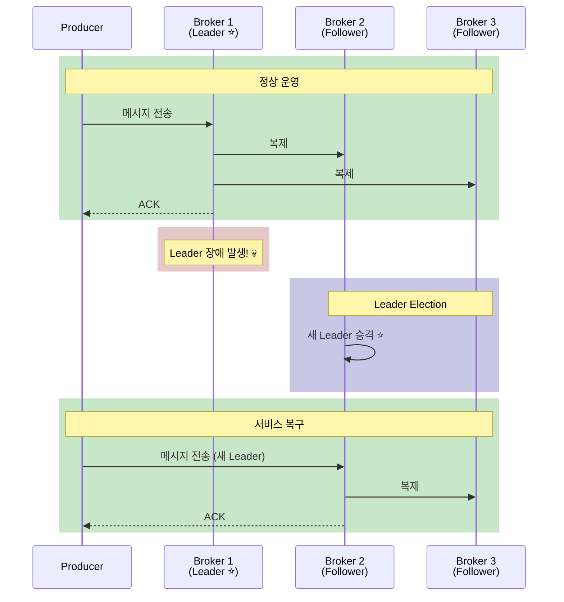

**다이어그램 - Replication Factor:**

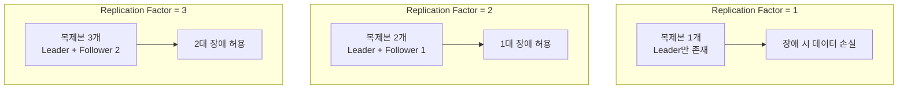

**다이어그램 - ISR 개념:**

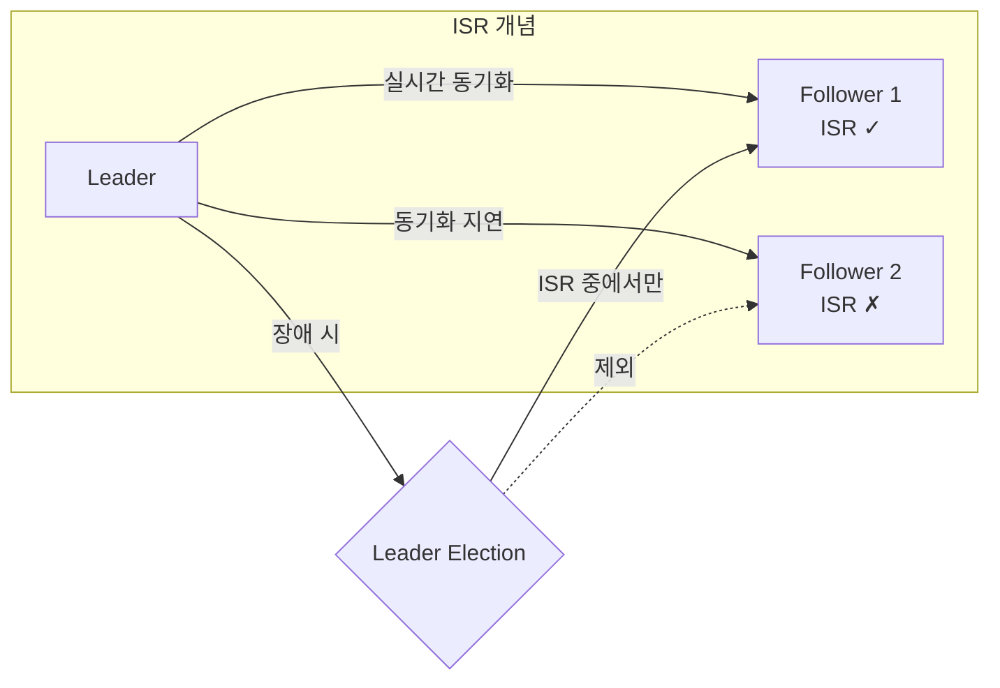

### 4. Zookeeper / KRaft

**정의:** Kafka 클러스터 관리 및 Leader Election 담당

**두 가지 방식:**

| 항목 | Zookeeper (기존) | KRaft (신규) |
|------|------------------|--------------|
| **관리 방식** | 외부 시스템 (Zookeeper) | 내부 합의 (Raft 프로토콜) |
| **구성 요소** | Kafka + Zookeeper 별도 운영 | Kafka만 운영 |
| **복잡도** | 높음 (두 시스템 관리) | 낮음 (단일 시스템) |
| **Kafka 버전** | 2.x 이하 기본 | 3.x 이상 권장 |

**전환 이유:**
- 운영 단순화 (Zookeeper 별도 운영 불필요)
- 성능 향상 (메타데이터 처리 속도, Partition 확장 용이)

**다이어그램:**

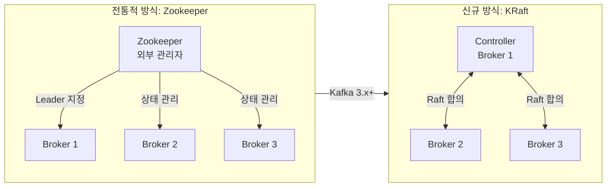

**실무 권장:**

| 상황 | 권장 |
|------|------|
| 신규 프로젝트 | KRaft (Kafka 3.x+) |
| 기존 Zookeeper 운영 중 | 점진적 마이그레이션 |
| 학습/예제 | KRaft 권장 (더 단순) |

### 5. Acknowledgment (acks)

**정의:** Producer가 메시지 전송 성공을 확인받는 시점 설정

**acks 옵션:**

| acks | 동작 | 속도 | 안전성 | 사용 사례 |
|------|------|------|--------|-----------|
| **0** | 확인 안 함 | 가장 빠름 | 낮음 | 로그, 메트릭 (손실 허용) |
| **1** | Leader만 확인 | 빠름 | 중간 | 일반적 사용 |
| **all** | 모든 ISR 확인 | 느림 | 높음 | 결제, 주문 (손실 불가) |

**다이어그램:**

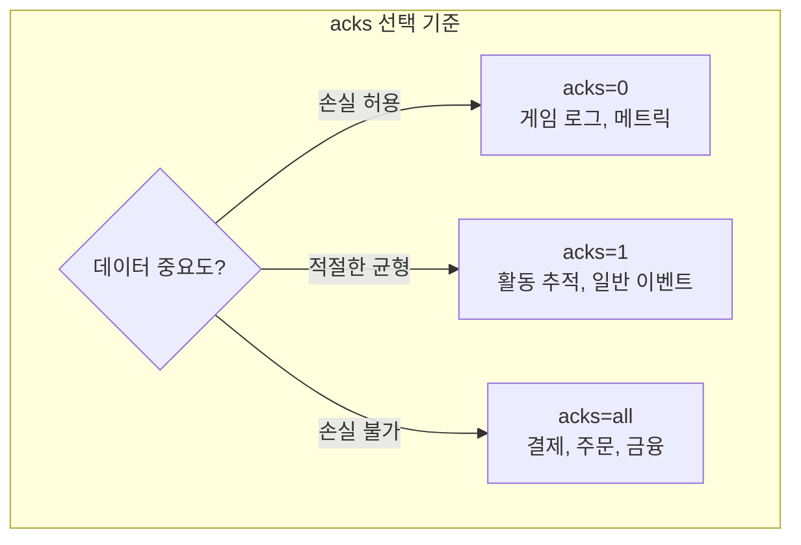

> **핵심:** 속도 vs 안전성 Trade-off → 비즈니스 요구사항에 따라 선택

### 6. Message Key

**정의:** 메시지가 어느 Partition으로 갈지 결정하는 기준

**Partition 결정 방식:**

| Key 상태 | 분배 방식 |
|----------|-----------|
| Key 없음 | Round Robin (순서대로 분배) |
| Key 있음 | hash(Key) % Partition 수 → 특정 Partition |

**핵심 이점:** 같은 Key = 같은 Partition = 순서 보장

**다이어그램:**

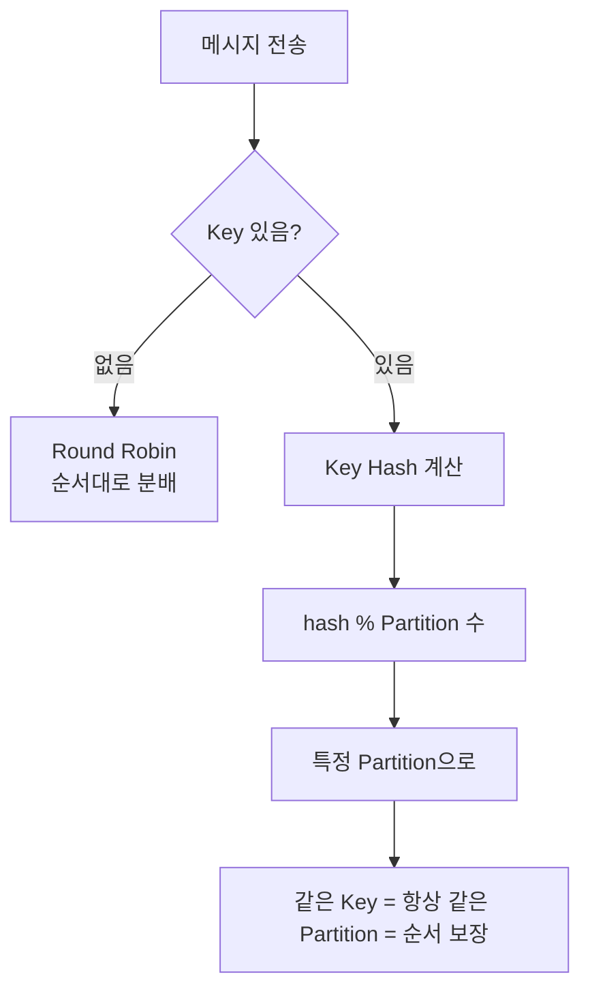

**사용 예시:**

| 상황 | Key 사용 | 예시 |
|------|----------|------|
| 순서 중요 | ✅ 사용 | 주문 이벤트 (user-id) |
| 순서 무관 | ❌ 미사용 | 로그 수집 (Round Robin) |
| 그룹핑 필요 | ✅ 사용 | 센서 데이터 (sensor-id) |

### 7. Retention

**정의:** Kafka에 저장된 메시지의 보관 정책

**핵심 특징:**
> Kafka는 Consumer가 읽어도 메시지가 삭제되지 않음 (전통적 Message Queue와 차이점)

**Retention 정책:**

| 설정 | 값 예시 | 동작 |
|------|---------|------|
| `retention.ms` | 604800000 (7일) | 7일 후 삭제 |
| `retention.bytes` | 107374182400 (100GB) | 100GB 초과 시 오래된 것부터 삭제 |
| `retention.ms` | -1 | 무제한 보관 |
| `cleanup.policy` | compact | Key당 최신 값만 유지 |

**Cleanup 정책 선택:**

| 정책 | 사용 사례 |
|------|-----------|
| **delete** (기본) | 모든 이력 중요 - 주문 로그, 감사 로그, 이벤트 스트림 |
| **compact** | 최신 상태만 중요 - 설정값, 사용자 프로필, 계좌 잔액 |

**다이어그램:**

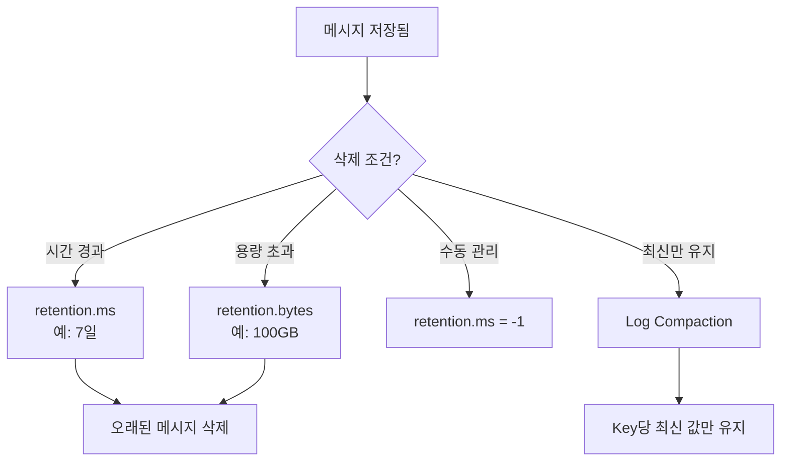

---

## 통합 다이어그램

### Kafka 핵심 개념 통합

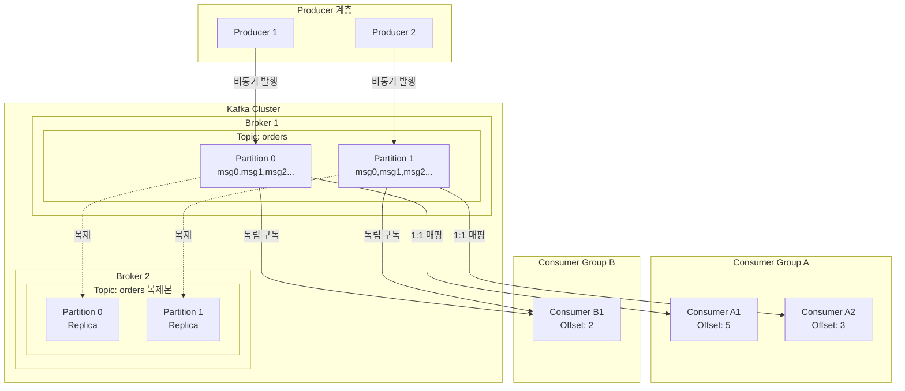

### 개념별 역할 매핑

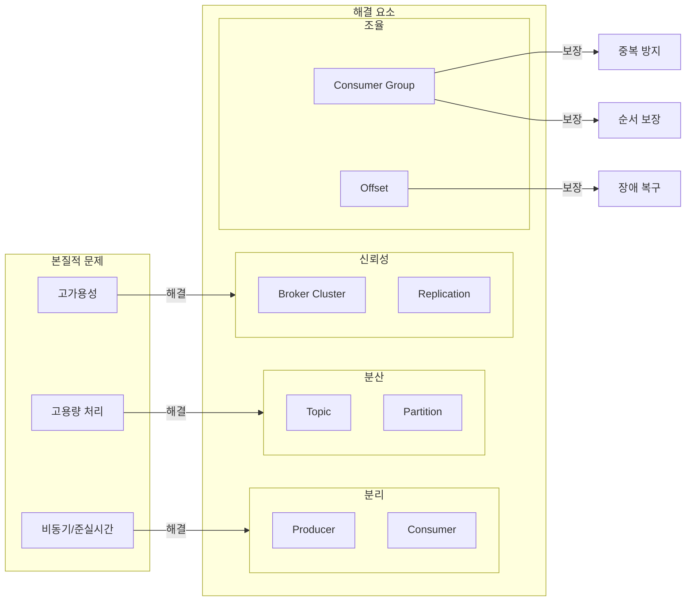

### 메시지 흐름 전체 시퀀스

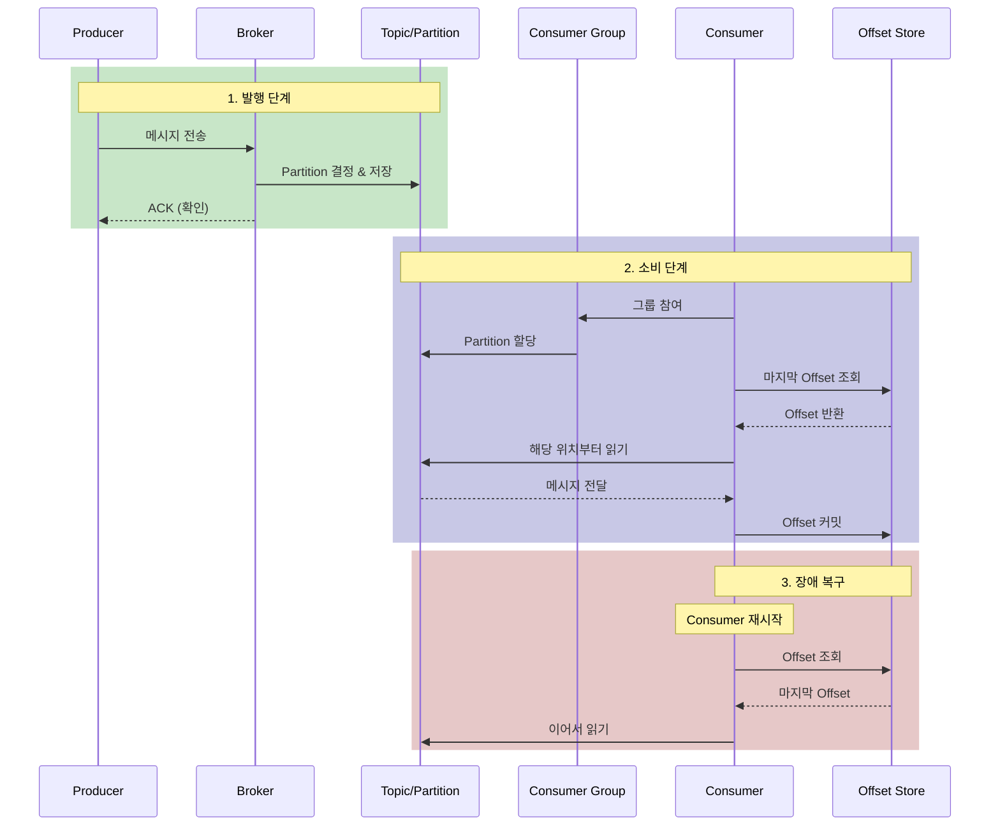

---

## 개념 정리 요약

| 개념 | 역할 | 해결하는 문제 |
|------|------|---------------|
| **Producer** | 메시지 발행 | 비동기 처리 (발행 후 대기 안함) |
| **Consumer** | 메시지 구독 | 비동기 처리 (독립적 소비) |
| **Broker** | 메시지 저장/전달 | 고가용성 (클러스터) |
| **Topic** | 논리적 분류 | 데이터 조직화 |
| **Partition** | 물리적 분산 | 고용량 병렬 처리 |
| **Consumer Group** | 소비자 조율 | 중복 방지 + 순서 보장 |
| **Offset** | 읽기 위치 추적 | 장애 복구 + 정합성 |
| **Replication** | 데이터 복제 | 고가용성 + 장애 복구 |
| **Zookeeper/KRaft** | 클러스터 관리 | Leader Election + 메타데이터 관리 |
| **acks** | 전송 확인 수준 | 속도 vs 안전성 Trade-off |
| **Message Key** | Partition 라우팅 | 순서 보장 |
| **Retention** | 보관 정책 | 저장 공간 관리 + 데이터 수명 |

---

## 탐구 개념 완료 현황

- [x] Replication (Leader/Follower) ✅
- [x] Zookeeper / KRaft ✅
- [x] Message Key ✅
- [x] Acknowledgment (acks) ✅
- [x] Retention ✅

---

## Mind Mapping: 가이드 문서 구조

### 전체 구조 개요 (Role Playing 반영)

```mermaid
flowchart TB
    CENTER[Kafka 가이드<br/>Java/Spring Boot]

    CENTER --> S0[0. Quick Start]
    CENTER --> S1[1. 개념 이해]
    CENTER --> S3[2. 실습 예제]
    CENTER --> S4[3. 심화 주제]
    CENTER --> S5[4. 운영 가이드]
    CENTER --> S6[부록]

    S0 --> Q1[5분 만에 시작하기]

    S1 --> C1[1.1 핵심 구성요소]
    S1 --> C2[1.2 메시지 흐름]
    S1 --> C3[1.3 심화 개념]

    S3 --> E0[2.0 환경 구성]
    S3 --> E1[2.1 기본 Producer/Consumer]
    S3 --> E2[2.2 주문 시스템 예제]
    S3 --> E3[2.3 이벤트 소싱 패턴]
    S3 --> E4[2.4 에러 처리 & 재시도]
    S3 --> E5[2.5 여러 Consumer Group]

    S4 --> A1[3.1 성능 튜닝]
    S4 --> A2[3.2 트랜잭션]
    S4 --> A3[3.3 Schema Registry]
    S4 --> A4[3.4 Kafka Streams]
    S4 --> A5[3.5 Kafka Connect]
    S4 --> A6[3.6 보안 설정]

    S5 --> O1[4.1 모니터링]
    S5 --> O2[4.2 로깅 & 디버깅]
    S5 --> O3[4.3 클러스터 관리]
    S5 --> O4[4.4 백업 & 복구]
    S5 --> O5[4.5 장애 대응]
    S5 --> O6[4.6 용량 계획]

    S6 --> AP1[FAQ]
    S6 --> AP2[연습 문제]
    S6 --> AP3[참고 자료]
    S6 --> AP4[용어 사전]
```

### 1. 개념 이해

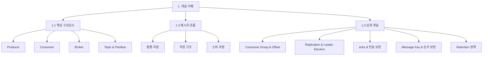

### 2. 실습 예제

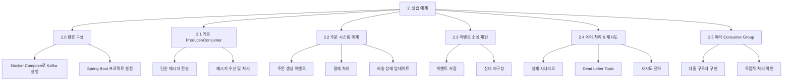

### 3. 심화 주제

```mermaid
flowchart TB
    S4[3. 심화 주제]

    S4 --> A1[3.1 성능 튜닝]
    A1 --> A1a[Producer 설정<br/>batch.size, linger.ms]
    A1 --> A1b[Consumer 설정<br/>fetch.min.bytes, max.poll.records]
    A1 --> A1c[Broker 설정]

    S4 --> A2[3.2 트랜잭션]
    A2 --> A2a[Exactly-once 시맨틱]
    A2 --> A2b[Transactional Producer]
    A2 --> A2c[Idempotent Producer]

    S4 --> A3[3.3 Schema Registry]
    A3 --> A3a[Avro 스키마]
    A3 --> A3b[스키마 버전 관리]
    A3 --> A3c[Spring Boot 연동]

    S4 --> A4[3.4 Kafka Streams]
    A4 --> A4a[스트림 처리 기초]
    A4 --> A4b[KTable vs KStream]
    A4 --> A4c[Windowing]

    S4 --> A5[3.5 Kafka Connect]
    A5 --> A5a[Source Connector]
    A5 --> A5b[Sink Connector]
    A5 --> A5c[커스텀 Connector]

    S4 --> A6[3.6 보안 설정]
    A6 --> A6a[SSL/TLS 암호화]
    A6 --> A6b[SASL 인증]
    A6 --> A6c[ACL 권한 관리]
```

### 4. 운영 가이드

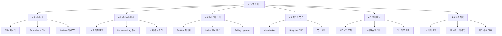

### 0. Quick Start (신규)

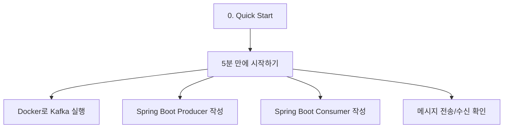

### 부록 (신규)

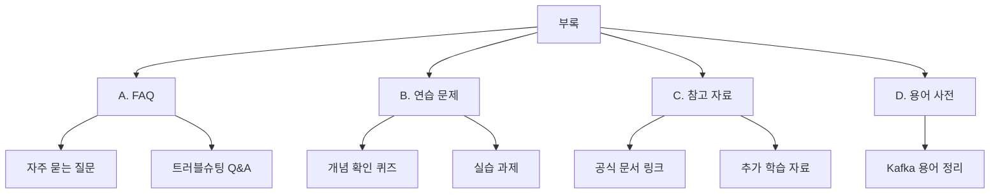

### 문서 목차 (텍스트 버전 - 최종)

```
Kafka 가이드 - Java/Spring Boot

0. Quick Start
   - 5분 만에 시작하기
     - Docker로 Kafka 실행
     - Spring Boot Producer 작성
     - Spring Boot Consumer 작성
     - 메시지 전송/수신 확인

1. 개념 이해
   1.1 핵심 구성요소
       - Producer
       - Consumer
       - Broker
       - Topic & Partition
   1.2 메시지 흐름
       - 발행 과정
       - 저장 구조
       - 소비 과정
   1.3 심화 개념
       - Consumer Group & Offset
       - Replication & Leader Election
       - acks & 전송 보장
       - Message Key & 순서 보장
       - Retention 정책

2. 실습 예제
   2.0 환경 구성
       - Docker Compose로 Kafka 실행
       - Spring Boot 프로젝트 설정
   2.1 기본 Producer/Consumer
       - 단순 메시지 전송
       - 메시지 수신 및 처리
   2.2 주문 시스템 예제
       - 주문 생성 이벤트
       - 결제 처리
       - 배송 상태 업데이트
   2.3 이벤트 소싱 패턴
       - 이벤트 저장
       - 상태 재구성
   2.4 에러 처리 & 재시도
       - 실패 시나리오
       - Dead Letter Topic
       - 재시도 전략
   2.5 여러 Consumer Group
       - 다중 구독자 구현
       - 독립적 처리 확인

3. 심화 주제
   3.1 성능 튜닝
       - Producer 설정 (batch.size, linger.ms)
       - Consumer 설정 (fetch.min.bytes, max.poll.records)
       - Broker 설정
   3.2 트랜잭션
       - Exactly-once 시맨틱
       - Transactional Producer
       - Idempotent Producer
   3.3 Schema Registry
       - Avro 스키마
       - 스키마 버전 관리
       - Spring Boot 연동
   3.4 Kafka Streams
       - 스트림 처리 기초
       - KTable vs KStream
       - Windowing
   3.5 Kafka Connect
       - Source Connector
       - Sink Connector
       - 커스텀 Connector
   3.6 보안 설정
       - SSL/TLS 암호화
       - SASL 인증
       - ACL 권한 관리

4. 운영 가이드
   4.1 모니터링
       - JMX 메트릭
       - Prometheus 연동
       - Grafana 대시보드
   4.2 로깅 & 디버깅
       - 로그 레벨 설정
       - Consumer Lag 추적
       - 문제 추적 방법
   4.3 클러스터 관리
       - Partition 재배치
       - Broker 추가/제거
       - Rolling Upgrade
   4.4 백업 & 복구
       - MirrorMaker
       - Snapshot 전략
       - 복구 절차
   4.5 장애 대응
       - 일반적인 문제
       - 트러블슈팅 가이드
       - 긴급 대응 절차
   4.6 용량 계획
       - 스토리지 산정
       - 네트워크 대역폭
       - 메모리 & CPU

부록
   A. FAQ
      - 자주 묻는 질문
      - 트러블슈팅 Q&A
   B. 연습 문제
      - 개념 확인 퀴즈
      - 실습 과제
   C. 참고 자료
      - 공식 문서 링크
      - 추가 학습 자료
   D. 용어 사전
      - Kafka 용어 정리
```

---

## Role Playing 결과

### 검토 대상 페르소나

| 페르소나 | 설명 |
|----------|------|
| **Kafka 입문자** | Kafka 개념을 처음 접하는 개발자 |
| **Spring Boot 개발자** | Spring Boot는 알지만 Kafka는 처음 |
| **본인 (학습 목적)** | 이해도 높이기 위한 자기 학습 |

### 페르소나별 피드백 및 반영 사항

| 페르소나 | 피드백 | 반영 사항 |
|----------|--------|-----------|
| Kafka 입문자 | Kafka 소개 필요 | 1.1 핵심 구성요소에서 간략히 소개 |
| Spring Boot 개발자 | 빠른 시작 필요 | **0. Quick Start 섹션 추가** |
| 본인 (학습) | 학습 보조 요소 필요 | **부록 추가** (FAQ, 연습문제, 참고자료, 용어사전) |

### 구조 변경 요약

**추가된 섹션:**
1. **0. Quick Start** - 5분 만에 시작하기 (Spring Boot 개발자용)
2. **부록** - FAQ, 연습 문제, 참고 자료, 용어 사전 (학습 효과 강화)

**수정된 섹션:**
- 1.1 핵심 구성요소: Kafka 소개 간략히 포함

---

## 브레인스토밍 세션 진행 현황

- [x] First Principles Thinking ✅
- [x] Mind Mapping ✅
- [x] Role Playing ✅

---

## 다음 단계

1. ~~남은 개념 탐구 완료~~ ✅
2. ~~Mind Mapping으로 문서 구조 설계~~ ✅
3. ~~Role Playing으로 독자 관점 검토~~ ✅
4. **Project Brief 작성** ← 다음 권장

---

## 브레인스토밍 세션 완료

**세션 결과물:**
- Kafka 핵심 개념 정리 (First Principles)
- 가이드 문서 구조 설계 (Mind Mapping)
- 독자 관점 검토 및 구조 개선 (Role Playing)

**최종 문서 구조:**
- 0. Quick Start (신규)
- 1. 개념 이해
- 2. 실습 예제
- 3. 심화 주제
- 4. 운영 가이드
- 부록 (신규): FAQ, 연습 문제, 참고 자료, 용어 사전

---

*브레인스토밍 세션 완료. Project Brief 작성 준비 완료.*
